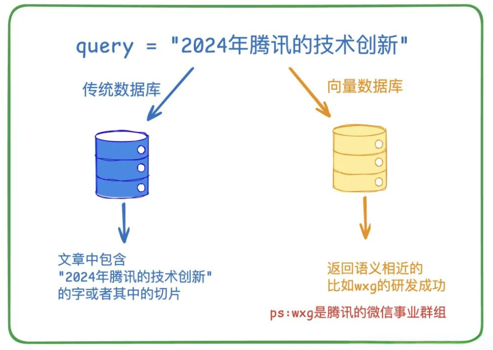
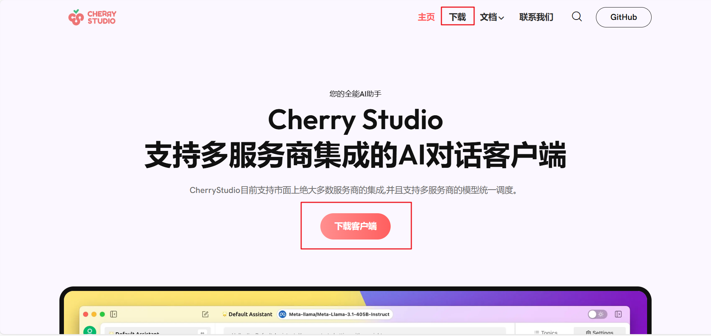
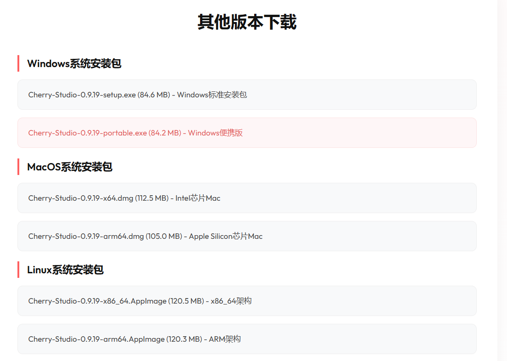
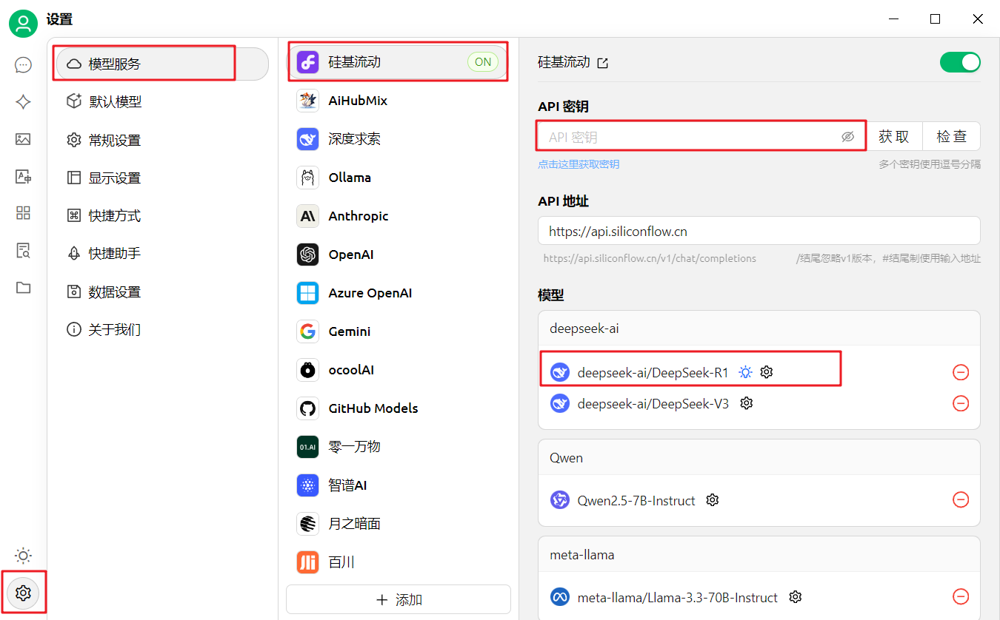
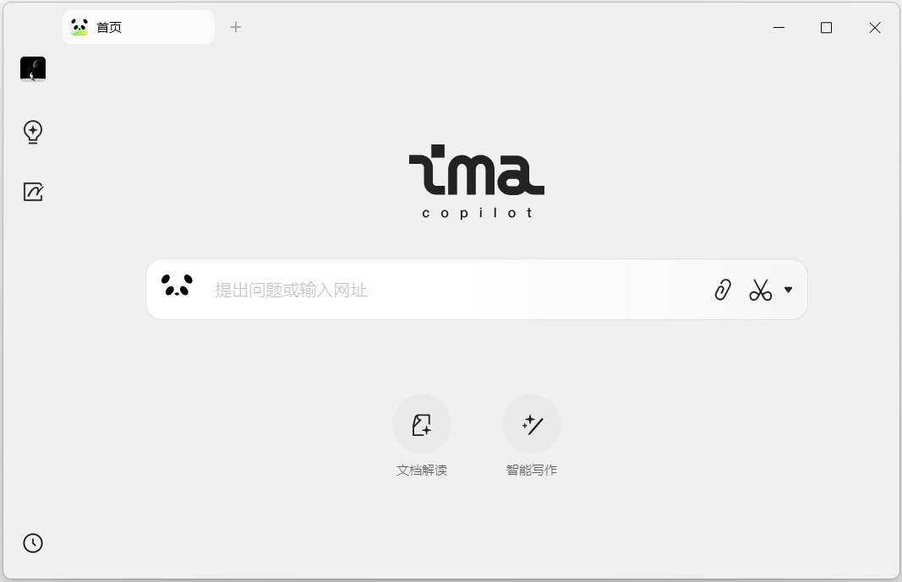
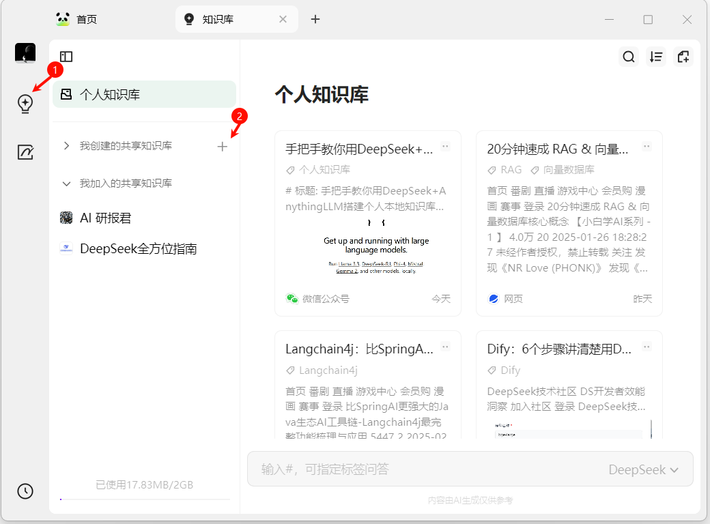
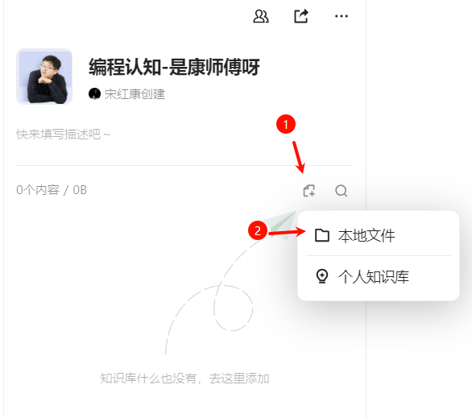
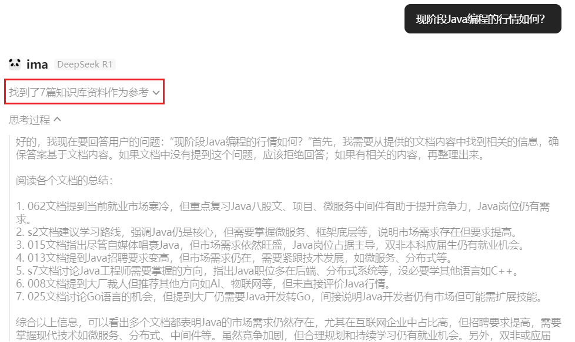
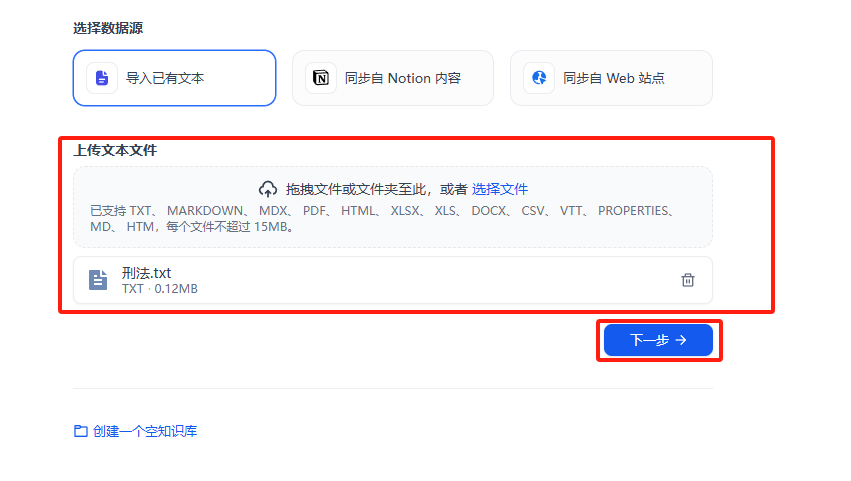

# 第01章：RAG-搭建企业私有/个人知识库

***


## 1、RAG的理解

### 1.1 什么是RAG

RAG（Retrieval-Augmented Generation，检索增强生成）是一种结合`信息检索`（Retrieval）与`文本生成`（Generation）的技术，旨在提升大语言模型在回答专业问题时的`准确性`和`可靠性`。

### 1.2 为什么需要RAG

**背景：**

- 大模型的知识冻结
- 大模型幻觉

`举例1：`

随着 LLM 规模扩大，训练成本与周期相应增加。因此，包含最新信息的数据难以融入模型训练过程，无法及时反映最新的信息或动态变化，导致 LLM 难以应对诸如“请推荐当前热门影片”等**时间敏感性问题。**

`举例2：`

大型语言模型（LLM）的训练依赖于网络上`海量公开的静态数据`，而某些`特定领域`（如企业内部资料、专有技术文档等）的数据通常不会作为公开的训练数据，导致模型在面对这些领域的查询时，可能因缺乏足够的信息而生成不准确甚至虚构的回复。【领域信息虚构】

**解决方案：**

为了解决这一问题，RAG技术通过引入`向量数据库（Vector Database）`作为外部知识源，将模型缺失的知识以结构化的形式提供。

`举例1：`

LLM在考试的时候面对陌生的领域，答复能力有限，然后就准备放飞自我了，而此时RAG给了一些提示和思路，让LLM懂了开始往这个提示的方向做，最终考试的正确率从60%到了90%！


`举例2：`


> 你看到「苹果」两个字，大脑会自动联想到：水果、红色、甜的、iPhone、科技公司……  
这些联想是**多维度的、模糊的、连续的**。

但计算机不懂「意思」，它只认数字。所以大模型做了一件事：

> 把「苹果」这个词，压缩成一串数字，比如 768 个或 1536 个浮点数。  
> 语义相近 = 数字相近
> 这串数字就是「向量（Vector）」，也叫「嵌入（Embedding）」。

### 1.3 执行流程

![[Pasted image 20260620150639.png]]


> 检索-增强-生成过程：检索可以理解为第10步，增强理解为第13步（这里的提示词包含检索到的数据），生成理解为第15步。

![[Pasted image 20260620153757.png]]


**强调一下难点的步骤（蓝色部分）：**


**这里有三个位置涉及到大模型的使用：**

- 第3步向量化时，需要使用**EmbeddingModels**。【文件解析 切割】
- 第7步重排序时，需要使用**RerankModels**。可对初步**召回**的较多 chunk（如 top 20 或 top 50）进行精排，提高召回准确率，防止LLM 处理无关信息，减少时间和成本。
- 第9步生成答案时，需要使用LLM。

**Reranker的使用场景：**

- 适合：追求回答高精度和高相关性的场景中特别适合使用 Reranker，例如专业知识库或者客服系统等应用。
- 不适合：Reranker相较于RAG的成本更高。此外，引入Reranker会增加召回时间，增加检索延迟。服务对响应时间要求高时，使用Reranker可能不合适。

## 2、知识库的概述

### 2.1 哪些人需要搭建(个人)知识库

**小型企业主或创业者：查阅和分享文件、文档、客户反馈、市场分析，大大提升你的工作效率。

**职场打工人或自由职业者：无论是写作、设计、开发，还是视频制作，知识库都可以管理大量的素材、创意和客户需求，通过知识库，你可以轻松存储和搜索这些资料，并通过大模型二次创作

**教育工作者或学生：利用知识库管理教学资源、课程安排、教材资料等，学生则可以将课堂笔记、参考书目和作业整理在一起，随时复习和备考。

**生活中的普通人：无论是旅行计划、兴趣爱好，还是学习笔记，全部都可以集中在知识库管理。

### 2.2 知识库各个搭建平台对比

很多平台都支持个人知识库的搭建。

#### 2.2.1 核心定位和技术特点

**AnythingLLM、CherryStudio**：`桌面/图形化 AI 助手 + 知识库（RAG）`，支持对接云模型与本地模型；适合`个人/小团队`快速验证。在“多租户治理、复杂系统集成、生产化观测”等方面通常不如平台型/专业引擎。

**Dify、FastGPT**：`LLM Agent 与工作流编排平台`，支持创建知识库，支持`云端`与`本地`部署（可用Docker）。

**RAGFlow**：基于`深度文档理解`的开源 RAG 引擎，强调复杂文档解析、引用与可视化干预；也支持 Agent 能力，但通用工作流生态通常不如“全能型 Agent 平台”。（支持Docker部署）

#### 2.2.2 典型场景与选型建议

| 场景 | 需求 | 推荐工具 | 理由 |
|------|------|----------|------|
| **个人知识管理（轻量级）** | 快速验证、低预算（开发成本 ≤ 1周），个人/小团队使用，**以”能用”为主**（文档以 Markdown、PDF、网页为主） | Cherry Studio / AnythingLLM | ① 部署和操作简单，上手快<br>② 可直接对接在线大模型 API，也可接本地模型，适合快速试错<br>③ 支持多模型对话（如 DeepSeek + Ollama），适合整合笔记/文献 |
| **应用化交付与团队协作（平台型场景）** | ① 将知识库能力**封装为可复用的 AI 应用或 Agent**<br>② 支持多成员协作、权限控制、应用发布与版本迭代<br>③ 需要流程编排（如检索 → 工具调用 → 多轮推理），而不仅是简单问答 | Dify / FastGPT | ① 提供完整的 **Agent / Workflow 编排能力**，知识库（RAG）作为其中一环<br>② 支持多应用管理、角色与权限控制，更适合团队或内部平台使用<br>③ 易于与业务系统集成（API / Webhook），便于”从 Demo 走向可用系统” |
| **企业级文档解析（高精度需求）** | 面向复杂文档（**长PDF、复杂版式、表格/图片混排、扫描件**等），强调解析质量与可控性，要求可追溯引用 | RAGFlow | ① 强调深度文档理解，解析/分块结果可视化，便于检查与必要时干预<br>② 对复杂格式更友好，适合把”文档解析质量”作为核心竞争力的场 |


## 3、Cherry-Studio搭建个人知识库

> 后续我们会重点拿Coze和Dify讲工作流和智能体，所以知识库这里，我们选另外两个非常不错的平台：Cherry-Studio 和腾讯出品的ima


### 3.1 Cherry-Studio特点

**小白友好**：Cherry Studio 致力于降低技术门槛，零基础用户也能快速上手，让用户专注于工作、学习或者创作。

**一问多答**：支持同一问题通过多个模型同时生成回复，方便用户对比不同模型的表现


**助手市场**：内置千余个行业专用助手，涵盖翻译、编程、写作等领域，同时支持用户自定义助手。


**服务商模型聚合**：支持 OpenAI、Gemini、Anthropic、Azure 等规范的三方服务商接入，兼容性强。


**数据安全**：支持全本地场景使用，结合本地大模型，避免数据泄漏风险。


### 3.2 LLM的使用

#### 步骤1：下载与安装客户端工具

Cherry Studio官网：https://cherry-ai.com/





安装过程：傻瓜式安装，这里省略。

#### 步骤2：硅基流动注册账号

这里的大模型，以硅基流动平台为例说明。

网址：https://siliconflow.cn/zh-cn/models


用手机号注册即可，新注册的账号有免费的token可以使用。

#### 步骤3：创建API密钥


#### 步骤4：复制API密钥


#### 步骤5：配置API密钥




#### 步骤6：选择大语言模型


### 3.3 知识库的使用

#### 步骤1：添加嵌入模型

根据下图确认名称：


回到Cherry Studio添加：


#### 步骤2：创建知识库


上面的pro版本的搜索精度更高，但收费。

提供知识库内容：


这里支持不同格式文件、文件夹、网页地址、大段文本内容等方式添加到知识库。

> 注意：上传的文件中如果有手写内容，或者表格或复杂的数据公式，那解析的效果就会较差。

#### 步骤3：支持直接检索

检索：


此时的检索，基于RAG（检索增强生成）技术，在数据库中去搜索相应的答案。这里还包括占比得分。

#### 步骤4：基于知识库生成


选中后，提问：


#### 补充：增强文档解析能力

如果上传的文件中如果有手写内容，或者表格或复杂的数据公式，那解析的效果就会较差。这里可以提前将文件进行解析处理，然后再上传到个人知识库。

使用工具：Doc2X

网址：https://doc2x.noedgeai.com/


### 3.4 流程分析


## 4、ima搭建个人知识库

### 4.1 ima特点

- 支持客户端、小程序、网页等多端同步访问
- 支持腾讯混元大模型、DeepSeek-R1满血版
- 通过微信提问，模型基于知识库生成答案

### 4.2 搭建知识库过程

#### 步骤1：下载-安装

网址：https://ima.qq.com/


安装好以后，登录一下即可：



#### 步骤2：新建知识库




#### 步骤3：导入本地文件




#### 步骤4：基于知识库"生成"




### 4.3 组合互联网网页构成知识库

步骤1：我们可以在微信公众号搜索相关主题的公众号文章，并将他们加入到ima。

步骤2：在ima中新建个人知识库，将相关文章加入到此知识库。


步骤3：在文章导入完成以后，可以生成自己的知识库，进而结合大模型进行搜索


### 4.4 添加第三方知识库

在pc端查看：


> 添加到相关知识库之后，不管在手机端还是同账号的PC端，都可以查看。

## 5、使用Dify搭建知识库

### 5.1 Dify介绍

Dify（DefineModify）是一个开源的大语言模型(LLM)应用开发平台，由`苏州语灵人工智能`推出。

Dify 为 AI Agent 提供了50多种内置工具，如谷歌搜索、DALL·E、Stable Diffusion 和 WolframAlpha 等。

官网：https://dify.ai/zh

说明：https://github.com/langgenius/dify/blob/main/docs/zh-CN/README.md

### 5.2 源数据格式

通过使用Dify，可以方便快捷地构建私有知识库。可以将知识库放在工作流中，协同多种工具一起使用。而且Dify提供的知识库功能有着简洁的可视化界面，可以很方便地进行管理，适用于个人和团队。

目前Dify 支持多种源数据格式，包括： 

- 长文本内容：TXT、Markdown、DOCX、HTML、JSON、 PDF  


- 结构化数据：CSV、Excel


**注：私有知识库要达到良好的效果，必须与embedding模型和reranker模型相结合，请在xinterface中启用相关模型并引入Dify。**

### 5.3 构建私有知识库

**步骤1：首先创建一个新的知识库**


**步骤2：上传知识库文件**

这里准备的是一部刑法的txt格式文本，用自然段的形式划分了每一条法则



**步骤3：分段设置**

大语言模型存在有限的上下文窗口，通常需要将整段文本进行分段处理后，将与用户问题关联度最高的几个段落召回，即分段 top-K 召回模式。此外，在用户问题与文本分段进行语义匹配时，合适的分段大小将有助于匹配关联性最高的文本内容，减少信息噪音。

分段标识符如果是`\n`，则是以换行为一个分段；如果是`\n\n`，则是以一个段落为一个分段。点击`预览块`查看目前块划分的情况。

分段重叠长度一般是分段最大长度的`10%-20%`。

知识库文档里如果有url、邮箱，还可以把这些过滤掉。


**步骤4：选择索引方式**

这里自动选择高质量。高质量的准确性更高，但是token消耗也会增加。如果使用的是部署到本地的模型，花费就没有影响。


还有Q&A方式。 如果文档是问答方式，那选择这种方式是最契合的。

**步骤5：检索设置**

在这里可以选择Embedding模型和Rerank模型，也可以设置Top K，也就是选出最相似的前n条。选择Score阈值，即筛选文本的相似度阈值。


混合检索：既包括向量检索（涉及rerank检索的大模型），也包含全文检索。

设置完成后，保存并处理即可。


### 5.4 测试

接下来我们进行测试使用。创建一个聊天助手，将提示词写为

```
你是一个法律小助手，请只根据知识库中的信息，简要回答用户提问的案件触犯了哪些法律
```

知识库选择刚才添加的刑法.txt，然后可以开始提问。

可以观察到，聊天助手会自动引用知识库中的内容进行回答。


