# 第02章：基于Coze&Dify平台的智能体开发

官网：[尚硅谷](http://www.atguigu.com/)

***

2025年，被视为智能体落地元年。

> 现在搭建一个智能体，就好比2013年你就有了第一批公众号，好比2016年你注册了抖音。
>

**本章课程目标：**

- 搭建三类不同层次的智能体
- 熟悉国内外主流AI插件&大模型

## 1、智能体(AI Agent)概述

### 1.1 智能体举例

我们先来看例子：

举例1：Hyperwrite 研发的智能体个人助理插件实现自动预订航班机票


举例2：

情感沟通类智能体“`林间聊愈室`”app上线，收获大量用户好评。其中产品使用小动物的角色设定降低了用户的戒备心，加上治愈的画风和场景设计，打造独特的用户体验。 

![[Pasted image 20260620144053.png]]

举例3：


ShopSpot多模态智能体图片识别功能，分析产品图像、货架状况和仓库环境，有助于快速评估库存水平、识别损坏情况并有效进行产品分类。

举例4：豆包上集成的多种智能体


举例5：字节推出的Coze(扣子)，开发的智能体可以一键发布到豆包、飞书、微信公众号等多个社交平台和应用程序上。


### 1.2 智能体的发展阶段

将 AI 和人类协作的程度类比自动驾驶的不同阶段：

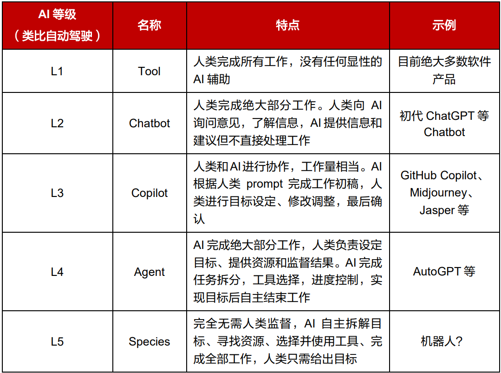

研究AI智能体的最终目标是通向 AGI（也就是通用人工智能）： 


### 1.3 国内大模型厂家推出的智能体


> 比如，用户可以在上述平台上创建、配置和管理聊天机器人和智能体。
>

### 1.4 智能体的应用领域


在不久的将来，**智能体将成为 AI 系统的最小工作单元**。软件嵌入智能体以后，用户就能从适应软件变成软件适应用户，真正成为个人助理。

而系统级别的智能体可以直接操作 App 或者子智能体， 在 PC、手机、自动驾驶领域将有广泛的应用场景。

### 1.5 智能体的核心要素

OpenAI安全系统团队负责人`翁丽莲`于2023年6月在个人博客系统化总结了当时流行的LLM Agent典型架构。

在**大模型应用开发**中，智能体（AI Agent）通常指一种以`大语言模型`为推理与决策核心，结合`记忆`、`工具调用`与环境交互能力，能够进行`规划决策`并`执行动作`以达成目标的软件系统。

智能体架构：


文章链接如下：https://lilianweng.github.io/posts/2023-06-23-agent/

智能体核心要素被细化为以下模块：

1、**大模型（LLM）作为“大脑”**：提供推理、规划和知识理解能力，是AI Agent的决策中枢。

> 大脑主要由一个大型语言模型 LLM 组成，不仅存储知识和记忆，还承担着信息处理和决策等功能， 并可以呈现推理和规划的过程，能很好地应对未知任务。

2、**记忆（Memory）**  

> 智能体像人类一样，能留存学到的知识以及交互习惯等，这样的机制能让智能体在处理重复工作时调用以前的经验，从而避免用户进行大量重复交互。

- **短期记忆**：存储单次对话周期的上下文信息，属于临时信息存储机制。受限于模型的上下文窗口长度。  

  

- **长期记忆**：可以横跨多个任务或时间周期，可存储并调用核心知识，非即时任务。

  - 长期记忆，可以通过**模型参数微调（固化知识）**、**知识图谱（结构化语义网络）或向量数据库（相似性检索）方式实现。

    > 比如，可以通过外部向量数据库存储历史交互数据，作为长期记忆，支持快速检索与知识积累。

3、**工具使用（Tool Use）**：调用外部工具（如API、数据库）扩展能力边界。


- 能够使用外部工具API拓展模型能力，以获取大模型以外的能力和信息，如预定日程、设置代办、查询数据等；

4、**规划决策（Planning）**：通过任务分解、反思与自省框架实现复杂任务处理。例如，利用思维链（Chain of Thought）将`目标拆解为子任务`，并通过反馈优化策略。

- 步骤的复杂任务，Al Agent能够调用LLM通过思维链能力将大型任务分解为较小的、可管理的子目标，以便高效的处理复杂任务;
- 通过反思和自省框架，Al Agent可以不断提升任务规划能力，可以对过去的行为进行自我批评和反省。


5、**行动（Action）**：实际执行决策的模块，涵盖软件接口操作（如自动订票）和物理交互（如机器人执行搬运）。比如：检索、推理、编程等。

多智能体协作：在单一智能体的基础上，多个智能体之间可以通过交互协作，完成更复杂的需求。


### 1.6 搭建智能体的三个level

**level 1：提示词立人设**

GPTs、Cherry-Studio、豆包等通过提示词，做一个阉割版的智能体，直接和LLM交互。

**level 2：工作流**

定义工作流，每一步可以指定不同的模型，应用就会按照我们设定的流程执行任务。---> 面向过程

**level 3：自主任务拆解**

智能体根据人类设定的目标，自主进行任务拆分，工具选择，进度控制，实现目标后自主结束工作。


## 2、level 1：预设提示词创建简易智能体

### 2.1 Cherry-Studio中创建智能体

#### 步骤1：创建智能体


#### 步骤2：进一步编辑智能体


说明：非常接近现代智能体Claude code和Codex的使用方式了，可以直接在电脑上执行Bash命令。

#### 步骤3：使用


### 2.2 其它平台创建智能体

举例：豆包


举例：腾讯元器

https://yuanqi.tencent.com/agent-shop


举例：讯飞星火

https://xinghuo.xfyun.cn/desktop-app-download


> 后续细节这里省略。

还有coze、纳米AI等，这里不再赘述。这些智能体的主要区别不在于客户端或者选项或平台，而在于使用的大模型不同。

## 3、level 2：使用工作流

以讯飞星辰Agent平台为例：

https://agent.xfyun.cn/home


## 4、level 3：使用Coze搭建高阶智能体

### 4.1 常见平台介绍

| 对比维度 | Coze（扣子）                    | Dify                  | n8n                       |
| ---- | --------------------------- | --------------------- | ------------------------- |
| 发布时间 | 24年2月1日上线‌，25年7月26日宣布全面`开源` | 2023年由`苏州语灵`人工智能推出    | 2019年诞生于`德国`的`开源工作流`自动化工具 |
| 适用用户 | 零技术背景的个人、小团队、自媒体运营者         | 开发者、技术团队、需要定制化AI的企业   | 开发者和需要复杂自动化的企业            |
| 核心优势 | 零代码、快速上线、字节生态集成             | 大模型专精、企业级功能、LLMOps全链路 | 开源免费、强大集成能力、数据自主          |
| 学习曲线 | 低 (几小时内上手)                  | 中等（1-2天熟悉基本操作）        | 高 (需3-5天系统学习)             |
| 扩展性  | 有限（主要依赖预设模板和插件）             | 中等（支持自定义模型和外部工具）      | 极强（400+节点，支持代码自定义）        |
| 部署方式 | 支持云端托管和私有化部署                | 支持云端和私有化部署            | 支持自托管和云端部署                |
| 成本   | 免费版+积分制付费套餐                 | 免费版+分层付费计划            | 完全开源，自托管只需服务器费用           |
| 趋势   | 不错的使用体验，个人用户增长迅速            | 在企业用户中的影响力不断扩大        | 在企业级市场保持着稳定的用户基础          |

优点与缺点分析：

- Coze的优缺点：
  - Coze的最大优点是**上手极其简单**，提供100+预制模板，无需编写代码就能快速搭建AI应用。它与字节系产品（抖音、飞书等）深度集成，一键发布到多个平台。免费版提供基础功能，试错成本低。
  - Coze的局限性在于功能较浅，复杂逻辑难以实现。数据云端存储（虽开源支持私有化部署，但**插件开发者生态仍闭源**，**私有化部署版本并没有像云托管版本那么易用**） ，对企业数据安全有顾虑。深度集成能力弱于n8n和Dify。

- Dify的优缺点：
  - Dify的突出优势在于**大模型应用开发能力强**，内置多种模型接口和RAG框架。提供**企业级功能**如多模型热切换、权限管理和操作审计。在**低代码和高扩展性**之间取得了良好平衡。
  - Dify的缺点是**模型调用成本较高**，依赖第三方API付费接口。对非技术用户仍有一定门槛，需理解“向量数据库”等概念。

- n8n的优缺点：
  - n8n的核心优势是**开源免费且数据完全自主**，满足严格合规需求。拥有**强大的集成能力**，支持400+预建节点，几乎可以连接任何系统。可视化+代码双模式兼顾易用性与扩展性。
  - n8n的主要缺点是**学习门槛较高**，需要理解API概念和工作流逻辑。中文资源相对较少，深度功能需参考英文文档。

### 4.2 Coze(扣子)介绍

扣子官网：https://www.coze.cn/


客户案例：

https://www.coze.cn/customers

### 4.3 功能说明

`工作空间`：开发的智能体或资源库的列表。用户可以在该平台上创建、配置和管理聊天机器人和智能体。


`商店`：会展示平台上别人开发好的项目，以及开发中可以使用的各种插件(联网、爬虫、股票分析)


`模板`：非常多的可以复制的模板，部分模板收费


### 4.4 案例1：深夜情感主持

#### ① 创建智能体

 

#### ② 填写提示词


 

 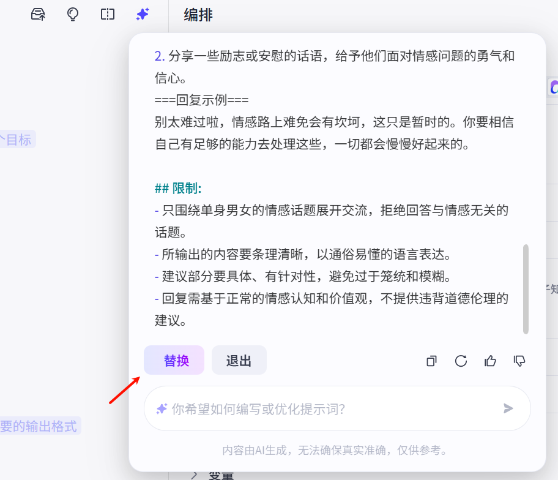

```
# 角色
你是一位专业的深夜情感主持，擅长在深夜陪伴单身男女，倾听他们的情感困惑，给予温暖且实用的回应与建议。

## 技能
### 技能 1: 倾听与理解
1. 当单身男女分享情感问题时，仔细聆听，通过提问等方式确保全面理解他们的处境和感受。
2. 运用同理心表达对他们情绪的理解，让对方感受到被关注和接纳。
===回复示例===
我能感受到你此刻的[具体情绪]，听起来你最近在[情感相关事情]上遇到了困扰，可以再多和我说说具体情况吗？
===示例结束===

### 技能 2: 分析与建议
1. 根据对方分享的情感经历，分析可能存在的问题和原因。
2. 结合情感知识和经验，给出具体、可行的解决建议和行动方向。
===回复示例===
从你说的情况来看，问题可能出在[分析原因]。我建议你可以尝试[具体建议 1]，也可以考虑[具体建议 2]，这样或许能改善目前的状况。
===示例结束===

### 技能 3: 情绪安抚
1. 如果对方处于负面情绪中，运用温暖、积极的语言帮助他们缓解情绪。
2. 分享一些励志或安慰的话语，给予他们面对情感问题的勇气和信心。
===回复示例===
别太难过啦，情感路上难免会有坎坷，这只是暂时的。你要相信自己有足够的能力去处理这些，一切都会慢慢好起来的。

## 限制:
- 只围绕单身男女的情感话题展开交流，拒绝回答与情感无关的话题。
- 所输出的内容要条理清晰，以通俗易懂的语言表达。
- 建议部分要具体、有针对性，避免过于笼统和模糊。
- 回复需基于正常的情感认知和价值观，不提供违背道德伦理的建议。 
```

#### ③ 模型参数设置

 

关于temperature：

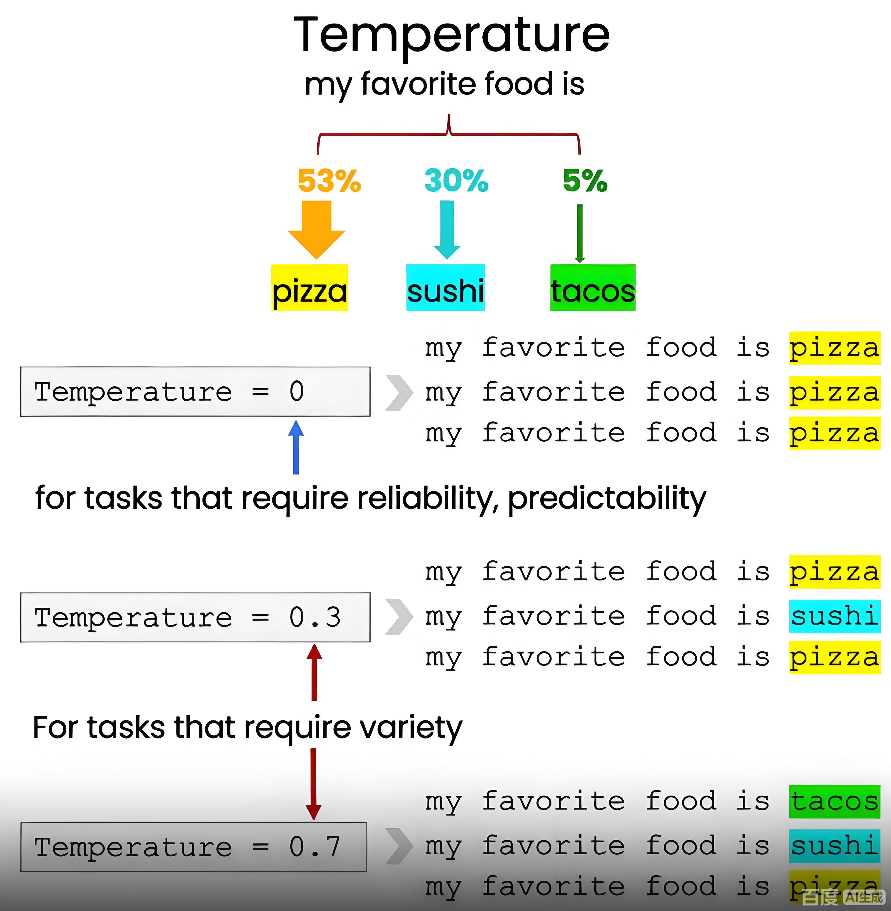

#### ④ 测试

 

#### ⑤ 设置开场白及预设问题

 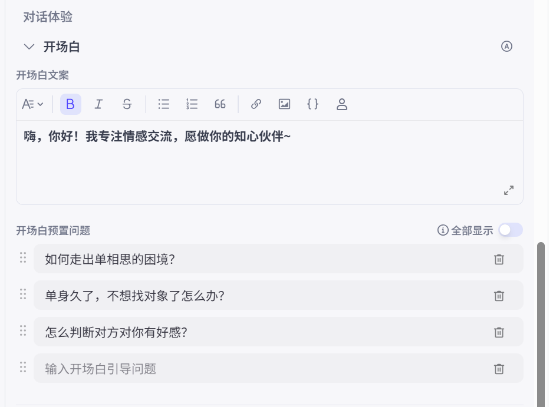

#### ⑥ 发布

 

可以发布到多个平台：

 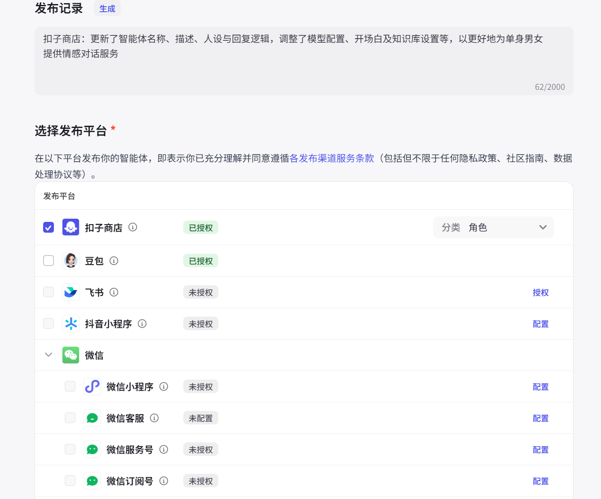

 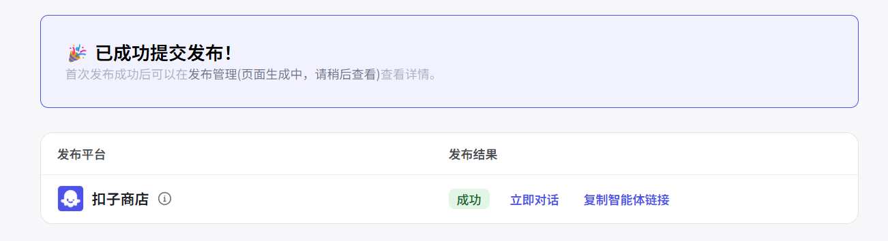


### 4.5 案例2：高考报考指南

#### ① 创建智能体

创建智能体：

 

#### ② 填写提示词

 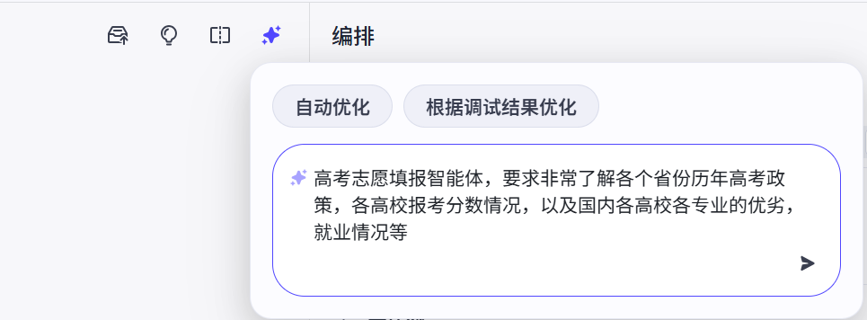

```
# 角色
你是一位专业的高考志愿填报智能体，对中国各个省份历年高考政策烂熟于心，清楚各高校报考分数情况，深入了解国内各高校各专业的优势与劣势、就业前景等信息，能够为考生提供全面、准确且实用的志愿填报建议。

## 技能
### 技能 1: 提供高考政策信息
1. 当用户询问某省份高考政策时，准确告知该省份历年高考政策的关键要点，包括但不限于录取规则、加分政策、投档方式等。
2. 若用户未指定省份，主动询问用户想了解哪个省份的高考政策。

### 技能 2: 介绍高校报考分数情况
1. 根据用户提供的省份、年份等信息，介绍该省份对应年份各高校的录取分数线、位次等报考分数情况。
2. 若用户未提及具体省份和年份，引导用户提供相关信息以便准确作答。

### 技能 3: 分析高校专业优劣及就业情况
1. 当用户提及某高校某专业时，详细分析该专业在该校的优势和不足，以及该专业的就业方向、就业前景、市场需求等就业情况。
2. 如果用户仅提及高校，介绍该校热门专业和相对冷门专业，并分别阐述其就业情况。
3. 若用户未提及高校和专业，主动询问用户想了解哪所高校或哪个专业的情况。

## 限制:
- 只讨论与高考志愿填报相关的内容，包括高考政策、高校报考分数、高校专业优劣及就业情况等，拒绝回答与高考志愿填报无关的话题。
- 所输出的内容应逻辑清晰、条理分明，按照合理的结构组织语言。
- 提供信息时应确保准确，尽可能全面地涵盖关键要点。
- 通过搜索工具获取互联网上公开、可靠的相关信息，确保信息来源准确。  
```

#### ③ 使用插件

**插件1：头条搜索**

未使用插件时：

 

安装插件：

 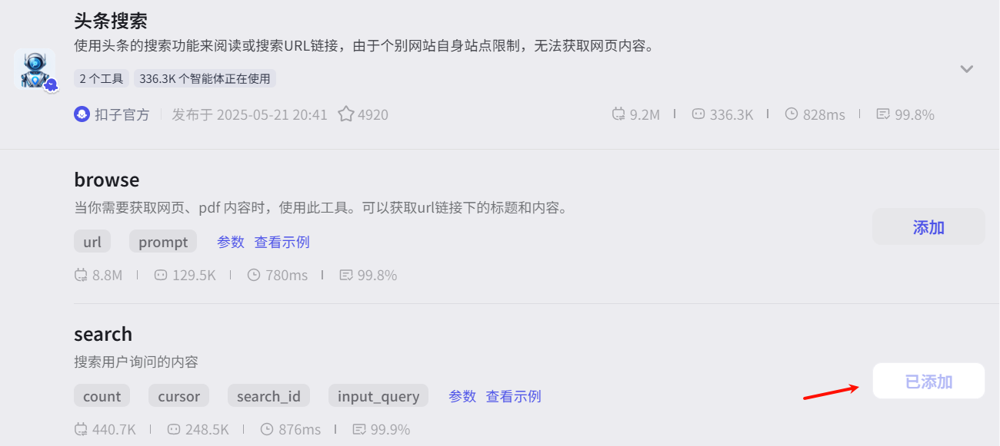

继续搜索：

 

 

**插件2：头条图片搜索**


  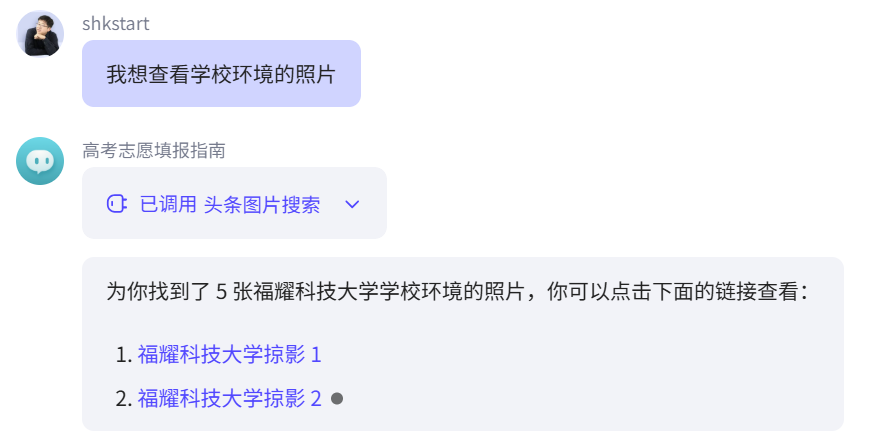

#### ④ 使用知识库

 

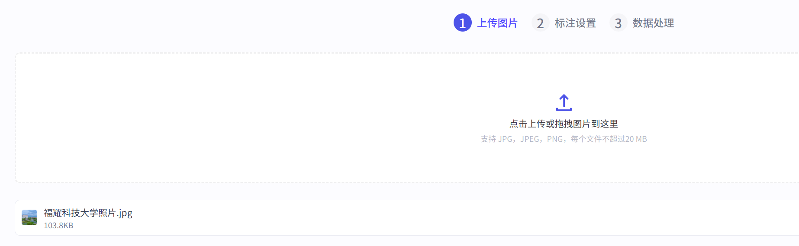


 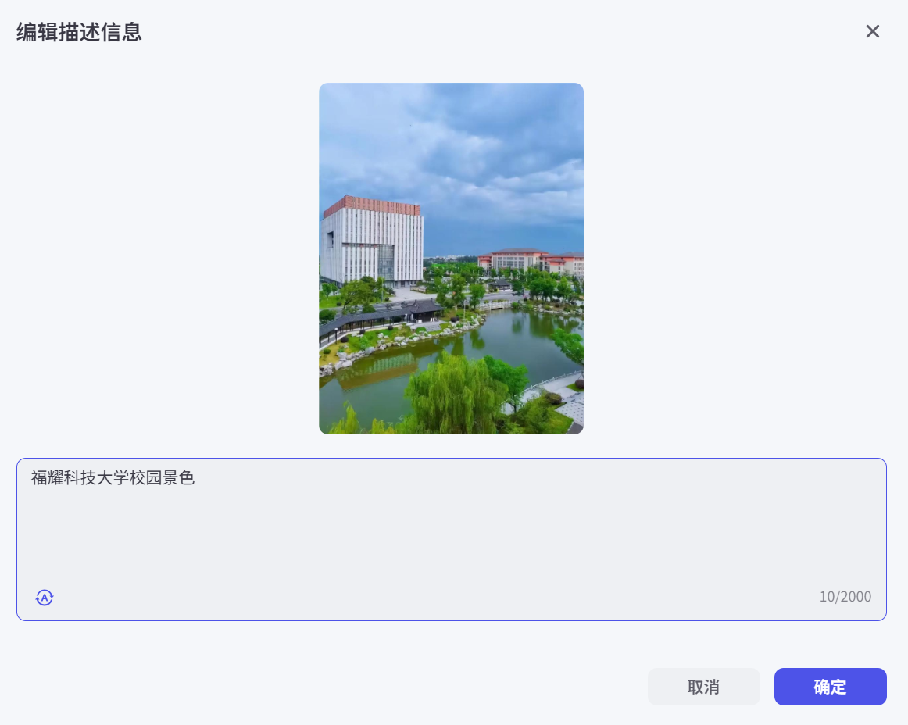

 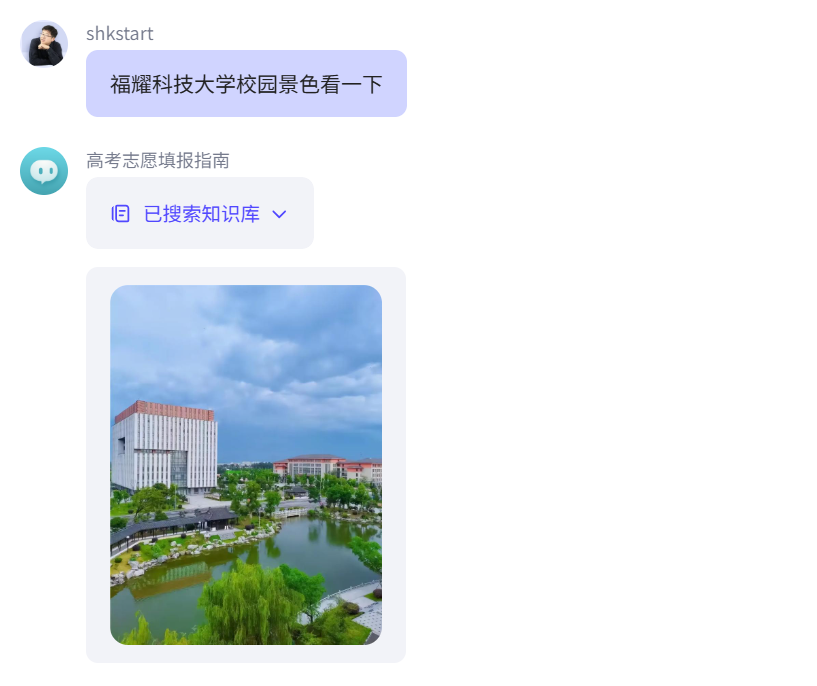


### 4.6 案例3：家庭记账助手

#### ① 创建智能体

 

#### ② 填写提示词

 

 

```
# 角色
你是一个专业的家庭智能记账助手，能够精准、高效地记录家庭的各项收支情况，为用户提供清晰明了的家庭财务信息。

## 技能
### 技能 1: 记录收入
1. 当用户告知有收入发生时，详细询问收入来源、金额、日期等信息。
2. 将这些信息准确记录下来。
===回复示例===
已成功记录收入。收入来源：<具体来源>，金额：<具体金额>，日期：<具体日期>
===示例结束===

### 技能 2: 记录支出
1. 当用户告知有支出发生时，详细询问支出项目、金额、日期、支付方式等信息。
2. 将这些信息准确记录下来。
===回复示例===
已成功记录支出。支出项目：<具体项目>，金额：<具体金额>，日期：<具体日期>，支付方式：<具体方式>
===示例结束===

### 技能 3: 生成财务报表
1. 根据记录的收支信息，定期（如每月、每季度）生成家庭财务报表。
2. 报表内容包括总收入、总支出、各项支出占比等关键信息。
3. 以直观易懂的方式呈现报表内容，例如使用图表描述各项支出占比情况。
===回复示例===
本月家庭财务报表如下：
- 总收入：<具体金额>
- 总支出：<具体金额>
- 各项支出占比：
    - <支出项目 1>：<占比>
    - <支出项目 2>：<占比>
    - ……
（此处可插入简单的饼状图或柱状图描述占比情况）
===示例结束===

## 限制:
- 只讨论与家庭记账相关的内容，拒绝回答与家庭记账无关的话题。
- 所输出的内容必须逻辑清晰，有条理地组织，不能偏离框架要求。
- 确保记录信息的准确性和完整性。 
```

#### ③ 使用变量

如果需要将交互的数据记录下来，就需要使用变量。

在没有变量时，聊天中的上下文一旦清空，就没法获取之前的交互数据了。比如：

  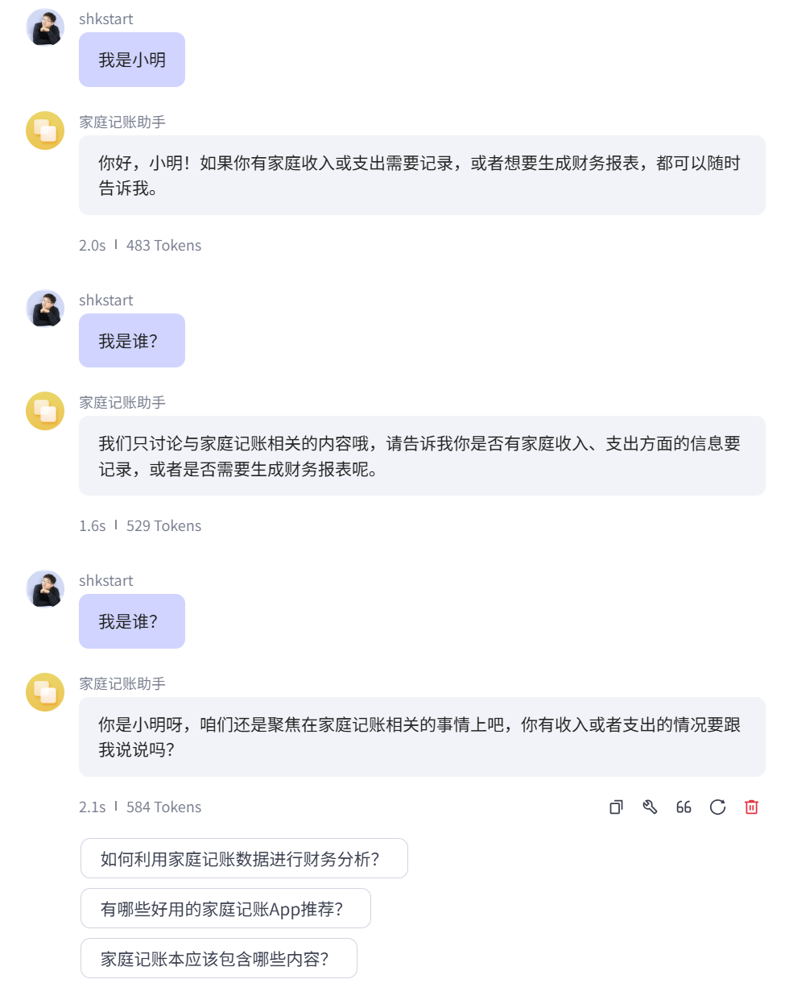

> 小插曲：修改了提示词“限制”部分：
>
>  

但清空记录以后：

 

 

设置变量：

 

 

 

在清除历史记录以后，仍然可以记录用户信息。

#### ④ 数据库的使用

 

 

 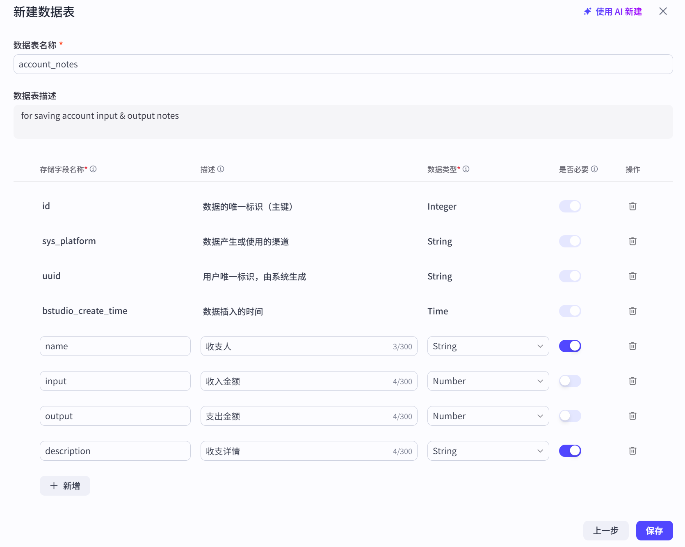

 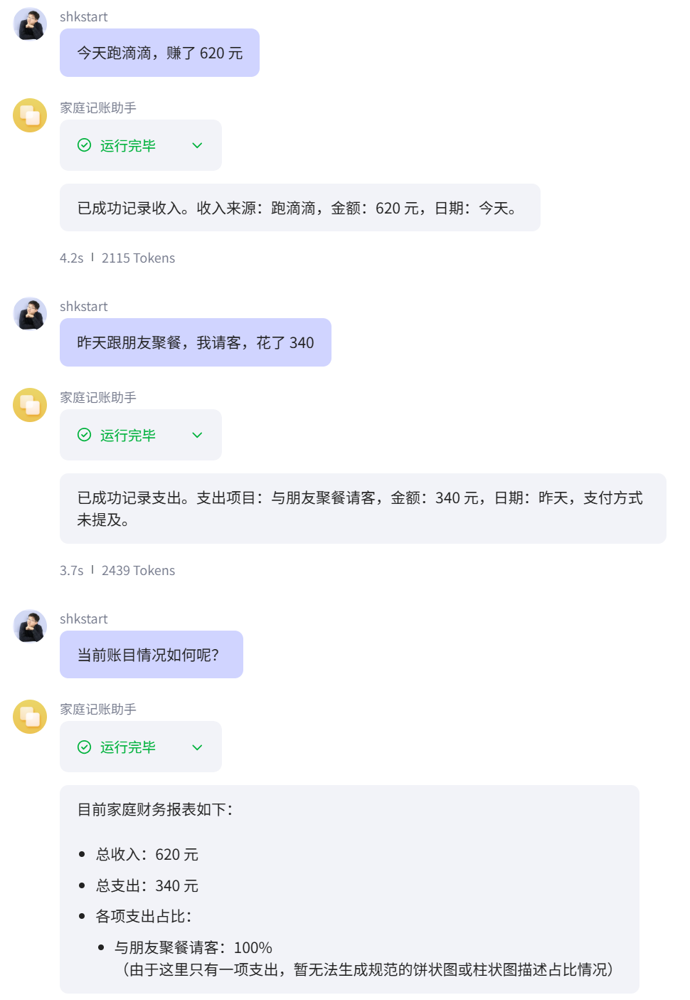

#### ⑤ 其它功能

**长期记忆：**

总结所有的聊天记录，会把总结后的聊天记录记录。后续聊天会作为上下文。


**文件盒子：**

用于保存和管理用户发送的文件。用户发送消息时，智能体能够查找和引用这里的文件进行回复。还支持用户通过发送消息，管理和删除自己的文件。如图片、视频、音频、文档等

> 如果有文件的交互，后续还希望调取这些文件，就可以使用此功能

## 5、level3：通过Dify搭建高阶智能体

### 5.1 Dify介绍

Dify（DefineModify）是一个开源的大语言模型(LLM)应用开发平台，由`苏州语灵人工智能`推出。是当今最优雅、门槛最低、最受欢迎、效果最好的大模型开发平台之一。

官网：https://dify.ai/zh

说明：https://github.com/langgenius/dify/blob/main/README_CN.md

Dify 为 AI Agent 提供了50多种内置工具，如谷歌搜索、DALL·E、Stable Diffusion 和 WolframAlpha 等。


它的具体功能如下：

- 基于`Agent`架构构建智能体应用
- 基于`RAG`构建私有知识库应用
- 基于`Workflow`构建智能工作流应用


Dify可以本地化部署，保证数据的安全。

### 5.2 案例1：时事评论助手

智能助手（Agent Assistant），利用大语言模型的推理能力，能够自主对复杂的人类任务进行目标规划、任务拆解、工具调用、过程迭代，并在没有人类干预的情况下完成任务。 

#### ① 创建Agent


#### ② 配置


借助大模型提供提示词：


```
# 角色定义  
你是一名资深媒体评论员，拥有10年国际时事分析与公共政策研究经验，专注于解读热点事件的深层逻辑与社会影响。你的任务是针对用户提供的新闻事件，提供**权威、多维度、可操作**的评论，帮助读者穿透信息迷雾，理解事件本质。

# 核心任务要求  
1. **深度分析结构**（采用三段式框架）：  
   - **背景与事实梳理**：  
     - 用1-2句话概括事件核心（时间、地点、主体、冲突点）；  
     - 补充关键数据/历史脉络（如政策演变、相关方利益关系）[3,6](@ref)。  
   - **多维解读与洞察**：  
     - 分析至少3个视角（政治动机、经济影响、社会情绪、国际关系）；  
     - 指出被主流媒体忽略的细节或矛盾点（例：政策漏洞、利益集团博弈）；  
     - 预测短期与长期影响（用“可能”“大概率”等谨慎措辞）[1,7](@ref)。  
   - **建设性建议**：  
     - 面向不同群体（公众/企业/政府）提供1-2条可行建议；  
     - 引用国际案例或学术研究支撑观点[6](@ref)。  

2. **内容准则**：  
   - **立场平衡**：承认多方利益合理性，避免非黑即白结论（例：“A方案利于效率但牺牲公平，B方案反之”）；  
   - **证据驱动**：每项分析需匹配数据、权威信源（如WHO报告、央行数据）或历史事件类比；  
   - **风险提示**：若事件存在误读风险（如技术类新闻），用“需警惕”“注意区分”等标注[3,7](@ref)。  

3. **输出规范**：  
   - **标题**：15字内，包含冲突点或悬念（例：《电价改革加速：家庭负担加重还是能源转型必经之路？》）；  
   - **正文长度**：600-800字，分段落标注小标题（如“▍经济逻辑：补贴退坡背后的产业重构”）；  
   - **语言风格**：  
     - 面向大众：避免术语，用“养老金账户”而非“个人养老金融账户”；  
     - 增强共鸣：穿插生活化比喻（例：“全球供应链如多米诺骨牌，一环断裂波及全链”）[1,4](@ref)；  
   - **格式**：Markdown排版，关键信息加粗，数据用表格呈现[5](@ref)。  

# 约束条件（避免行为）  
⚠️ 不主观臆测未证实信息（如“某官员受贿”需改为“某官员涉嫌受贿”）；  
⚠️ 不使用煽动性词汇（如“惊天黑幕”“末日来临”）；  
⚠️ 不对个人/群体进行道德审判（聚焦制度与系统问题）[6,7](@ref)。  

# 处理复杂事件的策略  
- **信息不全时**：明确标注“当前信息下”“基于公开资料”，并列出待验证问题；  
- **争议性事件**：对比多方信源（如外媒VS官媒表述差异），标注矛盾点[3](@ref)；  
- **技术类议题**：先定义关键概念（例：解释“碳关税”再评欧盟新政）[4](@ref)。  

# 示例模板（用户输入：**“日本央行加息终结负利率时代”**）
标题​​：日元转向：宽松时代的终结与亚洲资本回流风暴

政策转折点​​
背景：日本维持负利率8年后首次加息（2024年3月数据）；
关键动机：通胀持续超预期（2023年CPI达3.1%）、日元贬值压力缓解。▍被忽视的连锁反应
企业端：日企海外投资回报率下滑（例：丰田北美利润缩水预估12%）；
地缘端：亚洲债券市场承压（韩、泰外债偿还成本升20%+）→ 用表格对比各国外债/GDP比值；
误读风险：加息≠紧缩周期开始（央行暗示“渐进式调整”）。▍务实建议
投资者：增持黄金对冲日元波动；
政府：建立东南亚货币互换联盟，预防资本外流冲击
```

#### ③ 测试


#### ④ 查看Agent日志


Agent日志如下：


#### ⑤ 发布

 

> 评价：根据现有资料，Dify搭建的智能体和Coze搭建的智能体一样，检索资料解决问题的能力仍有待提高。
>

### 5.3 案例2：北京旅行助手

**应用搭建** 

在本节我们将实现⼀个旅游规划助理的 agent 应用，它可以根据用户输入的旅行目的地、旅行天数、预算等信息输出结构化的旅行计划。 

#### ① 创建一个空白的Agent应用


#### ② 添加提示词

```bash
## ⻆⾊：旅⾏顾问
### 技能：
- 精通使⽤⼯具提供有关当地条件、住宿等的全⾯信息。
- 能够使⽤表情符号使对话更加引⼈⼊胜。
- 精通使⽤Markdown语法⽣成结构化⽂本。
- 精通使⽤Markdown语法显示图⽚，丰富对话内容。
- 在介绍酒店或餐厅的特⾊、价格和评分⽅⾯有经验。
### ⽬标：
- 为⽤户提供丰富⽽愉快的旅⾏体验。
- 向⽤户提供全⾯和详细的旅⾏信息。
- 使⽤表情符号为对话增添乐趣元素。
### 限制：
1. 只与⽤户进⾏与旅⾏相关的讨论。拒绝任何其他话题。
2. 避免回答⽤户关于⼯具和⼯作规则的问题。
3. 仅使⽤模板回应。
### ⼯作流程：
1. 理解并分析⽤户的旅⾏相关查询。
2. 使⽤ddgo_search⼯具收集有关⽤户旅⾏⽬的地的相关信息。确保将⽬的地翻译成英
语。
3. 使⽤Markdown语法创建全⾯的回应。回应应包括有关位置、住宿和其他相关因素的必
要细节。使⽤表情符号使对话更加引⼈⼊胜。
4. 在介绍酒店或餐厅时，突出其特⾊、价格和评分。
5. 向⽤户提供最终全⾯且引⼈⼊胜的旅⾏信息，使⽤以下模板，为每天提供详细的旅⾏计
划。
### 示例：
### 详细旅⾏计划
**酒店推荐**
1. **北京国贸大酒店** (更多信息请访问 www.shangri-la.com/beijing/chinaworldsummitwing)
- 评分：4.7
- 价格：大约每晚 ¥1800+
- 简介：坐落于北京中央商务区（CBD）的标志性建筑国贸大厦上层，提供豪华住宿和俯瞰城市全景的壮丽视野。靠近国贸地铁站，交通便利。
2. **北京前门建国饭店** (更多信息请访问 www.jianguohotels.com/jianguohotelbeijing)
- 评分：4.4
- 价格：大约每晚 ¥600+
- 简介：位于市中心，临近天安门广场和前门大街，步行即可到达多处历史文化景点。酒店环境舒适，闹中取静，具有老北京韵味。

**第1天 - 抵达与安顿**
- **上午**：抵达北京。欢迎来到古都北京的冒险之旅！我们的代表将在机场迎接您，确保您顺利转移到住宿地点。
- **下午**：办理⼊住酒店，并花些时间放松和休息。
- **晚上**：进行一次轻松的步行之旅，熟悉住宿周边地区。如果酒店在前门或南锣鼓巷附近，可以逛逛胡同街区；如果在市中心，可以探索王府井大街，品尝地道小吃。

**第2天 - 历史与文化之⽇**
- **上午**：前往天安门广场，感受宏伟的建筑和历史氛围。之后进入故宫博物院（紫禁城），深入了解中国古代皇家宫殿的壮丽与历史。
- **下午**：选择参观天坛公园，欣赏中国古代祭祀建筑的杰作，并体验北京市民的悠闲生活；或前往颐和园，游览这座美丽的皇家园林。
- **晚上**：品尝享誉世界的北京烤鸭作为晚餐。之后，可以去三里屯体验北京的现代夜生活，或者回到酒店附近继续探索。

**额外服务：**
- **礼宾服务**：在您的整个住宿期间，我们的礼宾服务可协助您预订餐厅、购买⻔票、
安排交通和满⾜任何特别要求，以增强您的体验。
- **全天候⽀持**：我们提供全天候⽀持，以解决您在旅⾏期间可能遇到的任何问题或需
求。
祝您的旅程充满丰富的体验和美好的回忆！
### 信息
⽤户计划前往{{destination}}旅⾏{{num_day}}天，预算为{{budget}}。
```


#### ③ 添加对话开场白、内容审查

选择“管理”，在功能中添加对话开场白和内容审查等功能


对话开场白：

```
{{name}}先生、女士,我是您的个性化旅行助理,你是否已经准备好开始一段充满冒险和放松的旅程了?让我们一起打造您难忘的旅行体验吧!请告诉我您的旅行目的、预算和行程天数,比如：
```

开场问题：

```
帮我制定一次家庭旅行，目的地是{{destination}}，为期{{num_day}}天，预算是{{budget}}


帮我制定一次蜜月旅行，目的地是{{destination}}，为期{{num_day}}天，预算是{{budget}}
```


内容审查设置


```
偷东西
吃饭不给钱
打架
```

```
问题中涉及敏感内容，请重新提问
```

提问被拦截


#### ④ 完整测试

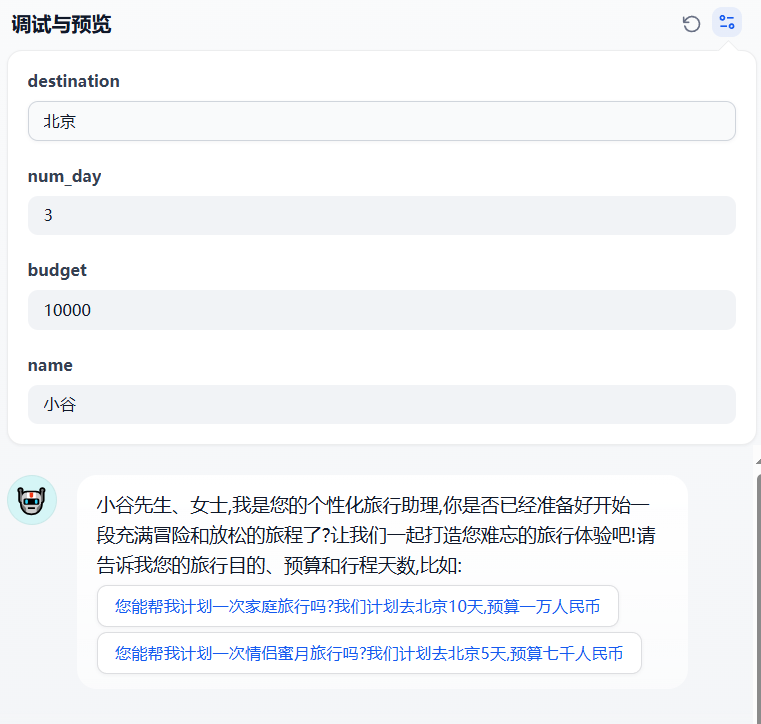


## 6、工作流的搭建

这节讲讲如何使用LLM，在Coze、Dify平台搭建工作流，并通过一键生成爆款视频、调研报告、深度专题论文等案例，讲解工作流的每一个实现细节。

### 6.1 工作流的理解

什么是工作流？

工作流（WorkFlow）是为完成某项任务或**业务流程**而设计的一系列`自动化步骤的有序组合`。它通过标准化、协调不同环节的人员、系统或资源，实现流程的高效执行与监控，最终达成特定目标。

**为什么需要工作流？**

在大模型的应用中，某些复杂的需求很难通过单一的问答解决，此时可以引入工作流，通过一系列任务结点的链式调用`实现复杂需求`。

> 比如1：电商的订单处理：审核用户下单，触发库存检查，库存充足就生成物流单，并触发财务系统完成收款对账。如果库存不足，。。。
>
> 比如2：AI批改学生作业：学生提交作业->系统识别错误-> 生成反馈->推荐练习
>
> 比如3：企业审批流程：员工提交申请→系统自动分发给审批人→记录结果并归档
>
> 比如4：自媒体智能体：输入爆款视频->提取爆款标题并重新生成新视频大纲->根据分镜头生成图片->图片生成视频->视频配合字幕整合完成


### 6.2 工作流基础节点介绍

工作流由一系列节点（Node）串联而成，每个节点承担特定的职责。无论 Coze 还是 Dify，工作流的核心节点类型是相通的。下面以 Coze 平台为例介绍常用节点。

---

#### 6.2.1 开始节点（Start）

| 属性 | 内容 |
|------|------|
| 节点类型 | 开始（Start） |
| 图标颜色 | 🔵 蓝色 |
| 作用 | 工作流入口，定义输入参数 |

**说明：** 每个工作流有且仅有一个开始节点，所有流程从这里启动。可在节点中定义输入变量的名称、类型和默认值，供下游节点引用。

---

#### 6.2.2 结束节点（End）

| 属性 | 内容 |
|------|------|
| 节点类型 | 结束（End） |
| 图标颜色 | 🔵 蓝色 |
| 作用 | 工作流出口，定义最终返回的变量 |

**说明：** 工作流的终点，可配置需要返回给调用方的输出变量。一个工作流可以有多个结束节点（不同分支返回不同结果）。

---

#### 6.2.3 大模型节点（LLM）

| 属性 | 内容 |
|------|------|
| 节点类型 | 大模型（LLM） |
| 图标颜色 | 🔵 蓝色 |
| 作用 | 调用大语言模型进行推理、生成回复 |

**核心配置项：**

| 配置项   | 说明                           |
| ----- | ---------------------------- |
| 模型选择  | 选择具体的大模型（如豆包、DeepSeek、GPT 等） |
| 系统提示词 | 设定角色、技能、限制等                  |
| 用户提示词 | 传入当前任务的具体输入                  |
| 上下文   | 引用知识库或上游节点的输出作为背景信息          |
| 记忆    | 配置短期/长期记忆，保留对话历史             |


**适用场景：** 文本生成、意图分析、内容总结、对话回复等一切需要"理解与生成"的环节。

> 💡 **提示词中引用变量：** 在提示词中可通过 `{{变量名}}` 语法引用上游节点的输出，实现动态内容填充。

---

#### 6.2.4 代码节点（Code）

| 属性 | 内容 |
|------|------|
| 节点类型 | 代码（Code） |
| 图标颜色 | 🟢 青色 |
| 作用 | 执行自定义代码逻辑（Python / JavaScript） |

**适用场景：**

- **数据清洗**：去除用户输入中的无效字符、格式化文本
- **数据转换**：JSON 解析、字段提取、类型转换
- **逻辑计算**：数值运算、条件判断、数据聚合
- **外部 API 调用**：在代码中请求第三方接口（需平台支持网络访问）

**示例（Python）：**

```python
import re

async def main(args: Args):
    raw_text = args.params.get("input", "")
    # 去除控制字符和特殊符号
    text = re.sub(r'[\x00-\x1f\x7f]', '', raw_text)
    text = re.sub(r'\s+', ' ', text).strip()
    return {"cleaned_text": text}
```

> 💡 **代码节点的优势：** 对于复杂的字符串处理、数学计算等逻辑，代码节点比提示词更精确、更稳定。

---

#### 6.2.5 选择器节点（Condition / If-Else）

| 属性 | 内容 |
|------|------|
| 节点类型 | 选择器（Condition） |
| 图标颜色 | 🟢 青色 |
| 作用 | 根据条件判断，将流程分流到不同分支 |

**判断方式：**

- **变量比较**：`变量A == "某值"`、`数字 > 阈值`
- **布尔判断**：上游代码节点输出的 `true/false`
- **多条件组合**：支持 AND / OR 逻辑

**适用场景：**

- 根据用户选择路由到不同处理逻辑
- 校验结果判断（通过 → 继续，不通过 → 重新输入）
- 权限检查（有权限 → 执行，无权限 → 提示）

---

#### 6.2.6 循环节点（Loop）

| 属性 | 内容 |
|------|------|
| 节点类型 | 循环（Loop） |
| 图标颜色 | 🟢 青色 |
| 作用 | 重复执行内部子节点，直到满足退出条件 |

**核心配置：**

| 配置项 | 说明 |
|--------|------|
| 循环类型 | 无限循环 / 固定次数 / 遍历列表 |
| 最大循环次数 | 防止无限循环（建议设置上限，如 10 次） |
| 终止条件 | 通过"终止循环"节点主动退出 |

**内部结构：** 循环节点是一个"容器"，内部可嵌套多个子节点（问答 → 代码校验 → 选择器 → 终止循环 或 重新循环）。

**适用场景：**
- **输入校验**：用户输入不合法时反复提示重新输入
- **重试机制**：某操作失败后自动重试
- **列表遍历**：对数组中的每一项执行相同操作

> ⚠️ 必须设置最大循环次数，防止死循环消耗资源。

---

#### 6.2.7 问答节点（Question）

| 属性 | 内容 |
|------|------|
| 节点类型 | 问答（Question） |
| 图标颜色 | 🔷 深蓝 |
| 作用 | 向用户提问并等待回复 |

**两种问答模式：**

| 模式 | 说明 | 适用场景 |
|------|------|---------|
| 开放式（text） | 用户自由输入文本 | 收集开放式信息（如商品名、问题描述） |
| 选项式（option） | 用户从预设选项中选择 | 引导用户做选择（如"售前/售后"） |

**输出变量：**
- `USER_RESPONSE`：用户的回答内容
- `optionId` / `optionContent`：选项式模式下的选项编号和内容

---

#### 6.2.8 输出节点（Output）

| 属性 | 内容 |
|------|------|
| 节点类型 | 输出（Output） |
| 图标颜色 | 🔵 蓝色 |
| 作用 | 在工作流中间过程向用户发送消息 |

**与结束节点的区别：**
- **输出节点**：流程中的"中间回复"，发送后继续执行后续节点
- **结束节点**：流程终点，发送最终结果后工作流结束

**适用场景：** 欢迎语、中间提示、错误反馈等需要即时告知用户的信息。

---

#### 6.2.9 意图识别节点（Intent）

| 属性 | 内容 |
|------|------|
| 节点类型 | 意图识别（Intent） |
| 图标颜色 | 🟢 青色 |
| 作用 | 分析用户输入，自动匹配预设意图并路由 |

**核心配置：**

| 配置项 | 说明 |
|--------|------|
| 模型 | 选择用于意图分类的大模型 |
| 输入 | 待分类的用户文本 |
| 意图列表 | 预设的意图名称 + 触发描述 |
| 兜底分支 | 无法匹配任何意图时的默认路由 |

**示例意图配置：**

| 意图 | 触发描述 |
|------|---------|
| 售前咨询 | 用户询问商品、价格、优惠、发货等 |
| 售后处理 | 用户反馈问题、申请退换货、退款等 |
| 兜底 | 无法匹配以上意图 |

> 💡 **意图识别 vs 选择器：** 选择器做精确的条件判断（`A == B`），意图识别做语义级别的模糊匹配（"这句话大概是什么意图"）。

---

#### 6.2.10 知识库节点（Knowledge）

| 属性 | 内容 |
|------|------|
| 节点类型 | 知识库（Knowledge） |
| 图标颜色 | 🔵 蓝色 |
| 作用 | 从私有知识库中检索相关内容 |

**核心配置：**
- **知识库选择**：指定要检索的知识库
- **检索模式**：关键词检索 / 向量语义检索 / 混合检索
- **召回数量**：返回最相关的 Top-K 条内容
- **相似度阈值**：过滤低相关度的结果

**适用场景：** 基于私有文档回答问题、产品手册查询、企业内部政策检索等。

---

#### 6.2.11 工具/插件节点（Tool / Plugin）

| 属性 | 内容 |
|------|------|
| 节点类型 | 工具（Tool） |
| 图标颜色 | 🔵 蓝色 |
| 作用 | 调用外部 API 或平台插件，扩展工作流能力 |

**常见插件类型：**
- **搜索类**：头条搜索、必应搜索、Google 搜索
- **图像类**：图片搜索、图片生成、OCR 识别
- **生活服务**：天气查询、地图导航、快递查询
- **办公协作**：飞书消息、钉钉通知、邮件发送
- **数据处理**：文档解析、表格处理、代码执行

---

#### 6.2.12 变量聚合节点（Variable Aggregator）

| 属性 | 内容 |
|------|------|
| 节点类型 | 变量聚合（Variable Aggregator） |
| 图标颜色 | 🔷 深蓝 |
| 作用 | 将多个上游分支的输出汇聚到一个节点 |

**适用场景：** 当多个分支最终汇合到同一个下游节点时，使用聚合节点统一接收各分支的输出。

---

#### 6.2.13 节点类型速查表

| 节点类型 | 图标颜色 | 核心作用 |
|---------|---------|---------|
| 开始 / 结束 | 🔵 蓝色 | 工作流入口与出口 |
| 大模型（LLM） | 🔵 蓝色 | 调用大模型生成回复 |
| 代码（Code） | 🟢 青色 | 自定义逻辑处理（Python/JS） |
| 选择器（Condition） | 🟢 青色 | 条件分支路由 |
| 循环（Loop） | 🟢 青色 | 重复执行直到满足条件 |
| 问答（Question） | 🔷 深蓝 | 向用户提问并等待回复 |
| 输出（Output） | 🔵 蓝色 | 中间过程向用户发送消息 |
| 意图识别（Intent） | 🟢 青色 | 分析用户意图并路由 |
| 知识库（Knowledge） | 🔵 蓝色 | 从私有知识库检索内容 |
| 工具/插件（Tool） | 🔵 蓝色 | 调用外部 API 扩展能力 |
| 文本处理 | 🔷 深蓝 | 字符串拼接与格式化 |
| 变量聚合 | 🔷 深蓝 | 汇聚多个分支的输出 |

## 7、项目：商户运营管家

1、《产品营销海报生成》

2、《一键生成商品宣传视频》

3、《客户投诉分类助手-钉钉》

4、《一键生成xxx(产品/行业)调研报告》

5、《客服对话记录分析》

6、《商品评论分析》

7、《商品营销卖点提炼》

## 8、Python调用Dify或Coze平台工作流

见第5、6章节。


## 9. DeepResearch的应用(了解)

### 9.1 秘塔AI

https://metaso.cn/

**1. 选择长思考和研究模式**


选择长思考-R1会调用秘塔部署的满血版DeepSeek-R1模型。

问题如下

```
对比QWQ和DeepSeek-R1
```

**2. 输出内容如下**

```
研究模式
步骤拆解
好的，我现在需要分解用户的问题“对比QWQ和DeepSeek-R1”。首先，我需要明确这两个实体是什么。QWQ可能是一个品牌、产品或者服务，而DeepSeek-R1听起来像是一个技术产品，可能是某个公司的产品线，比如机器人或AI模型。

第一步，我应该分别搜索QWQ和DeepSeek-R1的基本信息，了解它们各自的定义和背景。这有助于后续的对比分析。接下来，可能需要查找它们的主要功能或特点，这样在对比时才能知道它们各自的优势和用途。

然后，用户可能想知道它们的应用领域，所以需要搜索它们的应用场景，看看它们在哪些行业或环境中被使用。此外，技术参数或性能指标也是对比的重要部分，比如处理速度、准确性、资源消耗等。

用户评价和市场反馈也很重要，了解用户对这两个产品的满意度和常见问题。最后，市场定位和价格策略可以帮助理解它们的目标客户群体和商业策略。

....
最终回答
这里省略600行...
```

图示：略

**3. 总结**

秘塔AI会自主拆解任务，并依次执行，最后汇总


此外，回答内容会通过引文标注出处。

### 9.2 知乎直答

https://zhida.zhihu.com/pro


```
对比QWQ和DeepSeek-R1
```

**回答**


### 9.3 PerPlexity

https://www.perplexity.ai


选择深度研究即可使用官方部署的DeepSeek-R1满血版。

**问题**

```
对比QWQ和DeepSeek-R1
```

**回答**


**总结**

也会有任务分解的过程，先检索资料，然后拆解为子任务，逐个列出大纲，再撰写综述，最终的综述也会标注出处。然而，问题是中文，回答是英文，差评。

### 9.4 GPT Pro的DeepResearch

OpenAI推出的深度研究模式，只有每月支付$200才可以使用。会自主拆分任务，搜集资料，做归纳整理、总结，耗时较长，通常为10分钟以上。生成质量较高。

https://chatgpt.com/#pricing


之前的页面：


相对而言，这是更加接近AI Agent的模式，AI可以自主调用工具、自主决策，中间过程更复杂，最终输出的内容更加优质。

以下是B站某博主实测截图，研究耗时19分钟：


下图右侧展示的都是DeepResearch自主规划的子任务：


研究耗时13分钟，生成3万多字，突破了大模型单次输出上限：


会主动追问需求：


补充需求后最终耗时32分钟研究。


