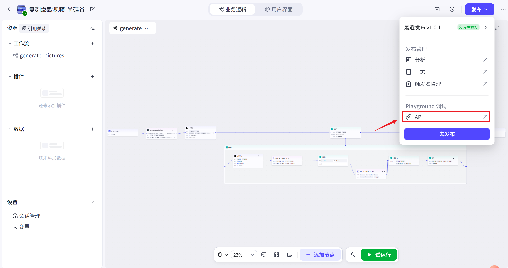
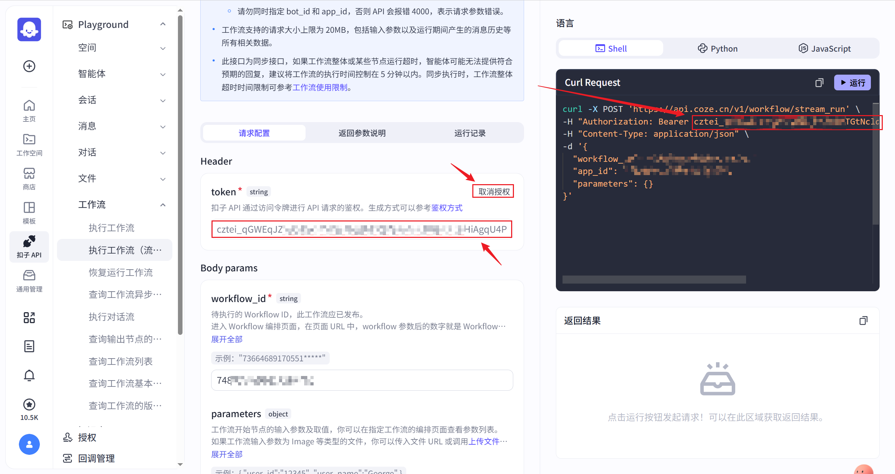
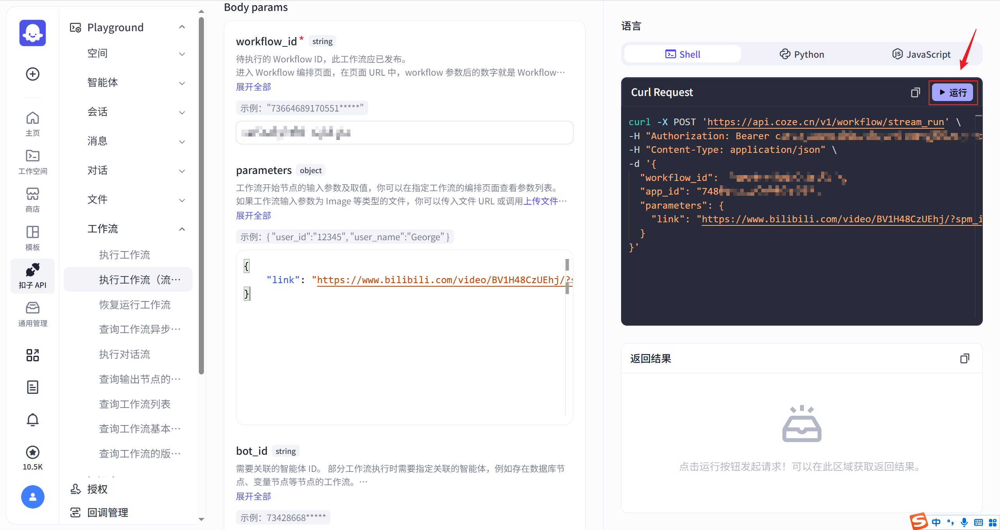
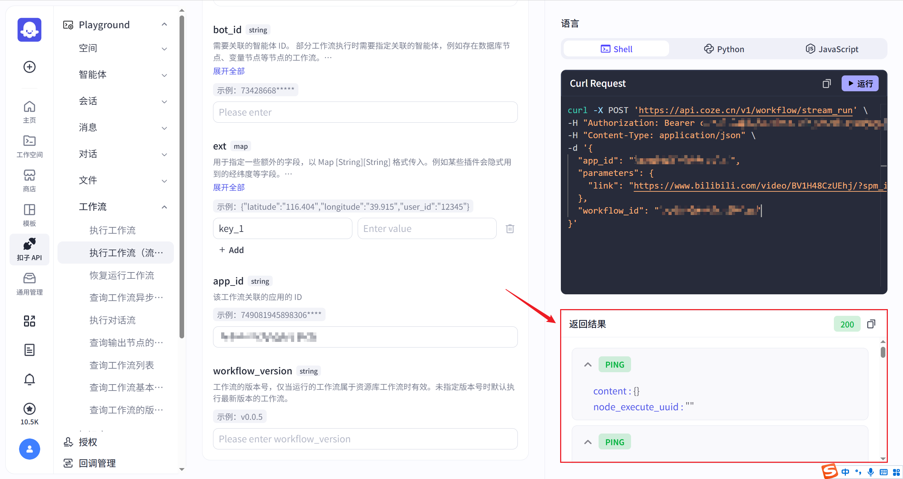
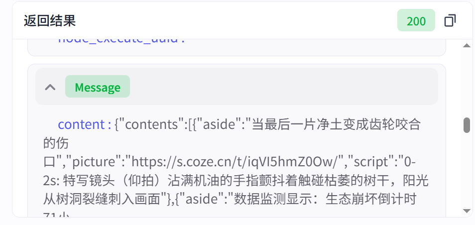
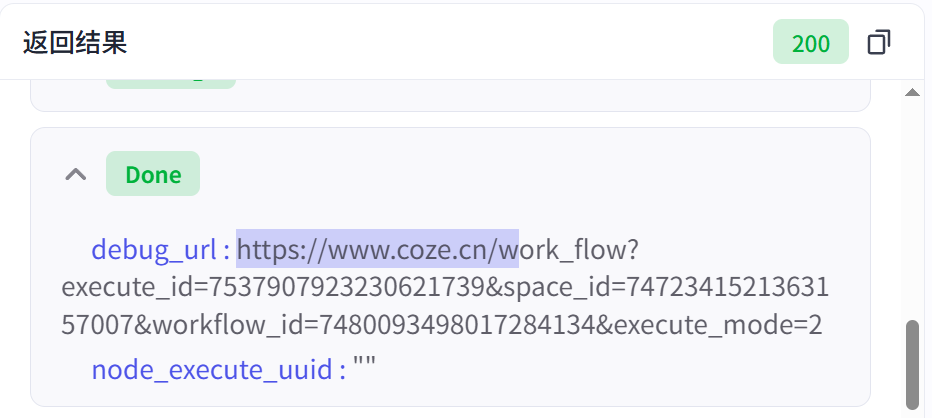
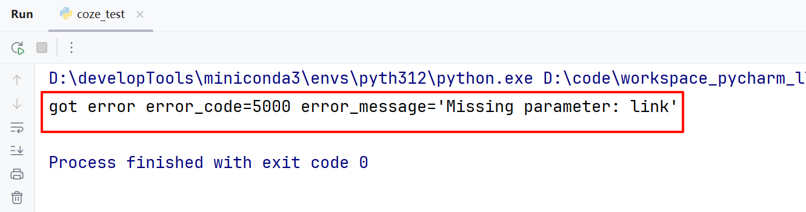
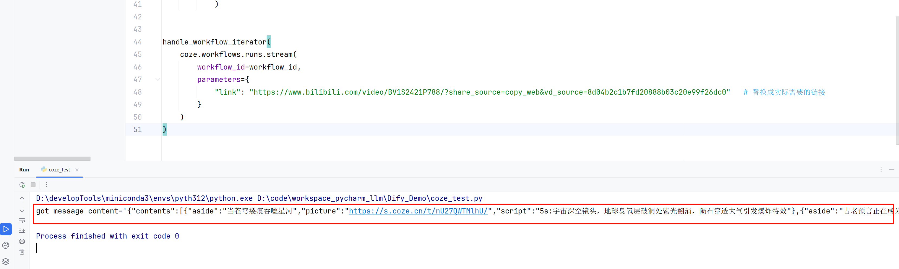
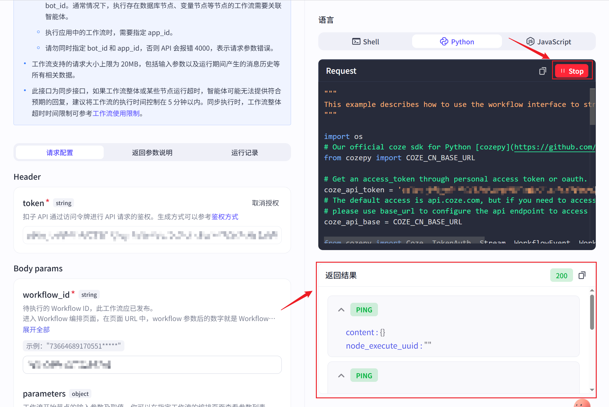

# 第06章：Python调用Coze平台工作流

## 1. 发布API

Coze的API功能需要通过应用发布功能启用。


## 2. 调试

### 2.1 入口

发布成功后在工作流画布页面可以看到API调试入口



### 2.2 查看工作流ID和应用ID

通过上述入口进入API playground，选择右侧的Shell请求

可以看到工作流ID：workflow_id

应用ID：app_id


### 2.3 授权API key

左侧窗口下滑，可以看到token，这就是API Key，点击授权


点击“授权”后自动生成并填充 API Key



右侧的Shell命令窗口同步更新

### 2.4 添加参数

parameters属性下的JSON用于向工作流传递参数。

该JSON对象的每个属性对应一个工作流的输入变量


### 2.5 运行

可以直接点击Shell命令窗口右上角的“运行”按钮



### 2.6 完整命令

```sh
curl -X POST 'https://api.coze.cn/v1/workflow/stream_run' \
-H "Authorization: Bearer {api_key}" \
-H "Content-Type: application/json" \
-d '{
  "workflow_id": "{workflow_id}",
  "app_id": "{app_id}",
  "parameters": {
    "link": "https://www.bilibili.com/video/BV1H48CzUEhj/?spm_id_from=333.337.search-card.all.click&vd_source=88c7b17e5559e5e21cf45e7e873d1459" #希望复刻的视频链接
  }
}'
```

### 2.7 运行结果



右下角可以看到运行结果

200表示通信正常

PING是用于维持通信连接的心跳响应

Message是携带数据的响应



此处的content是工作流的输出。

Done是最后一个响应，表示工作流执行完毕，在Message响应之后。



## 3.通过python代码调用工作流

### 3.1 官方提供了调用API的Python代码


### 3.2 源码如下

```python
"""
This example describes how to use the workflow interface to stream chat.
"""

import os
# Our official coze sdk for Python [cozepy](https://github.com/coze-dev/coze-py)
from cozepy import COZE_CN_BASE_URL

# Get an access_token through personal access token or oauth.
coze_api_token = '{API_KEY}'
# The default access is api.coze.com, but if you need to access api.coze.cn,
# please use base_url to configure the api endpoint to access
coze_api_base = COZE_CN_BASE_URL

from cozepy import Coze, TokenAuth, Stream, WorkflowEvent, WorkflowEventType  # noqa

# Init the Coze client through the access_token.
coze = Coze(auth=TokenAuth(token=coze_api_token), base_url=coze_api_base)

# Create a workflow instance in Coze, copy the last number from the web link as the workflow's ID.
workflow_id = '{WORKFLOW_ID}'


# The stream interface will return an iterator of WorkflowEvent. Developers should iterate
# through this iterator to obtain WorkflowEvent and handle them separately according to
# the type of WorkflowEvent.
def handle_workflow_iterator(stream: Stream[WorkflowEvent]):
    for event in stream:
        if event.event == WorkflowEventType.MESSAGE:
            print("got message", event.message)
        elif event.event == WorkflowEventType.ERROR:
            print("got error", event.error)
        elif event.event == WorkflowEventType.INTERRUPT:
            handle_workflow_iterator(
                coze.workflows.runs.resume(
                    workflow_id=workflow_id,
                    event_id=event.interrupt.interrupt_data.event_id,
                    resume_data="hey",
                    interrupt_type=event.interrupt.interrupt_data.type,
                )
            )


handle_workflow_iterator(
    coze.workflows.runs.stream(
        workflow_id=workflow_id
    )
)
```

将源码粘贴到PyCharm。

### 3.3 在本地PyCharm中运行需要安装cozepy

```sh
pip install cozepy
```

代码粘贴后，运行，报错：



需要补充代码：


说明：在coze平台拷贝过来的代码基础上，添加参数parameters：

```python
handle_workflow_iterator(
    coze.workflows.runs.stream(
        workflow_id=workflow_id,
        parameters={
            "link": "https://www.bilibili.com/video/BV1S2421P788/?share_source=copy_web&vd_source=8d04b2c1b7fd20888b03c20e99f26dc0"   # 替换成实际需要的链接
        }
    )
)
```


### 3.4 最终代码

```python
"""
This example is about how to use the streaming interface to start a chat request
and handle chat events
"""

import os
# Our official coze sdk for Python [cozepy](https://github.com/coze-dev/coze-py)
from cozepy import COZE_CN_BASE_URL

# Get an access_token through personal access token or oauth.
coze_api_token = 'cztei_hauAfE3fAyudJBjx7YIuXhJLv3agMRYGVHhA9i0txXvQQlEKvR9Ias6GsgQtirdmP'
# The default access is api.coze.com, but if you need to access api.coze.cn,
# please use base_url to configure the api endpoint to access
coze_api_base = COZE_CN_BASE_URL

from cozepy import Coze, TokenAuth, Message, ChatStatus, MessageContentType, ChatEventType  # noqa

# Init the Coze client through the access_token.
coze = Coze(auth=TokenAuth(token=coze_api_token), base_url=coze_api_base)

# Create a bot instance in Coze, copy the last number from the web link as the bot's ID.
bot_id = '7651065383600308224'
# The user id identifies the identity of a user. Developers can use a custom business ID
# or a random string.
user_id = '123456789'

# Call the coze.chat.stream method to create a chat. The create method is a streaming
# chat and will return a Chat Iterator. Developers should iterate the iterator to get
# chat event and handle them.

for event in coze.chat.stream(
    bot_id=bot_id,
    user_id=user_id,
    additional_messages=[
        Message.build_user_question_text("闲聊."),
    ],
    parameters={
        "name": "红烧牛肉面",
    }
):
    if event.event == ChatEventType.CONVERSATION_MESSAGE_DELTA:
        print(event.message.content, end="", flush=True)

    if event.event == ChatEventType.CONVERSATION_CHAT_COMPLETED:
        print()
        print("token usage:", event.chat.usage.token_count)


```


### 3.5 运行

运行结果如下：




## 4.通过平台运行



