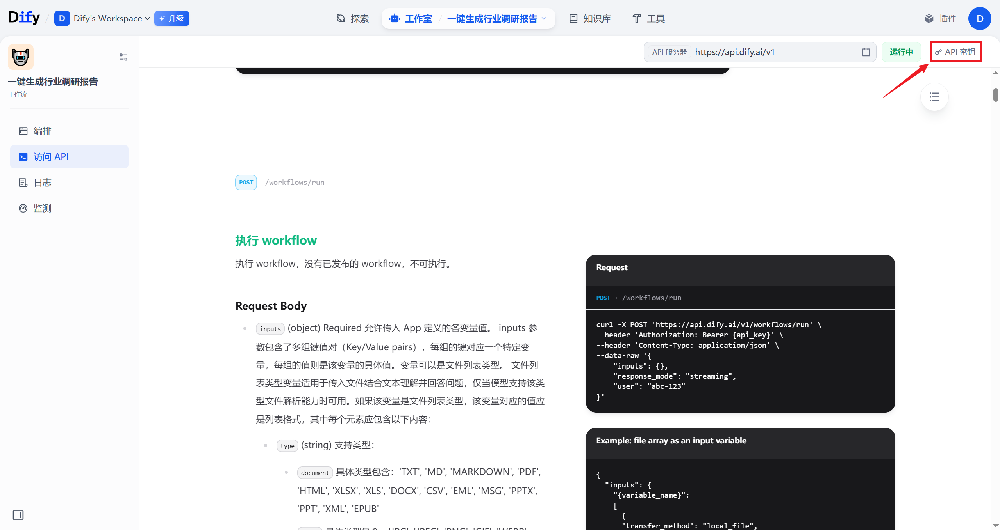
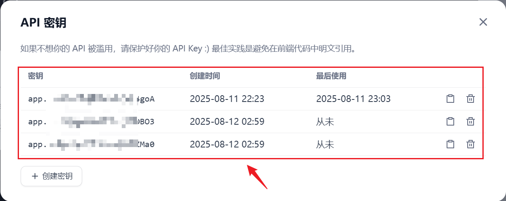
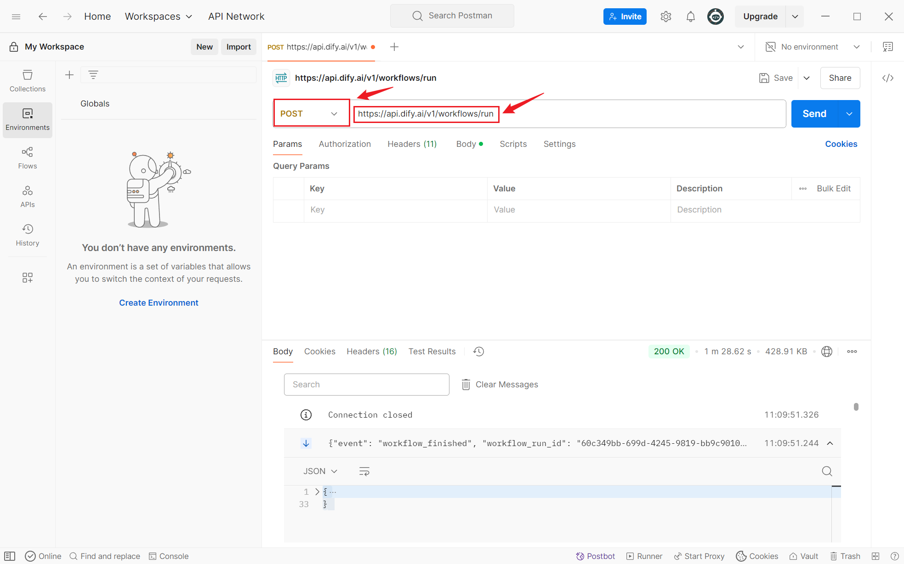
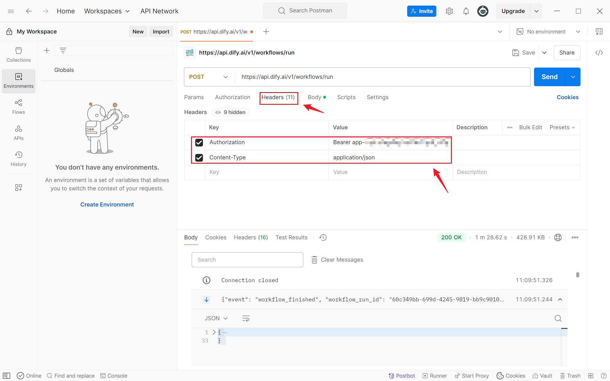
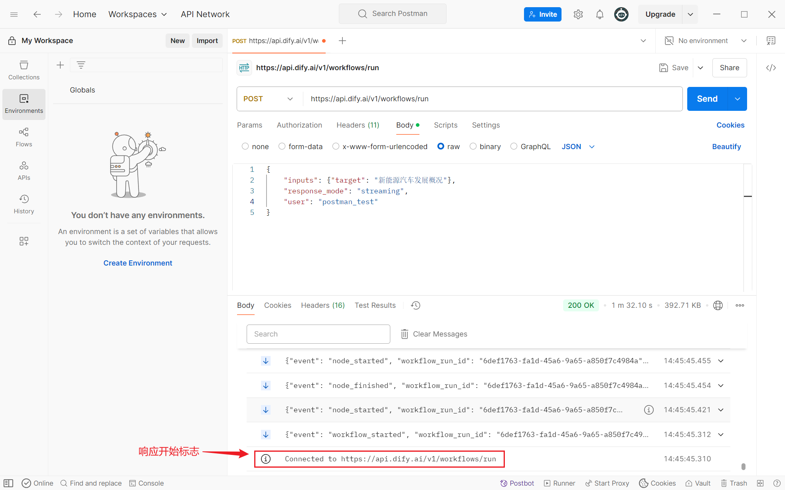
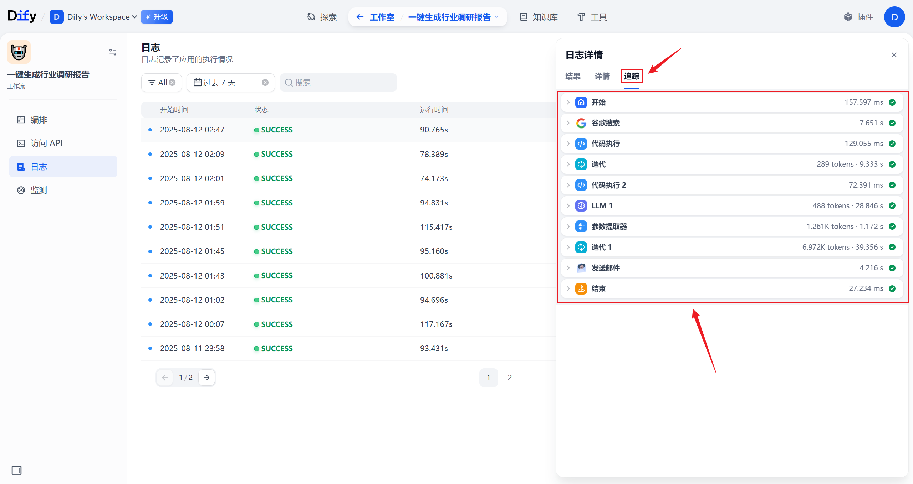

# 第05章：Python调用Dify平台工作流

通过调用API的方式启动工作流

## 1、发布

要通过API的方式启动工作流，后者必须是已发布状态。


## 2、查看API文档


## 3、创建API密钥

### 3.1 创建秘钥




创建后复制即可。

### 3.2 工作流和API Key的关系

dify的API密钥是**和工作流绑定**的，一个API Key只能用于**访问特定的工作流**。

一个工作流可以对应多个 API Key



## 4、请求格式

通过POST请求启动工作流

示例如下

```sh
curl -X POST 'https://api.dify.ai/v1/workflows/run' \
--header 'Authorization: Bearer {api_key}' \
--header 'Content-Type: application/json' \
--data-raw '{
    "inputs": {},
    "response_mode": "streaming",
    "user": "abc-123"
}'
```

### 4.1 url

> https://api.dify.ai/v1/workflows/run

### 4.2 头部信息

| 键            | 值               |
| ------------- | ---------------- |
| Authorization | Bearer api_key   |
| Content-Type  | application/json |

api_key 替换为上一步创建的API秘钥

### 4.3 请求体

请求体为原始的JSON格式。

```json
{
    "inputs": {},                 //真正输入工作流的数据，每个输入字段对应该JSON的一个字段
    "response_mode": "streaming", //响应模式，分为流式（streaming）和阻塞式（blocking）
    "user": "abc-123"             //用户信息，用于区分调用者，随意命名
}
```

流式，基于SSE（Server-Sent Events）实现类似打字机输出方式的流式返回

阻塞式，等待执行完毕后返回结果（流程较长则可能会被中断）。由于平台限制，请求会在100秒超时无返回后中断

## 5、postman测试（可跳过）

### 5.1 新建POST请求，输入url



### 5.2 添加头信息



### 5.3 添加请求体

此处选择原始文本-JSON格式


请求体如下

```json
{
    "inputs": {"target": "新能源汽车发展概况"},
    "response_mode": "streaming",
    "user": "postman_test"
}
```

target字段的值就是我们传递给工作流的输入信息。

### 5.4 发送


### 5.5 响应


响应开始标志



响应结束标志


除了开始和结束响应，中间的响应都带有response body，包含了工作流的运行日志（状态、输入输出等）最后一个response body携带了工作流的最终输出


### 5.6 响应体格式

最后一个响应体内容如下

```json
{
    "event": "workflow_finished",
    "workflow_run_id": "6def1763-fa1d-45a6-9a65-a850f7c4984a",
    "task_id": "11e8e90c-2a04-4a17-acce-8de24e16ba20",
    "data": {
        "id": "6def1763-fa1d-45a6-9a65-a850f7c4984a",
        "workflow_id": "28a5fdb6-e5ad-4f59-9d18-3016eabc1a6a",
        "status": "succeeded",
        "outputs": {
            "output": [
                "### **1. 引言**  \n\n#### **1.1 研究背景与意义**  \n在全球应对气候变化与能源转型的背景下，新能源汽车（NEV）作为传统燃油车的替代方案，已成为交通领域低碳化发展的核心方向。据国际能源署（IEA）统计，2022年全球新能源汽车销量突破1000万辆，占汽车总销量的14%，标志着产业从政策驱动向市场驱动的关键转折。发展新能源汽车不仅有助于减少化石能源依赖和碳排放（交通运输占全球碳排放的24%），还能推动能源结构优化、培育新兴产业生态，对实现《巴黎协定》碳中和目标具有战略意义。  \n\n#### **1.2 新能源汽车的定义与分类**  \n新能源汽车泛指采用非传统燃料驱动技术的车辆，主要分为三类：  \n- **纯电动汽车（BEV）**：完全依赖电池供能，零尾气排放，代表车型如特斯拉Model 3、比亚迪汉；  \n- **插电式混合动力汽车（PHEV）**：兼具燃油与电力双系统，短途纯电、长途混动，如丰田普锐斯Prime；  \n- **燃料电池汽车（FCEV）**：以氢为能源，通过电化学反应发电，典型如现代NEXO。  \n此外，增程式电动车（REEV）和氢内燃机车辆等细分技术也在探索中。  \n\n#### **1.3 全球能源转型与政策驱动**  \n各国政府通过多维政策加速新能源汽车普及：  \n- **中国**：实施“双积分”政策，设定2025年NEV渗透率25%的目标；  \n- **欧盟**：通过《Fit for 55》法案，2035年禁售燃油车；  \n- **美国**：《通胀削减法案》提供单车最高7500美元税收抵免。  \n国际能源署预测，若维持当前政策力度，2030年全球NEV保有量将达2.5亿辆，显著降低交通领域石油需求。  \n\n（注：可根据实际需求补充具体国家政策案例或最新数据。）",
                "### **2. 全球新能源汽车发展现状**  \n\n#### **2.1 市场规模与增长趋势**  \n近年来，全球新能源汽车市场呈现爆发式增长。根据国际能源署（IEA）数据，2022年全球新能源汽车销量突破1000万辆，渗透率超过14%，较2020年（4%左右）实现显著提升。区域分布上：  \n- **中国**：全球最大市场，2022年销量占比超60%，政策驱动（如“双积分”政策）与本土品牌崛起（比亚迪、蔚来等）是核心动力。  \n- **欧洲**：受碳排放法规和补贴政策推动，2022年渗透率达21%，挪威、德国等国家领先，但近期部分国家补贴退坡导致增速放缓。  \n- **北美**：美国市场增速加快（2022年渗透率约7%），《通胀削减法案》通过后本土化生产要求加剧竞争，特斯拉占主导地位。  \n\n未来五年，预计全球年复合增长率将保持在20%以上，2030年渗透率或突破30%。  \n\n#### **2.2 主要车企与技术路线对比**  \n- **特斯拉**：以纯电（BEV）技术为核心，垂直整合能力强，4680电池和FSD自动驾驶系统为差异化优势。  \n- **比亚迪**：兼顾纯电与插混（PHEV），刀片电池技术提升安全性，2022年全球销量超越特斯拉（含混动车型）。  \n- **传统车企转型**：大众（MEB平台）、丰田（氢能与混动并行）等加速电动化，但技术路线选择差异显著（欧洲侧重纯电，日韩探索氢燃料）。  \n- **新势力车企**：蔚来（换电模式）、Rivian（电动皮卡）等聚焦细分市场，但盈利压力较大。  \n\n#### **2.3 产业链成熟度**  \n- **电池**：宁德时代、LG新能源、松下主导全球供应，中国产能占70%以上，但上游锂资源（智利、澳大利亚）和负极材料（石墨）存在地缘风险。  \n- **电机与电控**：博世、大陆等传统供应商与比亚迪、华为等新进入者竞争，碳化硅（SiC）器件应用提升能效。  \n- **配套环节**：充电桩建设滞后于需求，中国公共充电桩数量全球第一（2022年超180万台），欧美正加速布局超充网络。  \n\n**注**：可补充图表（如分区域销量占比、车企市场份额等）以增强数据呈现。",
                "### **3. 关键技术进展与突破**  \n\n新能源汽车的快速发展离不开核心技术的持续创新与突破。近年来，动力电池、充电基础设施、智能化技术以及氢燃料电池等领域均取得显著进展，为行业提供了强有力的技术支撑。  \n\n#### **3.1 动力电池技术**  \n动力电池是新能源汽车的核心部件，其性能直接影响车辆的续航里程、安全性和成本。当前主流技术路线包括：  \n- **锂离子电池**：占据市场主导地位，能量密度逐年提升（如宁德时代麒麟电池达255 Wh/kg），但面临热失控风险和原材料价格波动问题。  \n- **固态电池**：被视为下一代技术，采用固态电解质提升安全性（能量密度有望突破400 Wh/kg），丰田、QuantumScape等企业加速产业化布局，但界面阻抗和量产成本仍是挑战。  \n- **钠离子电池**：凭借钠资源丰富、成本低等优势崭露头角（如比亚迪2023年发布钠电池车型），虽能量密度较低（120-160 Wh/kg），但适用于储能和低速电动车领域。  \n\n#### **3.2 充电基础设施与快充技术**  \n充电便利性是用户购买新能源汽车的重要考量因素，相关技术进展包括：  \n- **超快充技术**：高压平台（如800V）搭配高倍率电池可将充电时间缩短至15分钟（如小鹏G9、保时捷Taycan），但需配套液冷超充桩以减少热损耗。  \n- **无线充电**：动态无线充电技术（如ElectReon道路试点）有望解决续航焦虑，目前处于示范阶段。  \n- **换电模式**：蔚来、奥动等企业推动标准化换电站建设，提升补能效率，但电池包通用性仍是推广瓶颈。  \n\n#### **3.3 智能化与网联化融合**  \n新能源汽车正成为智能化技术落地的关键载体：  \n- **自动驾驶**：L2+级ADAS普及（特斯拉FSD、小鹏XNGP），L4级在特定场景（如Robotaxi）加速测试，依赖高算力芯片（英伟达Orin）和多传感器融合。  \n- **车联网（V2X）**：5G+C-V2X技术实现车路协同，提升交通效率与安全性（如上海智慧交通示范区）。  \n\n#### **3.4 氢燃料电池技术发展**  \n氢燃料电池车（FCEV）在商用车领域潜力显著：  \n- **技术突破**：电堆功率密度提升（如现代NEXO达4.1 kW/L），催化剂铂用量减少降低成本。  \n- **基础设施**：全球加氢站超1000座（中国建成超350座），但氢气储运成本高制约商业化进程。  \n\n**总结**：关键技术持续迭代推动新能源汽车性能提升与成本下降，未来需进一步突破材料、工艺和系统集成瓶颈，以实现全面市场化竞争。  \n\n---  \n**注**：可根据需要补充具体数据（如2023年全球快充桩数量、固态电池量产时间表）或案例（如特斯拉4680电池量产进展）。",
                "### **4. 政策环境与市场驱动因素**  \n\n#### **4.1 各国政策支持**  \n全球新能源汽车的快速发展离不开各国政府的政策推动，主要措施包括：  \n- **财政补贴与税收优惠**：  \n  - **中国**：通过购置补贴、免征车辆购置税等政策刺激消费，2023年补贴虽逐步退坡，但地方性激励（如牌照优惠）仍存。  \n  - **欧洲**：多国实施高额购车补贴（如德国最高达9000欧元/辆），并推行增值税减免。  \n  - **美国**：《通胀削减法案》（IRA）提供最高7500美元税收抵免，但要求本土化生产比例。  \n- **碳配额与禁燃令**：  \n  - 欧盟通过“Fit for 55”计划，要求2035年禁售燃油车；中国提出“双积分”政策，倒逼车企转型。  \n  - 挪威、荷兰等国家明确2025-2030年燃油车禁售时间表。  \n- **基础设施投资**：各国政府加大充电网络建设投入，如中国“十四五”规划目标建成覆盖城乡的充电体系。  \n\n#### **4.2 消费者需求变化**  \n市场增长的核心驱动力从政策导向逐步转向消费者自发需求：  \n- **环保意识提升**：全球碳中和目标推动公众选择低碳出行，尤其欧洲消费者对碳排放敏感度较高。  \n- **使用成本优势**：  \n  - 电动车全生命周期成本（TCO）低于燃油车，尤其在油价波动背景下（如2022年欧洲能源危机）。  \n  - 电价稳定性与家庭充电桩普及进一步降低用车成本。  \n- **产品力升级**：  \n  - 续航里程提升（主流车型达500-700公里）、快充技术（如800V高压平台）缓解里程焦虑。  \n  - 智能化配置（自动驾驶、车机交互）吸引年轻消费者。  \n\n#### **4.3 产业链协同效应**  \n新能源汽车的爆发式增长依赖全产业链的协同创新与规模化效应：  \n- **上游资源整合**：  \n  - 锂、镍、钴等关键材料企业加速布局（如宁德时代投资海外锂矿），但供应链安全仍存挑战。  \n- **中游制造降本**：  \n  - 动力电池成本十年下降超80%（据BloombergNEF），规模效应推动电芯价格趋近100美元/kWh临界点。  \n  - 一体化生产模式（如比亚迪自研电池、电机、电控）提升效率。  \n- **下游服务生态**：  \n  - 充电运营商（如特来电、ChargePoint）与车企合作构建“充电+储能”网络。  \n  - 换电模式（蔚来、奥动）和V2G（车辆到电网）技术探索新盈利场景。  \n\n**小结**：政策引导、市场需求与产业链成熟形成正向循环，但未来需平衡补贴退坡后的市场自主性与技术突破节奏。",
                "### **5. 面临的挑战与瓶颈**  \n\n尽管新能源汽车发展迅速，但在技术、经济、资源和政策协调等方面仍存在显著挑战，制约其大规模普及和可持续发展。  \n\n#### **5.1 技术瓶颈**  \n- **续航焦虑**：当前主流纯电动汽车的续航里程虽已提升至500公里以上，但低温性能衰减、高速工况能耗增加等问题仍影响用户体验。  \n- **充电效率**：快充技术（如800V高压平台）虽可缩短充电时间至30分钟内，但电网负荷、电池寿命损耗及基础设施覆盖率不足仍是障碍。  \n- **电池回收与环保问题**：退役电池的梯次利用（如储能）和材料回收体系尚不完善，存在环境污染风险；固态电池等新技术尚未实现商业化突破。  \n\n#### **5.2 成本与经济性问题**  \n- **初始购车成本高**：动力电池占整车成本约40%，尽管锂价回落，但高端车型价格仍高于同级别燃油车。  \n- **基础设施投入大**：充电桩/换电站建设需巨额资金，偏远地区投资回报率低，制约网络均衡发展。  \n- **全生命周期成本争议**：尽管用电成本低于燃油，但保险费用、电池更换成本（如超出保修期）可能抵消部分优势。  \n\n#### **5.3 资源约束**  \n- **关键材料供应风险**：锂、钴、镍等资源高度集中（如刚果钴产量占全球70%），地缘政治和开采环保问题可能引发供应链波动。  \n- **材料替代技术待成熟**：钠离子电池虽可缓解锂资源依赖，但能量密度较低，目前仅适用于低速电动车或储能场景。  \n\n#### **5.4 标准与法规不统一**  \n- **充电接口与协议差异**：中国（GB/T）、欧洲（CCS）、日本（CHAdeMO）等标准并存，跨国出行兼容性不足。  \n- **政策连续性风险**：部分国家补贴退坡（如德国2023年取消插混补贴）可能短期抑制市场需求；碳配额、电池碳足迹核算等法规尚未全球协同。  \n\n#### **5.5 其他潜在挑战**  \n- **电网承载能力**：若新能源汽车渗透率超过30%，现有电网需升级以适应集中充电负荷。  \n- **消费者认知与习惯**：对新技术信任度不足（如电池安全）、充电便利性担忧等非技术因素影响购买决策。  \n\n**总结**：突破上述瓶颈需产业链上下游协同（如电池回收联盟）、政策持续支持（如资源战略储备）和技术创新（如无钴电池）的多维度努力。",
                "### **6. 未来发展趋势与展望**  \n\n#### **6.1 技术迭代方向**  \n未来新能源汽车技术的核心突破将集中在以下领域：  \n- **高能量密度电池**：固态电池的商业化应用（如丰田、QuantumScape的布局）有望解决续航焦虑，能量密度预计提升至500 Wh/kg以上；钠离子电池将弥补锂资源短缺问题，适用于低端车型和储能场景。  \n- **快充与无线充电**：800V高压平台（如小鹏、保时捷）可将充电时间缩短至15分钟内；动态无线充电技术（道路嵌入式）或重塑充电模式。  \n- **材料创新**：硅基负极、锂金属负极及无钴正极材料的研发将进一步降本增效。  \n\n#### **6.2 商业模式创新**  \n- **换电模式**：蔚来、奥动新能源等企业推动标准化换电站网络，降低用户购车成本并提升电池利用率。  \n- **车网互动（V2G）**：新能源汽车作为分布式储能单元，通过智能电网实现峰谷电价套利，提升能源系统灵活性。  \n- **共享出行与订阅制**：车企转型服务商（如特斯拉Robotaxi计划），通过数据驱动优化车辆全生命周期价值。  \n\n#### **6.3 碳中和目标下的长期路径**  \n- **全产业链脱碳**：从绿电制氢（燃料电池）到电池回收（闭环供应链），实现“矿山到车轮”的零碳闭环。  \n- **多技术路线并存**：纯电动主导乘用车市场，氢燃料电池侧重重卡、航运等长距离场景，插混作为过渡技术逐步退出。  \n\n#### **6.4 全球竞争格局预测**  \n- **中国**：依托完整供应链（占全球60%电池产能）和政策红利（双积分、新基建），持续领跑市场规模与技术输出。  \n- **欧美**：通过《通胀削减法案》和碳边境税扶持本土产业链，但依赖中国关键材料（如石墨、稀土）。  \n- **新兴市场**：东南亚、拉美等地或成为下一个增长极，但需解决基础设施不足和购车成本问题。  \n\n**总结**：新能源汽车将从“政策驱动”转向“市场驱动”，技术、模式与政策的协同创新将加速交通领域碳中和进程，但需平衡资源安全、技术公平性与全球合作。",
                "### **7. 结论**  \n\n#### **7.1 新能源汽车对能源与交通体系的变革意义**  \n新能源汽车的快速发展正在深刻重塑全球能源与交通体系。从能源角度看，其大规模普及推动了可再生能源电力消纳，减少了对化石燃料的依赖，助力实现碳中和目标；从交通领域看，电动化与智能化技术的结合正催生更高效、低碳的出行模式，如车联网协同和自动驾驶应用。此外，新能源汽车产业链的完善（如电池回收、梯次利用）进一步促进了循环经济的发展，为全球绿色转型提供了关键支撑。  \n\n#### **7.2 需多方协同推动可持续发展**  \n尽管前景广阔，新能源汽车的全面推广仍面临技术、成本、资源等多维挑战。未来需通过以下协同努力实现可持续发展：  \n- **技术创新**：突破电池能量密度、快充技术及氢燃料电池商业化瓶颈；  \n- **政策引导**：各国需加强标准统一与长期政策稳定性（如补贴退坡后的替代机制）；  \n- **产业合作**：上下游协同优化资源利用（如锂钴替代技术、回收体系）；  \n- **市场教育**：提升消费者对全生命周期成本与环保价值的认知。  \n\n新能源汽车不仅是交通领域的革命，更是全球能源结构转型的核心驱动力。唯有技术、政策、市场三方合力，才能实现其从“政策驱动”到“市场驱动”的跨越，最终达成经济性与环境效益的双赢。"
            ]
        },
        "error": "",
        "elapsed_time": 90.764909,
        "total_tokens": 9010,
        "total_steps": 44,
        "created_by": {
            "id": "58f3594e-acc3-4726-84f2-b4568c00f4b2",
            "user": "postman_test"
        },
        "created_at": 1754981145,
        "finished_at": 1754981236,
        "exceptions_count": 0,
        "files": []
    }
}
```

output字段下为最终输出。我们精简输出，JSON格式为

```json
{
    "event": "workflow_finished",
    "workflow_run_id": "6def1763-fa1d-45a6-9a65-a850f7c4984a",
    "task_id": "11e8e90c-2a04-4a17-acce-8de24e16ba20",
    "data": {
        "id": "6def1763-fa1d-45a6-9a65-a850f7c4984a",
        "workflow_id": "28a5fdb6-e5ad-4f59-9d18-3016eabc1a6a",
        "status": "succeeded",
        "outputs": {
            "output": [
                "……",
                "……",
                "……",
                "……",
                "……",
                "……",
                "……"
            ]
        },
        "error": "",
        "elapsed_time": 90.764909,
        "total_tokens": 9010,
        "total_steps": 44,
        "created_by": {
            "id": "58f3594e-acc3-4726-84f2-b4568c00f4b2",
            "user": "postman_test"
        },
        "created_at": 1754981145,
        "finished_at": 1754981236,
        "exceptions_count": 0,
        "files": []
    }
}
```

## 6、Dify工作空间查看日志

### 6.1 打开日志页面


第一个就是刚才测试的工作流日志

### 6.2 查看结果


### 6.3 详情


### 6.4 追踪



可以查看工作流中所有节点的运行详情。

## 7、通过python代码处理请求

### 7.1 安装requests包

```sh
pip install requests
```

### 7.1 代码

```python
import requests
import json

# 响应返回模式
# 流式，基于SSE（Server-Sent Events）实现类似打字机输出方式的流式返回
STREAMING_MODE="streaming"
# 阻塞式，等待执行完毕后返回结果（流程较长则可能会被中断）。由于Cloudflare限制，请求会在100秒超时无返回后中断
BLOCKING_MODE="blocking"

# 工作流的API_KEY
API_KEY="{your key}" 
# Dify base_url，如果是本地部署，替换为 http://localhost/v1
BASE_URL="https://api.dify.ai/v1"

# 工作流完成标志
WORKFLOW_FINISHED="workflow_finished"
# 工作流成功标志
WORKFLOW_SUCCESS="succeeded"

# 用于启动工作流
def stream_dify_workflow(target, api_key=API_KEY, base_url=BASE_URL, username="python_request", mode=STREAMING_MODE):
    # 拼接用于启动工作流的 url
    url = f"{base_url}/workflows/run"

    # 拼接头信息，包括API Key和数据类型
    headers = {
        "Authorization": f"Bearer {api_key}",
        "Content-Type": "application/json"
    }

    # 拼接请求体
    payload = {
        "inputs": {"target": target},
        "response_mode": mode,
        "user": username
    }

    try:
        # 使用stream=True保持连接打开
        with requests.post(url, headers=headers, json=payload, stream=True) as response:
            if response.status_code != 200:
                print(f"请求失败，状态码: {response.status_code}")
                print(response.text)
                return

            print("=== 开始接收流式响应: ===")
            # 逐行读取服务器推送的数据
            for line in response.iter_lines():
                if line:
                    # 解码
                    decoded_line = line.decode('utf-8')

                    # 处理中文乱码，将Unicode转义格式处理为正常中文
                    fixed_line = decoded_line.encode("utf-8").decode("unicode_escape")

                    # 打印由二进制二进制解析为UTF-8后的响应
                    print(f"decoded_line: {decoded_line}")
                    # 解码后换行会导致日志非常乱，一般不打开
                    # print(f"fixed_line: {fixed_line}")
                    # print(fixed_line)

                    # 去除SSE格式前缀
                    if(decoded_line.startswith("data: ")):
                        decoded_line=decoded_line[6:]

                        try:
                            # 尝试解析为JSON
                            json_data = json.loads(decoded_line)
                            if(json_data.get("event")==WORKFLOW_FINISHED):
                                print("---> 工作流执行完毕 <---")
                                print(f"{json_data.get("data")=}")
                                data = json_data.get("data")
                                workflow_status = data.get("status")
                                if (workflow_status == WORKFLOW_SUCCESS):
                                    print("---> 工作流执行成功 <---")

                                    try:
                                        # 获取工作流最终输出
                                        result = data.get("outputs").get("output")

                                        # 返回结果
                                        return result
                                    except Exception as e:
                                        print("工作流输出解码错误: ", e)
                                        print("data: ", data)
                                        return None
                                else:
                                    print("---> 工作流执行失败 <---")
                                    return None
                        except Exception as e:
                            print("JSON解析错误: ", e)
                            return None

            print("=== 流式响应结束 ===")

    except requests.exceptions.RequestException as e:
        print(f"请求发生错误: {e}")
        return None


if __name__ == "__main__":
    result = stream_dify_workflow("新能源发展现状")
    print("----------> result <----------")
    
    # 遍历结果列表，打印最终输出
    for l in result:
        print(l)

```

### 7.3 日志

#### 7.3.1 日志如下


#### 7.3.2 日志分为两类

###### 1. 以data开头

此类为工作流运行日志

```
decoded_line: data: {"event": "iteration_next", "workflow_run_id": "32d6ed79-7e38-4eac-8e30-5257cad5d4d8", "task_id": "4084f4fd-d1c1-42b6-b887-242f6a812a61", "data": {"id": "1741071594000", "node_id": "1741071594000", "node_type": "iteration", "title": "\u8fed\u4ee3", "index": 9, "created_at": 1754982824, "pre_iteration_output": null, "extras": {}, "parallel_id": null, "parallel_start_node_id": null, "parallel_mode_run_id": "6b39461463794c01963a98313de395a8", "duration": 4.917943}}
```

###### 2. 以event开头

此类为通信状态心跳响应

```
decoded_line: event: ping
```

#### 7.3.3 完整日志内容

```
C:\Users\Lenovo\.conda\envs\baes_python\python.exe "C:\AI WorkSpace\AI Project\API_test\dify_test.py" 
=== 开始接收流式响应: ===
decoded_line: data: {"event": "workflow_started", "workflow_run_id": "32d6ed79-7e38-4eac-8e30-5257cad5d4d8", "task_id": "4084f4fd-d1c1-42b6-b887-242f6a812a61", "data": {"id": "32d6ed79-7e38-4eac-8e30-5257cad5d4d8", "workflow_id": "28a5fdb6-e5ad-4f59-9d18-3016eabc1a6a", "inputs": {"target": "\u65b0\u80fd\u6e90\u53d1\u5c55\u73b0\u72b6", "sys.files": [], "sys.user_id": "python_request", "sys.app_id": "dd69a48d-f7ce-40ee-b5d2-0c5940ca49ac", "sys.workflow_id": "28a5fdb6-e5ad-4f59-9d18-3016eabc1a6a", "sys.workflow_run_id": "32d6ed79-7e38-4eac-8e30-5257cad5d4d8"}, "created_at": 1754982814}}
decoded_line: data: {"event": "node_started", "workflow_run_id": "32d6ed79-7e38-4eac-8e30-5257cad5d4d8", "task_id": "4084f4fd-d1c1-42b6-b887-242f6a812a61", "data": {"id": "10314665-3d35-459a-b5b0-a49e3c61da8b", "node_id": "1741069960721", "node_type": "start", "title": "\u5f00\u59cb", "index": 1, "predecessor_node_id": null, "inputs": null, "created_at": 1754982814, "extras": {}, "parallel_id": null, "parallel_start_node_id": null, "parent_parallel_id": null, "parent_parallel_start_node_id": null, "iteration_id": null, "loop_id": null, "parallel_run_id": null, "agent_strategy": null}}
decoded_line: data: {"event": "node_finished", "workflow_run_id": "32d6ed79-7e38-4eac-8e30-5257cad5d4d8", "task_id": "4084f4fd-d1c1-42b6-b887-242f6a812a61", "data": {"id": "10314665-3d35-459a-b5b0-a49e3c61da8b", "node_id": "1741069960721", "node_type": "start", "title": "\u5f00\u59cb", "index": 1, "predecessor_node_id": null, "inputs": {"target": "\u65b0\u80fd\u6e90\u53d1\u5c55\u73b0\u72b6", "sys.files": [], "sys.user_id": "python_request", "sys.app_id": "dd69a48d-f7ce-40ee-b5d2-0c5940ca49ac", "sys.workflow_id": "28a5fdb6-e5ad-4f59-9d18-3016eabc1a6a", "sys.workflow_run_id": "32d6ed79-7e38-4eac-8e30-5257cad5d4d8"}, "process_data": null, "outputs": {"target": "\u65b0\u80fd\u6e90\u53d1\u5c55\u73b0\u72b6", "sys.files": [], "sys.user_id": "python_request", "sys.app_id": "dd69a48d-f7ce-40ee-b5d2-0c5940ca49ac", "sys.workflow_id": "28a5fdb6-e5ad-4f59-9d18-3016eabc1a6a", "sys.workflow_run_id": "32d6ed79-7e38-4eac-8e30-5257cad5d4d8"}, "status": "succeeded", "error": null, "elapsed_time": 0.0285, "execution_metadata": {}, "created_at": 1754982814, "finished_at": 1754982814, "files": [], "parallel_id": null, "parallel_start_node_id": null, "parent_parallel_id": null, "parent_parallel_start_node_id": null, "iteration_id": null, "loop_id": null}}
decoded_line: data: {"event": "node_started", "workflow_run_id": "32d6ed79-7e38-4eac-8e30-5257cad5d4d8", "task_id": "4084f4fd-d1c1-42b6-b887-242f6a812a61", "data": {"id": "b52cd12f-d0b8-4632-8ebb-e67e9936c1c9", "node_id": "1741070282146", "node_type": "tool", "title": "\u8c37\u6b4c\u641c\u7d22", "index": 2, "predecessor_node_id": "1741069960721", "inputs": null, "created_at": 1754982814, "extras": {"icon": "https://cloud.dify.ai/console/api/workspaces/current/plugin/icon?tenant_id=37b50949-93f9-41aa-8b8e-0f6791bc6deb&filename=1c5871163478957bac64c3fe33d72d003f767497d921c74b742aad27a8344a74.svg"}, "parallel_id": null, "parallel_start_node_id": null, "parent_parallel_id": null, "parent_parallel_start_node_id": null, "iteration_id": null, "loop_id": null, "parallel_run_id": null, "agent_strategy": null}}
decoded_line: data: {"event": "node_finished", "workflow_run_id": "32d6ed79-7e38-4eac-8e30-5257cad5d4d8", "task_id": "4084f4fd-d1c1-42b6-b887-242f6a812a61", "data": {"id": "b52cd12f-d0b8-4632-8ebb-e67e9936c1c9", "node_id": "1741070282146", "node_type": "tool", "title": "\u8c37\u6b4c\u641c\u7d22", "index": 2, "predecessor_node_id": "1741069960721", "inputs": {"query": "\u65b0\u80fd\u6e90\u53d1\u5c55\u73b0\u72b6"}, "process_data": null, "outputs": {"text": "", "files": [], "json": [{"organic_results": [{"link": "https://zjic.zj.gov.cn/ywdh/nyhj/202307/t20230721_20268472.shtml", "snippet": "\u5f53\u524d\uff0c\u6211\u56fd\u7684\u5149\u4f0f\u3001\u98ce\u7535\u3001\u50a8\u80fd\u7b49\u4e3b\u8981\u65b0\u80fd\u6e90\u5df2\u8fdb\u5165\u5927\u89c4\u6a21\u3001\u5e02\u573a\u5316\u3001\u9ad8\u8d28\u91cf\u53d1\u5c55\u65b0\u9636\u6bb5\u3002\u622a\u81f32022 \u5e74\u5e95\uff0c\u6211\u56fd\u53ef\u518d\u751f\u80fd\u6e90\u88c5\u673a\u5bb9\u91cf\u8f
。。。大量做了省略。.。
"https://zjic.zj.gov.cn/ywdh/nyhj/202307/t20230721_20268472.shtml", "snippet": "\u5f53\u524d\uff0c\u6211\u56fd\u7684\u5149\u4f0f\u3001\u98ce\u7535\u3001\u50a8\u80fd\u7b49\u4e3b\u8981\u65b0\u80fd\u6e90\u5df2\u8fdb\u5165\u5927\u89c4\u6a21\u3001\u5e02\u573a\\n\n**\u6700\u7ec8\u76ee\u6807**\u662f\u901a\u8fc7\u591a\u7ef4\u5ea6\u521b\u65b0\u4e0e\u5408\u4f5c\uff0c\u6784\u5efa\u9ad8\u97e7\u6027\u3001\u4f4e\u78b3\u5316\u3001\u5305\u5bb9\u6027\u7684\u5168\u7403\u80fd\u6e90\u65b0\u4f53\u7cfb\u3002"]}, "error": "", "elapsed_time": 102.464781, "total_tokens": 8632, "total_steps": 46, "created_by": {"id": "99fec563-2cba-4830-bfec-2426a1f77770", "user": "python_request"}, "created_at": 1754982814, "finished_at": 1754982916, "exceptions_count": 0, "files": []}}
---> 工作流执行完毕 <---
json_data.get("data")={'id': '32d6ed79-7e38-4eac-8e30-5257cad5d4d8', 'workflow_id': '28a5fdb6-e5ad-4f59-9d18-3016eabc1a6a', 'status': 'succeeded', 'outputs': {'output': ['### 一、引言  \n\n#### 1.1 研究背景与意义  \n随着全球气候变化加剧与化石能源资源枯竭问题日益突出，新能源的发展已成为各国实现能源安全、环境可持续性和经济转型的核心路径。根据国际能源署（IEA）数据，2022年全球可再生能源发电量占比已突破30%，标志着能源结构转型进入加速阶段。新能源不仅能够减少温室气体排放，缓解《巴黎协定》提出的温控目标压力，还能通过技术创新带动新兴产业增长，创造就业机会。因此，系统梳理新能源发展现状、技术瓶颈及未来趋势，对政策制定、产业投资和学术研究具有重要指导意义。  \n\n#### 1.2 全球能源转型的紧迫性  \n当前，能源领域碳排放仍占全球总排放量的75%以上，而极端气候事件频发进一步凸显了能源系统低碳化的紧迫性。俄乌冲突等地缘政治事件导致的传统能源供应危机，亦暴露出依赖化石燃料的经济脆弱性。在此背景下，欧盟通过“Fit for 55”一揽子计划将2030年可再生能源目标提升至45%，中国提出“双碳”战略（2030碳达峰、2060碳中和），美国《通胀削减法案》（IRA）计划投入3690亿美元支持清洁能源——这些政策信号共同表明，新能源已成为全球竞争的战略高地。  \n\n#### 1.3 综述目标与框架  \n本综述旨在整合近年全球新能源发展的技术进展、区域实践与挑战，为读者提供结构化分析框架。首先梳理太阳能、风能、氢能等关键技术现状（第二章），进而对比不同区域发展模式（第三章），剖析技术、经济与环境层面的瓶颈（第四章），最后提出面向未来的解决方案（第五章）。通过多维度交叉分析，揭示新能源规模化应用的关键驱动因素与潜在风险，为相关决策提供参考。  \n\n---  \n**说明**：  \n1. **数据支撑**：引言中嵌入IEA、政策金额等具体数据，增强说服力；  \n2. **问题导向**：通过气候危机、地缘冲突等现实问题引出研究必要性；  \n3. **逻辑衔接**：末段明确综述路径，与后文大纲形成呼应。  \n如需调整侧重点（如增加核能或碳捕集背景），可进一步补充。', '### 二、新能源主要类型与技术进展  \n\n新能源作为全球能源转型的核心驱动力，近年来在技术突破与规模化应用方面取得显著进展。本节将围绕太阳能、风能、氢能等主流领域，系统分析其技术现状与发展趋势。  \n\n#### 2.1 太阳能  \n**光伏发电技术现状**  \n- **晶硅电池主导市场**：PERC（钝化发射极背面接触）技术量产效率达23%-24%，占全球光伏装机量的80%以上。TOPCon（隧穿氧化层钝化接触）和HJT（异质结）技术逐步商业化，实验室效率突破26%。  \n- **薄膜电池与新兴技术**：钙钛矿电池研发进展迅速，实验室效率从2009年的3.8%提升至2023年的33.7%，但稳定性与大面积制备仍是产业化瓶颈。  \n\n**光热利用与储能创新**  \n- 熔盐储热技术成为光热发电（CSP）主流方案，可实现10小时以上储能，西班牙、中国等地项目已实现24小时连续供电。  \n- 光伏-光热协同系统（PV-CSP）通过热电联产提升综合效率，迪拜950MW光热光伏混合项目为全球标杆案例。  \n\n#### 2.2 风能  \n**陆上风电与海上风电发展**  \n- **陆上风电低成本化**：中国三北地区平准化度电成本（LCOE）降至0.15元/千瓦时以下，全球陆上风电平均容量因子超35%。  \n- **海上风电规模化**：欧洲漂浮式风电（如苏格兰Hywind项目）实现商业化，中国2023年海上风电装机量超30GW，单机容量突破18MW。  \n\n**风机大型化与智能化趋势**  \n- 叶片长度突破120米，数字化技术（如数字孪生、AI预警）降低运维成本20%-30%。  \n- 直驱永磁与中速齿轮箱技术路线并行，适应不同场景需求。  \n\n#### 2.3 氢能  \n**绿氢制备与商业化应用**  \n- 碱性电解槽（ALK）与质子交换膜电解槽（PEM）为主流技术，中国万吨级绿氢示范项目（如鄂尔多斯）推动成本降至3-4美元/公斤。  \n- 合成氨、钢铁冶金（如瑞典HYBRIT项目）成为绿氢主要应用场景，燃料电池汽车全球保有量超7万辆。  \n\n**储运技术挑战**  \n- 液氢储运（日本川崎重工试点）与有机液态储氢（LOHC）处于示范阶段，管道输氢在欧洲（如H2Med计划）加速布局。  \n\n#### 2.4 其他新能源  \n- **生物质能**：第三代生物燃料（藻类）转化效率提升至15%，欧盟将生物甲烷纳入REPowerEU计划。  \n- **地热能**：增强型地热系统（EGS）突破干热岩开发技术，美国FORGE项目实现井下循环发电。  \n- **海洋能**：英国MeyGen潮汐电站累计发电50GWh，波浪能装置向模块化发展。  \n\n---  \n*注：本节聚焦技术成熟度与产业化进展，后续章节将结合区域案例与产业链分析展开讨论。*', '### 三、全球新能源发展现状  \n\n#### 3.1 区域发展对比  \n\n**中国：装机规模与政策驱动**  \n中国是全球新能源发展的领跑者，截至2023年，可再生能源装机容量占比超40%，其中光伏和风电累计装机均居世界第一。政策层面，“双碳”目标（2030碳达峰、2060碳中和）推动风光大基地建设，分布式光伏与整县推进项目加速落地。产业链优势显著，光伏组件产量占全球70%以上，但面临国际贸易壁垒（如美国UFLPA法案限制）和产能过剩风险。  \n\n**欧洲：碳中和目标下的激进转型**  \n欧盟通过“Fit for 55”计划将2030年可再生能源占比目标提升至42.5%，海上风电和绿氢是核心方向。德国、丹麦等国家在风机技术和电解槽领域领先，但俄乌冲突后能源安全压力加剧，短期重启煤电与长期新能源扩张并存。欧洲碳边境税（CBAM）试图强化本土产业竞争力。  \n\n**美国：IRA法案重塑产业格局**  \n《通胀削减法案》（IRA）提供3690亿美元新能源补贴，刺激本土制造回流，2023年光伏新增装机同比翻倍。特斯拉、First Solar等企业在储能和薄膜电池领域技术领先，但电网老化、审批流程冗长制约项目落地。页岩气与新能源的博弈持续。  \n\n**新兴市场：潜力与挑战并存**  \n- **印度**：2030年500GW可再生能源目标，光伏招标规模全球前列，但土地获取和电网薄弱问题突出。  \n- **东南亚**：越南光伏装机激增，泰国布局生物质能，但政策稳定性不足。  \n- **中东**：沙特“2030愿景”投资千亿美元发展绿氢，阿联酋借COP28推动能源转型。  \n\n#### 3.2 产业链成熟度分析  \n\n**上游材料供应**  \n- **关键矿物**：锂、钴、镍需求激增，中国控制60%稀土加工，欧美加速供应链多元化（如非洲锂矿投资）。  \n- **硅料与多晶硅**：2023年价格下跌50%，产能过剩倒逼技术升级（N型电池硅料纯度要求提升）。  \n\n**中游制造与成本下降**  \n- **光伏**：TOPCon、HJT电池量产效率突破25%，组件成本降至0.15美元/瓦（2010年的10%）。  \n- **风电**：15MW海上风机商业化，叶片回收技术仍处试点阶段。  \n- **电解槽**：碱性电解槽成本下降30%，质子交换膜（PEM）技术依赖进口催化剂。  \n\n**下游应用扩展**  \n- **交通领域**：全球新能源汽车渗透率超15%，中国动力电池产能占全球60%。  \n- **工业脱碳**：绿钢（氢能炼钢）、绿氨等示范项目启动，成本为传统工艺2-3倍。  \n- **微电网与离网系统**：非洲光伏-储能微电网覆盖率提升，降低柴油依赖。  \n\n#### 3.3 国际合作与竞争动态  \n- **技术合作**：中美在CCUS（碳捕集）领域联合研究，欧盟-非洲绿氢伙伴关系。  \n- **贸易摩擦**：美国对东南亚光伏组件反规避调查，中国逆变器出口受欧洲碳足迹认证限制。  \n- **标准制定**：国际可再生能源署（IRENA）推动绿氢认证体系统一。  \n\n---  \n（注：本节数据可更新至2023年Q4，需根据实际研究周期补充最新政策或装机统计。）', '### 四、关键挑战与瓶颈  \n\n尽管全球新能源发展迅速，但在大规模推广和应用过程中仍面临多重挑战，涉及技术、经济、政策及社会等多个层面。  \n\n#### 4.1 技术层面  \n1. **储能技术局限性**  \n   - **短时与长时储能失衡**：当前锂离子电池等主流储能技术难以满足电网级长时储能（如跨季节储能）需求，而抽水蓄能、压缩空气储能等受地理条件限制。  \n   - **效率与成本问题**：氢储能、液流电池等新兴技术仍存在能量转换效率低、初始投资高的问题，制约商业化应用。  \n\n2. **电网消纳与稳定性**  \n   - **间歇性电源并网挑战**：风电、光伏的波动性导致电网频率调节难度增加，需配套灵活性资源（如快速响应储能、燃气调峰电站）。  \n   - **跨区域输电瓶颈**：新能源富集地区与负荷中心不匹配，特高压输电建设滞后可能引发弃风弃光现象（如中国西部部分地区）。  \n\n#### 4.2 经济与政策层面  \n1. **补贴依赖与市场化竞争**  \n   - 部分国家新能源项目仍依赖政府补贴（如欧洲海上风电的差价合约机制），补贴退坡后项目经济性面临考验。  \n   - 光伏、风电虽已实现平价上网，但与传统能源竞价时仍受化石燃料价格波动冲击（如2022年欧洲能源危机中的煤电反弹）。  \n\n2. **国际贸易壁垒**  \n   - **供应链本地化要求**：美国《通胀削减法案》（IRA）对本土新能源制造设补贴门槛，加剧全球产业链分割。  \n   - **关税与技术封锁**：部分国家对光伏组件、电池材料（如多晶硅）征收高额关税，或限制关键技术出口（如中国稀土加工技术）。  \n\n#### 4.3 环境与社会影响  \n1. **资源开采的生态代价**  \n   - 锂、钴、镍等关键矿物开采引发水源污染（如南美盐湖提锂）和生物多样性破坏（如印尼红土镍矿开采）。  \n   - 风机叶片、光伏板回收体系不完善，可能导致未来电子废弃物激增（预计2030年全球光伏废料达800万吨/年）。  \n\n2. **社区接受度与公平转型**  \n   - **土地冲突**：陆上风电、大型光伏电站占用农业或生态用地，易引发当地社区抵制（如德国“风电—居民矛盾”）。  \n   - **就业结构性失衡**：传统能源从业者（如煤矿工人）转型困难，需配套再培训计划以避免社会矛盾。  \n\n---  \n**总结**：新能源发展需系统性突破技术瓶颈、优化政策设计，并平衡环境与社会公平，方能实现从“增量替代”到“主体能源”的跨越。', '### 五、未来趋势与建议  \n\n#### 5.1 技术突破方向  \n**（1）光伏技术：钙钛矿与叠层电池的产业化**  \n钙钛矿太阳能电池因转换效率高（实验室已超33%）、成本低且可柔性制备，成为下一代光伏技术的核心方向。未来需解决其稳定性和大面积制备问题，预计2030年前实现商业化量产。叠层电池（如硅-钙钛矿组合）可突破单结电池效率极限，推动光伏度电成本进一步下降至0.1元/kWh以下。  \n\n**（2）储能技术：长时储能与固态电池**  \n- **长时储能**：液流电池、压缩空气储能、热储能等技术将填补锂电4-6小时储能的不足，支撑电网连续多日调峰需求。  \n- **固态电池**：通过消除液态电解质提升能量密度（目标500 Wh/kg）和安全性，有望在电动汽车和分布式储能中普及，但需攻克界面阻抗和量产工艺难题。  \n\n**（3）数字化与AI赋能**  \n- **智能预测**：AI算法优化风光功率预测精度（误差<5%），减少弃风弃光率。  \n- **虚拟电厂**：通过区块链和物联网整合分布式资源，提升区域电网灵活性。  \n\n#### 5.2 政策与市场机制优化  \n**（1）碳定价与绿色金融创新**  \n- 扩大碳市场覆盖行业（如交通、建筑），推动碳价升至100美元/吨以上，倒逼企业转型。  \n- 发展绿色债券、碳期货等金融工具，降低新能源项目融资成本，吸引私人资本投入。  \n\n**（2）打破国际贸易壁垒**  \n- 建立全球统一的绿证互认体系，避免光伏、风电设备重复认证。  \n- 协商降低关键材料（如多晶硅、稀土）的出口限制，保障供应链安全。  \n\n**（3）多国合作与技术标准统一**  \n- 共建跨国氢能输送管网（如欧洲-北非“绿氢走廊”），协调氢气纯度、压力等标准。  \n- 联合研发关键设备（如大功率电解槽），避免技术碎片化。  \n\n#### 5.3 可持续发展路径  \n**（1）多能互补系统**  \n- 风光储一体化基地配套燃气调峰电站，平抑出力波动。  \n- 氢能作为跨季节储能介质，耦合化工、冶金等高碳行业脱碳。  \n\n**（2）循环经济实践**  \n- 光伏板回收率提升至95%以上，稀土永磁材料闭环利用。  \n- 生物质能与碳捕集（BECCS）结合，实现负排放。  \n\n**（3）社会公平转型**  \n- 设立“公正转型基金”，培训化石能源从业者转向新能源运维、碳管理等岗位。  \n- 鼓励社区参股风电/光伏项目，提升当地接受度（如德国公民能源合作社模式）。  \n\n---  \n**注**：本节内容可结合最新数据（如IRENA 2024报告）或典型案例（如中国“沙戈荒”大基地）进一步细化。若需突出某一技术（如核聚变），可单独增设小节分析。', '### 六、结论  \n\n#### 6.1 主要研究发现总结  \n全球新能源发展已进入加速阶段，太阳能、风能、氢能等技术持续突破，成本下降与规模扩张推动其成为能源转型的核心驱动力。研究发现：  \n- **技术进步显著**：光伏效率提升、风机大型化及绿氢制备技术突破，推动新能源经济性增强；储能技术虽进展迅速，但长时储能仍是关键瓶颈。  \n- **区域发展不均衡**：中国在装机规模与产业链整合上领先，欧美聚焦政策创新与前沿技术，新兴市场潜力待释放，但受限于基础设施与资金。  \n- **系统性挑战突出**：电网消纳能力不足、资源开采的生态代价、补贴依赖与贸易壁垒等问题，制约新能源的规模化与可持续发展。  \n\n#### 6.2 对全球能源体系的展望  \n未来能源体系将呈现以下趋势：  \n- **技术融合与协同**：新能源与传统能源的互补性增强，数字化（如AI预测发电）与材料科学（如钙钛矿电池）将重塑产业形态。  \n- **政策与市场双轮驱动**：碳定价机制和绿色金融工具有望降低投资风险，而国际标准统一可缓解贸易摩擦，加速全球化布局。  \n- **可持续发展导向**：需强化全生命周期管理，平衡资源开发与生态保护，并通过社区参与实现公平转型。  \n\n**最终目标**是通过多维度创新与合作，构建高韧性、低碳化、包容性的全球能源新体系。']}, 'error': '', 'elapsed_time': 102.464781, 'total_tokens': 8632, 'total_steps': 46, 'created_by': {'id': '99fec563-2cba-4830-bfec-2426a1f77770', 'user': 'python_request'}, 'created_at': 1754982814, 'finished_at': 1754982916, 'exceptions_count': 0, 'files': []}
---> 工作流执行成功 <---
----------> result <----------
### 一、引言  

#### 1.1 研究背景与意义  
随着全球气候变化加剧与化石能源资源枯竭问题日益突出，新能源的发展已成为各国实现能源安全、环境可持续性和经济转型的核心路径。根据国际能源署（IEA）数据，2022年全球可再生能源发电量占比已突破30%，标志着能源结构转型进入加速阶段。新能源不仅能够减少温室气体排放，缓解《巴黎协定》提出的温控目标压力，还能通过技术创新带动新兴产业增长，创造就业机会。因此，系统梳理新能源发展现状、技术瓶颈及未来趋势，对政策制定、产业投资和学术研究具有重要指导意义。  

#### 1.2 全球能源转型的紧迫性  
当前，能源领域碳排放仍占全球总排放量的75%以上，而极端气候事件频发进一步凸显了能源系统低碳化的紧迫性。俄乌冲突等地缘政治事件导致的传统能源供应危机，亦暴露出依赖化石燃料的经济脆弱性。在此背景下，欧盟通过“Fit for 55”一揽子计划将2030年可再生能源目标提升至45%，中国提出“双碳”战略（2030碳达峰、2060碳中和），美国《通胀削减法案》（IRA）计划投入3690亿美元支持清洁能源——这些政策信号共同表明，新能源已成为全球竞争的战略高地。  

#### 1.3 综述目标与框架  
本综述旨在整合近年全球新能源发展的技术进展、区域实践与挑战，为读者提供结构化分析框架。首先梳理太阳能、风能、氢能等关键技术现状（第二章），进而对比不同区域发展模式（第三章），剖析技术、经济与环境层面的瓶颈（第四章），最后提出面向未来的解决方案（第五章）。通过多维度交叉分析，揭示新能源规模化应用的关键驱动因素与潜在风险，为相关决策提供参考。  

---  
**说明**：  
1. **数据支撑**：引言中嵌入IEA、政策金额等具体数据，增强说服力；  
2. **问题导向**：通过气候危机、地缘冲突等现实问题引出研究必要性；  
3. **逻辑衔接**：末段明确综述路径，与后文大纲形成呼应。  
如需调整侧重点（如增加核能或碳捕集背景），可进一步补充。
### 二、新能源主要类型与技术进展  

新能源作为全球能源转型的核心驱动力，近年来在技术突破与规模化应用方面取得显著进展。本节将围绕太阳能、风能、氢能等主流领域，系统分析其技术现状与发展趋势。  

#### 2.1 太阳能  
**光伏发电技术现状**  
- **晶硅电池主导市场**：PERC（钝化发射极背面接触）技术量产效率达23%-24%，占全球光伏装机量的80%以上。TOPCon（隧穿氧化层钝化接触）和HJT（异质结）技术逐步商业化，实验室效率突破26%。  
- **薄膜电池与新兴技术**：钙钛矿电池研发进展迅速，实验室效率从2009年的3.8%提升至2023年的33.7%，但稳定性与大面积制备仍是产业化瓶颈。  

**光热利用与储能创新**  
- 熔盐储热技术成为光热发电（CSP）主流方案，可实现10小时以上储能，西班牙、中国等地项目已实现24小时连续供电。  
- 光伏-光热协同系统（PV-CSP）通过热电联产提升综合效率，迪拜950MW光热光伏混合项目为全球标杆案例。  

#### 2.2 风能  
**陆上风电与海上风电发展**  
- **陆上风电低成本化**：中国三北地区平准化度电成本（LCOE）降至0.15元/千瓦时以下，全球陆上风电平均容量因子超35%。  
- **海上风电规模化**：欧洲漂浮式风电（如苏格兰Hywind项目）实现商业化，中国2023年海上风电装机量超30GW，单机容量突破18MW。  

**风机大型化与智能化趋势**  
- 叶片长度突破120米，数字化技术（如数字孪生、AI预警）降低运维成本20%-30%。  
- 直驱永磁与中速齿轮箱技术路线并行，适应不同场景需求。  

#### 2.3 氢能  
**绿氢制备与商业化应用**  
- 碱性电解槽（ALK）与质子交换膜电解槽（PEM）为主流技术，中国万吨级绿氢示范项目（如鄂尔多斯）推动成本降至3-4美元/公斤。  
- 合成氨、钢铁冶金（如瑞典HYBRIT项目）成为绿氢主要应用场景，燃料电池汽车全球保有量超7万辆。  

**储运技术挑战**  
- 液氢储运（日本川崎重工试点）与有机液态储氢（LOHC）处于示范阶段，管道输氢在欧洲（如H2Med计划）加速布局。  

#### 2.4 其他新能源  
- **生物质能**：第三代生物燃料（藻类）转化效率提升至15%，欧盟将生物甲烷纳入REPowerEU计划。  
- **地热能**：增强型地热系统（EGS）突破干热岩开发技术，美国FORGE项目实现井下循环发电。  
- **海洋能**：英国MeyGen潮汐电站累计发电50GWh，波浪能装置向模块化发展。  

---  
*注：本节聚焦技术成熟度与产业化进展，后续章节将结合区域案例与产业链分析展开讨论。*
### 三、全球新能源发展现状  

#### 3.1 区域发展对比  

**中国：装机规模与政策驱动**  
中国是全球新能源发展的领跑者，截至2023年，可再生能源装机容量占比超40%，其中光伏和风电累计装机均居世界第一。政策层面，“双碳”目标（2030碳达峰、2060碳中和）推动风光大基地建设，分布式光伏与整县推进项目加速落地。产业链优势显著，光伏组件产量占全球70%以上，但面临国际贸易壁垒（如美国UFLPA法案限制）和产能过剩风险。  

**欧洲：碳中和目标下的激进转型**  
欧盟通过“Fit for 55”计划将2030年可再生能源占比目标提升至42.5%，海上风电和绿氢是核心方向。德国、丹麦等国家在风机技术和电解槽领域领先，但俄乌冲突后能源安全压力加剧，短期重启煤电与长期新能源扩张并存。欧洲碳边境税（CBAM）试图强化本土产业竞争力。  

**美国：IRA法案重塑产业格局**  
《通胀削减法案》（IRA）提供3690亿美元新能源补贴，刺激本土制造回流，2023年光伏新增装机同比翻倍。特斯拉、First Solar等企业在储能和薄膜电池领域技术领先，但电网老化、审批流程冗长制约项目落地。页岩气与新能源的博弈持续。  

**新兴市场：潜力与挑战并存**  
- **印度**：2030年500GW可再生能源目标，光伏招标规模全球前列，但土地获取和电网薄弱问题突出。  
- **东南亚**：越南光伏装机激增，泰国布局生物质能，但政策稳定性不足。  
- **中东**：沙特“2030愿景”投资千亿美元发展绿氢，阿联酋借COP28推动能源转型。  

#### 3.2 产业链成熟度分析  

**上游材料供应**  
- **关键矿物**：锂、钴、镍需求激增，中国控制60%稀土加工，欧美加速供应链多元化（如非洲锂矿投资）。  
- **硅料与多晶硅**：2023年价格下跌50%，产能过剩倒逼技术升级（N型电池硅料纯度要求提升）。  

**中游制造与成本下降**  
- **光伏**：TOPCon、HJT电池量产效率突破25%，组件成本降至0.15美元/瓦（2010年的10%）。  
- **风电**：15MW海上风机商业化，叶片回收技术仍处试点阶段。  
- **电解槽**：碱性电解槽成本下降30%，质子交换膜（PEM）技术依赖进口催化剂。  

**下游应用扩展**  
- **交通领域**：全球新能源汽车渗透率超15%，中国动力电池产能占全球60%。  
- **工业脱碳**：绿钢（氢能炼钢）、绿氨等示范项目启动，成本为传统工艺2-3倍。  
- **微电网与离网系统**：非洲光伏-储能微电网覆盖率提升，降低柴油依赖。  

#### 3.3 国际合作与竞争动态  
- **技术合作**：中美在CCUS（碳捕集）领域联合研究，欧盟-非洲绿氢伙伴关系。  
- **贸易摩擦**：美国对东南亚光伏组件反规避调查，中国逆变器出口受欧洲碳足迹认证限制。  
- **标准制定**：国际可再生能源署（IRENA）推动绿氢认证体系统一。  

---  
（注：本节数据可更新至2023年Q4，需根据实际研究周期补充最新政策或装机统计。）
### 四、关键挑战与瓶颈  

尽管全球新能源发展迅速，但在大规模推广和应用过程中仍面临多重挑战，涉及技术、经济、政策及社会等多个层面。  

#### 4.1 技术层面  
1. **储能技术局限性**  
   - **短时与长时储能失衡**：当前锂离子电池等主流储能技术难以满足电网级长时储能（如跨季节储能）需求，而抽水蓄能、压缩空气储能等受地理条件限制。  
   - **效率与成本问题**：氢储能、液流电池等新兴技术仍存在能量转换效率低、初始投资高的问题，制约商业化应用。  

2. **电网消纳与稳定性**  
   - **间歇性电源并网挑战**：风电、光伏的波动性导致电网频率调节难度增加，需配套灵活性资源（如快速响应储能、燃气调峰电站）。  
   - **跨区域输电瓶颈**：新能源富集地区与负荷中心不匹配，特高压输电建设滞后可能引发弃风弃光现象（如中国西部部分地区）。  

#### 4.2 经济与政策层面  
1. **补贴依赖与市场化竞争**  
   - 部分国家新能源项目仍依赖政府补贴（如欧洲海上风电的差价合约机制），补贴退坡后项目经济性面临考验。  
   - 光伏、风电虽已实现平价上网，但与传统能源竞价时仍受化石燃料价格波动冲击（如2022年欧洲能源危机中的煤电反弹）。  

2. **国际贸易壁垒**  
   - **供应链本地化要求**：美国《通胀削减法案》（IRA）对本土新能源制造设补贴门槛，加剧全球产业链分割。  
   - **关税与技术封锁**：部分国家对光伏组件、电池材料（如多晶硅）征收高额关税，或限制关键技术出口（如中国稀土加工技术）。  

#### 4.3 环境与社会影响  
1. **资源开采的生态代价**  
   - 锂、钴、镍等关键矿物开采引发水源污染（如南美盐湖提锂）和生物多样性破坏（如印尼红土镍矿开采）。  
   - 风机叶片、光伏板回收体系不完善，可能导致未来电子废弃物激增（预计2030年全球光伏废料达800万吨/年）。  

2. **社区接受度与公平转型**  
   - **土地冲突**：陆上风电、大型光伏电站占用农业或生态用地，易引发当地社区抵制（如德国“风电—居民矛盾”）。  
   - **就业结构性失衡**：传统能源从业者（如煤矿工人）转型困难，需配套再培训计划以避免社会矛盾。  

---  
**总结**：新能源发展需系统性突破技术瓶颈、优化政策设计，并平衡环境与社会公平，方能实现从“增量替代”到“主体能源”的跨越。
### 五、未来趋势与建议  

#### 5.1 技术突破方向  
**（1）光伏技术：钙钛矿与叠层电池的产业化**  
钙钛矿太阳能电池因转换效率高（实验室已超33%）、成本低且可柔性制备，成为下一代光伏技术的核心方向。未来需解决其稳定性和大面积制备问题，预计2030年前实现商业化量产。叠层电池（如硅-钙钛矿组合）可突破单结电池效率极限，推动光伏度电成本进一步下降至0.1元/kWh以下。  

**（2）储能技术：长时储能与固态电池**  
- **长时储能**：液流电池、压缩空气储能、热储能等技术将填补锂电4-6小时储能的不足，支撑电网连续多日调峰需求。  
- **固态电池**：通过消除液态电解质提升能量密度（目标500 Wh/kg）和安全性，有望在电动汽车和分布式储能中普及，但需攻克界面阻抗和量产工艺难题。  

**（3）数字化与AI赋能**  
- **智能预测**：AI算法优化风光功率预测精度（误差<5%），减少弃风弃光率。  
- **虚拟电厂**：通过区块链和物联网整合分布式资源，提升区域电网灵活性。  

#### 5.2 政策与市场机制优化  
**（1）碳定价与绿色金融创新**  
- 扩大碳市场覆盖行业（如交通、建筑），推动碳价升至100美元/吨以上，倒逼企业转型。  
- 发展绿色债券、碳期货等金融工具，降低新能源项目融资成本，吸引私人资本投入。  

**（2）打破国际贸易壁垒**  
- 建立全球统一的绿证互认体系，避免光伏、风电设备重复认证。  
- 协商降低关键材料（如多晶硅、稀土）的出口限制，保障供应链安全。  

**（3）多国合作与技术标准统一**  
- 共建跨国氢能输送管网（如欧洲-北非“绿氢走廊”），协调氢气纯度、压力等标准。  
- 联合研发关键设备（如大功率电解槽），避免技术碎片化。  

#### 5.3 可持续发展路径  
**（1）多能互补系统**  
- 风光储一体化基地配套燃气调峰电站，平抑出力波动。  
- 氢能作为跨季节储能介质，耦合化工、冶金等高碳行业脱碳。  

**（2）循环经济实践**  
- 光伏板回收率提升至95%以上，稀土永磁材料闭环利用。  
- 生物质能与碳捕集（BECCS）结合，实现负排放。  

**（3）社会公平转型**  
- 设立“公正转型基金”，培训化石能源从业者转向新能源运维、碳管理等岗位。  
- 鼓励社区参股风电/光伏项目，提升当地接受度（如德国公民能源合作社模式）。  

---  
**注**：本节内容可结合最新数据（如IRENA 2024报告）或典型案例（如中国“沙戈荒”大基地）进一步细化。若需突出某一技术（如核聚变），可单独增设小节分析。
### 六、结论  

#### 6.1 主要研究发现总结  
全球新能源发展已进入加速阶段，太阳能、风能、氢能等技术持续突破，成本下降与规模扩张推动其成为能源转型的核心驱动力。研究发现：  
- **技术进步显著**：光伏效率提升、风机大型化及绿氢制备技术突破，推动新能源经济性增强；储能技术虽进展迅速，但长时储能仍是关键瓶颈。  
- **区域发展不均衡**：中国在装机规模与产业链整合上领先，欧美聚焦政策创新与前沿技术，新兴市场潜力待释放，但受限于基础设施与资金。  
- **系统性挑战突出**：电网消纳能力不足、资源开采的生态代价、补贴依赖与贸易壁垒等问题，制约新能源的规模化与可持续发展。  

#### 6.2 对全球能源体系的展望  
未来能源体系将呈现以下趋势：  
- **技术融合与协同**：新能源与传统能源的互补性增强，数字化（如AI预测发电）与材料科学（如钙钛矿电池）将重塑产业形态。  
- **政策与市场双轮驱动**：碳定价机制和绿色金融工具有望降低投资风险，而国际标准统一可缓解贸易摩擦，加速全球化布局。  
- **可持续发展导向**：需强化全生命周期管理，平衡资源开发与生态保护，并通过社区参与实现公平转型。  

**最终目标**是通过多维度创新与合作，构建高韧性、低碳化、包容性的全球能源新体系。

Process finished with exit code 0

```

#### 7.3.4 查看dify后台日志

对比dify后台日志和PyCharm控制台日志，输出结果内容完全一致

