# 第08章：Dify的Windows平台部署

## 1. Docker DeskTop安装

### 1.1 下载-安装包

官网：https://www.docker.com/

方式1：选择版本下载：


方式2：从视频资料里获取


### 1.2 OK即可


### 1.3 等待安装完成

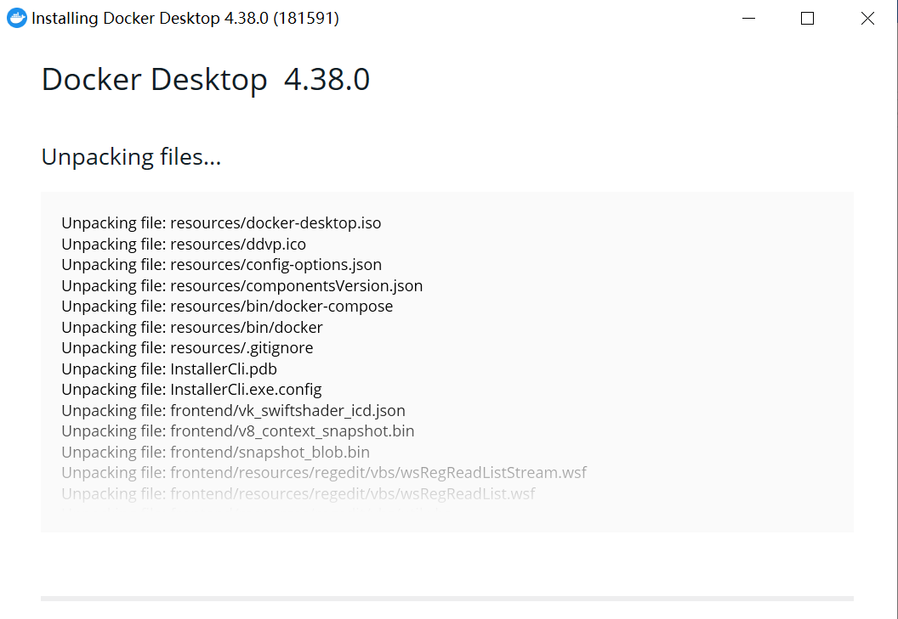

### 1.4 重启电脑

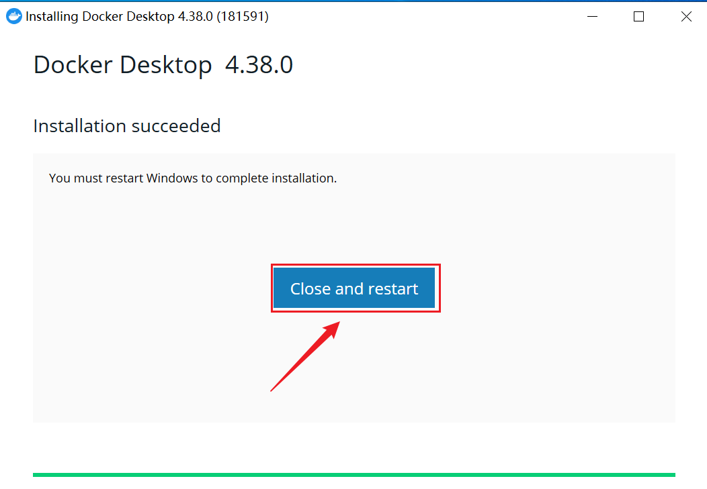

也可以关闭窗口，稍后自行重启。

### 1.5 接受服务协议

**重启后自动弹出**


### 1.6 完成安装

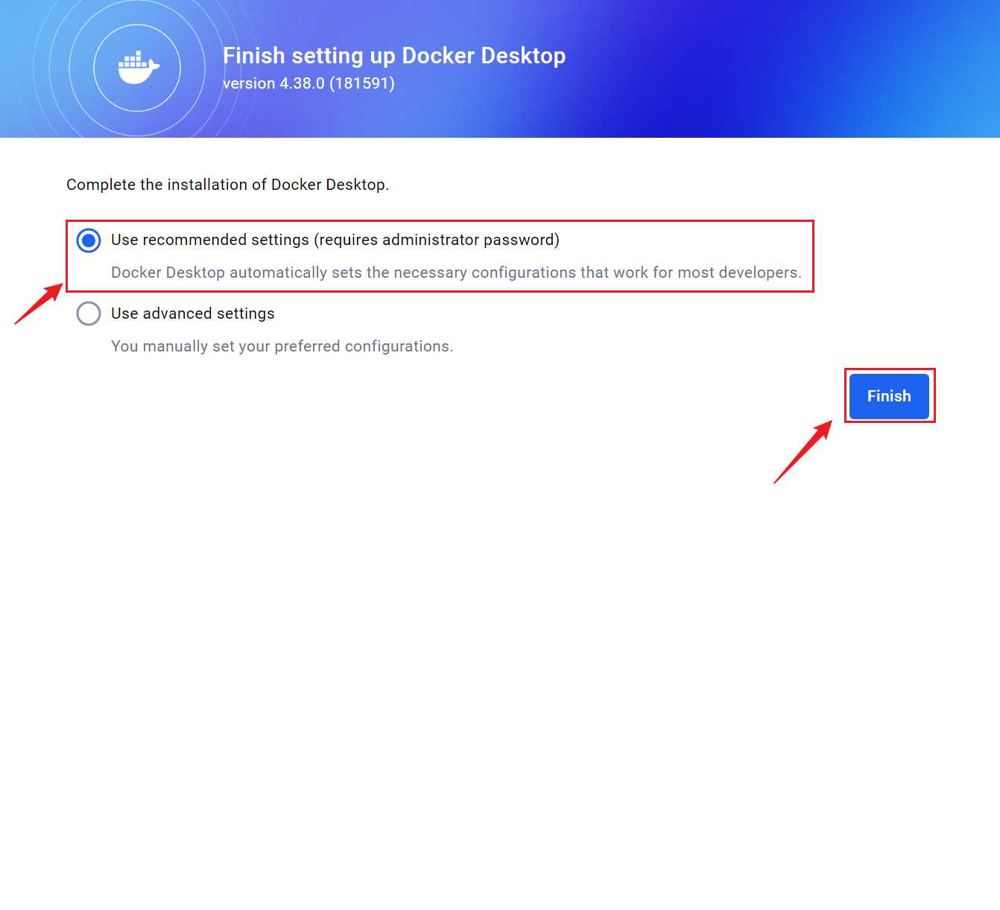

### 1.7 允许控制


### 1.8 不登录使用

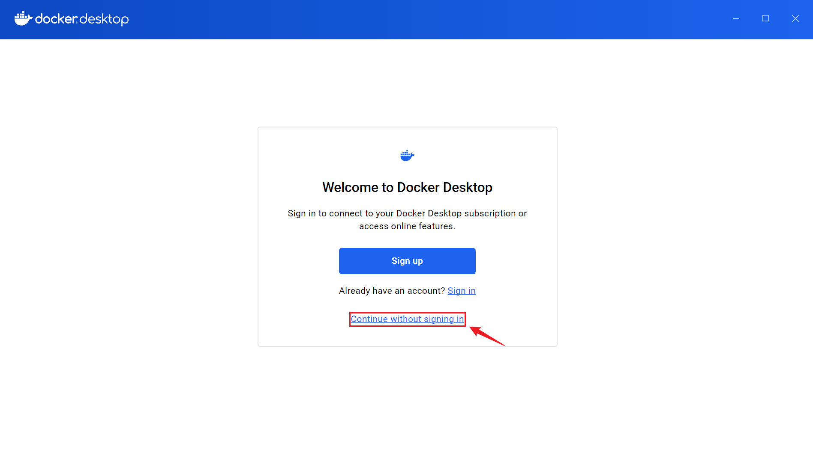

### 1.9 跳过

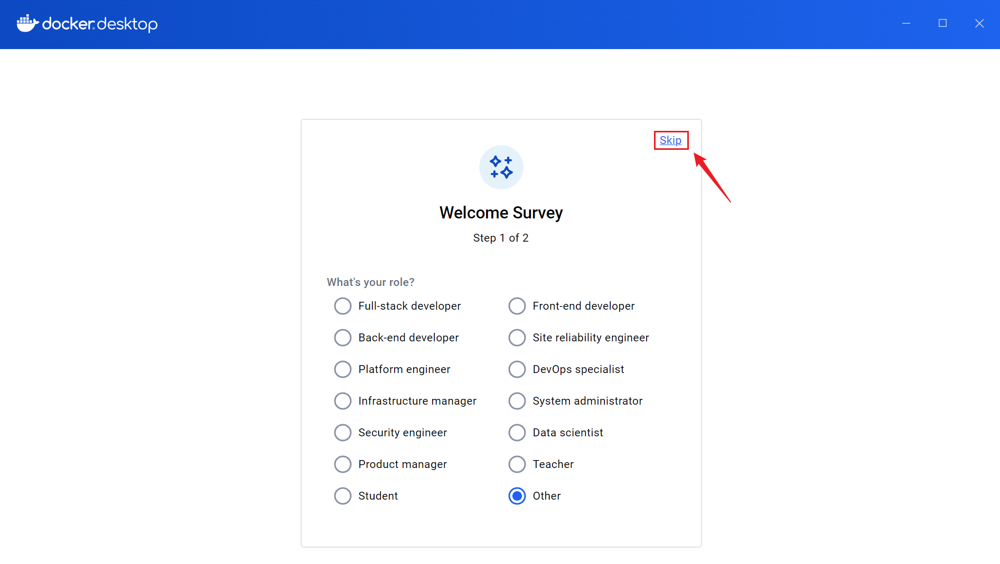

> 个别首次安装的小伙伴会被windows系统提示需要安装`适用于Linux的Windows子系统`。这里选择确认安装。稍等片刻后会完成安装。

### 1.10 安装成功验证

通过win+r调取运行：输入cmd


输入：docker。能显示如下内容即可成功

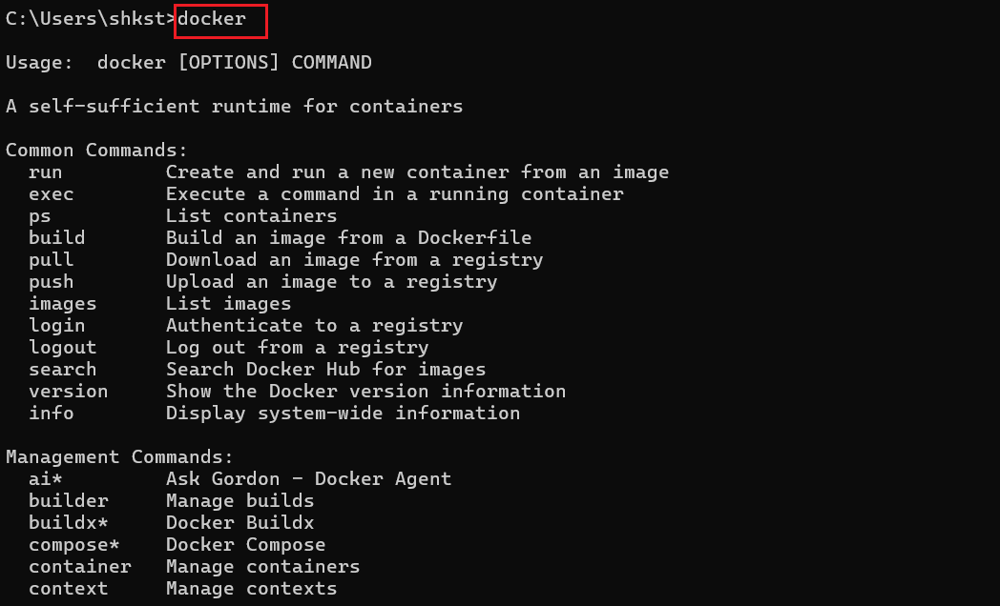


## 2. 部署dify

### 2.1 拉取dify代码

github地址

> https://github.com/langgenius/dify

或者使用本地提供给大家的：

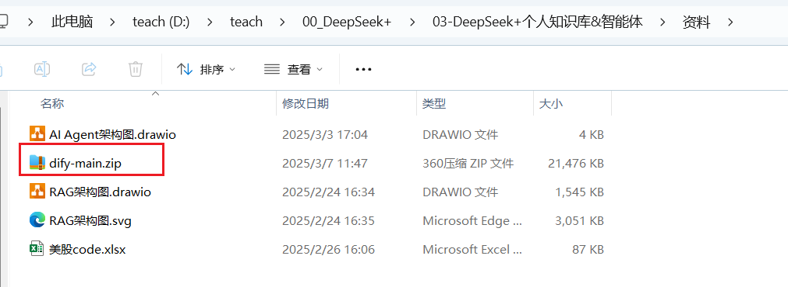

### 2.2 更改信息

> 下面的操作，在git的readme文档中都有。
>
> https://github.com/langgenius/dify/blob/main/README_CN.md
>
> 这里直接操作：

进入dify仓库目录下的docker目录

复制.env.example为.env

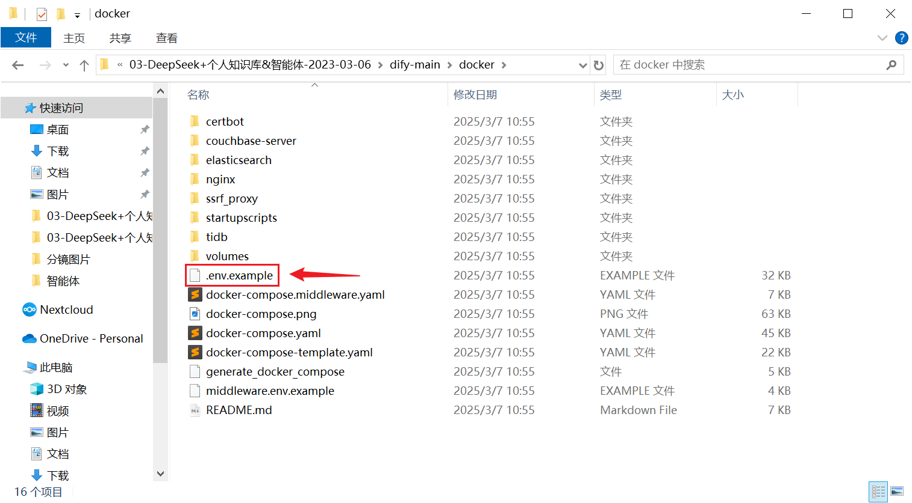

然后按需更改.env文件的配置即可。 

> 比如，修改端口号。默认端口号是80。可以修改为8100

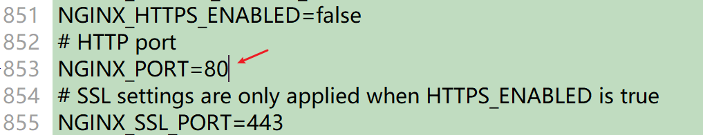

### 2.3 打开终端

如下操作可以在windows的命令行窗口进行，或者在docker客户终端中进行。

比如：在终端中进入docker目录


### 2.4 安装

执行以下命令部署dify

> ```shell
> docker compose up -d
> ```
>

> 这里注意，大概率会由于网络问题或镜像缺失问题发生报错。可以再次输入命令重新执行。

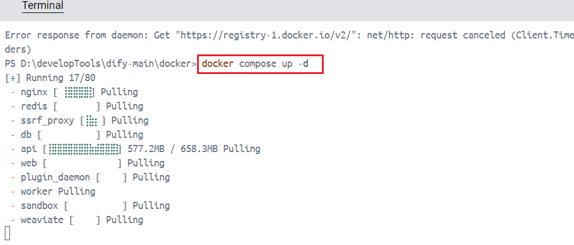

安装完以后：

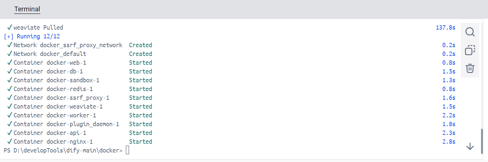

再次输入：docker compose up -d

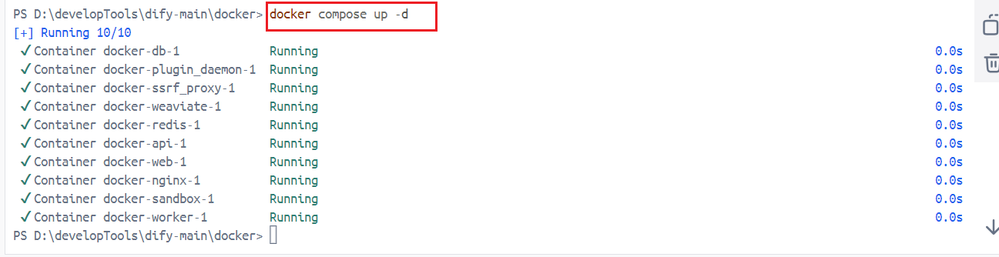

### 2.5 访问dify

浏览器访问localhost即可

首次访问需要设置用户名密码，略。

使用方式和官方提供的平台是一样的。

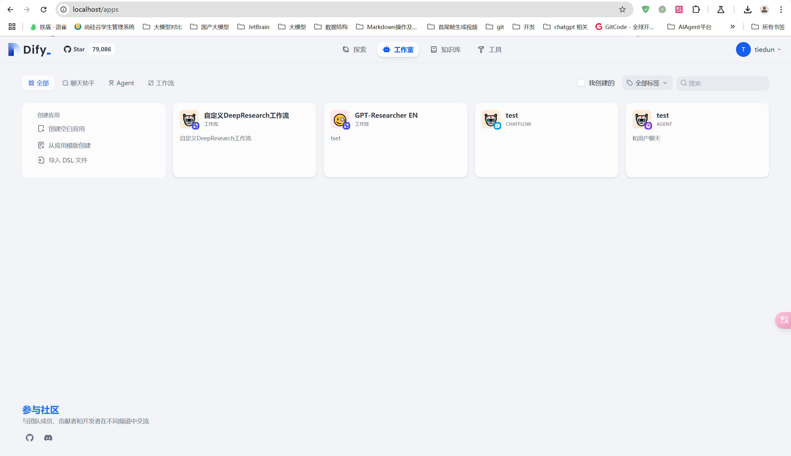


