#  第09章：企业级大模型的部署

欢迎访问尚硅谷官网（http://www.atguigu.com）获取更多学习资料

***

## 1、企业级大模型部署概述

### 1.1 为什么要部署？

企业部署大模型，不是为了解决“能不能用”，而是必须把`敏感数据`和`服务的控制权`牢牢掌握在自己手里。要想数据安全，就需要实现`私有化的部署`。这里包括大语言模型、嵌入模型、重排序模型以及多模态模型等。

|              | 第三方API                    | 企业级部署                                  |
| ------------ | ---------------------------- | ------------------------------------------- |
| **安全合规** | 敏感数据泄漏                 | 数据掌握在企业手中                          |
| **成本预算** | 高频调用成本不可控           | 成本可预测（服务器购买/租赁和运维<br>成本） |
| **能力可控** | 黑箱与版本漂移               | 推理性能、模型版本可定制                    |
| **可靠性**   | 延迟、吞吐不可控             | 内网低延迟、弹性扩缩容自由调整<br>吞吐量    |
| **运维治理** | 模型服务透明，不利于定位故障 | 模型服务可观测，支持故障定位和治理          |

> 注：版本漂移是指第三方更改版本，系统行为发生不可控变化
>

### 1.2 技术架构

- `应用层`：
  - 使用 Dify 构建大模型应用
  - 提供统一的 Web UI 和 API 接口
- `模型推理层`： 
  - 使用独立的推理框架托管大模型：vLLM / SGLang / Ollama / HuggingFace TEI
    - 相应的大模型：Qwen / LLaMA / Baichuan
  - 运行在云 GPU 服务器，提供高性能推理服务
- `连接方式`：
  - 通过标准 OpenAI-compatible API 进行调用

调用路径（从上到下）：

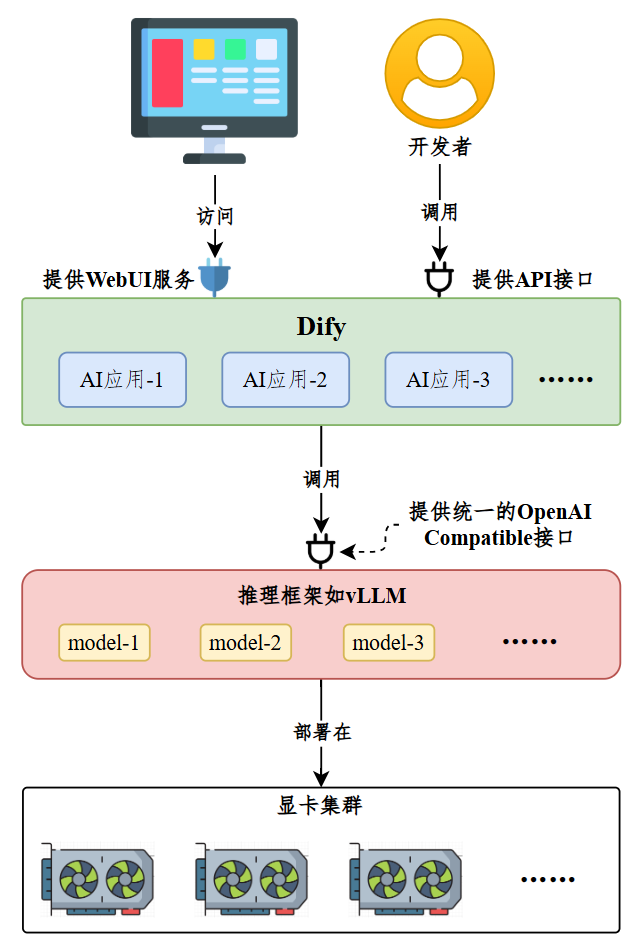

**这种架构的优势在于**：

- `技术解耦`
  - 模型可独立升级、替换
  - 应用开发不依赖具体模型实现

- `有利于运营治理`
  - 统一入口（标准OpenAI-compatible API调用）可以做统一鉴权、限流、审计等
  - 推理层可以被独立运维，单独监测QPS（Query Per Second）、TTFT（Time To First Token）、TPS（Token Per Second）、GPU利用率等指标

### 1.3 框架选型

#### 1.3.1 推理引擎

**① 本地开发 / 个人使用（最快跑起来、最少运维）**

核心目标是：上手简单、快速验证，但通常**不擅长多租户/高并发/多卡集群部署**。

- **Ollama**：由Ollama Inc.公司开发，是部署大模型`最简单`的方式，但`推理效率低`，`不适合高并发场景`。 
- **llama.cpp**：由Georgi Gerganov个人开发的开源项目，纯C/C++实现的LLaMA模型推理库。尤其适合 CPU/边缘设备/低成本部署。

> 结论：企业级部署不考虑Ollama和llama.cpp。

**② 高并发推理引擎**

这类引擎使用门槛稍高，但可以**充分发挥GPU性能**，适合企业**高并发**场景。

- **vLLM**：来自加州大学伯克利分校的 Sky Computing 实验室，采用了PagedAttention、P/D分离等多种优化策略，`追求极致推理性能`，支持英伟达GPU、AMD GPU和华为昇腾等`多种硬件平台`，支持`多卡并行`推理。主要`支持LLM部署`。
- **SGLang**：也是在Sky Computing 实验室诞生，同样采用了类似的优化策略，不同的是，SGLang面向`应用编排/结构化生成`，对同一个应用多次调用请求的场景做了优化，底层通过合并、复用、调度优化等策略`减少模型实际进行的推理次数`，进一步提升推理性能。

- **HuggingFace TEI（Text Embedding Inference）**：Huggingface官方推出的工具包，专为高效`部署嵌入模型`设计。

> 结论：通常vLLM的性能就足够支撑企业高并发场景调用了。 

#### 1.3.2 模型托管平台

这类平台**把模型当成服务管理起来**，底层可以配置不同的推理引擎。

- **Xinference（Xorbits Inference）**：杭州未来速度科技有限公司的大模型管理和推理服务平台，致力于打造一体化解决方案。支持`LLM`、`Embedding`、`Rerank`等多种模型托管。

#### 1.3.3 选型

**大语言模型：**可以用vLLM、SGLang、或者Xinference+vLLM引擎部署。

**嵌入模型：**可以用Huggingface TEI和Xinference部署。

**重排序模型：**目前调研的产品，除了Ollama和llama.cpp，只有Xinference支持这类模型的部署。

**最终选型：**

选定XInference平台作为模型托管与推理服务框架，部署大语言模型、嵌入模型和重排序模型。原因如下：

① 接口统一：可以向外提供统一的API接口，像大模型厂商那样一个链接管理多个模型。

② 针对LLM：结合vLLM引擎部署LLM，可以获得`极高的推理性能`。

③ 针对嵌入模型和重排序模型：嵌入模型和重排序模型只需要一次前向，和逐token生成的大语言模型相比，`资源开销要小得多`，因此对性能要求不高。XInference也支持这两种模型部署，这样我们可以用一个平台管理所有模型，`运维成本低`。

#### 1.3.4 整体调用关系

整体图示如下：

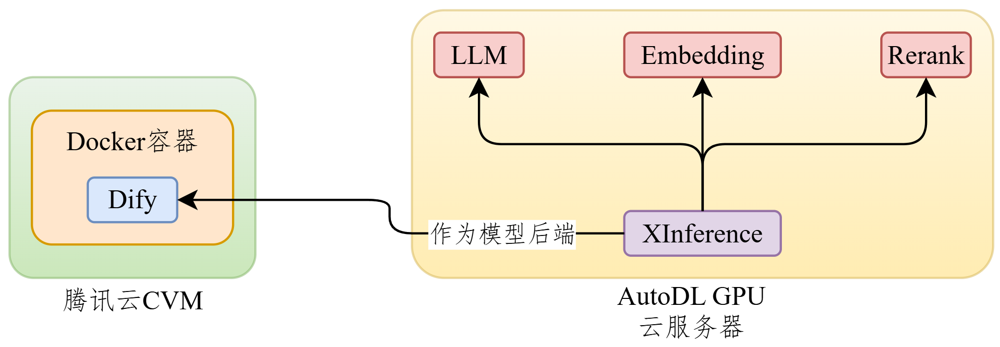

**问题：这个项目中只把Dify安装在了Docker中。XInference直接部署在GPU服务器，没有在Docker中。为什么？**

首先说，XInference是可以部署到Docker中的。但是XInference中模型使用，需要消耗大量GPU，而Docker中默认是使用CPU，不能使用GPU。所以：

方案1：XInference不安装在Docker中

方案2：XInference安装在Docker中，但是需要额外安装其他的软件，支持GPU的调用。

这里使用方案1，只将Dify安装到docker中，XInference不安装到docker中。


## 2、Dify平台私有化部署

### 2.1 Dify平台的介绍(复习)

Dify 作为一个综合性的 LLM 应用开发平台，内置了构建现代生成式 AI 应用所需的几乎所有关键技术栈。

它的具体功能如下：

- 基于Agent架构构建智能体应用
- 基于RAG构建私有知识库应用
- 基于Workflow构建智能工作流应用

Dify 是当今最优雅、门槛最低、最受欢迎、效果最好的大模型开发平台之一。

> 无论是经验丰富的程序员还是初涉AI领域的团队（如产品经理、运营人员），都能够快速、高效地搭建并运营生产级别的生成式 AI 应用。

官网：https://dify.ai/zh

文档说明：https://github.com/langgenius/dify/blob/main/README_CN.md

> 说明：访问Dify官网需要魔法（科学上网）

### 2.2 租赁Dify服务器：腾讯云

企业用户可以选择租用云服务器，或者在本地的服务器中部署Dify。因为Dify所需的资源很小，一个轻量级的服务器足以支持运行。

我们需要租赁一个云服务器去运行Dify服务：腾讯云。

官网：https://cloud.tencent.com/

#### ① 基础配置

https://buy.cloud.tencent.com/cvm

如果是企业中使用或者个人资金充裕且业务稳定的话，可以选择长租使用。期望优惠的话，可以选择竞价实例。竞价实例，在性能和稳定性上，与按量计费模式没有差别。

> 竞价实例，只要有人租长期的服务器就有可能把你的服务器踢掉，实例被竞价释放也是有解决办法的，后续会去讲。


地域选择：没有要求，自己根据需要选即可。

实例配置：根据自己需求选择，无具体要求。这里我选择4核8GB。

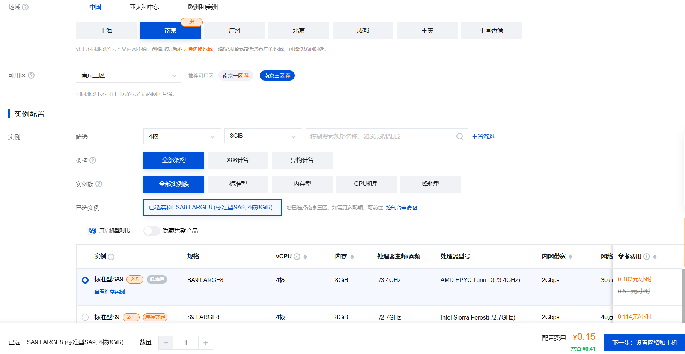

镜像：选择CentOS、Ubuntu都可以，这里使用了Ubuntu。选择后点击下一步。


#### ② 设置网络和主机

拉满带宽上限，新建安全组，把常用的端口都开启

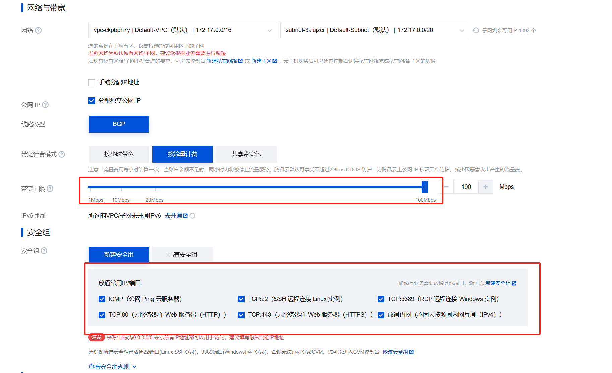

命名实例，设置密码，进行下一步（这里我的密码设置为abc_1234）


开通


#### ③ 登录(使用Xshell或finalshell或windTerm)


finalshell下载网站https://www.hostbuf.com/t/988.html

创建好了，通过这个公网IP，端口使用22，账号ubuntu，密码使用你设置的密码。使用你的远程连接工具XShell 或 final shell 连接即可。

XShell界面如下：


### 2.3 部署Docker

部署dify平台，需要基于docker环境，而腾讯云新建的云平台上默认是没有docker的。接着，需要在腾讯云租用的服务器中部署Docker。

**什么是Docker？**

 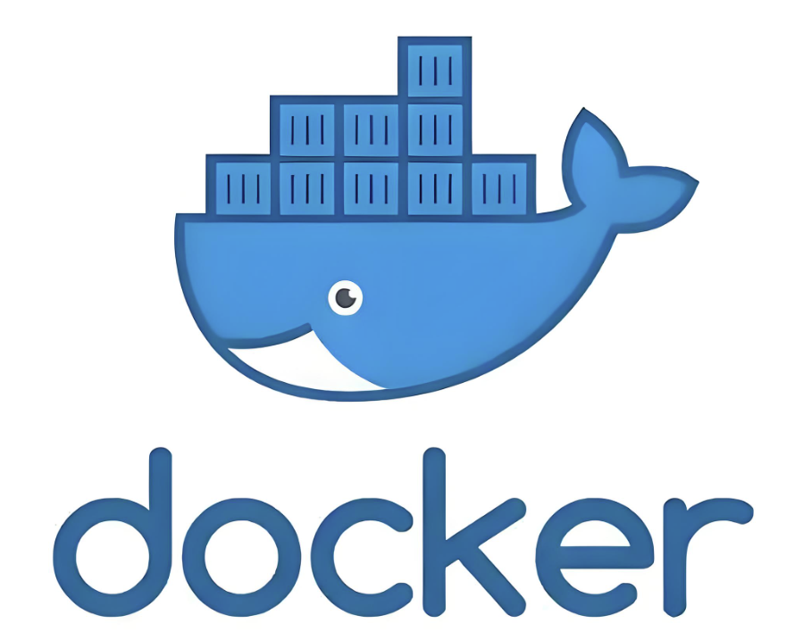

Docker是一种容器化技术，相较于传统的通过虚拟机技术实现的虚拟化方案来说，Docker是⼀种更加轻量级的虚拟化解决方案。

**它可以将应用程序及其依赖项打包成一个独立的容器，并在不同的环境中运行。**通过Docker容器， 开发者可以轻松地构建、部署和运行应用程序，而无需担心环境配置和依赖问题。

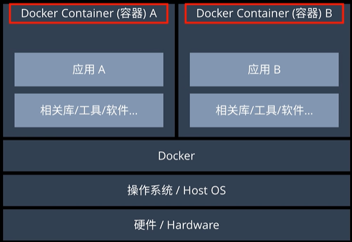

**使用Docker的好处：**

- `一次构建，到处运行`：你在自己电脑上开发测试好的程序，打成 Docker 镜像后，可以保证在生产服务器上跑起来的效果一模一样。再也不会出现“在我电脑上是好的啊！”这种问题。
- `环境隔离`：你可以同时运行一个项目的 Python 2 版本和 Python 3 版本，它们互不影响。
- `快速部署与扩展`：因为容器非常轻量，你可以瞬间启动成百上千个一样的容器来应对高流量（比如双十一抢购）。
- `简化配置`：环境配置都写在了“材料包”（镜像）里，新人接手项目时，不需要花几天时间配环境，直接一条命令就能让程序跑起来。

**场景：**

假设你开发了一个网站。

- **传统方式：** 你需要给运维人员一份长长的《环境配置手册》：“请先安装 CentOS 7，然后安装 Python 3.8.2，再安装 Nginx 1.18.0，配置如下……”。步骤繁琐，极易出错。
- **Docker 方式：** 你直接把整个网站和环境打包成一个 Docker 镜像。运维人员只需要执行一句简单的命令：`docker run [你的镜像名]`，一个完整、可运行的网站环境就在一秒内启动了。

按照下面的指令一步一步进行操作

```bash
#更新软件包
sudo apt update

sudo apt upgrade

# 如果出现需要更新内核
两次回车后执行 
sudo reboot

#安装docker依赖
sudo apt install software-properties-common

sudo apt-get install ca-certificates curl gnupg lsb-release

#添加Docker官方GPG密钥
curl -fsSL http://mirrors.aliyun.com/docker-ce/linux/ubuntu/gpg | sudo apt-key add -

#添加Docker软件源（输入后根据提示按Enter）
sudo add-apt-repository "deb [arch=amd64] http://mirrors.aliyun.com/docker-ce/linux/ubuntu $(lsb_release -cs) stable"

#安装docker（输入后根据提示输入 y ）
sudo apt-get install docker-ce docker-ce-cli containerd.io --fix-missing
```

执行`sudo apt upgrade`的时候会出现这个界面，按回车即可

	

之后如果在这个界面卡住，按几下回车即可。

安装完毕，启动docker，并查看状态

```bash
sudo systemctl start docker

sudo systemctl status docker
```

如图所示即为启动成功

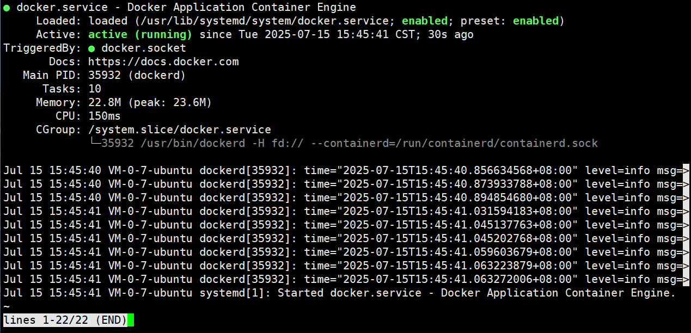

> 看到running状态说明docker已经正常启动

**注意：安装过程中如果报错如下：**

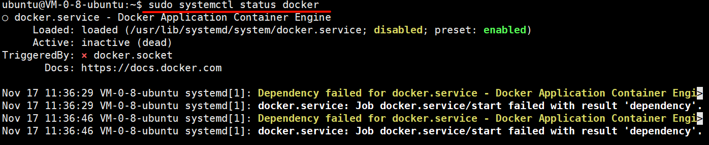

可以按如下操作步骤执行：

| 步骤                          | 关键检查点/操作                                              | 预期结果/说明                                                |
| :---------------------------- | :----------------------------------------------------------- | :----------------------------------------------------------- |
| 1. 验证Docker安装状态         | 运行 sudo systemctl status docker                            | 确认Docker服务当前的状态和错误日志。                         |
| 2. 检查并取消服务屏蔽         | 执行 sudo systemctl unmask docker.service                    | 解决服务被意外“屏蔽”导致无法启动的问题。                     |
| 3. 检查依赖服务状态           | 运行 systemctl list-dependencies docker.service.<br>如果containerd服务异常，尝试启动它：sudo systemctl start containerd | 查看Docker依赖的服务（如containerd）是否正常。<br>如果启动失败，进入第4步 |
| 4. 修复containerd（关键步骤） | 执行：① sudo apt-get update<br>② sudo apt-get install --reinstall containerd.io | 重新安装Docker的核心运行时依赖。                             |

**如果以上步骤均无效**，可以考虑彻底清理Docker及其相关组件后重新安装。这是解决文件损坏或版本冲突的可靠方法。

彻底卸载Docker：

```bash
sudo apt-get purge docker-ce docker-ce-cli containerd.io
sudo rm -rf /var/lib/docker
sudo rm -rf /var/lib/containerd
```

### 2.4 部署Dify

官网：https://github.com/langgenius/dify

文档：https://docs.dify.ai/zh-hans/getting-started/install-self-hosted/docker-compose

安装 Dify 之前, 请确保你的机器已满足最低安装要求：

- CPU >= 2 Core
- RAM >= 4 GiB

#### ① 下载

> 注意：新版本Dify本地部署可能会出现各种兼容问题，强烈推荐**0.15.5**版本，稳定，功能效果一致！
>

在`/opt`下创建一个dify目录，用于存储dify源码：

```cmd
cd /opt
sudo mkdir dify #用于存储dify源码包
```

##### 方式1：离线下载包(推荐)

**离线下载源码包**（科学上网）

下载地址：https://github.com/langgenius/dify/releases/tag/0.15.5

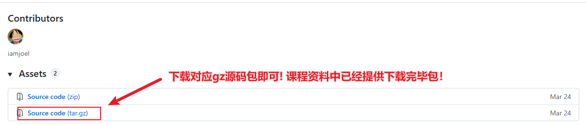

> 注意：网不好同学，已经提前下载好，放在课程资料中！
>

利用远程连接工具（比如：XFTP）将dify源码包传递到服务器 /opt/dify文件夹中，并解压即可：


上传可能失败（因为默认ubuntu用户权限不足），解决办法如下

```bash
# 方式1：赋予指定用户指定目录的完全权限（使用777）
# 在Ubuntu终端xshell执行：sudo chmod -R 777 /目标目录的完整路径
sudo chmod -R 777 /opt/dify

# 方式2：先将文件上传到您的用户主目录（如 /home/ubuntu），这个目录通常有写入权限
# 然后使用XShell或终端，通过命令移动文件：sudo mv /home/ubuntu/文件名 /目标/path/
```

进行解压：

```cmd
#进入dify目录,在opt目录下执行：
cd ./dify
#解压
sudo tar -zxvf dify-0.15.5.tar.gz

cd /opt/dify/dify-0.15.5

pwd # 输出 /opt/dify/dify-0.15.5
```

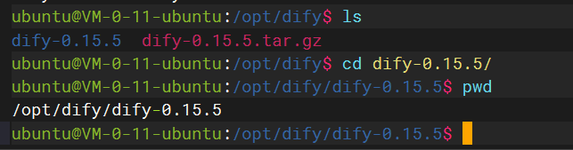

##### 方式2：Gitee下载

如果使用github下载过慢，还可以使用码云（Gitee）或镜像网站替代 GitHub 直接下载，利用国内服务器加速。

操作步骤：

1）注册码云账号（[https://gitee.com ](https://gitee.com/)）。

2）在码云新建仓库，选择「导入GitHub仓库」，粘贴 `https://github.com/langgenius/dify.git ` 的链接 。

3）导入完成后，使用码云生成的仓库地址克隆：

```bash
sudo git clone https://gitee.com/你的用户名/dify.git
```

这里大家也可以直接使用我的链接：

```bash
sudo git clone https://gitee.com/shkstart/dify.git
```


#### ② 使用docker启动Dify

1. 进入 Dify 源代码的 Docker 目录：

   ```cmd
   cd /opt/dify/dify-0.15.5/docker
   ```

2. 复制环境配置文件

   ```bash
   sudo cp .env.example .env
   ```

3. 启动 Docker 容器

   根据你系统上的 Docker Compose 版本，选择合适的命令来启动容器。你可以通过 ` docker compose version` 命令检查版本，详细说明请参考 [Docker 官方文档](https://docs.docker.com/compose/#compose-v2-and-the-new-docker-compose-command)：

   - 如果版本是 Docker Compose V2，使用以下命令（课程对应版本）：

     ```bash
     sudo docker compose up -d
     ```

   - 如果版本是 Docker Compose V1，使用以下命令：

     ```bash
     sudo docker-compose up -d
     ```

   说明：Docker 会自动帮你：拉取需要的镜像 → 创建容器 → 按顺序启动所有服务 → 后台运行。

4. 运行命令后，你应该会看到类似以下的输出，显示所有容器的状态和端口映射：

   注意：第一次拉取镜像，时间可能会很！！！

   ```cmd
   [+] Running 11/11
    ✔ Network docker_ssrf_proxy_network  Created                                         
    ✔ Network docker_default             Created                                         
    ✔ Container docker-redis-1           Started                                         
    ✔ Container docker-ssrf_proxy-1      Started                                         
    ✔ Container docker-sandbox-1         Started                                         
    ✔ Container docker-web-1             Started                                         
    ✔ Container docker-weaviate-1        Started                                         
    ✔ Container docker-db-1              Started                                         
    ✔ Container docker-api-1             Started                                         
    ✔ Container docker-worker-1          Started                                         
    ✔ Container docker-nginx-1           Started                                         
   ```

5. 最后检查是否所有容器都正常运行：

   ```cmd
   sudo docker compose ps
   ```

   在这个输出中，你应该可以看到包括 3 个业务服务 `api / worker / web`，以及 6 个基础组件 `weaviate / db / redis / nginx / ssrf_proxy / sandbox` 。

   

6. 停止Dify运行 

```cmd
#一键关停所有相关容器，干净不残留
docker compose down
```

7. 同步环境变量配置（重要！）

- 如果 `.env.example` 文件有更新，请务必同步修改你本地的 `.env` 文件。


- 检查 `.env` 文件中的所有配置项，确保它们与你的实际运行环境相匹配。你可能需要将 `.env.example` 中的新变量添加到 `.env` 文件中，并更新已更改的任何值。

#### ③ 常见问题解决

**问题1：安装 Dify常见问题和解决方案**

```cmd
sudo docker compose up -d
```

执行失败，大概率会由于网络问题或镜像缺失问题发生报错。

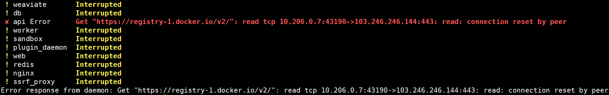

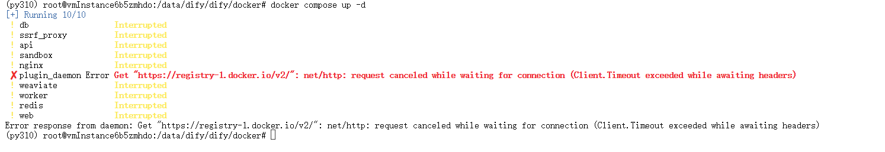

进行镜像源的配置

```bash
sudo vi /etc/docker/daemon.json
```

添加下面的配置

```bash
{
    "registry-mirrors": [
    "https://docker.unsee.tech",
    "https://dockerpull.org",
    "https://docker.1panel.live",
    "https://dockerhub.icu",
    "https://docker.m.daocloud.io",
    "https://docker.nju.edu.cn",
    "https://registry.docker-cn.com",
    "https://docker.mirrors.ustc.edu.cn",
    "https://hub-mirror.c.163.com",
    "https://mirror.baidubce.com",
    "https://5tqw56kt.mirror.aliyuncs.com",
    "https://docker.hpcloud.cloud",
    "http://mirrors.ustc.edu.cn",
    "https://docker.chenby.cn",
    "https://docker.ckyl.me",
    "http://mirror.azure.cn",
    "https://hub.rat.dev"]
}
```

或

```bash
{
    "registry-mirrors": [
        "https://mbirror.ccs.tencentyun.com"
    ]
}
```

保存，然后在终端重新启动一下docker

```bash
# 重新登陆，需要输入密码
systemctl daemon-reload

systemctl restart docker
```

重新执行

```bash
sudo docker compose up -d
```

开始正常下载了

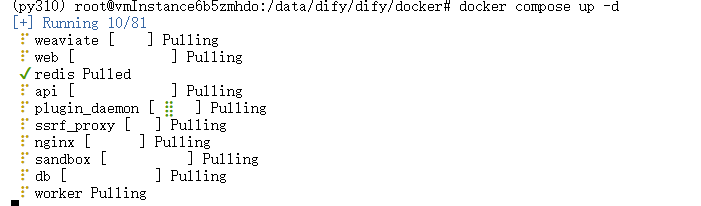

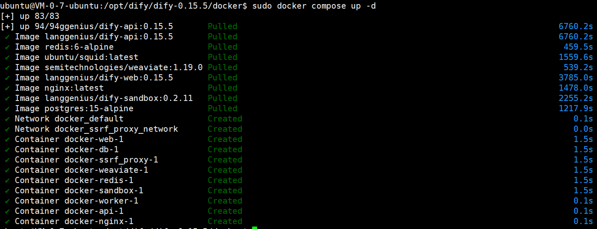

**问题2：可能出现报错，报错如下**


于是根据报错信息检查

```bash
sudo vi /etc/apparmor.d/tunables/home.d/ubuntu
```

删除掉报错信息中第七行的多余字符即可


重新运行，成功


#### ④ 访问

你可以先前往管理员初始化页面设置设置管理员账户：

```bash
# 服务器环境
http://your_server_ip/install   #your_server_ip即为配置的腾讯云服务器地址
```


如图所示为成功访问，进行注册登陆即可


**注意：如果一直无法加载进去，则需要重启docker再次尝试**

#### ⑤ 设置镜像

为避免案例中的竞价实例被释放，可以在控制台中的快照中设置快照策略，即使被释放了也能保存快照，从而快速恢复


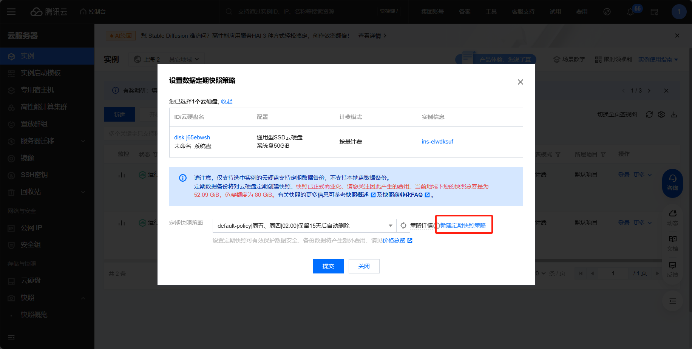

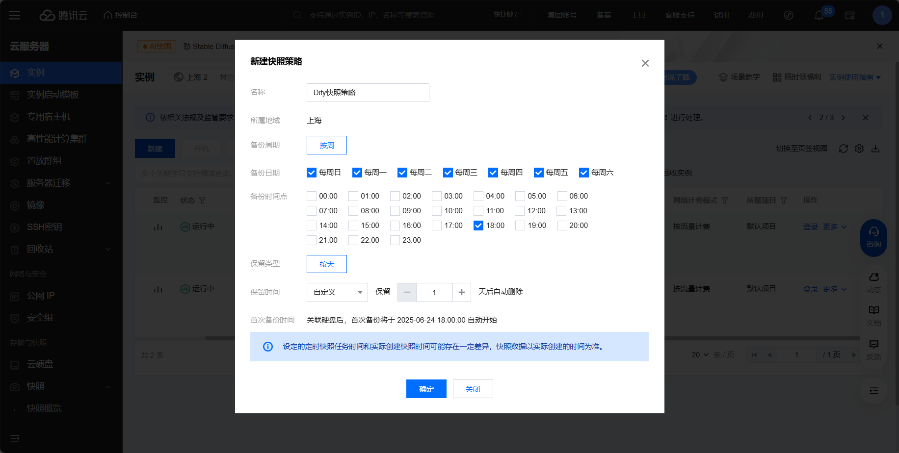

再次进入定期快照策略可发现已设置成功

### 2.5 配置在线大模型

如果想调用线上的LLM，则可以用Dify选择线上的模型运营商。比如说可以在模型运营商中选择Deepseek。

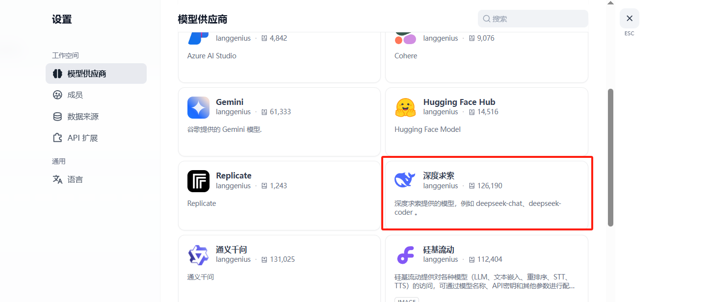

DeepSeek官网地址：https://www.deepseek.com/，在官网获取自己的API即可配置后使用


在这里我们可以使用提供的在线大模型运营商，但是为了考虑到可能存在的数据安全问题，所以我们自己部署XInference，进而部署私有的大模型。


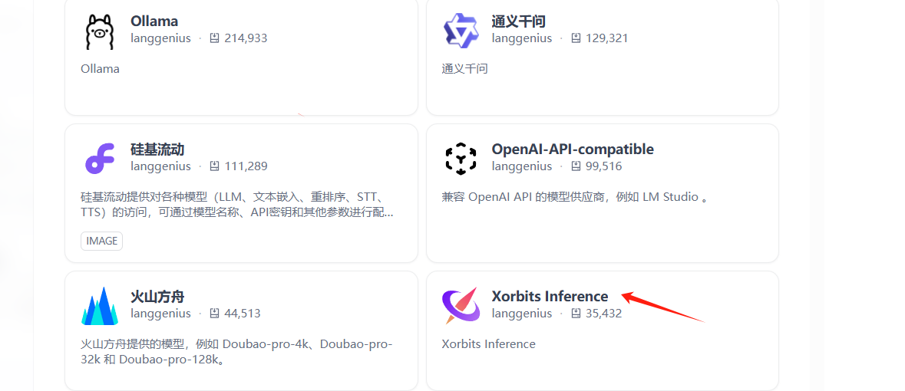


## 3、模型部署

### 3.1 租赁GPU服务器：AutoDL

**AutoDL介绍**

这里我们选用AutoDL平台租赁服务器。这是一款面向开发者和企业的云计算平台，主要提供高性价比的`GPU算力资源`，支持AIGC、深度学习、云游戏、渲染测绘、元宇宙、HPC等应用。

**平台地址：**https://www.autodl.com/

> AutoDL服务器的资源比较紧俏，且比较贵
>
> - 一台机器开机一个小时平均花费2元
> - `建议`：一般早上开始工作的时候开机，在结束一天工作的时候关机。
> - 大家选择显卡的时候选择能够安装pytorch2.12,python3.10以及cuda11.8的显卡就行，除了30和40系列显卡，还可以选择vGPU-32G（性价比拉满）和vGPU-48（贵但是效率高）
>

#### ① 配置服务器+镜像

选择服务器：

这里可以选择西北B区的单卡4090作为我们的服务器，我们需要租赁一台服务器部署Xinference。

注意：在AutoDL平台上，只提供了6006端口进行开放。

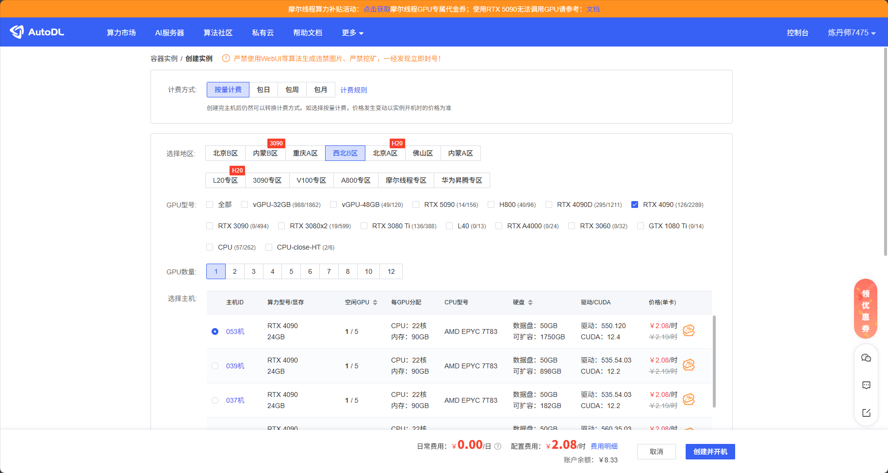

> **注意**：
>
> 1、这里推荐“西北地区”，因为会提供公网ip，其它地区不确定。
>
> 2、GPU推荐 RTX4090，3090，3080等，其它显卡可能会出现后续不兼容情况。
>
> 3、5090不推荐，创新架构兼容性比较差

选择镜像版本：

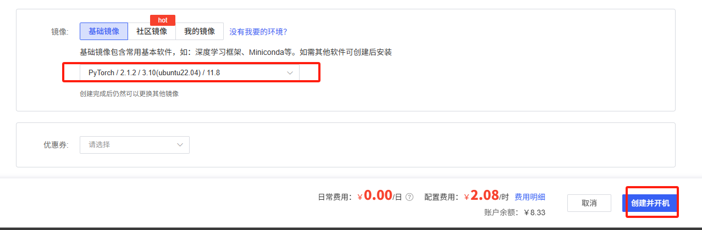

#### ② XShell连接登录

复制该服务器的登录指令，通过远程连接工具进行登录

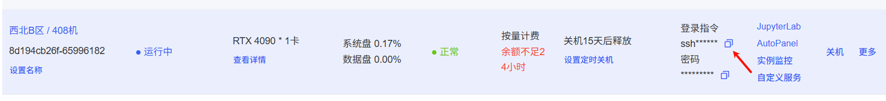


测试连接：

> 默认的用户名：root

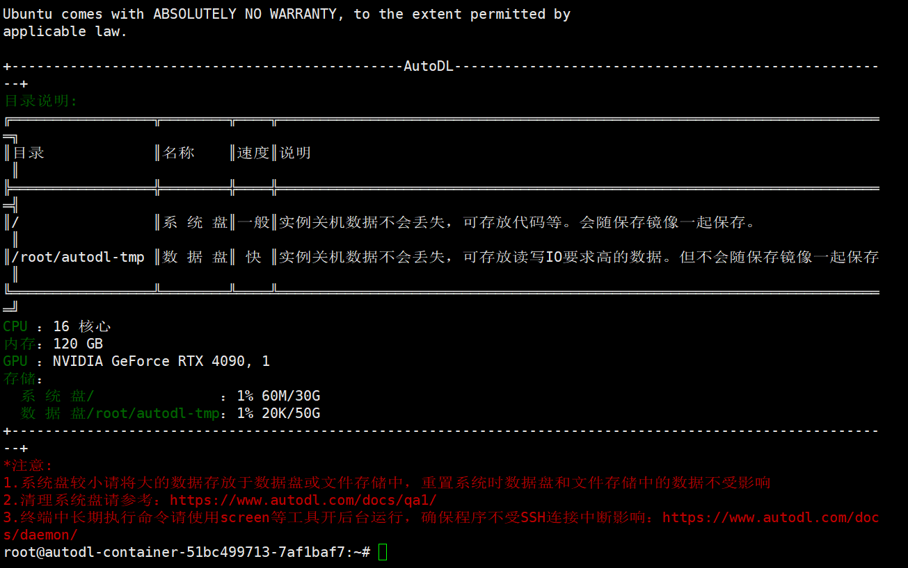

连接成功

#### ③ 开启学术资源加速

为下载一些外网的资源（比如Github、HuggingFace等），需要在**当前终端中**开启`学术资源加速`

> 免不了我们要在这个系统上安装一些软件。这些软件可能来自于如下的红框的位置。默认是下载不了的。那么就需要魔法或科学上网。这里我们称为：学术加速。

https://www.autodl.com/docs/network_turbo/

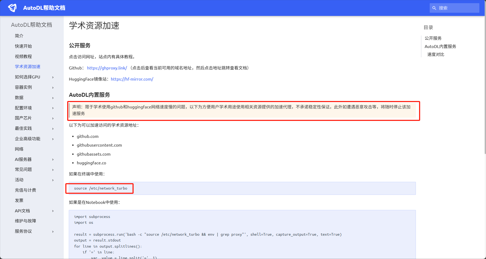

将框选住的一行复制到终端输入即可

```bash
source /etc/network_turbo
```


### 3.2 部署XInference

#### 1.准备conda环境

##### ① 创建conda环境

AutoDL的系统盘大小为30GB，数据盘大小为50GB，conda的默认工作路径在系统盘下，Xinference全家桶需要的空间比较大，可能导致系统盘被占满，因此，通过将环境文件放在数据盘下。

**注意**：如果创建环境这一步始终出现问题，建议先排查是不是5090，然后多做尝试，超过3次直接换一台服务器就好，不然只会浪费时间，只要创建环境激活环境没有问题，后续出现问题的概率就比较小了，大家可以先不急于测试，**先**把每个模型都**下载**下来，更推荐使用**命令行**的形式下载。


**注意，智川云如果有问题可以直接问客服，只要能建立连接，就按照教程步骤走就行**

```shell
autodl 算力云
conda create -p /root/autodl-tmp/conda_envs/xinfer_env python=3.10

智川云：
conda create -p /root/rivermind-data/conda_envs/xinfer_env python=3.10
```

##### ② 初始化conda环境

```shell
conda init bash

source ~/.bashrc
```

##### ③ 激活conda环境

```shell
conda deactivate

autodl（算力云）
conda activate /root/autodl-tmp/conda_envs/xinfer_env

智川云
conda activate /root/rivermind-data/conda_envs/xinfer_env
```

##### ④ 验证conda是否创建成功

python和pip命令的路径在conda环境文件下，则创建成功。

```shell
which python

which pip
```

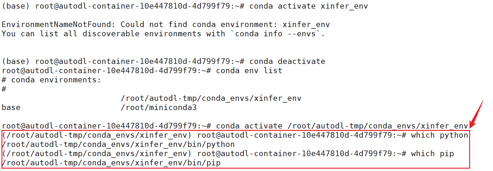

#### 2.部署XInference

AutoDL学术加速默认用阿里云作为PyPi源，镜像中不包含XInference全家桶的num2words，会报错，所以将清华源作为备用源。

```shell
pip install "xinference[vllm,embedding,rerank,transformers]==1.16.0" \
--extra-index-url https://pypi.tuna.tsinghua.edu.cn/simple
```

可以把安装服务放在后台

```shell
nohup pip install "xinference[vllm,embedding,rerank,transformers]==1.16.0" --extra-index-url https://pypi.tuna.tsinghua.edu.cn/simple >xinfer_install.log 2>&1 &
```


#### 3.启动XInference服务端

**在此之前执行**

```shell
pip install "sentence_transformers<4.0.0"
```


```shell
XINFERENCE_MODEL_SRC=modelscope xinference-local --host 0.0.0.0 --port 6006
```

XINFERENCE_MODEL_SRC=modelscope的作用是将默认的模型仓库从**Huggingface**更换为**魔搭**。

--host：指定监听网卡，0.0.0.0表示监听所有网卡的请求

--port：指定服务端口，默认9997

#### 4.访问XInference WebUI

##### ① 查看AutoDL自定义服务地址


AutoDL的云GPU服务器默认会将6006和6008映射为服务，XInference服务端监听了6006端口，访问对应链接即可访问Xinference的WebUI。

##### ② 访问Xinference的WebUI


### 3.3 部署LLM

#### 1.部署

##### ① 云端模型

我们可以让XInference平台帮我们从模型仓库下载并启动模型，前提是该模型被官方收录并支持。

以Qwen3-0.6B为例，参考官方文档

> https://inference.readthedocs.io/zh-cn/latest/models/builtin/llm/qwen3.html

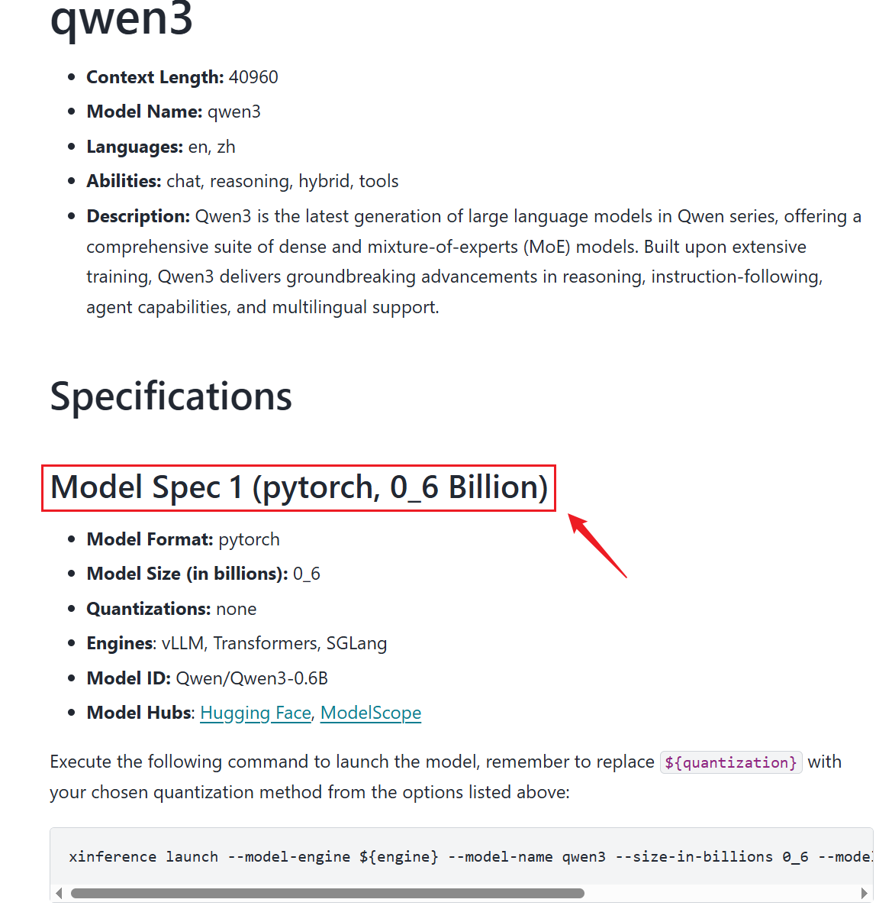

Xinference把模型分成了很多模型族，每个模型族都包含一系列不同规模的模型，通过不同的属性配置区分。Qwen3-0.6B的模型族为qwen3，配置如上图所示。

新起一个连接窗口：激活conda环境

```
conda activate /root/autodl-tmp/conda_envs/xinfer_env
```

开启学术加速：

```
source /etc/network_turbo
```

启动命令如下

```shell
xinference launch \
  --model-engine transformers \
  --model-name qwen3 \
  --size-in-billions 0_6 \
  --model-format pytorch \
  --quantization none \
  --model-uid Qwen3-0.6B \
  --gpu_memory_utilization 0.6 \
  --max_model_len 1024 \
  --endpoint http://localhost:6006
```

`--model-engine vllm`：底层推理引擎

`--model-name qwen3`：模型族

`--size-in-billions 0_6`：模型规模，以10亿为单位

`--model-format pytorch`：权重文件格式

`--quantization none`：是否量化

`--model-uid Qwen3-0.6B`：模型uid，用于在Xinference中唯一区分模型，可以省略，由系统生成

`--gpu_memory_utilization 0.3`：vllm参数，模型占用GPU显存的百分比

`--max_model_len 1024`：vllm参数，模型支持的上下文长度

`--endpoint`：Xinference服务端入口

此时服务端可以看到模型正在下载。


模型部署完成


##### ② 本地模型文件

如果模型权重已被预下载到本地，可以执行以下命令。

```shell
xinference launch \
  --model-engine transforms \
  --model-name qwen3 \
  --size-in-billions 0_6 \
  --model-format pytorch \
  --quantization none \
  --model-path "{your_model_dir}" \
  --model-uid Qwen3-0.6B \
  --gpu_memory_utilization 0.6 \
  --max_model_len 1024 \
  --endpoint http://localhost:6006
```

`--model-path`：模型权重本地存储路径。

#### 2.测试

##### ① 查看模型部署情况

```shell
xinference list \
  --endpoint http://localhost:6006
```


##### ② WebUI


##### ③ 发送请求

```shell
curl http://localhost:6006/v1/chat/completions -H "Content-Type: application/json" -d '{
        "model": "qwen3",
        "messages": [
                {"role": "system", "content": "你是个乐于助人的助理。"},
                {"role": "user", "content": "你好啊"}
        ]
}'
```

响应如下


### 3.4 部署Embedding模型

#### 1.部署

##### ① 云端模型

```shell
xinference launch \
  --model-name bge-small-zh-v1.5 \
  --model-type embedding \
  --endpoint http://localhost:6006
```

`--model-name`：模型名称

`--model-type`：模型类型

正在下载


部署完成


##### ② 本地文件

```shell
xinference launch \
  --model-name bge-small-zh-v1.5 \
  --model-type embedding \
  --model-path "${your_model_path}" \
  --endpoint http://localhost:6006
```

`--model-path`：模型下载路径

#### 2.测试

##### ① 查看模型部署情况

```shell
xinference list \
  --endpoint http://localhost:6006
```


##### ② WebUI


##### ③ 发送请求

```shell
curl http://localhost:6006/v1/embeddings \
  -H "Content-Type: application/json" \
  -d '{
    "model": "bge-base-zh-v1.5",
    "input": "这是一个用于测试的中文句子"
  }'
```

响应如下


### 3.5 部署Rerank模型

#### 1.部署

```shell
xinference launch \
  --model-name bge-reranker-base \
  --model-type rerank \
  --endpoint http://localhost:6006
```

正在下载


部署完成


#### 2.测试

##### ① 查看模型部署情况

```shell
xinference list \
  --endpoint http://localhost:6006
```


##### ② WebUI


##### ③ 发送请求

```shell
curl http://localhost:6006/v1/rerank \
  -H 'Content-Type: application/json' \
  -d '
{
  "model": "bge-reranker-base",
  "query": "Apple",
  "documents": [
    "鸡蛋",
    "苹果",
    "iphone",
    "香蕉"
  ],
  "instruction": "基于查询结果重排序",
  "top_n": 4
}
'
```

响应如下


### 3.6 Dify对接XInference

#### 1. 安装XInference插件


搜索Xinference

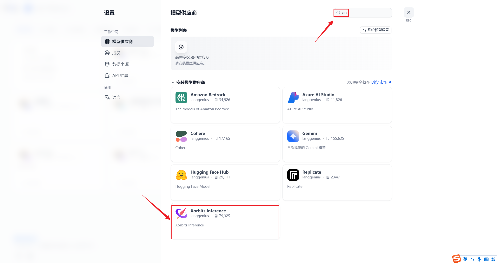

安装插件

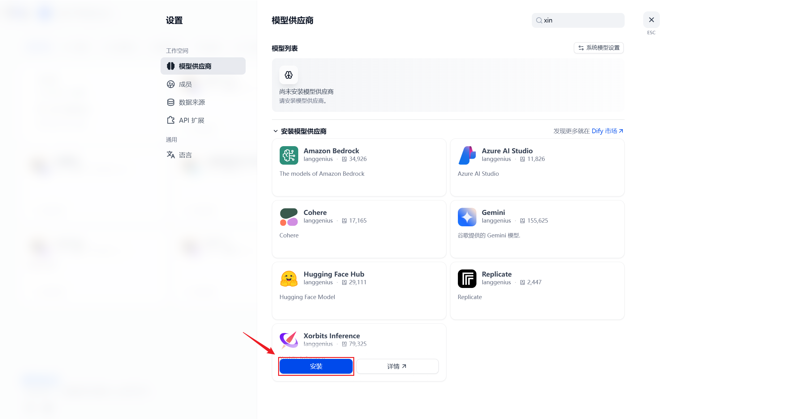

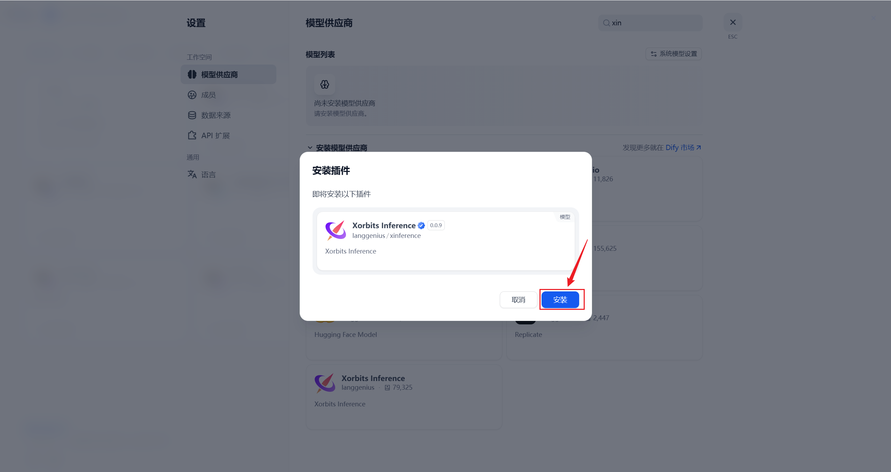

安装完成后即可看到XInference

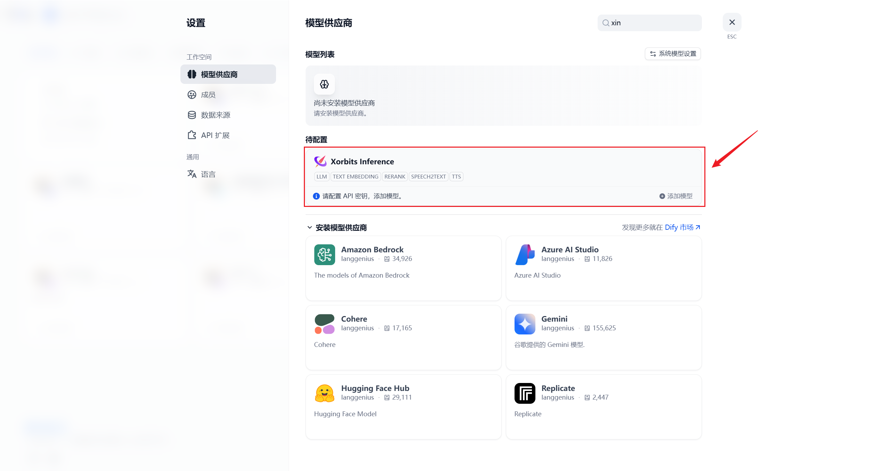

#### 2. 添加LLM

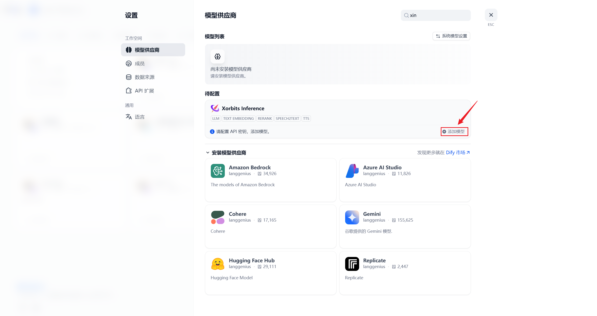


在XInference插件下可以看到模型，则配置成功


#### 3. 添加Embedding模型


#### 4. 添加Rerank模型


