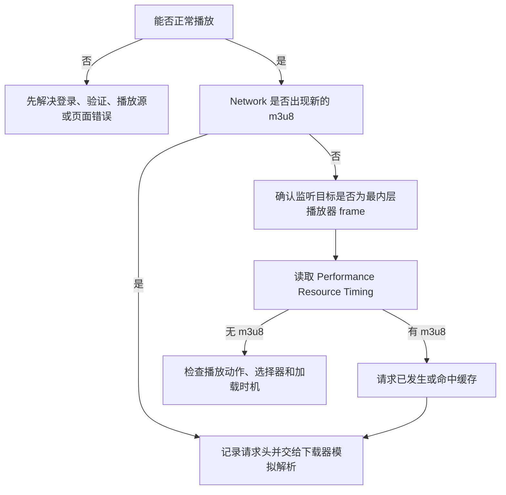

# 跨域播放器-HLS流捕获逆向实验教程

> [!abstract] 你将学会什么
> 当播放器能播放、自动化却显示“监听到 0 个请求”时，不要直接加等待时间。本教程带你用浏览器 DevTools、最小 Demo 和源码对照，确定请求究竟没有发生、发生在错误 frame，还是已经预加载/缓存，并把结论实现为可测试的双通道捕获器。

> [!warning] 使用边界
> 只调试你有权访问、下载或测试的内容。本文不讨论绕过付费授权、访问控制或版权限制；示例中的 URL 仅作为已验证的实验样本。

## 0. 实验地图



本教程只回答一个问题：**如何用证据排除假设，而不是用猜测堆叠重试。**

## 1. 实验前提与成功标准

### 1.1 固定实验对象

| 项目 | 固定值 | 为什么固定 |
| --- | --- | --- |
| 浏览器 | 项目专用 Chrome | 保持登录态、扩展和调试接口一致 |
| 调试端口 | `127.0.0.1:9336` | 自动化工具可重复连接 |
| 用户目录 | `VideoTool/data/browser-profiles/by-yeyun` | 与日常 Chrome 隔离，避免锁定或修改原始配置 |
| 样本页面 | `https://supjav.com/ja/439632.html` | 四个播放源可作为同页对照组 |
| 自动化库 | DrissionPage | 能定位 frame、监听请求、执行页面 JavaScript |
| 验证方式 | `yt-dlp --simulate` | 验证流可解析，但不写入实际视频 |

启动项目 Chrome 时的核心参数：

```text
--remote-debugging-port=9336
--user-data-dir=<VideoTool>/data/browser-profiles/by-yeyun
--profile-directory=Default
```

不要把日常 Chrome 的 `C:\Users\...\Google\Chrome\User Data` 直接作为自动化配置。它可能被正在运行的 Chrome 锁定，也会把日常浏览数据和自动化实验混在一起。

### 1.2 把“成功”拆成四个独立条件

| 条件 | 如何确认 | 不成立代表什么 |
| --- | --- | --- |
| 页面能播放 | 浏览器画面出现播放器进度 | 登录态、页面、服务器或播放动作可能有问题 |
| 捕获到新 Network 事件 | DevTools Network / DrissionPage listener 出现 `.m3u8` | 只说明观察窗口看到了新请求 |
| Performance 有资源条目 | frame Console 返回 `.m3u8` URL | 说明该页面上下文已加载过资源，即使没有新事件 |
| yt-dlp 可模拟解析 | 返回码为 0，输出格式信息 | URL、签名或请求上下文可用于下载器 |

> [!tip] 关键认知
> “Network 为 0”只能得出“监听窗口内没有新包”，不能推出“没有视频流”。这正是本案例的核心误判点。

## 2. 准备可观察环境

### 2.1 先检查调试端口

在 PowerShell 执行：

```powershell
Invoke-RestMethod http://127.0.0.1:9336/json/version
```

**预期结果**：返回包含 `Browser`、`webSocketDebuggerUrl` 等字段的 JSON。

| 现象 | 判断 | 下一步 |
| --- | --- | --- |
| 返回 JSON | 调试浏览器已就绪 | 继续 DevTools 与 Demo |
| 连接被拒绝 | Chrome 未以调试端口启动 | 用项目专用目录重新启动 Chrome |
| 返回的不是项目 Chrome | 端口被其它浏览器占用 | 关闭错误进程或改回 9336 |

### 2.2 在 DevTools 建立观察面板

1. 在项目 Chrome 打开样本页面，按 `F12`。
2. 打开 **Network** 标签。
3. 勾选 **Preserve log**，避免切换播放源后旧请求被清空。
4. 在过滤框输入 `m3u8`。
5. 打开 **Elements** 标签，为后面检查 iframe 做准备。

**你现在不应该做的事**：不要马上从 Network 复制 URL，也不要先改代码。第一轮的目标是记录四个播放源的差异。

## 3. 第一轮：建立最小对照实验

### 3.1 手工依次点击四个播放源

依次点击 `FST`、`TV`、`ST`、`VOE`。每次点击后等待播放器显示，再记录下表。

| 播放源 | 画面可播放 | iframe URL 变化 | Network 新 M3U8 | 备注 |
| --- | --- | --- | --- | --- |
| FST | 待填写 | 待填写 | 待填写 | 重点观察对象 |
| TV | 待填写 | 待填写 | 待填写 | 对照 |
| ST | 待填写 | 待填写 | 待填写 | 对照 |
| VOE | 待填写 | 待填写 | 待填写 | 对照 |

### 3.2 为什么先做对照而不是马上修 FST

本案例的真实观察是：VOE 能捕获 master 与分流 M3U8；FST 画面能播放，但自动化监听为 0。该对照可以先排除三类整体故障：

- 调试端口或登录态完全失效；
- 页面 URL 输入错误；
- 下载器或 M3U8 分类逻辑完全不可用。

剩余高概率问题才集中在 FST 的 frame 层级、请求时序或缓存行为。这是缩小排查范围的第一步。

## 4. 第二轮：定位真实执行上下文

### 4.1 在 Elements 查找 iframe 链路

在 **Elements** 搜索：

```text
iframe#video
```

预期先看到外层 `iframe id="video"`。展开或打开它的 `src` 后，通常还会发现一个内层 `iframe`，真正的 JW Player/`video` 元素在这里。

上下文层级是：

```text
SupJav 主页面
└─ iframe#video（外层：播放源切换结果）
   └─ iframe（内层：真实播放器）
      └─ JW Player / video / HLS 请求
```

### 4.2 在正确 frame 的 Console 执行检查

在 DevTools Console 左上角的执行上下文下拉框选择最内层播放器 frame，然后分别执行：

```javascript
location.href
```

**预期**：返回播放器域名，而不是 SupJav 主页面。

```javascript
document.querySelector('video')?.currentSrc
```

| 结果 | 意义 | 下一步 |
| --- | --- | --- |
| 返回 `.m3u8` | DOM 已直接暴露当前流 | 用它作为 JS 兜底候选，并继续模拟解析 |
| 返回空字符串 | 播放器可能仍未开始，或由脚本管理 | 检查 JW Player 按钮与 Performance |
| `undefined` | 当前仍在错误 frame 或页面不是 `<video>` 实现 | 回到 Elements 继续进入下一层 iframe |

### 4.3 对照源码：人工动作如何映射到函数

| 人工步骤 | VideoTool 函数 | 输入 | 成功输出 | 失败回退 |
| --- | --- | --- | --- | --- |
| 点 FST/TV/ST/VOE | `_click_server_button()` | 按钮文字 | 服务器切换日志 | 换后续服务器 |
| 找外层和内层 iframe | `_get_player_frames()` | 当前主 tab | `[outer, inner]` | 等待并重试上下文 |
| 点中间播放图标 | `_trigger_playback()` | frame 列表 | JW Player 点击日志 | 页面级点击，再 `video.play()` |
| 监听真实播放器 | `_start_m3u8_listener()` | 最内层 frame | listener 启动 | 不监听主页面 |

对应的核心概念不是“多找一层 iframe”，而是：**点击、监听、读取资源必须针对同一个执行上下文。**

## 5. 第三轮：证伪“只是加载慢”

### 5.1 可复刻实验

只修改等待时间，不改变监听位置：例如将播放器 frame 的等待从 8 秒改为 20 秒，再做三轮 FST 实验。

| 观察 | 结论 | 应采取的动作 |
| --- | --- | --- |
| frame 一直不存在 | 的确可能是加载慢/选择器失效 | 保留重试，检查 iframe selector |
| frame 出现，播放按钮可点，Network 仍为 0 | 不是纯加载慢 | 停止继续加超时，检查缓存证据 |
| frame 上下文偶发报错 | 切换源时 DOM 被重建 | 对 frame 定位做短间隔重试 |

本案例属于第二种：frame 已存在、播放器已能播放、Network 仍为 0。此时再把等待从 20 秒增加到 60 秒，不会增加信息量，只会让程序更慢。

> [!warning] 常见误区
> 超时重试解决的是“对象尚未存在”或“旧 JavaScript 上下文失效”；它不能让已经发生、已经被缓存的网络请求重新发生。

## 6. 第四轮：发现预加载与缓存证据

### 6.1 在最内层 frame 查询 Resource Timing

仍在最内层播放器 frame 的 Console 执行：

```javascript
performance.getEntriesByType('resource')
  .map(entry => entry.name)
  .filter(url => url.includes('.m3u8'))
```

**本案例的预期类型**：

```text
.../master.m3u8?...          ← 多画质入口
.../index-f3-v1-a1.m3u8?...  ← FST 的 1080p 分流
```

### 6.2 解释这项证据

| 证据来源 | 它回答的问题 | 它不保证什么 |
| --- | --- | --- |
| Network | 监听器开始后有没有新请求 | 监听开始前发生的请求 |
| Performance Resource Timing | 此页面上下文加载过哪些资源 | 完整原始请求头、资源仍未过期 |
| DOM `video.currentSrc` | 当前播放器宣称的播放地址 | 多码率清单、隐藏脚本地址 |

当 FST 的 Performance 中有 M3U8、但 Network 为 0 时，正确结论是：**流请求已经发生或命中缓存；自动化应读取历史资源，而不是继续等待新包。**

### 6.3 如何区分清单类型

VideoTool 使用的规则：

| URL 特征 | 分类 |
| --- | --- |
| 包含 `master` | `master` |
| 包含 `-f3-` | `1080p` |
| 包含 `-f2-` | `720p` |
| 包含 `-f1-` | `480p` |
| 包含路径分辨率，如 `/720p/` | 对应画质 |
| 其它不可识别 URL | `stream_<哈希>`，保留而不丢失 |

## 7. 第五轮：把实验结论转为代码

### 7.1 双通道捕获流程

```text
切换播放源
  ↓
定位并稳定最内层播放器 frame
  ↓
在该 frame 启动 Network 监听
  ↓
触发 JW Player 播放
  ↓
读取 Performance 中已存在的 .m3u8
  ├─ 有结果：分类、去重、立即返回
  └─ 无结果：等待 Network 后续请求
                    ↓
               保留 URL 与请求头
                    ↓
              失败则尝试下一个播放源
```

### 7.2 为什么 Performance 优先返回

如果 Performance 已经有清单，再等待 12 秒的 Network 不会带来更多有效信息，反而会拖慢每个播放源的尝试。VideoTool 因此立即使用 Performance 结果；当不存在缓存条目时才进入 Network 等待。

### 7.3 核心伪代码

```python
frames = get_player_frames(timeout=20)
listen_on(frames[-1])
trigger_playback(frames)

cached = extract_performance_m3u8(frames[-1])
if cached:
    return classify_and_deduplicate(cached)

packets = listen_for_m3u8(timeout=12)
return classify_and_deduplicate(packets)
```

代码日志应服务于排障，而非只报告成功：

| 日志 | 说明 | 下一步 |
| --- | --- | --- |
| `播放器 frame 尚未稳定` | DOM 或 JS 上下文仍在重建 | 等待重试 |
| `Performance 已发现 N 个 m3u8` | 请求已预加载/缓存 | 立即模拟解析 |
| `监听结束: 共 0 个请求包` | 没有新事件 | 检查 Performance，而非断言无流 |
| `播放源 X 捕获成功` | 本源得到可用候选 | 不再尝试后续源 |
| `未找到播放源按钮` | 页面结构或按钮文字变化 | 检查 Elements selector |

### 7.4 请求头为什么仍重要

Performance 条目通常只能提供 URL，不能还原完整请求头。Network 通道捕获到请求时，要同时保留 Referer、Origin、User-Agent 等必要头。带签名的 M3U8 还可能在短时间后过期，所以捕获后应立刻先做模拟解析。

## 8. 第六轮：只验证下载器，不下载视频

项目内的 `demo_fst_capture.py` 每次新建标签页，只测试 FST，最后用 yt-dlp 模拟解析。

```powershell
cd \\Dh4300plus-e224\新加卷\VideoTool
py -3.12 -X utf8 demo_fst_capture.py "https://supjav.com/ja/439632.html" --attempts 3
```

Demo 输出分为五个阶段：

1. 浏览器连接：确认使用项目专用调试 Chrome。
2. 播放器上下文：打印播放源、frame 数、页面 URL。
3. 证据通道：分别打印 Performance 清单数、Network 包数、Network M3U8 数和最终来源。
4. 候选流：打印画质数量与目标域名。
5. yt-dlp 模拟解析：打印格式/分辨率和本轮结论。

通过标准：

```text
FST_STABILITY=3/3
```

| 模拟结果 | 意义 | 处理 |
| --- | --- | --- |
| 返回码 0，有格式信息 | 流地址可被下载器解析 | 可进入实际下载流程 |
| 403/签名过期 | 地址时效已失效 | 重新捕获，不复用旧 URL |
| 需要 Referer/Origin | 服务器校验上下文 | 将 Network 请求头传给 yt-dlp |
| 无法解析 m3u8 | URL 不完整或播放器规则变化 | 回到 frame/Performance 检查 |

## 9. 故障树：迁移到其它允许调试的 HLS 页面

| 可播放 | Network 新 M3U8 | Performance M3U8 | yt-dlp 模拟 | 判断与下一步 |
| --- | --- | --- | --- | --- |
| 否 | 任意 | 任意 | 任意 | 先解决登录、验证、页面与播放动作 |
| 是 | 是 | 任意 | 成功 | 记录 frame 和请求头，完成捕获 |
| 是 | 是 | 任意 | 失败 | 检查签名、Referer、Origin、User-Agent |
| 是 | 否 | 是 | 成功 | 预加载/缓存，使用 Performance 通道 |
| 是 | 否 | 是 | 失败 | Performance 只给 URL，补充请求头或重新触发 |
| 是 | 否 | 否 | 不适用 | frame 错误、播放未触发或页面结构变化 |

### 通用脚本骨架

替换页面 URL、服务器按钮 selector、播放器 iframe selector 和播放按钮 selector，即可用于其它有权调试的 HLS 页面：

```python
tab.get(PAGE_URL)
click(SERVER_BUTTON_SELECTOR)
inner = find_inner_frame(OUTER_FRAME_SELECTOR, INNER_FRAME_SELECTOR)
listen_on(inner, target=r"\.m3u8")
click_or_play(inner, PLAY_BUTTON_SELECTOR)

urls = resource_timing(inner, suffix=".m3u8")
if not urls:
    urls = wait_network_m3u8(inner, timeout=12)

for url in deduplicate(urls):
    simulate_with_ytdlp(url, referer=tab.url)
```

迁移时必须先重新做第 3～6 节的观察，不要直接复制 FST 的 selector 或 URL 分类规则。

## 10. 回归测试与练习

| 测试 | 它防止的回归 |
| --- | --- |
| frame 上下文重建后重试 | 切换服务器时偶发找不到 iframe |
| Performance 有清单时立即返回 | 缓存播放器无谓等待 Network 超时 |
| 重复 URL 去重 | 同一 master 不重复出现在画质列表 |
| master、FST 分流、路径画质、未知流分类 | 画质选择丢失或错误 |
| 标题文件名清理和空标题回退 | 下载输出在 Windows 创建失败 |

建议练习顺序：先不改代码，完整手工走一遍第 2～6 节；再运行 Demo；最后只修改一个 selector 并观察哪一条证据链断裂。

## 相关笔记

- [[Python-MOC]]
- [[02-JS逆向分析与模拟]]
- [[浏览器自动化批量下载案例]]
- [[01-快速入门]]
