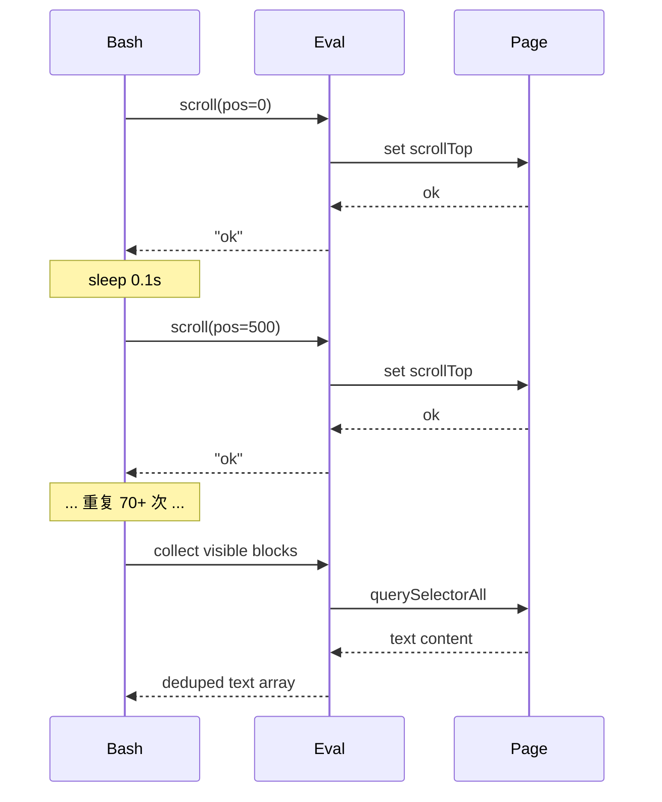

# 实战：飞书Wiki文档全量爬取——虚拟滚动页面的内容提取

## 1. 项目背景

### 1.1 需求描述

需要完整抓取飞书文档 `https://my.feishu.cn/wiki/IXIrw5MQniW60hkaFTAcgJx3nyt` 的全部内容（文本+图片），包含：

- 格式化文本（标题、段落、列表、代码块）
- 嵌入的图片（9张，含封面、数据图、示意图等）
- 保持原文的排版与叙事结构

### 1.2 页面特点

| 特性                          | 说明                                                       |
| --------------------------- | -------------------------------------------------------- |
| **强认证**                     | 必须登录飞书账号，未登录直接跳转登录页                                      |
| **虚拟滚动（Virtual Scrolling）** | DOM 中仅维持可见区域的 ~8-20 个内容块，滚动时动态渲染/回收                      |
| **图片 CDN 隔离**               | 图片托管于 `internal-api-drive-stream.feishu.cn`，需携带认证 Cookie |
| **防止复制**                    | 页面禁用右键菜单和文本选择                                            |

---

## 2. 技术选型分析

### 2.1 方案对比

| 方案                | 可行性 | 原因                       |
| ----------------- | --- | ------------------------ |
| `requests` 直接 GET | ❌   | 跳转登录页，无法获取真实内容           |
| `WebFetch` API    | ❌   | 需要认证，返回登录页内容             |
| 提取 API 接口数据       | ❌   | XHR 请求返回 0 长度，无法定位内部 API |
| **浏览器自动化（CDP）**   | ✅   | 复用已有登录 Session，可操作虚拟滚动   |

### 2.2 最终技术栈

```
┌─────────────────────────────────────────────┐
│             控制层 (Bash/PowerShell)          │
│   ┌─────────────────────────────────────┐   │
│   │        浏览器自动化 (agent-browser)     │   │
│   │         ←→ CDP Protocol             │   │
│   └─────────────────────────────────────┘   │
│   ┌─────────────────────────────────────┐   │
│   │       Chrome Browser (headed)       │   │
│   │    - 复用飞书登录 Session           │   │
│   │    - 虚拟滚动触发                   │   │
│   │    - 认证图片 fetch                │   │
│   └─────────────────────────────────────┘   │
│   ┌─────────────────────────────────────┐   │
│   │         Python (图像解码)            │   │
│   │    - base64 → PNG/JPG              │   │
│   │    - 文件头校验                    │   │
│   └─────────────────────────────────────┘   │
└─────────────────────────────────────────────┘
```

---

## 3. 核心挑战与解决方案

### 3.1 挑战一：飞书页面需要登录认证

**现象**：直接用 HTTP 请求或 `WebFetch` 访问 URL，返回飞书登录页 HTML。

**分析**：飞书 Wiki 页面在未认证状态下返回 SSR 的登录页面，所有内容数据通过登录后的 Session Token 鉴权。

**解决方案**：复用本地 Chrome 浏览器中已有的飞书登录 Session。

```bash
# 使用 headed 模式启动，用户已在浏览器中登录飞书
agent-browser open "https://my.feishu.cn/wiki/..." --headed
```

> Python 等价方案：使用 `selenium` 或 `playwright` 加载已有 Chrome 用户数据目录（User Data Dir），复用 Cookie。

```python
# Python playwright 方案
from playwright.sync_api import sync_playwright

with sync_playwright() as p:
    browser = p.chromium.launch_persistent_context(
        user_data_dir="C:/Users/xxx/AppData/Local/Google/Chrome/User Data",
        headless=False,
    )
    page = browser.new_page()
    page.goto("https://my.feishu.cn/wiki/...")
    # 此时已在登录状态
```

### 3.2 挑战二：虚拟滚动导致内容不全

**现象**：页面总高度约 36,646px，但 DOM 中只有 ~20 个内容块，其余被虚拟滚动回收。

**原理分析**：飞书使用类似 `react-virtualized` 的虚拟滚动技术。

```
┌───────────────┐
│   可见视口    │ ← 约 841px，渲染真实 DOM
│    ~20个块    │
├───────────────┤
│              │
│   滚动区域    │ ← 36,646px 的占位容器
│   (虚拟)      │    内容被回收
│              │
└───────────────┘
```

**解决方案**：逐步滚动容器，在每个位置采集出现的文本块。

**关键技术**：通过 Chrome DevTools Protocol 执行 JavaScript，在服务端逐段滚动采集。

```
算法流程：
1. 滚动容器 .bear-web-x-container.scrollTop = 0
2. for pos in range(0, maxHeight, step=500):
3.     c.scrollTop = pos
4.     sleep(80-150ms)  // 等待虚拟滚动渲染
5.     采集 .zone-container.non-empty 和 .heading-content
6.     用 textContent.substring(0,60) 去重
```

> Python 等价方案：

```python
from selenium import webdriver
from selenium.webdriver.common.by import By
import time

driver = webdriver.Chrome()
driver.get("https://my.feishu.cn/wiki/...")

container = driver.find_element(By.CSS_SELECTOR, ".bear-web-x-container")
max_height = driver.execute_script("return arguments[0].scrollHeight", container)

all_texts = []
seen = set()
step = 500

for pos in range(0, int(max_height), step):
    driver.execute_script("arguments[0].scrollTop = arguments[1]", container, pos)
    time.sleep(0.15)  # 等待虚拟滚动渲染

    blocks = driver.find_elements(By.CSS_SELECTOR, ".zone-container.non-empty, .heading-content")
    for block in blocks:
        text = block.text.strip()
        if not text:
            continue
        key = text[:60]
        if key not in seen:
            seen.add(key)
            all_texts.append(text)

print(f"Collected {len(all_texts)} blocks")
```

### 3.3 挑战三：单次 Eval 超时

**现象**：一次 JavaScript 执行中循环 75+ 次（36646/500），耗时较长，返回 `null`。

**分析**：agent-browser 的 `eval` 命令有执行时间限制，且复杂闭包易出错。

**解决方案**：拆分为两阶段——（1）先 Bash 循环滚动触发加载，（2）再采集。



```bash
# 分步方案伪代码
for pos in $(seq 0 500 37000); do
    agent-browser eval "container.scrollTop=$pos"
    sleep 0.15
done

# 然后再采集
agent-browser eval "collect all visible blocks"
```

### 3.4 挑战四：图片跨域 + 认证

**现象**：图片直接引用 `internal-api-drive-stream.feishu.cn` 的 CDN URL，无法使用 canvas.toDataURL()（CORS 污染），也无法直接用 curl 下载（缺少认证 Cookie）。

**分析**：
- canvas 读取跨域图片会抛出 `Tainted canvases` 错误
- curl 传 Cookie 后返回 49 字节（非图片内容）

**解决方案**：在浏览器已认证的上下文中，使用 `fetch()` 以流式方式下载图片。

```javascript
// 核心代码——在浏览器中执行
async function downloadImage(url) {
    const response = await fetch(url, { credentials: 'include' });
    const blob = await response.blob();
    // blob 可用
}
```

**base64 分块转换**（避免调用栈溢出）：

```python
def blob_to_base64(buffer: bytes) -> str:
    """分块转换为 base64，避免大 buffer 导致堆栈溢出"""
    CHUNK_SIZE = 8192
    result = []
    for i in range(0, len(buffer), CHUNK_SIZE):
        chunk = buffer[i:i + CHUNK_SIZE]
        result.append(base64.b64encode(chunk).decode('ascii'))
    return ''.join(result)
```

### 3.5 挑战五：数据写入与格式转换

**流程**：

```
Browser fetch image → base64 → stdout pipe → Python decode → save file
```

```bash
# 通过管道传输
agent-browser eval "download and base64" | python3 -c "
import sys, base64
data = sys.stdin.read()
with open('output.jpg', 'wb') as f:
    f.write(base64.b64decode(data))
"
```

---

## 4. 关键技术详解

### 4.1 Chrome DevTools Protocol (CDP)

CDP 是 Chrome 浏览器暴露的调试协议，允许外部工具控制浏览器的几乎所有行为。

| 能力    | 本案例应用                          |
| ----- | ------------------------------ |
| 页面导航  | `Page.navigate` → 打开飞书 URL     |
| JS 执行 | `Runtime.evaluate` → 滚动、采集 DOM |
| 网络拦截  | 获取 authenticated fetch 结果      |
| 截图    | 页面可视化确认                        |

agent-browser 封装了 CDP 接口，通过命令行暴露常用操作：

```
agent-browser open <url>     # Page.navigate
agent-browser eval <code>    # Runtime.evaluate
agent-browser snapshot       # 获取 accessibility tree
agent-browser close          # 关闭浏览器
```

> Python 等价库：`pyppeteer`、`playwright`、`selenium-wire`

### 4.2 虚拟滚动原理

虚拟滚动（Windowing / Virtual Scrolling）是前端优化技术，只渲染可见区域的内容。

```
position: relative; height: 36646px;  ← 占位容器
  ┌──────────────────────┐
  │   position: absolute  │  ← 实际渲染块（offsetTop 动态计算）
  │   top: 0px            │
  │   第一课：AI短剧...    │
  ├──────────────────────┤
  │   top: 120px          │
  │   前言：              │
  ├──────────────────────┤
  │        ...            │
  └──────────────────────┘
  （看不见的区域被 DOM 回收）
```

**检测方法**：

```python
# 检查页面是否采用虚拟滚动
def is_virtual_scrolling(driver):
    container = driver.find_element(By.CSS_SELECTOR, ".bear-web-x-container")
    scroll_height = driver.execute_script("return arguments[0].scrollHeight", container)
    client_height = container.size["height"]
    dom_blocks = len(driver.find_elements(By.CSS_SELECTOR, ".zone-container"))
    
    # 如果 scrollHeight >> clientHeight 且 DOM 块数很少
    return scroll_height / client_height > 10 and dom_blocks < 50
```

### 4.3 Accessibillity Tree（可访问性树）

agent-browser 的 `snapshot` 命令返回 Chrome 的 A11Y Tree（无障碍树），这是比 DOM 更高层次的抽象，保留语义结构：

```
- heading "第一课：AI 短剧行业全景分析与全流程快速上手" [level=1]
  - paragraph
    - StaticText "AI 短剧作为近两年增速最快..."
```

优势：过滤掉视觉布局元素，只保留内容节点。

---

## 5. 完整工作流

```mermaid
flowchart TD
    A[启动 headed Chrome] --> B[打开飞书 URL]
    B --> C{已登录?}
    C -->|No| D[手动登录]
    C -->|Yes| E[获取页面尺寸]
    
    E --> F[逐段滚动触发加载]
    F --> F1[scrollTop=0]
    F1 --> F2[scrollTop=500]
    F2 --> F3[...]
    F3 --> F4[scrollTop=37000]
    
    F --> G[采集所有文本块]
    G --> H[去重 + 排序]
    
    H --> I[提取图片 URL]
    I --> J[认证 fetch 下载]
    J --> J1[base64 编码]
    J1 --> J2[分块拼接]
    
    J2 --> K[Python 解码]
    K --> K1[PNG: 89 50 4E 47]
    K1 --> K2[JPEG: FF D8 FF]
    
    H --> L[组装 Markdown]
    K2 --> L
    L --> M[写入笔记文件]
    M --> N[图片用 ![[wikilink]] 嵌入]
```

---

## 6. 核心代码片段

### 6.1 检测并滚动虚拟滚动容器

```javascript
// 在浏览器上下文中执行
var container = document.querySelector('.bear-web-x-container');
if (!container) throw new Error('虚拟滚动容器未找到');

var totalHeight = container.scrollHeight;
var collected = new Set();
var storage = document.createElement('div');
storage.id = 'claude-store';
storage.style.display = 'none';
document.body.appendChild(storage);

for (var pos = 0; pos <= totalHeight; pos += 500) {
    container.scrollTop = pos;
    // 等待渲染：自旋等待 80-150ms
    var t = Date.now();
    while (Date.now() - t < 100) {}
    
    var blocks = document.querySelectorAll('.zone-container.non-empty, .heading-content');
    blocks.forEach(function(block) {
        var text = block.textContent.trim();
        if (!text) return;
        var key = text.substring(0, 60);
        if (collected.has(key)) return;
        collected.add(key);
        var el = document.createElement('div');
        el.textContent = text;
        storage.appendChild(el);
    });
}
```

### 6.2 认证图片下载（绕过 CORS）

```javascript
async function downloadImageAsBase64(url) {
    const response = await fetch(url, { credentials: 'include' });
    const blob = await response.blob();
    const arrayBuffer = await blob.arrayBuffer();
    const bytes = new Uint8Array(arrayBuffer);
    
    // 分块编码，避免调用栈溢出
    const CHUNK_SIZE = 8192;
    let base64 = '';
    for (let i = 0; i < bytes.length; i += CHUNK_SIZE) {
        const chunk = bytes.slice(i, Math.min(i + CHUNK_SIZE, bytes.length));
        // 使用浏览器内置的 btoa 转换
        let binary = '';
        chunk.forEach(function(b) { binary += String.fromCharCode(b); });
        base64 += btoa(binary);
    }
    return base64;
}
```

### 6.3 Python 侧图片解码与校验

```python
import base64
import struct

def decode_and_save(base64_str: str, output_path: str) -> bool:
    """解码 base64 并保存为图片文件，校验文件头"""
    raw = base64.b64decode(base64_str)
    
    with open(output_path, 'wb') as f:
        f.write(raw)
    
    # 校验文件头
    with open(output_path, 'rb') as f:
        header = f.read(4)
    
    if header[:3] == b'\xff\xd8\xff':
        return True  # JPEG
    elif header == b'\x89PNG':
        return True  # PNG
    else:
        return False  # 未知格式
```

### 6.4 去重算法

```python
class ContentDeduplicator:
    """基于文本前缀的去重器，用于虚拟滚动场景"""
    
    def __init__(self, key_length: int = 60):
        self.seen: set = set()
        self.key_length = key_length
    
    def is_duplicate(self, text: str) -> bool:
        key = text.strip()[:self.key_length]
        if key in self.seen:
            return True
        self.seen.add(key)
        return False
    
    def collect(self, texts: list[str]) -> list[str]:
        """过滤重复并保留顺序"""
        return [t for t in texts if not self.is_duplicate(t)]
```

---

## 7. 遇到的坑与解决方案汇总

| 问题 | 症状 | 原因 | 解决 |
|------|------|------|------|
| `eval` 返回 `null` | 复杂多行脚本不返回 | agent-browser 对多行复杂返回值序列化的限制 | 拆分为单步命令 |
| Chrome 进程残留 | "浏览器已占用" | 断开后 daemon 和 Chrome 未清理 | `taskkill /f /im chrome.exe` + `daemon stop` |
| CORS 图片污染 | canvas.toDataURL() 报错 | 跨域 CDN 图片 | 改用 `fetch()` 直接下载 Blob |
| curl 下载无效 | 49 字节文件 | 缺少 Cookie 或 Cookie 过期 | 通过浏览器认证 Session 下载 |
| 堆栈溢出 | Maximum call stack | 大数组在 btoa 时递归溢出 | 分 8192 字节块编码 |
| 虚拟滚动回收 | 只看到 8-20 个块 | 飞书 DOM 回收不可见元素 | 边滚边采 |

---

## 8. Python 爬虫技术对照表

本案例使用 agent-browser（Rust/Node.js）实现，但每项技术都有对应的 Python 生态实现：

| 本案例技术 | Python 等价方案 | 对应库 |
|-----------|----------------|--------|
| CDP 协议控制 | `pyppeteer` / `playwright` | `pip install playwright` |
| 浏览器自动化 | `selenium` WebDriver | `pip install selenium` |
| 认证 Session 复用 | `ChromeOptions.add_argument("user-data-dir")` | `selenium.webdriver` |
| DOM 查询 | `BeautifulSoup` / `lxml` / `selenium` find | `pip install beautifulsoup4` |
| base64 编解码 | `base64` 标准库 | 内置 |
| 图片文件头校验 | `struct` / `PIL` | `pip install Pillow` |
| 异步 fetch | `aiohttp` / `httpx.AsyncClient` | `pip install aiohttp` |
| 去重集合 | `set()` / `dict()` | 内置 |
| 管道通信 | `subprocess.PIPE` | 内置 `subprocess` |

### Python 版简化实现（playwright）

```python
import asyncio
from playwright.async_api import async_playwright
import base64

async def scrape_feishu(url: str, user_data_dir: str):
    async with async_playwright() as p:
        browser = await p.chromium.launch_persistent_context(
            user_data_dir=user_data_dir,
            headless=False,
        )
        page = await browser.new_page()
        await page.goto(url)
        await page.wait_for_selector(".bear-web-x-container")
        
        # 滚动采集
        container = page.locator(".bear-web-x-container")
        scroll_height = await container.evaluate("el => el.scrollHeight")
        
        all_texts = []
        seen = set()
        
        for pos in range(0, scroll_height, 500):
            await container.evaluate(f"el => el.scrollTop = {pos}")
            await page.wait_for_timeout(100)
            
            blocks = await page.locator(
                ".zone-container.non-empty, .heading-content"
            ).all()
            
            for block in blocks:
                text = (await block.text_content()).strip()
                if not text or text[:60] in seen:
                    continue
                seen.add(text[:60])
                all_texts.append(text)
        
        print(f"Collected {len(all_texts)} blocks")
        await browser.close()

asyncio.run(scrape_feishu(
    "https://my.feishu.cn/wiki/IXIrw5MQniW60hkaFTAcgJx3nyt",
    "C:/Users/xxx/AppData/Local/Google/Chrome/User Data"
))
```

---

## 9. 经验总结

### 9.1 虚拟滚动爬取的通用模式

```
1. 定位滚动容器 → 2. 触底强制加载 → 3. 边滚边采 → 4. 内容去重
```

适用于：飞书文档、语雀文档、微信公众号长文、瀑布流页面

### 9.2 认证内容的抓取策略优先级

```
优先：复用已有浏览器 Session > 获取 API Token > 模拟登录 > 无认证（极少）
```

### 9.3 选择 agent-browser 还是 Python

| 场景 | 推荐 |
|------|------|
| 快速调试、交互式操作 | agent-browser CLI |
| 大规模、定时任务 | Python playwright |
| Pipelines 和分布式 | Scrapy + playwright middleware |
| 需要配合数据分析 | Python 全栈（playwright + pandas） |

---

## 10. 参考链接

- [agent-browser GitHub](https://github.com/seanpianka/agent-browser)
- [Chrome DevTools Protocol](https://chromedevtools.github.io/devtools-protocol/)
- [Playwright Python 文档](https://playwright.dev/python/)
- [虚拟滚动原理 (react-window)](https://react-window.vercel.app/)
