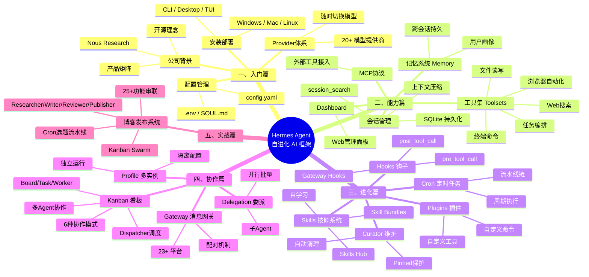
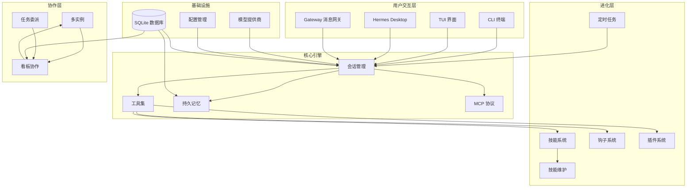

# Hermes Agent 概念全景

> 本文档将 Hermes Agent 的全部概念按「从入门到实战」的学习路线组织起来，每个概念都用**通俗的语言 + 生活类比**解释，最后附完整思维导图。

---

## 思维导图（总览）



---

## 一、入门篇 — 认识 Hermes Agent

### 1.1 Nous Research：谁创造了它？

> **一句话**：一个坚持开源、反对垄断的 AI 研究实验室，2023 年成立于美国德州。

**通俗理解**：如果把 AI 公司比作餐厅——
- **OpenAI** 是米其林三星，菜好但贵，菜单由主厨定（你只能点他们允许的）
- **Nous Research** 是自助厨房，工具全开放，你想做什么菜都行，甚至能自己改菜谱

**核心理念**：开源（代码/模型全公开）、无限制（模型拒绝率仅 40%，商业模型通常 95%+）、人类对齐（忠实执行你的意图，而不是"教育"你）

**产品矩阵**：

| 产品 | 通俗理解 |
|------|---------|
| **Hermes 模型系列** | 他们的"招牌菜"——开源大语言模型，90% 训练数据是合成的 |
| **DisTrO** | 分布式训练"加速器"——让分散在世界各地的普通电脑也能一起训练大模型 |
| **Psyche Network** | 去中心化"算力滴滴"——用区块链把闲置 GPU 收集起来训练 AI |
| **Hermes Agent** | 本教程的主角——一个会自己学习、自己进化的 AI 助手框架 |
| **Hermes Desktop** | 桌面版 App，像微信一样聊天使用 |
| **Forge API** | 云端推理服务，支持高级推理技术 |

### 1.2 Hermes Agent 是什么？

> **一句话**：一个**会自己学习、自己进化**的 AI 助手，可以跑在终端、桌面 App、甚至微信/Telegram 里。

**生活类比**：想象你雇了一个**实习生**——
- 第一天：你手把手教他怎么做（手动配置）
- 一周后：他学会了你常用的工作流程，自己知道怎么做了（Skills 技能）
- 一个月后：他记住了你的偏好，不用你重复说（Memory 记忆）
- 三个月后：他能同时处理多个任务，还自己优化工作方法（自进化）

**核心亮点**：
- 🧠 **自进化**：解决复杂问题后，自动把方法保存为"技能"，下次直接用
- 💾 **跨会话记忆**：记住你的偏好、环境、约定——越用越聪明
- 🔌 **多平台**：同一个 Agent 同时跑在 Telegram、微信、Discord、终端
- 🎭 **多角色**：可以创建多个独立 Agent（一个写代码、一个写文章、一个做运维）
- 🧩 **可扩展**：插件、MCP 服务器、自定义工具、定时任务

### 1.3 安装与使用方式

Hermes 有三种使用方式，就像同一个工具的三个"形态"：

| 方式 | 通俗理解 | 适合谁 |
|------|---------|--------|
| **CLI 终端** | 在命令行里对话 | 开发者、运维 |
| **TUI 界面** | 带界面的终端聊天 | 喜欢终端但想要更好体验 |
| **Desktop 桌面 App** | 像微信一样的桌面应用 | 所有人（v0.16 新功能） |

**安装**：一行命令搞定
```bash
# Linux/Mac
curl -fsSL https://hermes-agent.nousresearch.com/install.sh | bash

# Windows (PowerShell)
iex (irm https://hermes-agent.nousresearch.com/install.ps1)
```

### 1.4 Provider 体系：不绑定任何模型

> **一句话**：支持 20+ 模型提供商、400+ 模型，随时切换，不被任何一家锁定。

**通俗理解**：就像手机可以换 SIM 卡——
- 今天用 **Claude**（写作质量高，适合写文章）
- 明天换 **DeepSeek**（便宜，适合批量调研）
- 后天用 **本地模型**（隐私要求高时）

**常用提供商**：

| 提供商 | 适合场景 | 接入方式 |
|--------|---------|---------|
| **Nous Portal** | 首选，400+ 模型 | OAuth 一键登录 |
| **Anthropic (Claude)** | 写作、推理 | API Key |
| **OpenAI (GPT)** | 通用任务 | API Key |
| **DeepSeek** | 高性价比 | API Key |
| **本地模型** | 隐私场景 | LM Studio |

### 1.5 配置管理

**核心文件**（都在 `~/.hermes/` 下）：

| 文件 | 通俗理解 |
|------|---------|
| `config.yaml` | 主配置文件——相当于"设置面板" |
| `.env` | 密码本——存 API Key 等敏感信息 |
| `SOUL.md` | 人格文件——定义 Agent 的性格和行为方式 |
| `memories/` | 记忆文件夹——存用户偏好 |
| `skills/` | 技能文件夹——存工作流程模板 |

---

## 二、能力篇 — Hermes 能做什么

### 2.1 会话管理（Session）

> **一句话**：每一次对话都是一个"会话"，系统自动保存，可以随时回查和继续。

**通俗理解**：就像微信聊天记录——
- 所有对话自动保存（SQLite 数据库）
- 可以搜索以前聊过的内容（session_search）
- 上下文太长时会自动压缩，保留重点
- 支持 `/undo` 撤销、`/continue` 继续上次会话

**session_search（跨会话搜索）**：
- v0.15 重大升级：速度提升 **4500 倍**（从 90 秒降到 20 毫秒），且**零费用**
- 支持四种模式：关键词搜索（Discovery）、翻看上下文（Scroll）、浏览最近（Browse）、读取完整会话（Read）
- Agent 会自动使用它来回查历史，不用你重复说

### 2.2 工具集（Toolsets）

> **一句话**：工具是 Hermes 的"手脚"，按功能分组为工具集，可以按需开关。

**通俗理解**：就像工具箱里的不同抽屉——
- **Web 工具**：搜索网页、提取内容（相当于浏览器）
- **终端工具**：执行命令、读写文件（相当于你的双手）
- **浏览器工具**：自动化操作网页（相当于遥控器）
- **媒体工具**：看图、听语音、生成图片
- **编排工具**：规划任务、委托子任务

**关键工具一览**：

| 工具 | 通俗理解 | 能做什么 |
|------|---------|---------|
| `web_search` | 搜索引擎 | 查资料、找文档 |
| `terminal` | 命令行 | 执行代码、安装软件 |
| `read_file` / `write_file` | 文件编辑器 | 读写文件 |
| `patch` | 智能替换 | 精确修改文件某部分 |
| `browser_*` | 浏览器遥控器 | 打开网页、点击、截图 |
| `delegate_task` | 派活 | 让子 Agent 帮忙干活 |
| `cronjob` | 定时器 | 设置定时任务 |
| `memory` | 笔记本 | 记住重要信息 |

**终端后端（7 种运行环境）**：

| 后端 | 通俗理解 | 适用场景 |
|------|---------|---------|
| `local` | 本机直接执行 | 日常开发 |
| `docker` | 隔离沙箱 | 不信任的任务 |
| `ssh` | 远程服务器 | 管理云服务器 |
| `modal` / `daytona` | 云端虚拟机 | 弹性计算 |

### 2.3 MCP 协议（Model Context Protocol）

> **一句话**：一个标准接口，让 Hermes 能接入外部工具服务器。

**通俗理解**：就像 USB 接口——
- 任何支持 MCP 的工具（GitHub、数据库、公司内部服务）都可以"插"到 Hermes 上
- 两种接入方式：
  - **stdio 模式**：本地启动一个工具进程，通过 stdin/stdout 通信
  - **HTTP 模式**：连接一个已经运行在服务器上的工具服务

**配置示例**：
```yaml
mcp_servers:
  github:
    command: "npx"
    args: ["-y", "@modelcontextprotocol/server-github"]
```

### 2.4 持久记忆（Memory）

> **一句话**：Hermes 会记住你的偏好、环境和约定，跨会话持续积累。

**通俗理解**：就像你的私人助理有一个笔记本——
- 你说"我喜欢简洁的回答"，他记下来，以后都简洁
- 你说"项目用 pytest"，他记下来，以后测试都用 pytest
- 你不需要每次重复告诉他

**记忆分两种**：

| 类型 | 存什么 | 例子 |
|------|--------|------|
| `memory` | 环境事实、工具技巧 | "项目使用 pytest + xdist" |
| `user` | 用户画像 | "用户偏好简洁回答" |

### 2.5 Dashboard（Web 管理面板）

> **一句话**：浏览器里的管理后台，可视化配置 Hermes。

启动 `hermes dashboard` 后，在浏览器里可以：
- 配置消息平台（Telegram、微信等）
- 管理 MCP 服务器
- 编辑 API Key
- 查看 Gateway 运行状态
- 监控会话

---

## 三、进化篇 — Hermes 如何自我成长

### 3.1 Skills 技能系统（核心亮点 ⭐）

> **一句话**：Hermes 解决复杂问题后，会自动把方法保存为"技能文件"，下次遇到类似任务直接调用。

**通俗理解**：就像你学做饭——
- 第一次做红烧肉：看菜谱、手忙脚乱
- 成功后：你把步骤写成"红烧肉 Skill"
- 下次再做：直接按 Skill 执行，又快又好
- 做得多了：Skill 越来越完善，还衍生出"糖醋排骨 Skill"

**技能文件长这样**（纯文本 Markdown，人类可读可编辑）：
```markdown
# Docker Troubleshooting
1. 检查容器状态: docker ps -a
2. 查看日志: docker logs --tail 100 --timestamps
3. 检查资源: docker stats
```

**技能操作命令**：
```bash
hermes skills list              # 列出已安装技能
hermes skills install <name>    # 安装技能
hermes skills search <keyword>  # 搜索技能市场
/skill <name>                   # 会话内加载技能
```

**Skill Bundles（v0.15+）**：把多个技能打包成一个，一键加载。比如 `writing-day` 同时加载写作、SEO、Markdown 三个技能。

**Skills Hub（agentskills.io）**：社区共享的技能市场，可以浏览、安装、发布技能。

### 3.2 Curator 技能维护

> **一句话**：自动清理技能库的"管家"，防止技能无限膨胀。

**通俗理解**：你的技能库就像衣柜——
- 衣服（技能）越来越多
- Curator 定期检查：30 天没穿的放"待处理"，90 天没穿的收进储藏室
- 特别喜欢的可以"Pin"住（像挂起来的好衣服），不会被处理
- 还会合并功能相似的技能

**关键命令**：
```bash
hermes curator status           # 查看技能状态
hermes curator run              # 手动运行维护
hermes curator pin <skill>      # 固定重要技能
```

### 3.3 Hooks 钩子系统

> **一句话**：在关键事件点插入自定义代码，就像"触发器"。

**通俗理解**：就像家里的智能传感器——
- 有人进门（事件）→ 开灯（动作）
- Hermes 执行工具前（pre_tool_call）→ 检查是否危险命令
- Hermes 执行工具后（post_tool_call）→ 记录日志

**三种钩子**：

| 类型 | 通俗理解 | 典型用途 |
|------|---------|---------|
| **Shell Hooks** | 用脚本写触发器 | 阻止危险命令、弹出通知 |
| **Plugin Hooks** | 用 Python 写触发器 | 拦截工具、采集指标 |
| **Gateway Hooks** | 网关级别触发器 | 记录消息、发送告警 |

**示例：阻止 `rm -rf /`**：
```yaml
hooks:
  pre_tool_call:
    - command: "~/.hermes/hooks/danger-guard.sh"
```
脚本检查命令是否在黑名单中，是则返回 `block` 阻止执行。

### 3.4 Plugins 插件系统

> **一句话**：不修改 Hermes 核心代码，通过插件添加新功能。

**通俗理解**：就像手机 App——
- 手机系统（Hermes 核心）不动
- 安装 App（插件）来增加功能
- 插件可以添加：新工具、新命令、新钩子、新平台支持

**最小插件结构**：
```
~/.hermes/plugins/hello-world/
├── plugin.yaml      # 插件信息（名称、版本）
└── __init__.py      # 注册函数，定义插件能力
```

### 3.5 Cron 定时任务

> **一句话**：让 Hermes 在指定时间自动执行任务。

**通俗理解**：就像闹钟——
- 每天早上 7 点：收集技术新闻
- 每周一 9 点：生成周报
- 每小时：检查服务器状态

**高级功能：流水线链**
多个 Cron 任务可以串联：任务 A 收集数据 → 任务 B 分析数据 → 任务 C 生成报告。通过 `context_from` 参数建立依赖链。

---

## 四、协作篇 — 多 Agent 协同工作

### 4.1 Gateway 消息网关

> **一句话**：让 Hermes 接入 23+ 消息平台，在微信/Telegram/Discord 里直接使用。

**通俗理解**：就像客服系统的"多平台接入"——
- 用户从微信发消息 → Gateway 接收 → Hermes 处理 → 回复发回微信
- 用户从 Telegram 发消息 → 同一个 Hermes 处理 → 回复发回 Telegram
- 所有平台共享同一套配置、记忆、技能

**支持的平台（23+）**：

| 平台 | 说明 |
|------|------|
| Telegram / Discord / Slack | 海外主流 |
| 微信 / 钉钉 / 飞书 / 企微 | 国内平台 |
| WhatsApp / Signal | 加密通讯 |
| Email / SMS | 传统渠道 |
| Matrix / IRC | 开源社区 |

**配对机制**：首次使用时，Bot 会发一个配对码，管理员在本机批准后即可使用，确保安全。

### 4.2 Profile 多实例

> **一句话**：运行多个互相独立的 Hermes Agent，各有各的配置、会话、技能和记忆。

**通俗理解**：就像一台电脑上创建多个用户账户——
- 你的账户（default）：日常工作
- 写代码的账户（coder）：只装开发工具
- 写文章的账户（writer）：用 Claude 模型，加载写作技能
- 每个账户互不干扰

**创建和使用**：
```bash
hermes profile create coder     # 创建 coder 角色
coder chat                      # 直接用 coder 角色对话
coder config set model.default anthropic/claude-sonnet-4  # 设置模型
```

### 4.3 Delegation 任务委派

> **一句话**：创建子 Agent 来帮忙干活，可以并行处理多个任务。

**通俗理解**：就像项目经理——
- 你（父 Agent）接到一个大任务
- 拆成几个小任务，派给不同的"实习生"（子 Agent）
- 实习生各自独立工作，完成后汇报结果
- 你汇总结果，交给用户

**两种模式**：

| 模式 | 通俗理解 | 示例 |
|------|---------|------|
| **单任务** | 派一个人干活 | "去查一下 Docker 部署文档" |
| **并行批量** | 同时派三个人 | A 查文档、B 查社区、C 查 GitHub |

**子 Agent 的限制**（安全设计）：
- ❌ 不能再派活（防止无限嵌套）
- ❌ 不能问用户问题
- ❌ 不能写共享记忆
- ❌ 不能发消息到外部平台

### 4.4 Kanban 多 Agent 协作（高级功能 ⭐）

> **一句话**：一个"任务看板"系统，让多个 Profile 像团队一样协作完成复杂工作流。

**通俗理解**：就像软件开发团队的 Trello 看板——
- **Board（看板）**：项目面板，所有任务都在上面
- **Task（任务）**：一张卡片，写着"写文章"、"做调研"
- **Link（依赖）**："调研"没完成，"写文章"不能开始
- **Worker（工人）**：每个 Profile 就是一个工人，认领卡片开始干活
- **Dispatcher（调度员）**：自动分配任务、检查进度

**Task 生命周期**：
```
粗略想法 → 已创建 → 准备就绪 → 执行中 → 已完成
                                    ↓
                                 遇到问题 → 等待解决 → 重新就绪
```

**6 种协作模式**：

| 模式 | 通俗理解 | 例子 |
|------|---------|------|
| **Fan-out（扇出）** | 一个任务拆成多个并行 | 三个人同时调研不同方向 |
| **Pipeline（流水线）** | 流水线作业 | A 调研 → B 写稿 → C 审核 → D 发布 |
| **Fan-in（扇入）** | 多个结果汇总 | 三个调研报告汇总成一份 |
| **Human-in-the-loop** | 人工审批节点 | 写好的文章等主编审核 |
| **Long-running journal** | 定期重复任务 | 每天自动生成日报 |
| **Fleet farming** | 批量管理 | 同时管理多个服务器 |

---

## 五、实战篇 — 综合案例

### 博客自动发布系统

> **一句话**：用 Hermes 搭建一个从选题发现到文章发布的完整自动化流水线。

**角色分工**（4 个 Profile）：

| 角色 | 模型 | 职责 |
|------|------|------|
| **Researcher（调研员）** | DeepSeek（便宜） | 查资料、做调研 |
| **Writer（撰稿员）** | Claude（质量高） | 写文章 |
| **Reviewer（审核员）** | 通用模型 | 检查质量 |
| **Publisher（发布员）** | 通用模型 | 提交到 GitHub |

**工作流程**：
```
每天 7:00 Cron → 收集技术新闻
      7:30 Cron → 筛选 3 个选题
      8:00 Cron → 生成选题简报
      
用户说"写一篇关于 X 的文章"
  → Orchestrator 拆解任务
  → Researcher 并行调研
  → Writer 撰写文章
  → Reviewer 审核
  → Publisher 发布到 GitHub
```

**覆盖 25+ 功能**：Profile、Provider、Skills、Cron、Delegation、Kanban、Gateway、MCP、Hooks、Plugins 等。

---

## 概念关系图



---

## 学习路线建议

```
入门篇 ──→ 能力篇 ──→ 进化篇 ──→ 协作篇 ──→ 实战篇
  │           │           │           │           │
  ▼           ▼           ▼           ▼           ▼
了解背景    掌握工具    理解自学习    驾驭协作    融会贯通
安装配置    会用工具    会写技能    搭建网关    完成项目
选模型      用记忆      设定时      多角色      串联所有
```

---

## 快速对照表

| 你想做什么 | 对应的概念 | 在哪个模块 |
|-----------|-----------|-----------|
| 安装 Hermes | 安装部署 | 入门篇 |
| 切换模型 | Provider 体系 | 入门篇 |
| 让 Agent 搜索网页 | web_search 工具 | 能力篇 |
| 让 Agent 记住偏好 | Memory | 能力篇 |
| 回查历史对话 | session_search | 能力篇 |
| 接入外部工具 | MCP 协议 | 能力篇 |
| 保存工作流程 | Skills | 进化篇 |
| 自动清理技能 | Curator | 进化篇 |
| 阻止危险命令 | Hooks | 进化篇 |
| 添加自定义功能 | Plugins | 进化篇 |
| 每天早上自动干活 | Cron | 进化篇 |
| 在微信里用 Hermes | Gateway | 协作篇 |
| 创建多个独立 Agent | Profile | 协作篇 |
| 让 Agent 互相帮忙 | Delegation | 协作篇 |
| 搭建多 Agent 流水线 | Kanban | 协作篇 |

---

*本文档基于 [[02-Knowledge(知识层)/20-核心能力-Core_Ability/10 AI应用-AI_Application/01 AI工具/02 Agent/04 Hermes-Agent/README|Hermes Agent 教程]] 五篇模块整理，适合作为快速查阅的概念地图。*
