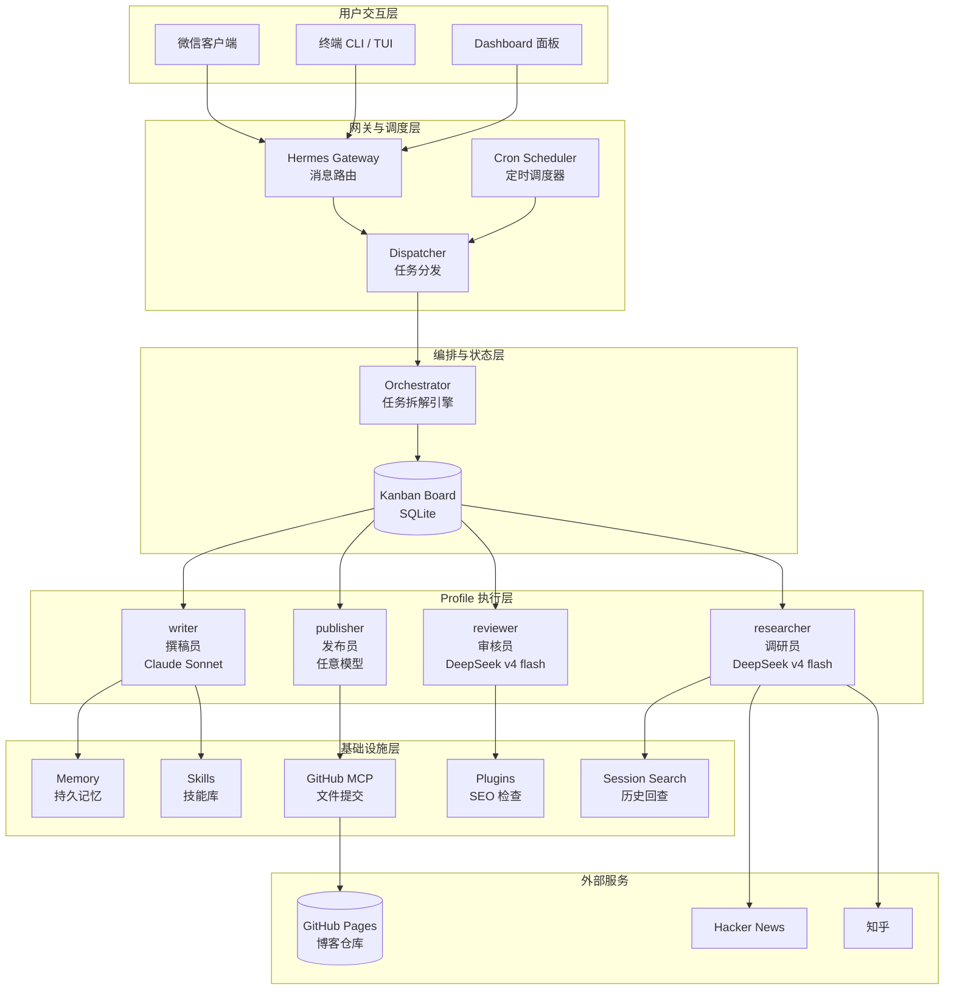
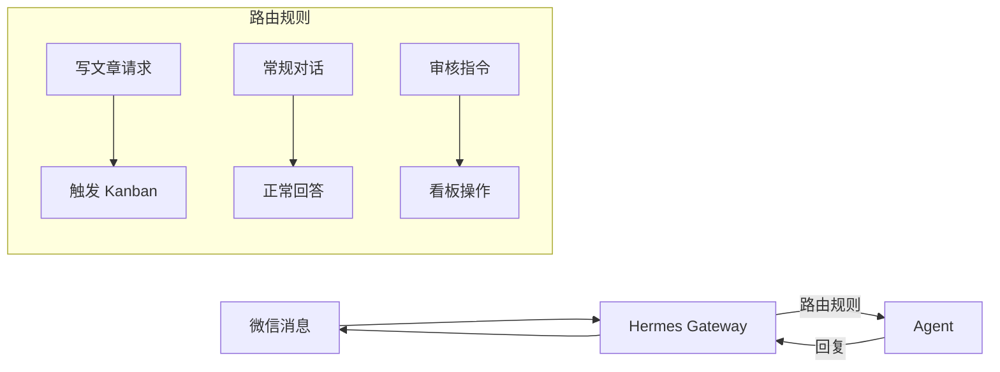
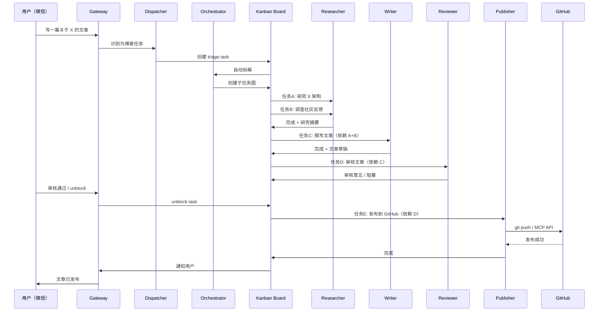

# 系统架构设计

## 系统架构总览



## 6 大核心模块

### 1. Profile — 多角色隔离

Hermes Profile 是**独立的 Agent 实例**，每个 Profile 拥有独立的配置、模型、工具权限、会话历史和 Memory。

| Profile | 职责 | 推荐模型 | 工具限制 | SOUL.md 人格 |
|---------|------|---------|---------|-------------|
| **researcher** | 查阅文档、源码、网络资料 | DeepSeek v4 flash（便宜） | 仅 web + terminal | 结构化输出、客观精确 |
| **writer** | 撰写技术文章 | Claude Sonnet 4.6（高质量） | 全开 | 技术专栏风格、1500~3000 字 |
| **reviewer** | 审核文章质量 | DeepSeek v4 flash | 全开 | checklist 格式审核 |
| **publisher** | 发布到 GitHub | 任意模型 | 仅 terminal + MCP | 执行 git 操作 |
| **orchestrator** | 任务拆解与编排 | DeepSeek v4 flash | 禁用所有工具 | 纯编排角色 |

**核心原则**：每个角色只做自己擅长的事，通过工具限制防止越界。

### 2. Provider — 模型按需分配

不同 Profile 使用不同的模型 Provider，实现成本与质量的平衡：

```yaml
# ~/.hermes/config.yaml 中的 Provider 配置
providers:
  deepseek:
    api_key: «redacted:sk-…»
    base_url: https://api.deepseek.com

  openrouter:
    api_key: «redacted:sk-…»
    base_url: https://openrouter.ai/api/v1
```

| Profile | Provider | 模型 | 原因 |
|---------|----------|------|------|
| researcher | DeepSeek | deepseek-chat (v4 flash) | 调研需要大量 token，便宜是关键 |
| writer | OpenRouter → Claude | anthropic/claude-sonnet-4.6 | 文章质量是最终产出，值得用好模型 |
| reviewer | DeepSeek | deepseek-chat (v4 flash) | 审核不需要最强模型 |
| publisher | DeepSeek | deepseek-chat (v4 flash) | 只执行 git 操作，任意模型即可 |

> **注意**：如果无法使用 Claude（国内网络问题），**统一用 DeepSeek 也完全没问题**。可以用 v4 flash（便宜）和 v4 pro（更好）来区分档次。

### 3. Kanban — 任务状态管理

Kanban Board 是整个工作流的**中枢神经系统**：

```
┌─────────────┐    ┌─────────────┐    ┌─────────────┐    ┌─────────────┐
│   triage    │ →  │   ready     │ →  │ in_progress │ →  │  completed  │
│  (待拆解)    │    │  (待执行)    │    │  (执行中)    │    │  (已完成)    │
└─────────────┘    └─────────────┘    └─────────────┘    └─────────────┘
                          │                                      │
                          ↓                                      ↓
                    ┌─────────────┐                       ┌─────────────┐
                    │   blocked   │                       │  archived   │
                    │  (被阻塞)    │                       │  (已归档)    │
                    └─────────────┘                       └─────────────┘
```

**关键特性**：
- **Task**：每个子任务包含标题、描述、assignee、依赖关系
- **Link**：任务间的依赖关系（`depends_on`）
- **Workspace**：每个任务有独立的工作目录
- **Comment**：审核意见、修改建议
- **Block/Unblock**：任务阻塞与解除
- **Dispatcher**：自动将 ready 任务分配给对应 Profile 执行

### 4. Cron — 定时选题流水线

三阶段流水线设计，通过 `context_from` 建立依赖链：


| 任务 | 时间 | 内容 | 推送 |
|------|------|------|------|
| blog-news-collect | 每天 7:00 | 采集 HN + 知乎 AI/前端热门 | ❌ 不推送（防限流） |
| blog-topic-select | 每天 7:30 | 筛选 3 个最佳选题 | ❌ 不推送（防限流） |
| blog-brief-generate | 每天 8:00 | 生成简报（≤500 字） | ✅ 推送微信 |

### 5. Gateway — 消息平台接入

Gateway 负责消息路由和平台适配：



**微信配置要点**：
- 使用二维码扫码登录
- 必须配置 `WEIXIN_ALLOWED_USERS=true` 否则消息被丢弃
- 微信有推送频率限制，需控制消息量

### 6. MCP — 外部工具集成

MCP（Model Context Protocol）让 Agent 可以调用外部服务：

```bash
# GitHub MCP Server 配置
hermes mcp add github --url https://api.github.com
hermes mcp test github  # 测试连接
```

**使用场景**：publisher Profile 通过 GitHub MCP 自动创建/更新博客仓库中的文章文件。

## 消息流转图

完整的消息流转路径：



## 技术选型理由

| 决策 | 选项 | 选择理由 |
|------|------|---------|
| **Agent 框架** | Hermes Agent vs AutoGPT vs CrewAI | Hermes 原生支持 Profile、Kanban、Cron、Gateway，一站式解决 |
| **调研模型** | DeepSeek vs Claude | DeepSeek 便宜（约 1/10 价格），推理能力强，适合大量 token 消耗的调研 |
| **写作模型** | Claude vs GPT-4o | Claude Sonnet 写作质量高、中文表达自然、代码示例准确 |
| **任务编排** | Kanban vs 手动调度 | Kanban 提供可视化状态管理、自动分发、依赖关系、阻塞/恢复 |
| **消息平台** | 微信 vs Telegram | 国内用户使用微信更方便，Hermes Gateway 原生支持 |
| **发布方式** | GitHub MCP vs git CLI | MCP 提供结构化 API 调用，比 shell git 命令更可靠 |
| **持久记忆** | Hermes Memory vs 外部 DB | 内置 Memory 零配置，自动积累，跨会话生效 |
| **定时任务** | Hermes Cron vs 系统 crontab | Hermes Cron 支持 `context_from` 依赖链、Agent 执行、多平台推送 |
