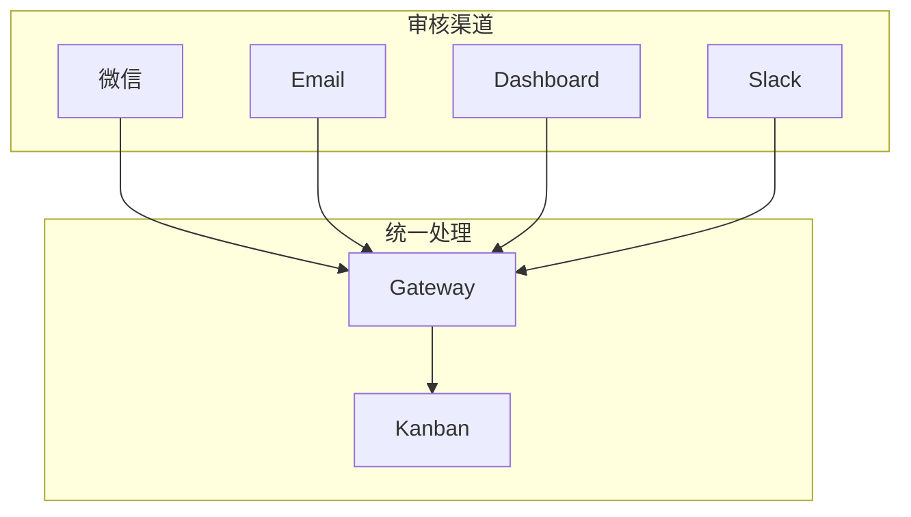
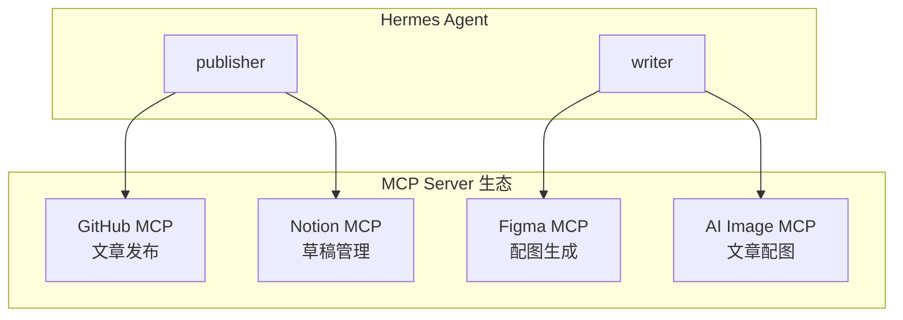
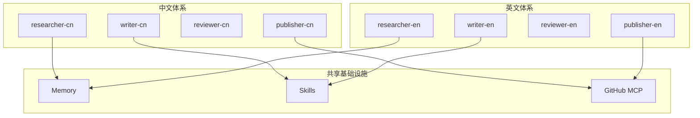

# 扩展思路

> 本文档提供博客自动发布系统的进阶扩展方向。当前系统已实现核心功能，以下扩展可以根据实际需求逐步添加。

---

## 1. 多渠道审核

### 现状

目前审核环节依赖微信手动 `unblock`，只有一种审核渠道。

### 扩展方案

#### 方案 A：邮件审核

利用 Hermes Gateway 的 Email 适配器，将审核通知发送到邮箱：

```bash
# 配置 Email Gateway
hermes gateway setup
# 选择 Email，配置 IMAP/SMTP
```

审核流程：

```text
Reviewer 完成审核 → 阻塞任务 → Gateway 发送邮件通知
负责人回复邮件 "通过" → Gateway 解析 → Kanban unblock
```

#### 方案 B：Dashboard 审核面板

利用 Hermes Dashboard 的 Web 界面进行审核：

```bash
hermes dashboard --port 8080
```

在浏览器中查看 Kanban 任务状态，直接点击 unblock。

#### 方案 C：Slack / Discord 审核

配置多个 Gateway 平台，审核通知同时推送到多个渠道：

```bash
hermes gateway setup
# 添加 Slack 或 Discord 适配器
```



---

## 2. 外部记忆提供商

### 现状

使用 Hermes 内置的 Memory（`MEMORY.md` 文件），适合单机场景。

### 扩展方案

Hermes 支持可插拔的记忆后端，可以接入外部记忆提供商：

#### Honcho（推荐）

```bash
# 安装 Honcho 插件
hermes plugins install honcho

# 配置 Honcho
hermes honcho setup
```

Honcho 提供：
- 云端持久化记忆
- 跨设备同步
- 结构化记忆检索
- 记忆版本管理

#### Mem0

```bash
# 配置 Mem0
hermes config set memory.provider mem0
```

Mem0 提供：
- 语义记忆检索
- 自动记忆分类
- 记忆重要性评分

#### 配置对比

| 提供商 | 存储方式 | 跨设备 | 检索方式 | 成本 |
|--------|---------|--------|---------|------|
| 内置 Memory | 本地文件 | ❌ | 关键词 | 免费 |
| Honcho | 云端 | ✅ | 结构化 | 免费/付费 |
| Mem0 | 云端 | ✅ | 语义向量 | 付费 |

---

## 3. SEO 插件扩展

### 现状

Reviewer 审核文章时主要靠 LLM 判断质量，没有专门的 SEO 检查工具。

### 扩展方案

创建 Hermes 插件，用 Python 代码实现文章元数据检查，**比让大模型检查更快、更便宜**。

#### 插件结构

```bash
~/.hermes/plugins/seo-checker/
├── plugin.yaml          # 插件配置
└── __init__.py          # 插件代码
```

#### plugin.yaml

```yaml
name: seo-checker
version: "1.0"
description: Checks blog post SEO metadata quality.
```

#### __init__.py（核心逻辑）

```python
import re

def check_seo(title: str, description: str, content: str, tags: list) -> dict:
    """检查文章 SEO 元数据质量"""
    issues = []
    score = 100

    # 标题检查
    if len(title) < 10:
        issues.append("标题太短（< 10 字符），建议 20-60 字符")
        score -= 10
    elif len(title) > 60:
        issues.append("标题太长（> 60 字符），建议 20-60 字符")
        score -= 10

    # 描述检查
    if not description:
        issues.append("缺少文章描述（description）")
        score -= 15
    elif len(description) < 50:
        issues.append("描述太短（< 50 字符），建议 120-160 字符")
        score -= 5
    elif len(description) > 160:
        issues.append("描述太长（> 160 字符）")
        score -= 5

    # 关键词密度
    if tags:
        for tag in tags:
            count = content.lower().count(tag.lower())
            if count < 2:
                issues.append(f"标签 '{tag}' 在正文中出现次数过少（{count} 次）")
                score -= 5

    # 代码块检查
    code_blocks = re.findall(r'```', content)
    if len(code_blocks) < 2:
        issues.append("技术文章建议包含代码示例")
        score -= 10

    # 图片检查
    images = re.findall(r'!\[.*?\]\(.*?\)', content)
    if not images:
        issues.append("建议添加配图或架构图")
        score -= 10

    # 标题层级
    h1_count = len(re.findall(r'^# ', content, re.MULTILINE))
    if h1_count > 1:
        issues.append("文章中有多个 H1 标题，建议只保留一个")
        score -= 5

    return {
        "score": max(0, score),
        "issues": issues,
        "pass": score >= 70
    }
```

#### 部署到 reviewer profile

```bash
# 启用插件
hermes plugins enable seo-checker

# 部署到 reviewer
reviewer plugins enable seo-checker
```

### 更多插件方向

| 插件 | 功能 | 实现方式 |
|------|------|---------|
| **seo-checker** | 文章 SEO 元数据检查 | Python 正则 + 规则 |
| **link-validator** | 检查文章中的外部链接是否有效 | HTTP HEAD 请求 |
| **code-linter** | 检查代码示例语法正确性 | 调用对应语言的 linter |
| **image-optimizer** | 检查图片大小和格式 | PIL/Pillow |
| **readability** | 检查文章可读性评分 | 文本统计 |

---

## 4. MCP Server Mode

### 现状

Hermes 作为客户端连接 GitHub MCP Server，用于提交文章。

### 扩展方案

#### 方案 A：Hermes 作为 MCP Server

将 Hermes 本身暴露为 MCP Server，让其他工具可以调用：

```bash
# 启动 MCP Server 模式
hermes mcp serve --port 8000
```

其他应用可以通过 MCP 协议调用 Hermes 的能力：

```text
# 外部 CMS 通过 MCP 调用 Hermes
POST /mcp/v1/tools/call
{
    "name": "generate_blog_post",
    "arguments": {
        "topic": "MCP 协议详解",
        "style": "技术深度分析"
    }
}
```

#### 方案 B：添加更多 MCP Server

| MCP Server | 用途 | 配置命令 |
|------------|------|---------|
| GitHub | 文件提交、PR 管理 | `hermes mcp add github` |
| Notion | 文章草稿管理 | `hermes mcp add notion` |
| Jira | 任务关联 | `hermes mcp add jira` |
| Figma | 配图获取 | `hermes mcp add figma` |
| Slack | 通知推送 | `hermes mcp add slack` |

```bash
# 示例：添加 Notion MCP Server
hermes mcp add notion --url https://api.notion.com
hermes mcp test notion
```

#### 方案 C：MCP 工作流集成



---

## 5. 多语言 Profile 体系

### 现状

目前所有 Profile 使用中文写作。

### 扩展方案

创建多语言版本的 Profile 体系，支持英文博客：

```bash
# 创建英文版 Profile 体系
hermes profile create researcher-en --clone --clone-from researcher
hermes profile create writer-en --clone --clone-from writer
hermes profile create reviewer-en --clone --clone-from reviewer
hermes profile create publisher-en --clone --clone-from publisher
```

#### 英文版 SOUL.md 示例

```markdown
# Writer Soul (English)
You are a technical blog writer. Writing style:
- Start with a compelling problem statement or question
- Code examples must be complete and runnable
- Explain WHY each technique matters
- Target length: 1500-3000 words
- Use clear, concise technical English
```

#### 多语言看板

```bash
# 创建英文看板
hermes kanban boards create blog-en --name "English Tech Blog Board" --switch
```

#### 多语言 Cron

```bash
# 英文选题 Cron
cronjob(action="create", name="blog-en-news-collect",
        schedule="0 7 * * *",
        prompt="Collect trending AI/programming topics from Hacker News and Reddit...",
        deliver="telegram")
```

#### 架构示意



---

## 6. 更多扩展方向

### API Server 模式

启动 Hermes API Server，让外部 CMS 系统可以触发文章发布：

```bash
hermes api serve --port 8080
```

```bash
# 外部系统调用
curl -X POST http://localhost:8080/api/v1/publish \
  -H "Content-Type: application/json" \
  -d '{"topic": "Kubernetes 入门指南", "urgent": true}'
```

### No-Agent Cron 监控

纯脚本监控博客站点健康状态，不需要 LLM 参与：

```bash
# 创建监控脚本
cat > ~/.hermes/scripts/blog-health-check.sh << 'EOF'
#!/bin/bash
STATUS=$(curl -s -o /dev/null -w "%{http_code}" https://yourname.github.io/blog/)
if [ "$STATUS" != "200" ]; then
  echo "BLOG DOWN: HTTP $STATUS"
  exit 1
fi
echo "OK: Blog healthy, status=$STATUS"
EOF

# 创建定时任务
hermes cron create "every 30m" \
  --no-agent \
  --script blog-health-check.sh \
  --deliver wechat \
  --name "blog-health-check"
```

### Hooks 监控 Token 消耗

配置 `post_tool_call` hook 记录每次工具调用的 Token 消耗：

```yaml
# ~/.hermes/config.yaml
hooks:
  post_tool_call:
    - name: token-logger
      command: echo "$(date) - $TOOL_NAME - $TOKEN_COST" >> ~/.hermes/logs/token-usage.log
```

> **注意**：老师认为直接用 DeepSeek 官网或桌面客户端查看 Token 消耗更方便，这个不是必须的。

---

> **扩展原则**：每次只加一个扩展，跑通后再加下一个。不要一次性全部加上，否则出问题时不知道是哪个扩展引起的。
