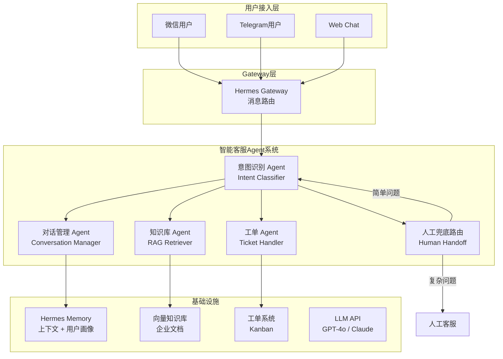

# 智能客服 Agent 系统

> 基于 **Hermes Agent** 构建的企业级智能客服系统实战项目，从零搭建一套可运行的客服 Agent 架构。

## 项目背景

传统客服系统面临人力成本高、响应速度慢、知识更新滞后、服务质量不稳定等痛点。随着大语言模型（LLM）和 Agent 框架的成熟，企业级智能客服已从"关键词匹配+FAQ 问答"进化到"意图理解+知识检索+多轮对话+自主决策"的 Agent 化阶段。

本项目参考 **京东智能客服（JIMI）**、**字节跳动客服机器人**、**银行智能客服 Agent** 等业界实践，基于 Hermes Agent 框架落地一套完整的智能客服系统。

## 一句话描述

**用 Hermes Agent 构建一个能理解意图、检索知识、多轮对话、自动派单、并可无缝转人工的智能客服系统。**

## 核心价值

| 维度 | 说明 |
|------|------|
| 🚀 **7×24 小时** | 全天候自动响应，零等待 |
| 🎯 **精准意图识别** | 基于 LLM 的意图分类，告别关键词死板匹配 |
| 📚 **企业知识库 RAG** | 实时检索最新知识，回答有据可查 |
| 🔄 **多轮对话管理** | 上下文保持，追问澄清，不丢失信息 |
| 🎫 **工单自动流转** | 识别问题类型，自动创建并分配工单 |
| 👤 **人工兜底** | 智能判断何时转人工，满意度兜底策略 |
| 📊 **持续优化** | 满意度评估闭环，持续改进回答质量 |

## 技术栈概览

| 组件 | 技术选型 | 说明 |
|------|----------|------|
| Agent 框架 | **Hermes Agent** | 核心编排引擎 |
| 大语言模型 | GPT-4o / Claude / DeepSeek | 意图识别 + 回答生成 |
| 知识库（RAG） | Hermes Memory + 向量库 | 企业知识检索 |
| 消息通道 | Hermes Gateway（微信 / Telegram） | 用户接入层 |
| 多 Agent 协作 | Hermes Delegation | 客服 / 知识库 / 工单 Agent 协同 |
| 任务管理 | Hermes Kanban | 工单状态跟踪 |
| 持久化 | Hermes Memory | 对话历史 + 用户画像 |

## 架构图



## 目录结构

```
02-智能客服Agent系统/
├── README.md                 # 项目总览（本文件）
├── docs/
│   ├── 01-架构设计.md        # 系统架构与模块说明
│   ├── 02-环境搭建.md        # 环境配置与部署步骤
│   ├── 03-核心流程.md        # 对话流程与多轮管理
│   ├── 04-踩坑记录.md        # 常见问题与解决方案
│   └── 05-扩展思路.md        # 多语言、语音、数据分析等
```

## 快速开始

```bash
# 1. 克隆项目
cd /path/to/project

# 2. 安装 Hermes（如未安装）
pip install hermes-agent

# 3. 创建客服 Agent Profile
hermes profile create customer-service-agent

# 4. 配置 Gateway（以 Telegram 为例）
hermes config set gateway.telegram.token YOUR_BOT_TOKEN

# 5. 启动
hermes run
```

> 详细步骤请参阅 [docs/02-环境搭建.md](02-Knowledge(知识层)/20-核心能力-Core_Ability/00%20AI/01%20AI工具/02%20Agent/04%20Hermes-Agent/项目实战/02-智能客服Agent系统/docs/02-环境搭建.md)

---

*本项目为 Hermes Agent 实战系列之一，更多项目请参考同级目录。*
