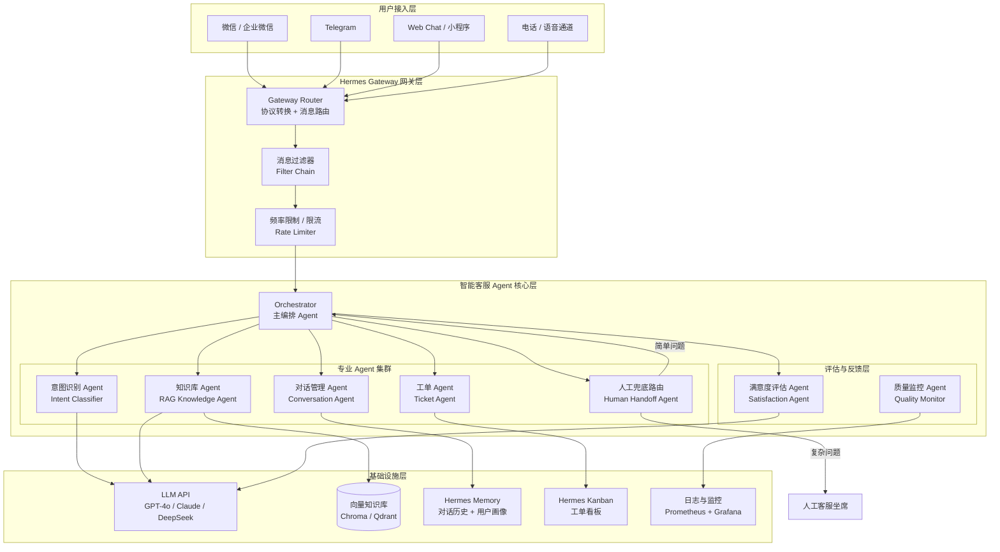
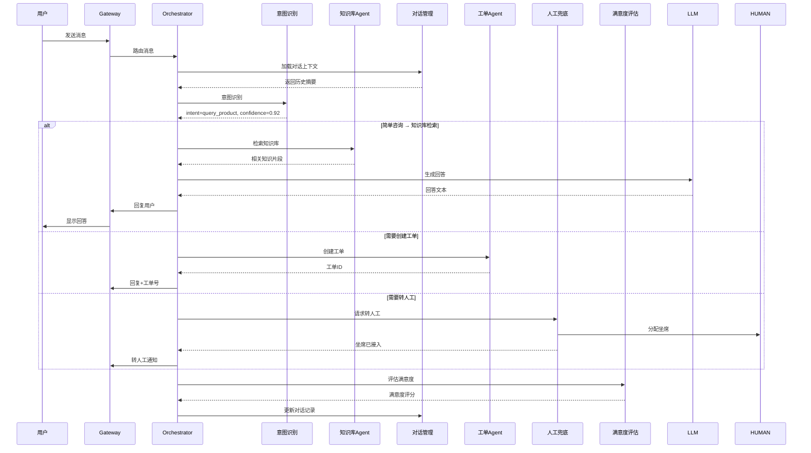

# 系统架构设计

## 一、系统架构图



## 二、核心模块说明

### 2.1 用户接入层（Gateway）

通过 Hermes Gateway 统一接入多端用户消息：

| 通道 | 配置方式 | 适用场景 |
|------|----------|----------|
| 微信 / 企业微信 | `hermes config set gateway.wechat.*` | 国内主流 IM |
| Telegram | `hermes config set gateway.telegram.*` | 海外 / 测试环境 |
| Web Chat | 嵌入式 WebSocket | 官网 / App 内嵌 |
| 语音通道 | Gateway + ASR/TTS | 电话客服（扩展） |

### 2.2 意图识别 Agent（Intent Classifier）

**职责**：接收用户消息，识别用户真实意图，分类路由。

**分类体系示例**：

```yaml
intents:
  - id: query_product
    name: 产品咨询
    examples: ["这个多少钱", "有什么功能", "支持哪些平台"]
    routing: knowledge_agent
    
  - id: order_inquiry
    name: 订单查询
    examples: ["我的订单到哪了", "什么时候发货", "物流信息"]
    routing: ticket_agent
    
  - id: complaint
    name: 投诉建议
    examples: ["我要投诉", "服务太差了", "退款"]
    routing: human_handoff
    
  - id: greeting
    name: 问候寒暄
    examples: ["你好", "在吗", "hello"]
    routing: conversation_agent
```

**实现方式**：使用 Hermes Skill + LLM Prompt 实现动态意图分类，而非静态关键词匹配。

### 2.3 知识库 Agent（RAG Knowledge Agent）

**职责**：从企业知识库中检索与用户问题最相关的知识片段，生成回答。

**检索流程**：

1. 用户问题 → Embedding 向量化
2. 向量相似度检索 Top-K
3. 重排序（Re-rank）提升精度
4. 拼接上下文 → LLM 生成回答
5. 附上知识来源引用

### 2.4 对话管理 Agent（Conversation Agent）

**职责**：维护多轮对话上下文，处理指代消解、追问澄清。

**核心能力**：
- 对话历史压缩与摘要
- 指代消解（"那个"、"它"、"这个"等代词还原）
- 追问策略（信息不足时主动反问）
- 上下文窗口管理（Token 预算控制）

### 2.5 工单 Agent（Ticket Agent）

**职责**：识别需要创建工单的场景，自动生成工单并流转。

**触发条件**：
- 用户明确要求创建工单
- 问题无法在 3 轮对话内解决
- 用户情绪检测为负面
- 涉及退款、投诉等敏感操作

### 2.6 人工兜底路由（Human Handoff Agent）

**职责**：判断是否需要转人工，并完成平滑过渡。

**转人工条件**：
- 用户连续 2 次表示"不满意"
- 意图分类置信度低于阈值（< 0.6）
- 涉及法律、财务等高风险领域
- 用户明确要求"转人工"
- 同一问题重复提问 ≥ 3 次

### 2.7 满意度评估 Agent（Satisfaction Agent）

**职责**：每轮对话结束后评估用户满意度，形成反馈闭环。

**评估维度**：
- 用户显式反馈（👍/👎）
- 对话长度与重复率（隐式信号）
- 情绪分析（正面/中性/负面）
- 转人工率（兜底率）

## 三、消息流转图



## 四、技术选型理由

### 4.1 为什么选 Hermes Agent？

| 需求         | Hermes 能力      | 优势                      |
| ---------- | -------------- | ----------------------- |
| 多 Agent 协作 | **Delegation** | 原生支持 Agent 间任务委派，无需额外编排 |
| 对话上下文      | **Memory**     | 持久化对话历史，支持长期记忆          |
| 多渠道接入      | **Gateway**    | 微信/Telegram/Web 统一接入    |
| 任务流转       | **Kanban**     | 工单状态可视化跟踪               |
| 知识库        | **RAG + 向量库**  | 企业知识即插即用                |
| 技能定制       | **Skills**     | 每个 Agent 可定制专属 Skill    |

### 4.2 模型选型对比

| 模型 | 适用场景 | 成本 | 延迟 |
|------|----------|------|------|
| GPT-4o | 复杂意图识别、投诉处理 | 高 | 中 |
| Claude 3.5 Sonnet | 知识库问答、长上下文 | 中 | 低 |
| DeepSeek V3 | 通用问答、成本敏感场景 | 低 | 低 |
| 本地模型（Qwen2） | 数据安全要求高 | 低（硬件） | 中 |

**推荐组合**：意图识别用 GPT-4o（精度优先），知识库问答用 Claude（长上下文优势），简单问候用 DeepSeek（成本优先）。

### 4.3 向量库选型

| 方案 | 部署方式 | 适合场景 |
|------|----------|----------|
| Chroma | 嵌入式 | 开发测试、中小规模 |
| Qdrant | Docker 部署 | 生产环境、大规模 |
| Milvus | 分布式 | 超大规模（百万级文档） |

**推荐**：起步用 Chroma，生产环境切换 Qdrant。

---

*相关文档：[02-环境搭建.md](02-Knowledge(知识层)/20-核心能力-Core_Ability/00%20AI/01%20AI工具/02%20Agent/04%20Hermes-Agent/项目实战/02-智能客服Agent系统/docs/02-环境搭建.md) | [03-核心流程.md](02-Knowledge(知识层)/20-核心能力-Core_Ability/00%20AI/01%20AI工具/02%20Agent/04%20Hermes-Agent/项目实战/02-智能客服Agent系统/docs/03-核心流程.md)*
