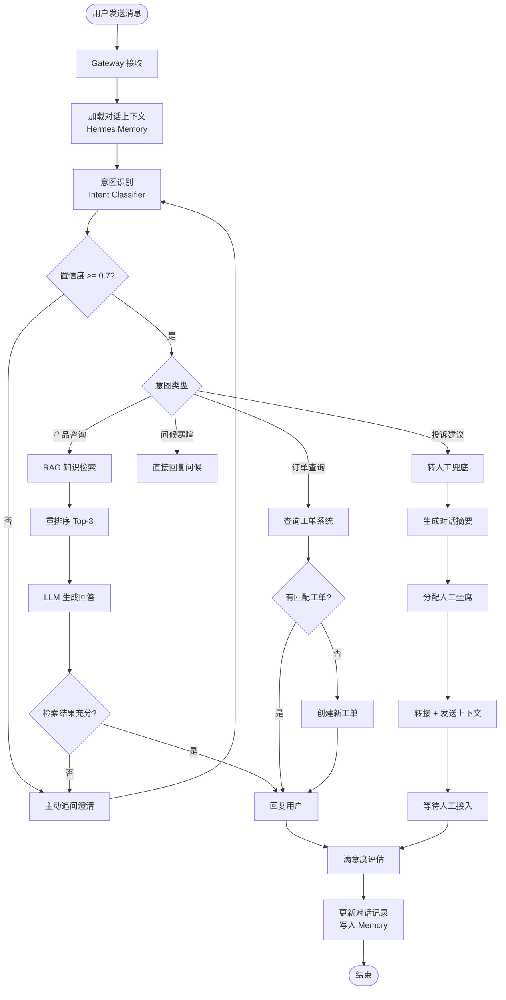
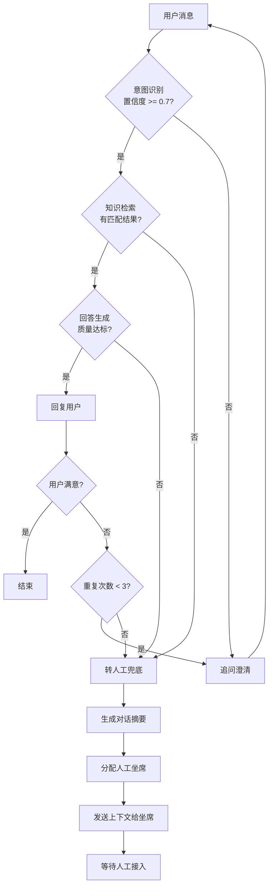

# 核心流程设计

## 一、完整对话流程

### 1.1 流程总览



### 1.2 流程步骤详解

#### Step 1: 消息接收与预处理

用户消息到达后，Gateway 层进行预处理：

```python
# 消息预处理逻辑（伪代码）
def preprocess_message(raw_message: str) -> dict:
    return {
        "text": raw_message.strip(),
        "user_id": extract_user_id(),
        "channel": detect_channel(),        # wechat / telegram / web
        "timestamp": current_timestamp(),
        "session_id": get_or_create_session(),
        "message_type": detect_type(raw_message),  # text / image / voice
    }
```

#### Step 2: 加载对话上下文

```python
def load_context(session_id: str) -> dict:
    # 从 Hermes Memory 加载历史
    history = hermes.memory.get(f"session:{session_id}")
    
    # 加载用户画像
    user_profile = hermes.memory.get(f"user:{user_id}")
    
    return {
        "history": history[-10:],           # 最近 10 轮
        "user_profile": user_profile,
        "current_intent": history.get("intent"),
        "unresolved_issues": history.get("pending_issues", []),
    }
```

#### Step 3: 意图识别

```python
INTENT_PROMPT = """
你是一个智能客服意图分类器。请分析用户消息，返回最匹配的意图。

可用意图：
- query_product: 产品/功能咨询
- order_inquiry: 订单/物流查询
- complaint: 投诉/建议/退款
- greeting: 问候/寒暄
- unknown: 无法确定

用户消息：{message}
对话历史：{history}

请以 JSON 格式返回：
{{"intent": "意图ID", "confidence": 0.0~1.0, "reason": "判断理由"}}
"""
```

#### Step 4: RAG 知识检索

```python
def retrieve_knowledge(query: str, top_k: int = 5) -> list:
    # 1. 向量化
    query_embedding = embedding_model.encode(query)
    
    # 2. 向量检索
    results = vector_store.similarity_search(
        query_embedding, 
        k=top_k,
        score_threshold=0.7
    )
    
    # 3. 重排序
    reranked = reranker.rerank(query, results)
    
    # 4. 返回 Top-3
    return reranked[:3]
```

#### Step 5: 回答生成

```python
ANSWER_PROMPT = """
你是一个专业的产品客服。请基于以下知识回答用户问题。

知识片段：
{knowledge_context}

对话历史：
{history}

用户问题：{question}

要求：
1. 回答简洁准确，200字以内
2. 引用知识来源（标注文档名）
3. 如果知识不足，主动询问澄清
4. 语气友好专业

回答：
"""
```

#### Step 6: 满意度评估

```python
SATISFACTION_PROMPT = """
评估本轮客服对话的用户满意度。

对话记录：
{conversation}

评估维度：
1. 用户是否明确表达满意/不满意
2. 问题是否得到解决
3. 对话轮数是否合理
4. 用户情绪变化

返回 JSON：
{{"score": 1-5, "need_human": true/false, "reason": "评估理由"}}
"""
```

## 二、多轮对话管理

### 2.1 上下文结构

```python
# 对话上下文数据结构
conversation_context = {
    "session_id": "sess_20241201_abc123",
    "user_id": "user_001",
    "current_intent": "query_product",
    "turn_count": 5,
    "history": [
        {
            "role": "user",
            "content": "你们的产品支持哪些平台？",
            "timestamp": "..."
        },
        {
            "role": "assistant",
            "content": "我们支持 Windows、macOS 和 Linux 平台。",
            "intent": "query_product",
            "sources": ["产品手册.md"]
        },
        {
            "role": "user",
            "content": "那价格是多少？",  # 指代消解："那"→"产品"
            "timestamp": "..."
        }
    ],
    "pending_info": ["用户还未提供联系方式"],
    "entities": {
        "product": "Hermes Agent",
        "platform": ["Windows", "macOS", "Linux"]
    }
}
```

### 2.2 指代消解策略

```python
RESOLUTION_PROMPT = """
分析对话历史，将用户最新消息中的代词替换为具体指代对象。

对话历史：
{history}

最新消息：{message}

请返回指代消解后的完整问题。
示例：
- "那价格是多少？" → "Hermes Agent 的价格是多少？"
- "它支持中文吗？" → "Hermes Agent 支持中文吗？"
"""
```

### 2.3 追问策略

当信息不足时，主动追问：

| 场景 | 追问方式 | 示例 |
|------|----------|------|
| 产品不明确 | 列出可选产品 | "您指的是 A 产品还是 B 产品？" |
| 问题模糊 | 引导具体化 | "能详细描述一下您遇到的问题吗？" |
| 需要补充信息 | 明确所需信息 | "为了查询订单，请提供您的订单号。" |
| 多选一 | 给出选项 | "您是想了解价格、功能还是售后？" |

### 2.4 上下文窗口管理

```python
def manage_context_window(context: dict, max_tokens: int = 4000) -> dict:
    """管理 Token 预算，防止超出上下文窗口"""
    
    # 1. 保留最近的 N 轮完整对话
    recent = context["history"][-5:]  # 最近 5 轮
    
    # 2. 对早期对话进行摘要压缩
    if len(context["history"]) > 5:
        early_summary = summarize_early_history(context["history"][:-5])
        context["compressed_history"] = early_summary
    
    # 3. 保留关键实体和未解决问题
    context["history"] = recent
    context["history"].insert(0, {
        "role": "system",
        "content": f"[早期对话摘要]: {early_summary}"
    })
    
    return context
```

## 三、上下文保持策略

### 3.1 短期记忆（会话内）

| 策略 | 实现方式 | 有效期 |
|------|----------|--------|
| 完整对话历史 | Hermes Memory 缓存 | 当前会话 |
| 实体提取 | 每次消息后更新 entities | 当前会话 |
| 意图追踪 | 记录意图变化路径 | 当前会话 |
| 未完成事项 | pending_issues 列表 | 当前会话 |

### 3.2 长期记忆（跨会话）

```python
# 写入长期记忆
def save_long_term_memory(user_id: str, context: dict):
    hermes.memory.set(
        key=f"user:{user_id}:profile",
        value={
            "frequent_intents": analyze_frequent_intents(user_id),
            "known_issues": context.get("unresolved_issues", []),
            "preferences": extract_preferences(context["history"]),
            "satisfaction_trend": get_satisfaction_trend(user_id),
        },
        ttl=None  # 永不过期
    )

# 跨会话恢复
def restore_cross_session_context(user_id: str) -> dict:
    profile = hermes.memory.get(f"user:{user_id}:profile")
    if profile:
        return {
            "welcome_back": True,
            "last_visit": profile.get("last_visit"),
            "pending_issues": profile.get("known_issues", []),
        }
    return {"welcome_back": False}
```

### 3.3 对话摘要压缩

```python
SUMMARY_PROMPT = """
请将以下客服对话压缩为摘要，保留关键信息。

对话：
{conversation}

摘要需包含：
1. 用户的核心问题
2. 已给出的回答/解决方案
3. 未解决的问题
4. 用户情绪状态
5. 关键实体（订单号、产品名等）

摘要（100字以内）：
"""
```

## 四、兜底策略

### 4.1 兜底决策树



### 4.2 兜底触发条件矩阵

| 触发条件 | 阈值 | 动作 | 优先级 |
|----------|------|------|--------|
| 意图置信度低 | < 0.6 | 转人工 | P0 |
| 知识检索无结果 | 0 条匹配 | 转人工 | P0 |
| 用户明确要求转人工 | — | 立即转接 | P0 |
| 同一问题重复 ≥ 3 次 | 3 | 转人工 | P1 |
| 用户情绪为愤怒 | 情绪分 < -0.5 | 转人工 + 优先分配 | P0 |
| 连续 2 次不满意 | 2 | 转人工 | P1 |
| 涉及敏感领域 | 法律/财务/医疗 | 转人工 | P0 |
| 对话超过 10 轮未解决 | 10 | 转人工 | P2 |

### 4.3 转人工上下文传递

```python
def prepare_human_handoff(session_context: dict) -> dict:
    """准备转人工时传递给坐席的上下文"""
    return {
        "user_id": session_context["user_id"],
        "user_name": session_context.get("user_name", "匿名用户"),
        "channel": session_context["channel"],
        "conversation_summary": generate_summary(session_context["history"]),
        "full_history": session_context["history"],
        "intent_history": session_context.get("intent_history", []),
        "attempted_solutions": [
            msg["content"] 
            for msg in session_context["history"] 
            if msg["role"] == "assistant"
        ],
        "user_sentiment": analyze_sentiment(session_context["history"]),
        "pending_issues": session_context.get("pending_issues", []),
        "urgency": determine_urgency(session_context),
        "suggested_action": suggest_next_action(session_context),
    }
```

### 4.4 降级策略

当系统部分组件不可用时，执行降级：

| 故障组件 | 降级行为 |
|----------|----------|
| LLM API 不可用 | 切换到备用模型 Provider |
| 向量库不可用 | 使用关键词搜索降级 |
| Memory 不可用 | 仅维持本轮对话上下文 |
| Gateway 部分通道故障 | 其他通道继续服务 |
| 所有模型不可用 | 全部流量转人工 |

```python
# 降级配置示例
fallback_config = {
    "llm_fallback": {
        "primary": "gpt-4o",
        "secondary": "deepseek-v3",
        "tertiary": "claude-3-haiku",
        "emergency": "human_only"  # 全部转人工
    },
    "knowledge_fallback": {
        "primary": "vector_search",
        "secondary": "keyword_search",
        "tertiary": "llm_direct_answer"
    }
}
```

---

*相关文档：[01-架构设计.md](02-Knowledge(知识层)/20-核心能力-Core_Ability/00%20AI/01%20AI工具/02%20Agent/04%20Hermes-Agent/项目实战/02-智能客服Agent系统/docs/01-架构设计.md) | [04-踩坑记录.md](02-Knowledge(知识层)/20-核心能力-Core_Ability/00%20AI/01%20AI工具/02%20Agent/04%20Hermes-Agent/项目实战/02-智能客服Agent系统/docs/04-踩坑记录.md)*
