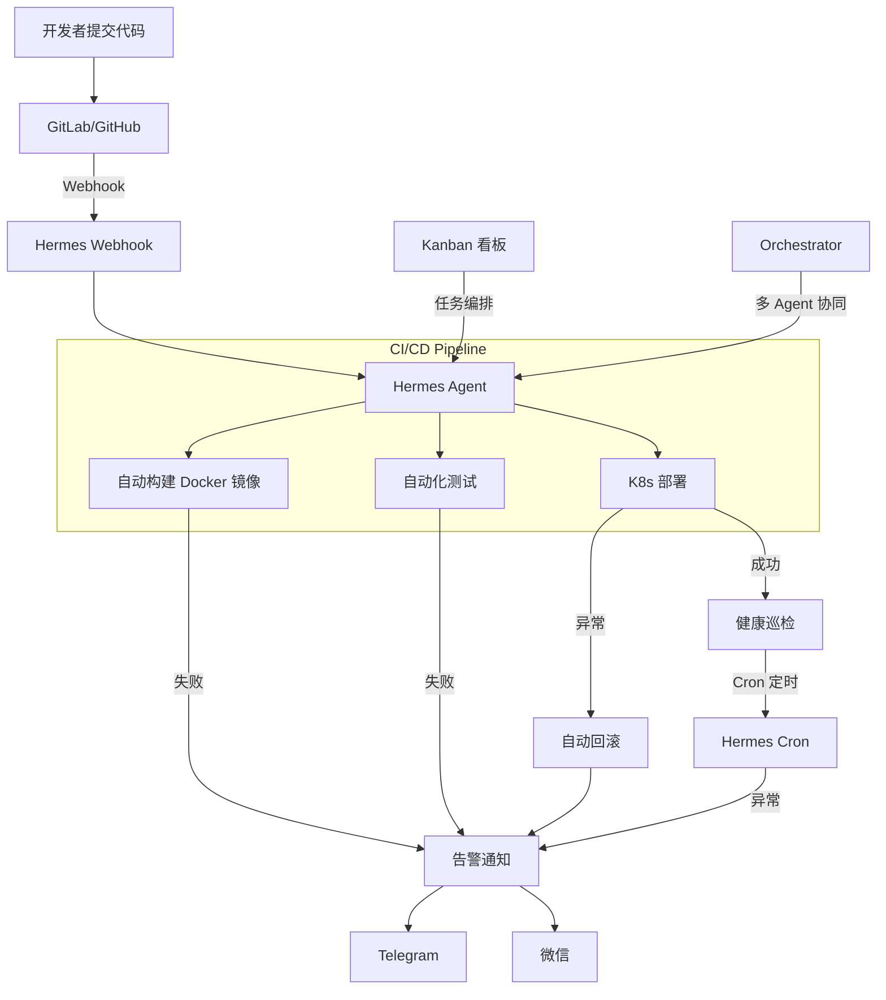

# CI/CD 自动化运维 Agent

> 基于 **Hermes Agent** 构建的智能 CI/CD 运维助手，实现从代码提交到生产部署的全链路自动化。

## 📋 项目概览

本项目利用 Hermes Agent 的 **Cron 调度**、**Webhook 触发**、**Gateway 多平台通知**、**Kanban 任务编排** 等核心能力，搭建一套企业级的 CI/CD 自动化运维系统。

### 核心场景

```
代码提交 → 自动构建 → 自动化测试 → 灰度部署 → 异常回滚 → 告警通知
```

### 技术栈

| 组件 | 技术选型 |
|------|----------|
| Agent 框架 | Hermes Agent |
| 代码仓库 | GitLab / GitHub |
| 容器化 | Docker |
| 编排平台 | Kubernetes |
| 自动化脚本 | Shell / Python |
| 通知渠道 | Telegram / 微信 (Hermes Gateway) |
| 任务调度 | Hermes Cron / No-Agent Cron |
| 事件驱动 | Hermes Webhook |
| 任务编排 | Hermes Kanban + Orchestrator |

### 参考案例

- **网易智企 Agent 工厂** — 多 Agent 协作的 DevOps 流水线
- **K8s 运维自动化** — 基于 Kubernetes 的弹性部署与自愈体系

---

## 📁 文档结构

```
.
├── README.md                 # 项目总览（本文档）
├── docs/
│   ├── 01-架构设计.md         # 系统架构与核心模块
│   ├── 02-环境搭建.md         # 前置依赖与配置步骤
│   ├── 03-核心流程.md         # CI/CD 全流程详解
│   ├── 04-踩坑记录.md         # 常见问题与解决方案
│   └── 05-扩展思路.md         # 进阶扩展方向
├── configs/                  # 配置文件目录
├── scripts/                  # 自动化脚本目录
└── references/               # 参考资料
```

---

## 🚀 快速开始

```bash
# 1. 确保 Hermes Agent 已安装
hermes doctor

# 2. 配置 GitLab/GitHub Webhook
hermes webhook subscribe gitlab-push

# 3. 创建定时健康检查任务
hermes cron create "*/5 * * * *" \
  --prompt "检查所有 K8s 服务健康状态" \
  --channel telegram

# 4. 启动 Gateway（接收告警通知）
hermes gateway start
```

---

## 🧩 核心功能

| 功能 | 说明 | 依赖 |
|------|------|------|
| Webhook 监听 | 接收 Git 仓库推送事件，触发自动流水线 | Hermes Webhook |
| 自动构建 | 代码提交后自动执行 Docker 构建 | Terminal + Shell |
| 自动化测试 | 运行单元测试、集成测试、安全扫描 | Terminal |
| K8s 部署 | 滚动更新、灰度发布、自动回滚 | Terminal + Kubectl |
| 健康巡检 | 定时检查服务状态，自动修复异常 | Hermes Cron |
| 异常告警 | 构建失败/部署异常时多渠道通知 | Hermes Gateway |
| 任务编排 | 多 Agent 协同完成复杂运维流程 | Kanban + Orchestrator |

---

## 📊 架构简图



---

## 📝 使用场景示例

### 场景一：代码提交自动部署

```bash
# 开发者推送代码到 main 分支
# Hermes Webhook 自动触发 Agent 会话
# Agent 执行：git pull → docker build → test → kubectl apply
```

### 场景二：定时健康巡检

```bash
# 每 5 分钟检查一次生产环境
hermes cron create "*/5 * * * *" \
  --prompt "检查 K8s 集群所有 Pod 状态，如有异常自动修复并通知" \
  --channel telegram
```

### 场景三：异常自动回滚

```bash
# 部署监控到错误率上升
# Agent 自动执行 kubectl rollout undo
# 通过 Gateway 发送回滚通知
```

---

## 🔗 相关资源

- [Hermes Agent 官方文档](https://hermes-agent.nousresearch.com/docs/)
- [Hermes Cron 调度指南](https://hermes-agent.nousresearch.com/docs/user-guide/features/cron)
- [Hermes Webhook 配置](https://hermes-agent.nousresearch.com/docs/user-guide/features/webhooks)
- [Hermes Gateway 消息平台](https://hermes-agent.nousresearch.com/docs/user-guide/messaging/)
- [Hermes Kanban 任务编排](https://hermes-agent.nousresearch.com/docs/user-guide/features/kanban)
