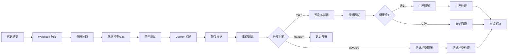
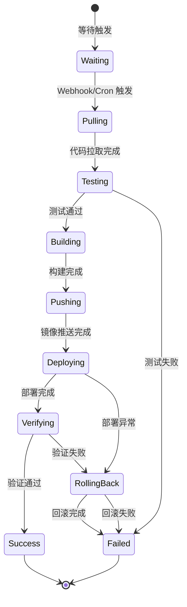

# CI/CD 核心流程详解

## 一、全流程总览



---

## 二、阶段一：事件触发

### 2.1 GitLab Webhook 事件

当开发者推送代码时，GitLab 向 Hermes Webhook 发送 POST 请求：

```json
{
  "object_kind": "push",
  "ref": "refs/heads/main",
  "user_username": "developer",
  "project": {
    "path_with_namespace": "myteam/myapp",
    "default_branch": "main"
  },
  "commits": [
    {
      "id": "abc123def456",
      "message": "feat: add user login API",
      "timestamp": "2026-07-07T10:00:00Z"
    }
  ]
}
```

### 2.2 Hermes Webhook 处理

```bash
# 创建 Webhook 路由
hermes webhook subscribe gitlab-push

# 路由配置（自动生成），Agent 收到事件后执行以下流程
```

Agent 收到事件后，解析 JSON 负载，提取以下关键信息：
- 仓库名 (`myteam/myapp`)
- 分支 (`refs/heads/main`)
- 提交信息
- 提交者

---

## 三、阶段二：代码拉取与检查

### 3.1 Agent 执行脚本

```bash
#!/bin/bash
# scripts/pull-and-check.sh

REPO_URL=$1
BRANCH=$2
WORK_DIR="/tmp/cicd-workspace/$BRANCH"

echo "=== 拉取代码 ==="
if [ -d "$WORK_DIR" ]; then
  cd "$WORK_DIR"
  git fetch origin
  git checkout "$BRANCH"
  git pull origin "$BRANCH"
else
  git clone --depth 1 --branch "$BRANCH" "$REPO_URL" "$WORK_DIR"
  cd "$WORK_DIR"
fi

echo "=== 代码检查 ==="
# 运行 linter
npm run lint || exit 1

# 检查安全漏洞
npm audit --production || true  # 不阻断，仅报告

echo "=== 检查完成 ==="
```

### 3.2 Hermes Agent 执行

Agent 通过 Terminal 工具调用脚本：

```bash
# Agent 内部执行的命令
bash /opt/cicd-agent/scripts/pull-and-check.sh \
  "https://gitlab.example.com/myteam/myapp.git" \
  "main"
```

---

## 四、阶段三：自动化测试

### 4.1 测试执行

```bash
#!/bin/bash
# scripts/run-tests.sh

echo "=== 运行单元测试 ==="
npm test -- --coverage

echo "=== 运行集成测试 ==="
npm run test:integration

echo "=== 运行安全扫描 ==="
npm run security-scan

echo "=== 测试完成 ==="
```

### 4.2 测试结果处理

Agent 解析测试输出，判断是否继续流水线：

```bash
# Agent 内部逻辑（伪代码）
if test_exit_code -eq 0; then
  send_notification "✅ 测试通过，继续部署"
  proceed_to_deploy()
else
  send_notification "❌ 测试失败，阻断流水线"
  log_failure_details()
  exit 1
fi
```

---

## 五、阶段四：Docker 构建与推送

### 5.1 Dockerfile 示例

```dockerfile
# Dockerfile
FROM node:20-alpine AS builder
WORKDIR /app
COPY package*.json ./
RUN npm ci
COPY . .
RUN npm run build

FROM node:20-alpine AS runner
WORKDIR /app
COPY --from=builder /app/dist ./dist
COPY --from=builder /app/node_modules ./node_modules
COPY --from=builder /app/package.json ./
EXPOSE 3000
CMD ["node", "dist/index.js"]
```

### 5.2 构建脚本

```bash
#!/bin/bash
# scripts/build-and-push.sh

APP_NAME=$1
VERSION=$2
REGISTRY=${3:-"registry.example.com"}
DOCKERFILE=${4:-"Dockerfile"}

echo "=== 构建 Docker 镜像 ==="
docker build -f "$DOCKERFILE" \
  -t "${REGISTRY}/${APP_NAME}:${VERSION}" \
  -t "${REGISTRY}/${APP_NAME}:latest" \
  .

echo "=== 推送镜像 ==="
docker push "${REGISTRY}/${APP_NAME}:${VERSION}"
docker push "${REGISTRY}/${APP_NAME}:latest"

echo "=== 镜像信息 ==="
echo "镜像: ${REGISTRY}/${APP_NAME}:${VERSION}"
echo "大小: $(docker images ${REGISTRY}/${APP_NAME}:${VERSION} --format '{{.Size}}')"
```

### 5.3 版本号策略

| 分支模式 | 版本号格式 | 示例 |
|----------|-----------|------|
| main | `v{major}.{minor}.{patch}` | `v1.2.3` |
| develop | `{branch}-{commit_sha:7}` | `develop-a1b2c3d` |
| feature/* | `{branch}-{commit_sha:7}` | `feature-login-e4f5g6h` |
| tag | 直接使用 tag 名 | `v2.0.0-rc1` |

---

## 六、阶段五：Kubernetes 部署

### 6.1 部署配置

```yaml
# configs/k8s-deployment.yaml
apiVersion: apps/v1
kind: Deployment
metadata:
  name: myapp
  namespace: production
  labels:
    app: myapp
spec:
  replicas: 3
  strategy:
    type: RollingUpdate
    rollingUpdate:
      maxSurge: 1
      maxUnavailable: 0  # 零停机部署
  selector:
    matchLabels:
      app: myapp
  template:
    metadata:
      labels:
        app: myapp
    spec:
      containers:
        - name: myapp
          image: registry.example.com/myapp:latest
          ports:
            - containerPort: 3000
          livenessProbe:
            httpGet:
              path: /health
              port: 3000
            initialDelaySeconds: 10
            periodSeconds: 10
          readinessProbe:
            httpGet:
              path: /ready
              port: 3000
            initialDelaySeconds: 5
            periodSeconds: 5
          resources:
            requests:
              cpu: "100m"
              memory: "128Mi"
            limits:
              cpu: "500m"
              memory: "512Mi"
```

### 6.2 部署脚本

```bash
#!/bin/bash
# scripts/deploy.sh

APP_NAME=$1
VERSION=$2
NAMESPACE=${3:-production}
REGISTRY=${4:-"registry.example.com"}

IMAGE="${REGISTRY}/${APP_NAME}:${VERSION}"

echo "=== 开始部署 ${APP_NAME}:${VERSION} 到 ${NAMESPACE} ==="

# 更新镜像
kubectl set image deployment/${APP_NAME} \
  ${APP_NAME}=${IMAGE} \
  -n ${NAMESPACE} \
  --record

# 监控部署状态
echo "=== 监控部署进度 ==="
kubectl rollout status deployment/${APP_NAME} \
  -n ${NAMESPACE} \
  --timeout=300s

# 获取部署结果
ROLLOUT_RESULT=$?

if [ $ROLLOUT_RESULT -eq 0 ]; then
  echo "✅ 部署成功！"
  echo "新版本 Pod:"
  kubectl get pods -n ${NAMESPACE} -l app=${APP_NAME}
else
  echo "❌ 部署超时或失败"
  echo "异常 Pod 状态:"
  kubectl get pods -n ${NAMESPACE} -l app=${APP_NAME}
  exit 1
fi
```

### 6.3 灰度发布策略

```bash
#!/bin/bash
# scripts/canary-deploy.sh

APP_NAME=$1
VERSION=$2
NAMESPACE=${3:-production}
CANARY_REPLICAS=${4:-1}

echo "=== 灰度发布: ${APP_NAME}:${VERSION} ==="

# 创建金丝雀 Deployment
kubectl set image deployment/${APP_NAME}-canary \
  ${APP_NAME}=${REGISTRY}/${APP_NAME}:${VERSION} \
  -n ${NAMESPACE}

# 等待金丝雀就绪
kubectl rollout status deployment/${APP_NAME}-canary \
  -n ${NAMESPACE} --timeout=120s

# 检查金丝雀健康
CANARY_PODS=$(kubectl get pods -n ${NAMESPACE} \
  -l app=${APP_NAME},track=canary \
  -o jsonpath='{.items[*].status.conditions[?(@.type=="Ready")].status}')

if [[ "$CANARY_PODS" == *"True"* ]]; then
  echo "✅ 金丝雀版本健康，开始全量发布"
  # 更新主 Deployment
  kubectl set image deployment/${APP_NAME} \
    ${APP_NAME}=${REGISTRY}/${APP_NAME}:${VERSION} \
    -n ${NAMESPACE}
  kubectl rollout status deployment/${APP_NAME} \
    -n ${NAMESPACE} --timeout=300s
else
  echo "❌ 金丝雀版本异常，中止发布"
  exit 1
fi
```

---

## 七、阶段六：健康检查与验证

### 7.1 部署后验证

```bash
#!/bin/bash
# scripts/verify-deploy.sh

APP_NAME=$1
NAMESPACE=${2:-production}
EXPECTED_REPLICAS=${3:-3}
TIMEOUT=${4:-60}

echo "=== 部署验证 ==="

# 1. 检查 Pod 数量
echo "检查 Pod 数量..."
CURRENT_REPLICAS=$(kubectl get pods -n ${NAMESPACE} \
  -l app=${APP_NAME} \
  --field-selector=status.phase=Running \
  --no-headers | wc -l)

if [ "$CURRENT_REPLICAS" -lt "$EXPECTED_REPLICAS" ]; then
  echo "❌ Pod 数量不足: ${CURRENT_REPLICAS}/${EXPECTED_REPLICAS}"
  exit 1
fi

# 2. 检查 HTTP 健康端点
echo "检查 HTTP 健康端点..."
ENDPOINT=$(kubectl get svc -n ${NAMESPACE} ${APP_NAME} \
  -o jsonpath='{.status.loadBalancer.ingress[0].ip}')

for i in $(seq 1 $TIMEOUT); do
  if curl -sf "http://${ENDPOINT}/health" > /dev/null 2>&1; then
    echo "✅ 健康检查通过"
    break
  fi
  sleep 1
done

# 3. 检查错误率
echo "检查错误率..."
ERROR_RATE=$(kubectl logs -n ${NAMESPACE} \
  -l app=${APP_NAME} --tail=100 | grep -c "ERROR" || true)
echo "最近 100 条日志中错误数: ${ERROR_RATE}"

echo "=== 验证完成 ==="
```

### 7.2 Cron 定时健康巡检

```bash
# 创建定时巡检任务
hermes cron create "*/5 * * * *" \
  --prompt "执行生产环境健康巡检：
1. 检查所有 Deployment 的可用副本数是否达到预期
2. 检查 Node 资源使用率（CPU > 80% 或 Memory > 85% 视为异常）
3. 检查最近 5 分钟的 Pod 重启次数
4. 检查关键 Service 的 Endpoint 是否正常
5. 如有异常，自动执行修复脚本并发送告警通知" \
  --channel telegram \
  --skills "cicd-ops"
```

---

## 八、阶段七：异常回滚

### 8.1 自动回滚触发条件

| 条件 | 检测方式 | 动作 |
|------|----------|------|
| 部署超时 | `rollout status` 超时 | 自动回滚到上一版本 |
| 健康检查失败 | HTTP 探针连续失败 | 自动回滚 |
| 错误率飙升 | 日志中 ERROR 激增 | 自动回滚 + 告警 |
| Pod 频繁重启 | `restartCount > 5` | 自动回滚 + 告警 |

### 8.2 回滚脚本

```bash
#!/bin/bash
# scripts/auto-rollback.sh

APP_NAME=$1
NAMESPACE=${2:-production}

echo "=== 自动回滚 ==="

# 获取当前和历史版本
echo "部署历史:"
kubectl rollout history deployment/${APP_NAME} -n ${NAMESPACE}

# 获取上一版本号
PREVIOUS_REVISION=$(kubectl rollout history deployment/${APP_NAME} \
  -n ${NAMESPACE} | tail -2 | head -1 | awk '{print $1}')

echo "回滚至 revision: ${PREVIOUS_REVISION}"

# 执行回滚
kubectl rollout undo deployment/${APP_NAME} \
  -n ${NAMESPACE} \
  --to-revision=${PREVIOUS_REVISION}

# 等待回滚完成
if kubectl rollout status deployment/${APP_NAME} \
  -n ${NAMESPACE} --timeout=300s; then
  echo "✅ 回滚成功至 revision ${PREVIOUS_REVISION}"
  exit 0
else
  echo "❌ 回滚失败，需要人工介入"
  exit 1
fi
```

---

## 九、阶段八：告警通知

### 9.1 Agent 通知逻辑

Agent 在流水线各关键节点发送通知：

```bash
# Agent 内部发送通知（通过 Gateway）
hermes chat -q "
发送部署通知到 Telegram：
📦 *部署报告*

项目: myteam/myapp
版本: v1.2.3
环境: production
分支: main
提交: abc123d - feat: add user login API

| 阶段 | 状态 | 耗时 |
|------|------|------|
| 代码检查 | ✅ | 12s |
| 单元测试 | ✅ | 45s |
| Docker 构建 | ✅ | 120s |
| 部署 | ✅ | 30s |
| 健康检查 | ✅ | 5s |

总耗时: 212s
部署者: developer
" --channel telegram
```

### 9.2 通知模板

```yaml
# configs/notification-templates.yaml
notifications:
  pipeline_start:
    channel: telegram
    template: |
      🔄 *流水线启动*
      项目: {{.project}}
      分支: {{.branch}}
      提交: {{.commit_message}}
      触发者: {{.author}}
      开始时间: {{.start_time}}

  pipeline_success:
    channel: telegram
    template: |
      ✅ *流水线完成*
      项目: {{.project}}
      版本: {{.version}}
      环境: {{.environment}}
      总耗时: {{.duration}}
      
      各阶段状态:
      {{range .stages}}
      - {{.name}}: {{.status}} ({{.duration}})
      {{end}}

  pipeline_failed:
    channel: telegram
    template: |
      ❌ *流水线失败*
      项目: {{.project}}
      分支: {{.branch}}
      失败阶段: {{.failed_stage}}
      错误信息: {{.error_message}}
      日志链接: {{.log_url}}
      
      请及时处理！

  rollback_notice:
    channel: telegram
    template: |
      ⚠️ *自动回滚通知*
      服务: {{.service}}
      环境: {{.environment}}
      原因: {{.reason}}
      回滚至: revision {{.revision}}
      回滚时间: {{.timestamp}}
      状态: {{.status}}
```

---

## 十、完整流水线脚本

### 10.1 主控脚本

```bash
#!/bin/bash
# scripts/cicd-pipeline.sh
# CI/CD 全流程主控脚本

set -e

APP_NAME=$1
VERSION=$2
BRANCH=$3
NAMESPACE=${4:-production}
REGISTRY=${5:-"registry.example.com"}

echo "=========================================="
echo " CI/CD Pipeline - ${APP_NAME}:${VERSION}"
echo " 分支: ${BRANCH}"
echo "=========================================="

START_TIME=$(date +%s)

# 阶段 1: 代码拉取
echo "[1/7] 拉取代码..."
bash scripts/pull-and-check.sh "https://gitlab.example.com/${APP_NAME}.git" "${BRANCH}"

# 阶段 2: 运行测试
echo "[2/7] 运行测试..."
bash scripts/run-tests.sh

# 阶段 3: Docker 构建
echo "[3/7] 构建 Docker 镜像..."
bash scripts/build-and-push.sh "${APP_NAME}" "${VERSION}" "${REGISTRY}"

# 阶段 4: 部署
echo "[4/7] 部署到 K8s..."
bash scripts/deploy.sh "${APP_NAME}" "${VERSION}" "${NAMESPACE}" "${REGISTRY}"

# 阶段 5: 验证
echo "[5/7] 验证部署..."
bash scripts/verify-deploy.sh "${APP_NAME}" "${NAMESPACE}"

# 阶段 6: 健康检查
echo "[6/7] 健康检查..."
# 内置在 verify-deploy.sh 中

# 阶段 7: 通知
echo "[7/7] 发送通知..."
# Agent 通过 Gateway 发送

END_TIME=$(date +%s)
DURATION=$((END_TIME - START_TIME))
echo "=========================================="
echo " ✅ 流水线完成，总耗时: ${DURATION}s"
echo "=========================================="
```

### 10.2 Agent 调用主控脚本

```bash
# Hermes Agent 收到 Webhook 后执行的指令
bash /opt/cicd-agent/scripts/cicd-pipeline.sh \
  myapp v1.2.3 main production
```

---

## 十一、流程状态机


