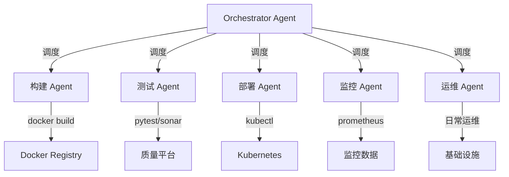
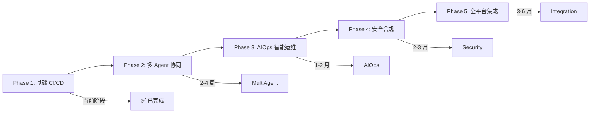

# 扩展思路

> 本文档探讨在基础 CI/CD 自动化运维之上，如何进一步扩展 Hermes Agent 的能力边界。

---

## 一、多 Agent 协同架构

### 1.1 专业 Agent 分工

将单一 Agent 拆分为多个专业 Agent，各司其职：



| Agent 角色 | 职责 | 工具集 |
|------------|------|--------|
| **Orchestrator** | 任务分解、进度跟踪、结果汇总 | Kanban、delegate_task |
| **Build Agent** | 代码拉取、Docker 构建、镜像推送 | Terminal、Docker |
| **Test Agent** | 单元测试、集成测试、安全扫描 | Terminal、Web |
| **Deploy Agent** | K8s 部署、灰度发布、回滚 | Terminal、Kubectl |
| **Monitor Agent** | 健康巡检、指标采集、异常检测 | Terminal、Cron |
| **Ops Agent** | 日志清理、证书续期、备份恢复 | Terminal、Cron |

### 1.2 使用 Kanban 编排

```bash
# 创建 Kanban 看板
hermes kanban init cicd-pipeline

# 创建任务卡片
hermes kanban create "构建 myapp v1.2.3" \
  --assignee build-agent \
  --label build

hermes kanban create "运行测试套件" \
  --assignee test-agent \
  --label test \
  --depends-on <build-task-id>

hermes kanban create "部署到预发布环境" \
  --assignee deploy-agent \
  --label deploy \
  --depends-on <test-task-id>

# 查看看板
hermes kanban list --status pending
```

### 1.3 使用 Orchestrator 编排

```bash
# 通过 Orchestrator 编排多 Agent 任务
hermes chat -q "
使用 Orchestrator 模式执行以下任务：
1. 构建 Agent：构建 myapp 最新代码并推送镜像
2. 测试 Agent：运行完整测试套件
3. 部署 Agent：部署到测试环境
4. 监控 Agent：验证部署后服务健康
汇总各阶段结果后发送报告到 Telegram
"
```

---

## 二、智能运维 (AIOps)

### 2.1 异常预测与自愈

利用 Hermes Agent 的推理能力，实现智能异常检测和自动修复：

```bash
# 创建智能巡检 Cron 任务
hermes cron create "*/10 * * * *" \
  --prompt "执行智能运维巡检：

1. 采集当前集群指标（Pod 状态、Node 资源、API 响应时间）
2. 与过去 24 小时基线数据对比
3. 识别异常模式：
   - 响应时间突增 > 50%
   - 错误率 > 1%
   - Pod 重启频率异常
4. 根据异常类型执行修复策略：
   - 资源不足 → 扩容
   - 进程挂起 → 重启 Pod
   - 配置错误 → 回滚配置
5. 生成巡检报告并发送到 Telegram" \
  --channel telegram \
  --skills "cicd-ops,aiops"
```

### 2.2 根因分析

当部署失败时，Agent 自动进行根因分析：

```bash
# Agent 根因分析流程（伪代码）
def root_cause_analysis():
    # 1. 收集现场信息
    pod_logs = kubectl_logs(deployment, tail=200)
    k8s_events = kubectl_get_events(namespace, sort_by='lastTimestamp')
    app_metrics = prometheus_query('error_rate{service="myapp"}')
    
    # 2. 关联分析
    if 'OOMKilled' in pod_logs:
        return '内存不足，建议增加 memory limits'
    elif 'ImagePullBackOff' in k8s_events:
        return '镜像拉取失败，检查 Registry 权限'
    elif error_rate > threshold:
        return '应用层错误率飙升，检查最近代码变更'
    else:
        return '未识别异常模式，需人工介入'
```

### 2.3 容量规划建议

Agent 根据历史数据提供容量规划建议：

```bash
# 分析过去 30 天的资源使用趋势
hermes cron create "0 9 * * 1" \
  --prompt "分析过去 30 天的集群资源使用数据：
1. 统计各 Namespace 的 CPU/Memory 平均使用率和峰值
2. 识别资源瓶颈（接近 limits 的服务）
3. 分析流量增长趋势
4. 给出容量规划建议：
   - 需要扩容的服务及建议副本数
   - 需要调整的资源 limits
   - 预计未来 3 个月资源需求
5. 生成容量规划报告" \
  --channel telegram
```

---

## 三、安全合规扩展

### 3.1 镜像安全扫描

在构建流水线中集成安全扫描：

```bash
#!/bin/bash
# scripts/security-scan.sh

IMAGE=$1

echo "=== 镜像安全扫描 ==="

# 使用 Trivy 扫描漏洞
trivy image --severity HIGH,CRITICAL --exit-code 1 "$IMAGE"

# 使用 Dockle 检查 Dockerfile 最佳实践
dockle --exit-code 1 "$IMAGE"

# 检查敏感信息
docker run --rm "$IMAGE" sh -c "grep -r 'password\|secret\|token' /app --include='*.env' 2>/dev/null" || true

echo "=== 安全扫描完成 ==="
```

### 3.2 合规审计

记录所有 Agent 操作，满足合规审计要求：

```bash
# 配置操作审计
hermes config set security.audit.enabled true
hermes config set security.audit.log_path "/var/log/hermes-audit.log"

# 审计日志示例
# 2026-07-07T10:00:00Z | deploy | myapp:v1.2.3 | production | developer | success
# 2026-07-07T10:05:00Z | rollback | myapp:v1.2.3 | production | auto | triggered_by:health_check_failed
```

### 3.3 密钥轮换

```bash
# 创建密钥轮换 Cron 任务
hermes cron create "0 0 1 * *" \
  --prompt "执行密钥轮换：
1. 生成新的 Docker Registry 访问令牌
2. 更新 K8s imagePullSecret
3. 更新 Hermes .env 配置
4. 验证新凭证可用
5. 记录轮换日志" \
  --channel telegram
```

---

## 四、GitOps 集成

### 4.1 声明式部署

将 K8s 资源配置存储在 Git 仓库中，Agent 监控配置变更并自动同步：

```bash
# 创建 GitOps 同步 Cron 任务
hermes cron create "*/2 * * * *" \
  --prompt "执行 GitOps 同步：
1. 拉取 gitops 仓库最新代码
2. 对比当前集群状态与期望状态
3. 识别差异（drift detection）
4. 自动同步漂移配置
5. 记录变更日志" \
  --channel telegram
```

### 4.2 配置漂移检测

```bash
#!/bin/bash
# scripts/drift-detection.sh

REPO_PATH="/opt/gitops-repo"

echo "=== 配置漂移检测 ==="

cd "$REPO_PATH"
git pull origin main

# 对比期望状态与实际状态
for manifest in $(find . -name "*.yaml" -path "*/production/*"); do
  RESOURCE=$(yq eval '.kind' "$manifest")
  NAME=$(yq eval '.metadata.name' "$manifest")
  
  echo "检查 ${RESOURCE}/${NAME}..."
  
  # 使用 kubectl diff 检测漂移
  kubectl diff -f "$manifest" > /dev/null 2>&1
  if [ $? -eq 1 ]; then
    echo "⚠️ 检测到配置漂移: ${RESOURCE}/${NAME}"
    kubectl apply -f "$manifest" --dry-run=client -o yaml | kubectl apply -f -
  fi
done
```

---

## 五、多集群管理

### 5.1 跨集群部署

```bash
#!/bin/bash
# scripts/multi-cluster-deploy.sh

APP_NAME=$1
VERSION=$2
CLUSTERS=${3:-"staging production"}

for CLUSTER in $CLUSTERS; do
  echo "=== 部署到 ${CLUSTER} 集群 ==="
  
  # 切换 K8s 上下文
  kubectl config use-context "${CLUSTER}-context"
  
  # 执行部署
  kubectl set image deployment/${APP_NAME} \
    ${APP_NAME}=registry.example.com/${APP_NAME}:${VERSION} \
    -n ${CLUSTER}
  
  kubectl rollout status deployment/${APP_NAME} \
    -n ${CLUSTER} --timeout=300s
done
```

### 5.2 多集群健康看板

```bash
# 创建多集群健康巡检
hermes cron create "*/5 * * * *" \
  --prompt "检查所有集群健康状态：
1. 切换上下文到每个集群（staging, production, dr）
2. 检查各集群 Node 状态和资源使用率
3. 检查关键服务可用性
4. 汇总生成多集群健康看板
5. 异常集群高亮告警" \
  --channel telegram
```

---

## 六、ChatOps 扩展

### 6.1 通过 Telegram 执行运维操作

```bash
# 在 Telegram 中直接与 Agent 交互
# 用户发送：/deploy myapp v1.2.3 production
# Agent 执行部署并回复结果

# 配置 Gateway 支持命令模式
# config.yaml
gateway:
  platforms:
    telegram:
      enabled: true
      command_prefix: "/"
      allowed_commands:
        - deploy
        - rollback
        - status
        - logs
        - scale
```

### 6.2 审批流程

```bash
# 高危操作需要审批
# Agent 发送审批请求到 Telegram
# 审批人回复 /approve 或 /deny

# Hermes 内置审批机制
# 使用 /approve 和 /deny 命令
```

---

## 七、数据与报表

### 7.1 部署统计报表

```bash
# 生成周报
hermes cron create "0 9 * * 1" \
  --prompt "生成上周部署统计报告：
1. 统计部署次数、成功率、平均耗时
2. 统计回滚次数和原因分布
3. 统计各服务部署频率
4. 分析部署趋势（与上月对比）
5. 生成 Markdown 格式周报并发送到 Telegram" \
  --channel telegram
```

### 7.2 SLA 监控

```bash
# 监控服务 SLA
hermes cron create "0 0 * * *" \
  --prompt "计算昨日服务 SLA：
1. 查询 Prometheus 中各服务的 uptime 指标
2. 计算各服务可用性百分比
3. 标记低于 SLA 阈值（99.9%）的服务
4. 分析宕机原因
5. 生成 SLA 日报" \
  --channel telegram
```

---

## 八、与外部系统集成

### 8.1 集成 Jira/工单系统

```bash
# 部署失败自动创建 Jira 工单
# Agent 调用 Jira API 创建 Bug 任务
curl -X POST "https://jira.example.com/rest/api/2/issue" \
  -H "Authorization: Basic $JIRA_TOKEN" \
  -H "Content-Type: application/json" \
  -d '{
    "fields": {
      "project": {"key": "OPS"},
      "summary": "部署失败: myapp v1.2.3",
      "description": "自动创建: 部署到 production 失败，已自动回滚",
      "issuetype": {"name": "Bug"}
    }
  }'
```

### 8.2 集成 Prometheus + Alertmanager

```yaml
# 将 Hermes Gateway 作为 Alertmanager 的 Webhook Receiver
# alertmanager.yml
receivers:
  - name: 'hermes-agent'
    webhook_configs:
      - url: 'http://localhost:8080/webhooks/alertmanager'
        send_resolved: true
```

### 8.3 集成 CMDB

```bash
# 部署完成后自动更新 CMDB 中的版本信息
curl -X PUT "https://cmdb.example.com/api/v1/ci/myapp" \
  -H "Authorization: Bearer $CMDB_TOKEN" \
  -d '{
    "version": "v1.2.3",
    "deploy_time": "2026-07-07T10:00:00Z",
    "deployer": "hermes-agent",
    "environment": "production"
  }'
```

---

## 九、扩展路线图



| 阶段 | 目标 | 关键能力 |
|------|------|----------|
| **Phase 1** | 单 Agent 自动化 CI/CD | Webhook 触发、Cron 调度、K8s 部署、回滚、通知 |
| **Phase 2** | 多 Agent 分工协作 | Kanban 编排、Orchestrator 调度、专业 Agent 角色 |
| **Phase 3** | 智能运维 AIOps | 异常预测、根因分析、自动修复、容量规划 |
| **Phase 4** | 安全合规增强 | 镜像扫描、密钥轮换、操作审计、合规报告 |
| **Phase 5** | 全平台生态集成 | GitOps、ChatOps、Jira/PagerDuty/CMDB 集成 |

---

## 十、总结

基于 Hermes Agent 的 CI/CD 自动化运维系统具备极强的可扩展性：

- **从单 Agent 到多 Agent** — 通过 Kanban + Orchestrator 实现复杂任务编排
- **从自动化到智能化** — 利用 LLM 推理能力实现异常预测和根因分析
- **从单一平台到全平台** — 通过 Gateway 和 Webhook 打通各类工具链
- **从运维到 DevOps** — 集成 GitOps、ChatOps，实现开发运维一体化

每个扩展方向都可以根据团队实际需求逐步落地，无需一次性完成全部改造。
