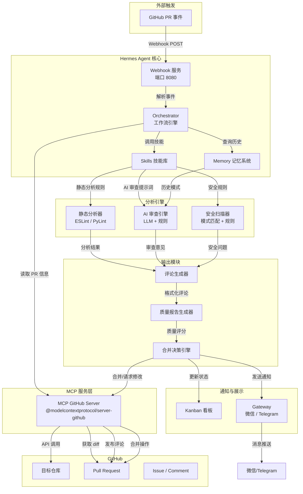
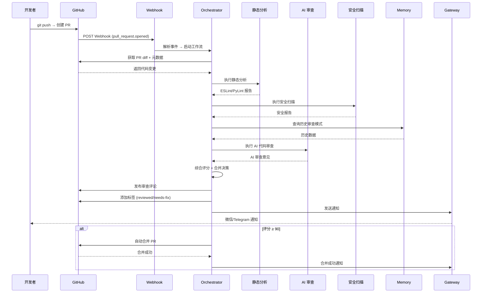
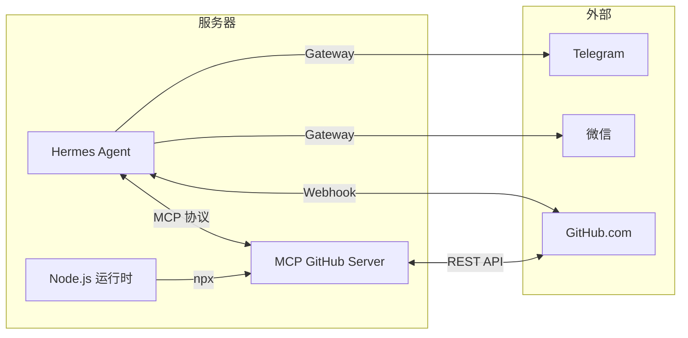

# 系统架构设计

## 1. 系统架构图



## 2. 核心模块详解

### 2.1 PR 监听模块

**职责**：监听 GitHub Pull Request 事件，解析事件类型并触发相应处理流程。

| 事件类型 | 触发条件 | 处理动作 |
|----------|----------|----------|
| `opened` | PR 新建 | 启动完整审查流程 |
| `synchronize` | PR 更新（新提交） | 增量审查，更新评论 |
| `reopened` | PR 重新打开 | 重新审查 |
| `labeled` | PR 打标签 | 根据标签执行特定检查 |
| `ready_for_review` | Draft PR 转为正式 | 启动审查 |

**配置示例**：
```yaml
# .hermes/webhooks/github-pr.yaml
name: github-pr-review
events:
  - pull_request.opened
  - pull_request.synchronize
  - pull_request.reopened
  - pull_request.ready_for_review
endpoint: /webhook/github
handler: code-review-agent
```

### 2.2 代码分析模块

**职责**：对 PR 中的代码变更进行多维度分析。

**分析维度**：
1. **静态分析** — ESLint（JavaScript/TypeScript）、PyLint（Python）
2. **代码复杂度** — 圈复杂度、函数长度、嵌套深度
3. **代码重复** — 重复代码块检测
4. **测试覆盖** — 测试文件变更关联分析
5. **AI 语义分析** — 逻辑错误、架构问题、性能隐患

**命令示例**：
```bash
# JavaScript/TypeScript 静态分析
npx eslint --format json pr_diff/**/*.{js,ts,tsx} > analysis/eslint-report.json

# Python 静态分析
pylint --output-format=json pr_diff/ > analysis/pylint-report.json
```

### 2.3 质量评分模块

**职责**：综合各维度分析结果，生成量化质量评分。

**评分模型**：

| 维度 | 权重 | 评分依据 |
|------|------|----------|
| 代码风格 | 15% | ESLint/PyLint 违规数量 |
| 代码复杂度 | 20% | 圈复杂度、函数长度 |
| 安全性 | 25% | 安全漏洞数量和严重程度 |
| 测试覆盖 | 15% | 新增代码的测试覆盖率 |
| AI 逻辑审查 | 25% | 逻辑错误、架构问题数量 |

**评分公式**：
```
总分 = Σ(维度得分 × 权重)
维度得分 = max(0, 100 - 扣分项)
扣分项 = 问题数量 × 问题严重系数
```

### 2.4 安全扫描模块

**职责**：检测代码中的安全漏洞和敏感信息泄露。

**扫描规则**：
- 硬编码密钥/密码检测
- SQL 注入模式识别
- XSS 漏洞检测
- 路径遍历检测
- 不安全的依赖版本
- 敏感文件泄露（`.env`, `credentials` 等）

### 2.5 评论生成模块

**职责**：将分析结果转化为结构化的 GitHub PR 评论。

**评论结构**：
```markdown
## 🤖 代码审查报告

### 📊 总体评分：85/100 ✅

| 维度 | 评分 | 状态 |
|------|------|------|
| 代码风格 | 90 | ✅ |
| 代码复杂度 | 85 | ✅ |
| 安全性 | 95 | ✅ |
| 测试覆盖 | 70 | ⚠️ |
| AI 逻辑审查 | 80 | ✅ |

### 🔴 必须修复
- [ ] **安全问题**: 第42行存在潜在的 SQL 注入风险
- [ ] **逻辑错误**: 第88行空指针异常风险

### 🟡 建议改进
- [ ] **性能**: 第156行循环可优化
- [ ] **风格**: 第23行变量命名不符合规范

### ✅ 通过项
- 代码格式符合规范
- 测试覆盖新增逻辑
- 无已知安全漏洞

---
> 🤖 由 Code Review Agent 自动生成
```

### 2.6 合并决策模块

**职责**：基于质量评分和审查结果，给出合并建议或自动执行合并。

**决策策略**：

| 评分区间 | 决策 | 操作 |
|----------|------|------|
| ≥ 90 | 自动合并 | 直接合并 PR |
| 70 - 89 | 建议合并 | 发布评论 + 建议合并 |
| 50 - 69 | 需修改 | 请求修改 + 标记变更请求 |
| < 50 | 拒绝合并 | 关闭 PR + 通知作者 |

## 3. 消息流转图



## 4. 技术选型理由

| 组件 | 选型 | 替代方案 | 选择理由 |
|------|------|----------|----------|
| **Agent 框架** | Hermes Agent | LangChain, AutoGPT | 原生支持 MCP、Webhook、Kanban、Gateway，开箱即用 |
| **MCP 服务** | `@modelcontextprotocol/server-github` | Octokit SDK | 标准化协议，与 Hermes 原生集成，无需额外开发 |
| **静态分析** | ESLint + PyLint | SonarQube, CodeQL | 轻量、社区活跃、易于集成到 CLI 工作流 |
| **AI 审查** | Hermes Skills + LLM | GitHub Copilot Code Review | 可自定义审查规则和提示词，灵活度高 |
| **通知** | Hermes Gateway | Slack API, Email | 支持微信/Telegram 多通道，配置简单 |
| **看板** | Hermes Kanban | GitHub Projects, Jira | 与 Hermes 深度集成，自动同步审查状态 |
| **存储** | Hermes Memory | Redis, PostgreSQL | 结构化记忆，支持语义检索，无需额外部署 |

## 5. 部署架构



**最低配置要求**：
- CPU: 2 核
- 内存: 4 GB
- 存储: 20 GB
- 网络: 公网 IP 或内网穿透（用于接收 Webhook）
- 运行时: Node.js ≥ 18, Python ≥ 3.9

---

> **状态**: 草稿 | **版本**: v0.1.0
