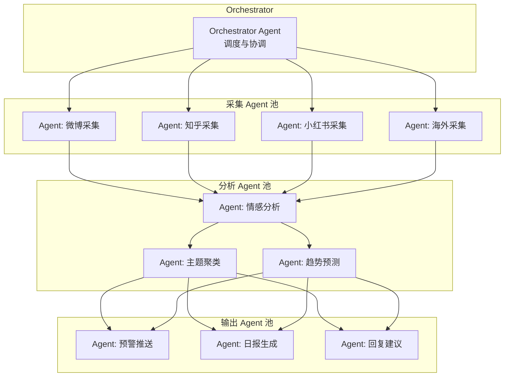

# 扩展思路

## 1. 更多平台集成

### 1.1 国内平台扩展

| 平台 | 集成方式 | 特点 | 优先级 |
|------|---------|------|--------|
| **抖音** | `web_search` + `site:douyin.com` | 短视频评论，舆情传播快 | ⭐⭐⭐ |
| **B站** | `web_search` + `site:bilibili.com` | 弹幕文化，年轻用户群体 | ⭐⭐⭐ |
| **微信公众号** | `web_search` + 搜狗微信搜索 | 深度长文，KOL 观点 | ⭐⭐⭐ |
| **贴吧** | `web_search` + `site:tieba.baidu.com` | 垂直社区，真实讨论 | ⭐⭐ |
| **大众点评** | `web_search` + `site:dianping.com` | 消费评价，口碑监控 | ⭐⭐ |

### 1.2 海外平台扩展

| 平台 | 集成方式 | 特点 | 优先级 |
|------|---------|------|--------|
| **Twitter/X** | `web_search` + `site:twitter.com` | 实时性强，舆情爆发地 | ⭐⭐⭐⭐⭐ |
| **YouTube** | `web_search` + `site:youtube.com` | 视频评论，长尾讨论 | ⭐⭐⭐ |
| **Medium** | `web_search` + `site:medium.com` | 深度技术/行业分析 | ⭐⭐ |
| **LinkedIn** | `web_search` + `site:linkedin.com` | B2B 舆情，行业观点 | ⭐⭐ |
| **4chan** | `web_search` + `site:4chan.org` | 网络亚文化，需谨慎 | ⭐ |

### 1.3 集成示例：Twitter/X 监控

```yaml
# configs/platforms.yaml 扩展
platforms:
  twitter:
    enabled: true
    search_template: "site:twitter.com {keyword}"
    max_results: 15
    frequency: "15m"          # Twitter 舆情变化快，提高频率
    alert_threshold: 30       # 更敏感的预警阈值
    # 注意：Twitter 搜索可能受 API 限制
```

## 2. 高级情感分析

### 2.1 细粒度情感维度

从单一的情感评分扩展到多维度分析：

```yaml
sentiment:
  dimensions:
    anger:                    # 愤怒指数
      weight: 0.3
      description: "用户愤怒程度"
    disappointment:           # 失望指数
      weight: 0.2
      description: "期望落差"
    satisfaction:             # 满意度
      weight: 0.3
      description: "使用体验满意度"
    urgency:                  # 紧迫度
      weight: 0.2
      description: "问题解决紧迫性"
```

### 2.2 主题聚类

对大量舆情进行自动主题聚类，发现热点话题：

```text
## 主题聚类分析

对以下 {N} 条舆情进行主题聚类：

{all_results}

输出格式：
1. 聚类主题1（出现 {count} 次）
   - 代表条目：{example}
   - 情感分布：正面 {pos}% / 中性 {neu}% / 负面 {neg}%
   
2. 聚类主题2（出现 {count} 次）
   ...
```

### 2.3 趋势预测

基于历史数据预测舆情走向：

```text
## 舆情趋势预测

历史数据（过去 7 天）：
{historical_data}

请分析：
1. 情感趋势是上升、下降还是平稳？
2. 是否有潜在危机信号？
3. 建议的应对策略是什么？
```

## 3. 多 Agent 协作架构

### 3.1 专用 Agent 分工



### 3.2 Kanban 多 Worker 配置

```bash
# 创建专用 Worker 配置文件
hermes profile create social-monitor-worker-1 --clone default
hermes profile create social-monitor-worker-2 --clone default
hermes profile create social-monitor-worker-3 --clone default

# 配置 Worker 的 Kanban 工具集
# 编辑 ~/.hermes/profiles/social-monitor-worker-1/config.yaml
# 启用 kanban 工具集

# 启动 Dispatcher（在 Gateway 中运行）
hermes kanban init social-monitor-board
hermes kanban daemon start --board social-monitor-board
```

## 4. 数据可视化

### 4.1 情感趋势图

通过 Cron 任务生成 HTML 格式的情感趋势图：

```bash
# 日报 Cron 中嵌入图表生成
hermes cron edit daily-report --prompt "
生成昨日舆情日报，包含：
1. 情感趋势折线图（使用 Mermaid）
2. 各平台舆情分布饼图
3. 关键词云
4. 负面舆情时间线
输出格式：HTML（可嵌入图片）
"
```

### 4.2 Mermaid 图表示例

在日报中嵌入 Mermaid 图表：

```mermaid
%% 情感趋势折线图
xychart-beta
    title "舆情情感趋势（过去7天）"
    x-axis "日期" [7/1, 7/2, 7/3, 7/4, 7/5, 7/6, 7/7]
    y-axis "情感评分" 0 --> 100
    line "平均情感分" [72, 68, 55, 48, 62, 70, 75]
    line "负面舆情数" [3, 5, 8, 12, 6, 4, 2]
```

## 5. 智能回复系统

### 5.1 自动回复工作流

```mermaid
flowchart TD
    NEG[检测到负面舆情] --> CLASSIFY{分类}
    CLASSIFY -->|产品问题| PROD[产品回复模板]
    CLASSIFY -->|服务投诉| SERV[服务回复模板]
    CLASSIFY -->|品牌质疑| BRAND[品牌回复模板]
    CLASSIFY -->|竞品对比| COMP[竞品对比话术]

    PROD --> LLM[LLM 生成具体回复]
    SERV --> LLM
    BRAND --> LLM
    COMP --> LLM

    LLM --> REVIEW[人工审核<br/>(通过 Gateway 推送)]
    REVIEW -->|审核通过| PUBLISH[发布回复]
    REVIEW -->|需修改| EDIT[修改后重新生成]
```

### 5.2 回复模板库

```yaml
# configs/reply-templates.yaml
reply_templates:
  product_issue:
    - scenario: "产品质量问题"
      template: |
        非常抱歉给您带来了不好的体验。关于您提到的{issue}问题，
        我们已经反馈给技术团队进行排查。请您通过私信提供订单号，
        我们将优先为您处理。感谢您的反馈！🙏
    - scenario: "功能缺失"
      template: |
        感谢您的建议！{feature}功能已经在我们的规划中，
        预计在{timeline}版本上线。我们会持续优化产品体验，
        感谢您的支持！

  service_complaint:
    - scenario: "客服响应慢"
      template: |
        很抱歉让您久等了。我们正在优化客服响应流程，
        您的工单编号是{ticket_id}，我们会加急处理。
        如有任何问题，请随时联系我们。

  brand_crisis:
    - scenario: "品牌负面事件"
      template: |
        关于{event}事件，我们高度重视。目前已经成立专项小组
        进行调查，调查结果将在{time}内公布。我们始终坚持以
        用户为中心，感谢大家的监督。
```

## 6. 企业级功能扩展

### 6.1 多品牌监控

```yaml
# configs/multi-brand.yaml
brands:
  brand_a:
    name: "品牌A"
    keywords:
      - "品牌A"
      - "品牌A 产品X"
    alert_channel: "brand-a-alert"
    report_recipients: ["brand-a-team@company.com"]

  brand_b:
    name: "品牌B"
    keywords:
      - "品牌B"
      - "品牌B 产品Y"
    alert_channel: "brand-b-alert"
    report_recipients: ["brand-b-team@company.com"]
```

### 6.2 竞品情报分析

```text
## 竞品情报分析

竞品关键词：{competitor_keywords}
时间范围：过去 24 小时

请输出：
1. 竞品正面新闻
2. 竞品负面舆情
3. 竞品产品发布/更新动态
4. 与自身品牌的对比分析
5. 建议应对策略
```

### 6.3 合规与审计

- **数据脱敏**：对涉及个人信息的舆情数据进行脱敏处理
- **审计日志**：所有预警和回复操作记录到审计日志
- **权限控制**：不同角色（查看者、分析者、回复者）分级权限

## 7. 社区与生态

### 7.1 分享为 Hermes Skill

将这套舆情监控流程封装为可复用的 Hermes Skill，方便社区使用：

```bash
# 发布到技能中心
hermes skills publish ./social-media-monitor
```

### 7.2 集成 MCP 服务

通过 Hermes MCP 服务暴露舆情数据 API：

```bash
# 启动 MCP 服务
hermes mcp serve --port 8080

# 其他 Agent 可通过 MCP 协议查询舆情数据
# hermes mcp add social-monitor --url http://localhost:8080/mcp
```

### 7.3 自定义 Webhook

```bash
# 创建 Webhook，当检测到特定关键词时触发外部系统
hermes webhook subscribe critical-alert \
  --url "https://hooks.company.com/alert" \
  --method POST \
  --header "Authorization: Bearer ${WEBHOOK_TOKEN}"
```
