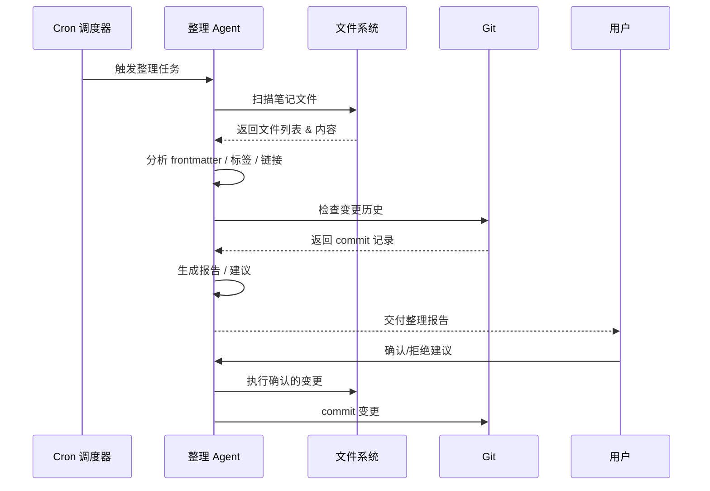
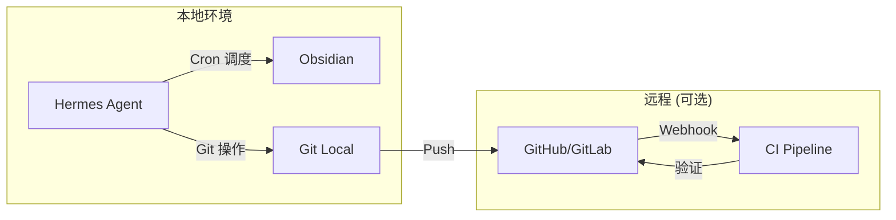

# 架构设计

## 1. 整体架构

```mermaid
graph TB
    subgraph "用户层"
        O[Obsidian Vault]
        CLI[Hermes CLI / Gateway]
    end

    subgraph "调度层 (Hermes Agent)"
        CRON[Cron 调度器]
        MEM[Memory 持久记忆]
        SS[session_search 语义搜索]
        KAN[Kanban 任务板]
        DEL[delegate_task 子代理]
    end

    subgraph "工具层"
        T[Terminal 终端]
        F[@file 文件引用]
        W[web_extract 网页提取]
        G[Git 操作]
    end

    subgraph "知识库层"
        DV[Dataview 查询引擎]
        TP[Templater 模板引擎]
        MD[Markdown 笔记库]
        MOC[MOC 索引系统]
    end

    subgraph "Agent 流程层"
        FM[Frontmatter 检测 Agent]
        TAG[标签推荐 Agent]
        LINK[链接检查 Agent]
        REL[关联推荐 Agent]
        ARC[归档建议 Agent]
    end

    O --> CLI
    CLI --> CRON
    CRON --> FM
    CRON --> LINK
    CRON --> ARC
    CLI --> SS
    SS --> REL
    MEM --> TAG
    MEM --> REL
    FM --> T
    FM --> F
    TAG --> DEL
    LINK --> T
    LINK --> W
    REL --> SS
    REL --> MEM
    ARC --> G
    ARC --> DV
    T --> MD
    F --> MD
    DV --> MD
    TP --> MD
    MOC --> DV
    KAN --> FM
    KAN --> LINK
    KAN --> ARC
```

## 2. 模块划分

### 2.1 调度层（Hermes Agent 核心能力）

| 模块 | 职责 | 对应 Hermes 功能 |
|------|------|------------------|
| **Cron 调度器** | 按预设周期触发各 Agent 流程 | `hermes cron create` / `cronjob` tool |
| **Memory** | 持久化用户偏好、笔记风格、标签历史 | `memory` toolset |
| **session_search** | 跨会话搜索历史整理记录、发现关联 | `session_search` tool |
| **Kanban 任务板** | 跟踪待处理项、分配整理任务 | `kanban` toolset |
| **delegate_task** | 子代理并行处理标签推荐等计算密集型任务 | `delegate_task` |

### 2.2 Agent 流程层（5 个核心 Agent）

每个 Agent 是一个独立的 Hermes 会话或 Cron 任务，负责知识库整理的特定环节。

#### Frontmatter 检测 Agent

```
触发: Cron (每 6 小时) 或 手动
目标: 扫描 vault 中缺少 frontmatter 或关键字段的笔记
输出: 报告 + 自动补全
```

#### 标签推荐 Agent

```
触发: 新笔记创建 (Git hook) 或 批量扫描
目标: 基于笔记内容语义推荐标签
输出: 建议标签列表，人工确认后写入
```

#### 链接检查 Agent

```
触发: Cron (每日)
目标: 检测死链、空链、指向不存在笔记的链接
输出: 完整性报告 + 修复建议
```

#### 关联推荐 Agent

```
触发: Cron (每周)
目标: 基于内容相似度推荐笔记间关联链接
输出: 关联建议列表
```

#### 归档建议 Agent

```
触发: Cron (每月)
目标: 识别长期未更新、低访问的笔记，建议归档
输出: 归档清单
```

### 2.3 知识库层

参考 vault 的 6 层架构：

```
00-Inbox(收件箱)          → 临时笔记入口
10-Project(项目层)        → 项目级笔记
20-核心能力-Core_Ability  → 核心能力沉淀
30-领域知识-Domain        → 领域知识
40-输出-Output            → 对外输出
50-归档-Archive           → 归档
```

每个层级下按 MOC（Map of Content）组织索引。

### 2.4 Frontmatter 规范

笔记的 frontmatter 遵循以下规范：

```yaml
---
title: 笔记标题
description: 简短描述
created: 2026-01-01
updated: 2026-07-07
author: 作者名
tags:
  - tag1
  - tag2
status: draft|published|archived
---
```

## 3. 数据流



## 4. 关键设计决策

### 4.1 为什么选择 Hermes Agent 而非纯 Obsidian 插件

| 维度 | Hermes Agent | Obsidian 插件 |
|------|-------------|---------------|
| 语义理解 | ✅ LLM 驱动，理解上下文 | ❌ 规则匹配，无语义 |
| 标签推荐 | ✅ 基于内容+历史推荐 | ❌ 仅能基于已有标签 |
| 关联发现 | ✅ 向量语义搜索 | ❌ 仅关键词匹配 |
| 跨会话记忆 | ✅ Memory 持久化 | ❌ 无记忆能力 |
| 定时调度 | ✅ Cron 原生支持 | ❌ 需额外插件 |
| 报告交付 | ✅ 多平台推送 | ❌ 仅 Obsidian 内 |

### 4.2 安全边界

- Agent 仅读取 Markdown 文件，不执行任意代码
- 所有修改需用户确认（通过 Cron 报告 + 人工审批）
- Git 版本控制确保可回滚
- Hermes 的 `approvals.mode` 保护高危操作

## 5. 部署拓扑



## 6. 扩展点

- **插件化 Agent**：每个整理流程可独立启用/禁用
- **自定义规则**：通过 Hermes 技能（skill）定义特定整理规则
- **多 Vault 支持**：通过 Hermes 配置文件切换不同 vault
- **外部知识源**：通过 `web_extract` 引入外部资料辅助标签推荐
