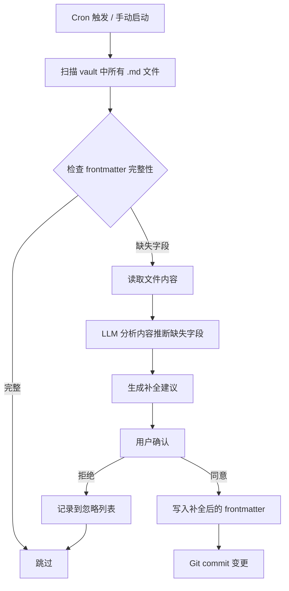
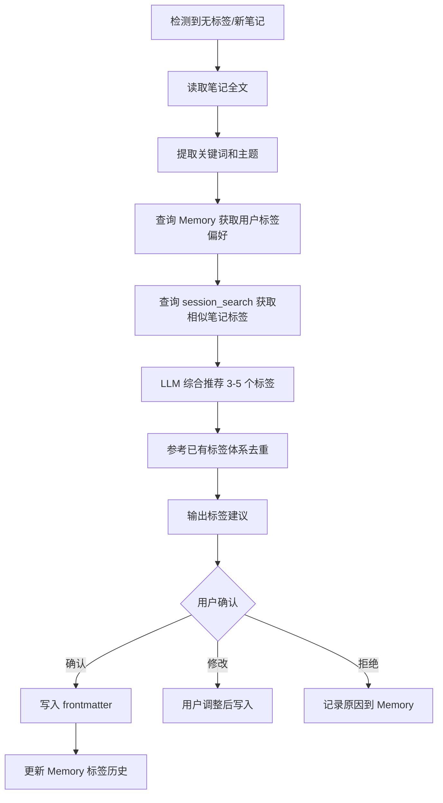
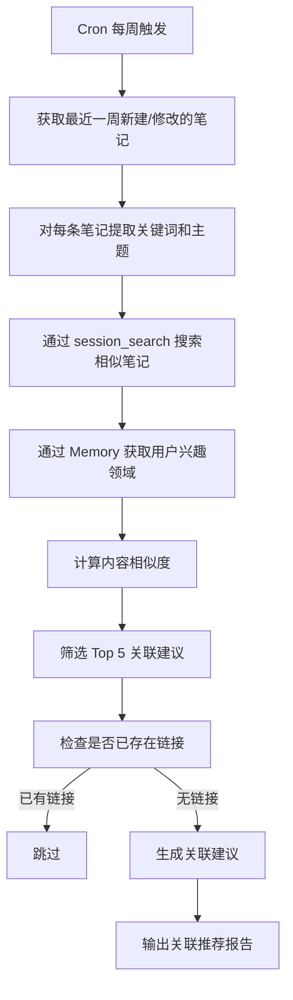
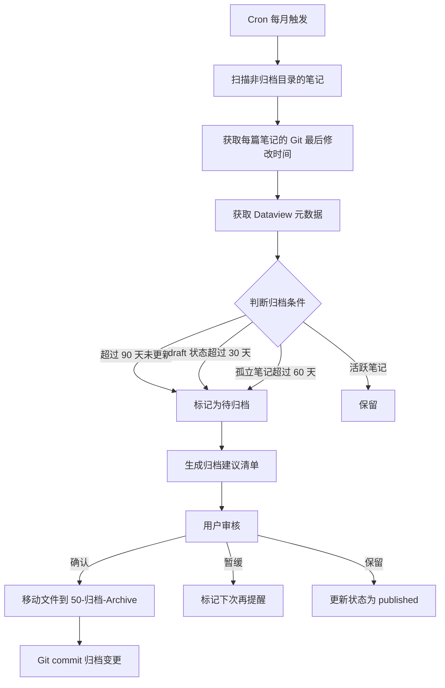
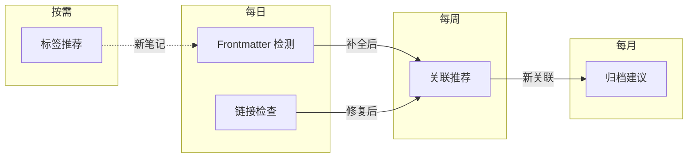

# 核心流程

## 1. Frontmatter 检测与补全

### 1.1 流程概述



### 1.2 扫描命令

```bash
# 查找所有缺少 frontmatter（不以 --- 开头）的 .md 文件
find "X:/KMS/yeyunby" -name "*.md" -not -path "*/.obsidian/*" \
  -not -path "*/50-归档-Archive/*" \
  -exec sh -c 'head -1 "$1" | grep -q "^---" || echo "$1"' _ {} \;

# 查找缺少特定 frontmatter 字段的文件
find "X:/KMS/yeyunby" -name "*.md" -not -path "*/.obsidian/*" | \
  while read f; do
    missing=""
    head -20 "$f" | grep -q "^tags:" || missing="$missing tags"
    head -20 "$f" | grep -q "^status:" || missing="$missing status"
    head -20 "$f" | grep -q "^description:" || missing="$missing description"
    [ -n "$missing" ] && echo "$f → 缺失:$missing"
  done
```

### 1.3 Hermes Agent 提示词模板

```
## 任务：Frontmatter 检测与补全

请扫描以下目录中的 .md 文件，检测 frontmatter 完整性：

目录: X:/KMS/yeyunby/00-Inbox(收件箱)/
排除: .obsidian/, 50-归档-Archive/

### 检测规则
- 文件必须以 `---` 开头（frontmatter 分隔符）
- 必须包含字段：title, created, tags, status
- 推荐包含字段：description, updated, author, aliases

### 补全策略
- title: 从文件第一个 H1 标题提取，或使用文件名
- created: 使用文件创建时间（git log 或 stat）
- tags: 分析正文内容，提取关键词作为标签
- status: 收件箱默认为 draft，其他目录根据内容判断
- description: 提取正文前两句话

### 输出格式
| 文件 | 缺失字段 | 建议补全值 |
|------|----------|------------|
| path/to/file.md | tags, status | tags: [obsidian, automation], status: draft |

对每个文件询问用户是否应用补全。
```

### 1.4 Dataview 查询：查看缺失 frontmatter 的笔记

```dataview
TABLE 
  file.folder as "路径",
  file.etags as "已有标签",
  file.frontmatter.status as "状态"
FROM ""
WHERE file.name != "README"
  AND file.name != "index"
  AND (
    file.frontmatter.title = null
    OR file.frontmatter.tags = null
    OR file.frontmatter.status = null
  )
SORT file.folder ASC
```

### 1.5 Dataview 查询：统计 frontmatter 完整性

```dataview
TABLE 
  length(filter(rows, (r) => r.has_title)) as "有标题",
  length(filter(rows, (r) => r.has_tags)) as "有标签",
  length(filter(rows, (r) => r.has_status)) as "有状态",
  length(filter(rows, (r) => r.has_desc)) as "有描述",
  length(rows) as "总计"
FLATTEN 
  choice(file.frontmatter.title != null, 1, 0) as has_title,
  choice(file.frontmatter.tags != null, 1, 0) as has_tags,
  choice(file.frontmatter.status != null, 1, 0) as has_status,
  choice(file.frontmatter.description != null, 1, 0) as has_desc
GROUP BY file.folder
SORT length(rows) DESC
```

## 2. 标签推荐

### 2.1 流程概述



### 2.2 Hermes Agent 提示词模板

```
## 任务：标签推荐

请为以下笔记推荐标签。

### 笔记信息
路径: {file_path}
标题: {title}
正文前 500 字: {content_excerpt}

### 标签推荐规则
1. 参考 vault 中已有的标签体系（避免创建孤立标签）
2. 推荐 3-5 个标签，按相关性排序
3. 优先使用已有标签（通过 session_search 查找）
4. 新标签需解释理由

### 用户标签偏好（来自 Memory）
{memory_tags}

### 相似笔记使用的标签（来自 session_search）
{similar_tags}

### 输出格式
## 推荐标签
- `tag1` - 理由
- `tag2` - 理由

## 建议新增标签（如有）
- `new-tag` - 定义和适用范围
```

### 2.3 标签推荐辅助脚本

将以下内容保存为 `scripts/recommend_tags.sh`：

```bash
#!/bin/bash
# 为指定笔记推荐标签
# 用法: ./recommend_tags.sh <笔记路径>

NOTE_PATH="$1"
NOTE_TITLE=$(head -1 "$NOTE_PATH" | sed 's/^# //')
NOTE_CONTENT=$(head -50 "$NOTE_PATH")

# 提取正文（跳过 frontmatter）
BODY=$(awk 'BEGIN{flag=0} /^---$/{flag++; next} flag>=2{print}' "$NOTE_PATH" | head -30)

echo "笔记: $NOTE_TITLE"
echo "路径: $NOTE_PATH"
echo "---"
echo "正文摘要:"
echo "$BODY" | head -10
```

### 2.4 Dataview 查询：查看标签使用频率

```dataview
TABLE 
  length(rows) as "使用次数",
  join(rows.file.link, ", ") as "使用笔记"
FLATTEN file.etags as tag
GROUP BY tag as "标签"
SORT length(rows) DESC
LIMIT 50
```

### 2.5 Dataview 查询：查找孤立标签（仅出现一次的标签）

```dataview
TABLE length(rows) as "使用次数"
FLATTEN file.etags as tag
GROUP BY tag as "标签"
WHERE length(rows) = 1
SORT tag ASC
```

## 3. 链接完整性检查

### 3.1 流程概述

```mermaid
flowchart TD
    A[Cron 每日触发] --> B[扫描所有 .md 文件中的链接]
    B --> C[提取 [[wikilink]] 和 [text](link) 格式]
    C --> D{链接类型判断}
    D -->|内部 wikilink| E[检查目标文件是否存在]
    D -->|外部 URL| F[检查 URL 可访问性]
    E --> G{目标存在?}
    G -->|是| H[正常]
    G -->|否| I[报告死链]
    F --> J{可访问?}
    J -->|是| K[正常]
    J -->|否| L[报告失效链接]
    I --> M[生成修复建议]
    L --> M
    M --> N[输出完整性报告]
```

### 3.2 链接扫描命令

```bash
# 提取所有 wikilink
grep -roh '\[\[[^]]*\]\]' "X:/KMS/yeyunby" --include="*.md" \
  --exclude-dir=".obsidian" --exclude-dir="50-归档-Archive" | \
  sed 's/\[\[//;s/\]\]//' | sort -u > /tmp/all_wikilinks.txt

# 检查每个 wikilink 的目标文件是否存在
cat /tmp/all_wikilinks.txt | while read link; do
  # 处理带别名的链接 [[target|alias]]
  target=$(echo "$link" | cut -d'|' -f1)
  # 处理标题锚点 [[target#section]]
  target=$(echo "$target" | cut -d'#' -f1)
  
  found=$(find "X:/KMS/yeyunby" -name "${target}.md" 2>/dev/null)
  if [ -z "$found" ]; then
    echo "死链: [[$link]] → 未找到 ${target}.md"
  fi
done

# 提取外部 URL
grep -roh '\[[^]]*\](https\?://[^)]*)' "X:/KMS/yeyunby" --include="*.md" \
  --exclude-dir=".obsidian" | head -20
```

### 3.3 Hermes Agent 提示词模板

```
## 任务：链接完整性检查

请检查以下 vault 中的链接完整性。

### 扫描结果
死链列表:
{dead_links}

外部链接状态:
{external_links_status}

### 修复建议
对于每个死链，请建议：
1. 如果目标笔记存在但路径不同 → 建议正确的 [[wikilink]]
2. 如果目标笔记不存在但内容相关 → 建议创建新笔记
3. 如果目标笔记已归档 → 建议更新链接到归档路径
4. 如果外部链接失效 → 建议 archive.org 快照或替代来源

### 输出格式
## 链接完整性报告

### 死链（需修复）
| 来源文件 | 死链 | 建议修复 |
|----------|------|----------|

### 失效外部链接
| 来源文件 | URL | 状态码 | 建议 |
|----------|-----|--------|------|

### 健康统计
- 总链接数: {total}
- 正常: {healthy}
- 死链: {dead}
- 外部失效: {broken}
- 健康率: {health_rate}%
```

### 3.4 Dataview 查询：查找孤立笔记（无入链）

```dataview
TABLE 
  file.folder as "路径",
  file.mtime as "最后修改"
FROM ""
WHERE file.name != "README"
  AND file.name != "index"
  AND length(file.inlinks) = 0
  AND file.folder != "50-归档-Archive"
SORT file.mtime DESC
```

### 3.5 Dataview 查询：查找出链最多的笔记

```dataview
TABLE 
  length(file.outlinks) as "出链数",
  file.folder as "路径"
FROM ""
WHERE length(file.outlinks) > 0
SORT length(file.outlinks) DESC
LIMIT 20
```

## 4. 笔记关联推荐

### 4.1 流程概述



### 4.2 Hermes Agent 提示词模板

```
## 任务：笔记关联推荐

请为以下新笔记推荐关联笔记。

### 新笔记
标题: {title}
路径: {file_path}
摘要: {content_excerpt}
标签: {tags}

### 关联推荐规则
1. 基于主题相似度（关键词重叠、标签匹配、内容语义）
2. 优先推荐同一层级或相邻层级的笔记
3. 避免推荐已存在 [[wikilink]] 的笔记
4. 每条推荐给出关联理由
5. 推荐 3-5 条

### 输出格式
## 关联推荐

### {新笔记标题}
建议关联：
1. [[笔记A]] - 理由：共享标签 X，讨论相似主题
2. [[笔记B]] - 理由：互补内容，可互相引用
3. [[笔记C]] - 理由：同一项目下的相关笔记

### 关联强度矩阵
| 新笔记 | 关联笔记 | 相似度 | 关联类型 |
|--------|----------|--------|----------|
| {title} | {note_a} | 高 | 主题相似 |
| {title} | {note_b} | 中 | 标签重叠 |
```

### 4.3 Dataview 查询：按标签查找相关笔记

```dataview
TABLE 
  file.etags as "标签",
  file.mtime as "最后修改"
FROM ""
WHERE 
  contains(file.etags, "hermes-agent")
  AND file.name != this.file.name
SORT file.mtime DESC
```

### 4.4 Dataview 查询：同一目录下的笔记关联

```dataview
TABLE 
  file.etags as "标签",
  file.mtime as "最后修改"
FROM "20-核心能力-Core_Ability/10 AI应用-AI_Application/01 AI工具/02 Agent"
SORT file.name ASC
```

## 5. 归档建议

### 5.1 流程概述



### 5.2 Git 日志分析命令

```bash
# 获取每个文件的最后修改时间
cd "X:/KMS/yeyunby"

# 使用 git log 获取最后提交时间
for f in $(find . -name "*.md" -not -path "./.obsidian/*" -not -path "./50-归档-Archive/*"); do
  last_commit=$(git log -1 --format="%ci" -- "$f" 2>/dev/null)
  if [ -n "$last_commit" ]; then
    echo "$last_commit | $f"
  else
    echo "未追踪 | $f"
  fi
done | sort > /tmp/file_ages.txt

# 找出超过 90 天未更新的文件
while IFS=' | ' read -r date file; do
  if [ "$date" != "未追踪" ]; then
    file_ts=$(date -d "$date" +%s 2>/dev/null)
    now_ts=$(date +%s)
    days=$(( (now_ts - file_ts) / 86400 ))
    if [ $days -gt 90 ]; then
      echo "$days 天未更新 | $file"
    fi
  fi
done < /tmp/file_ages.txt
```

### 5.3 Hermes Agent 提示词模板

```
## 任务：归档建议

请分析以下 vault 笔记的活跃度，给出归档建议。

### 扫描结果

#### 超过 90 天未更新
{stale_notes}

#### Draft 状态超过 30 天
{stale_drafts}

#### 孤立笔记（无入链）
{orphan_notes}

### 归档建议规则
1. 超过 90 天未更新 → 建议归档
2. Draft 状态超过 30 天 → 建议完成或归档
3. 孤立笔记超过 60 天 → 建议归档或删除
4. MOC 索引文件、README 等基础设施文件不归档
5. 最近 30 天内有更新的笔记不归档

### 输出格式
## 归档建议报告

### 建议归档
| 文件 | 最后更新 | 未更新天数 | 归档理由 |
|------|----------|------------|----------|

### 建议完成
| 文件 | 最后更新 | 状态 | 建议 |
|------|----------|------|------|

### 建议保留（已审核）
| 文件 | 理由 |
|------|------|

### 统计
- 总笔记数: {total}
- 建议归档: {to_archive}
- 建议完成: {to_finish}
- 保留: {keep}
```

### 5.4 Dataview 查询：按状态和修改时间查看笔记

```dataview
TABLE 
  file.mtime as "最后修改",
  date(today) - file.mtime as "未更新天数",
  file.folder as "路径"
FROM ""
WHERE 
  file.frontmatter.status = "draft"
  AND file.folder != "50-归档-Archive"
  AND file.folder != ".obsidian"
SORT file.mtime ASC
```

### 5.5 Dataview 查询：归档候选笔记

```dataview
TABLE 
  file.mtime as "最后修改",
  date(today) - file.mtime as "未更新天数",
  length(file.inlinks) as "入链数",
  length(file.outlinks) as "出链数"
FROM ""
WHERE 
  date(today) - file.mtime > dur(90 days)
  AND file.folder != "50-归档-Archive"
  AND file.folder != ".obsidian"
  AND file.name != "README"
SORT file.mtime ASC
```

## 6. 全流程自动化编排

### 6.1 流程依赖关系



### 6.2 一键全量整理

```bash
# 手动触发全量整理
hermes chat -q "
请执行知识库全量整理流程：
1. 扫描所有缺失 frontmatter 的笔记并补全
2. 检查所有内部链接的完整性
3. 为最近一周的新笔记推荐关联
4. 输出综合整理报告
路径: X:/KMS/yeyunby/
排除: .obsidian/, 50-归档-Archive/
"
```

### 6.3 查看整理历史

```bash
# 通过 session_search 查看历史整理记录
hermes chat -q "
使用 session_search 搜索关键词 'frontmatter 检测' 和 '链接检查'，
汇总最近 5 次知识库整理报告的关键发现。
"
```
