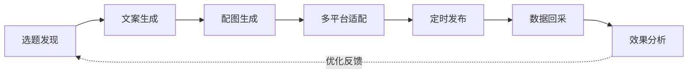

# 🏭 AI 内容工厂 — 多平台自媒体矩阵

> 基于 **Hermes Agent** 构建的全自动自媒体内容生产与分发系统，覆盖选题发现 → 文案生成 → 配图生成 → 多平台适配 → 定时发布 → 数据回采 → 效果分析全链路。

## 📋 项目概览

| 维度 | 说明 |
|------|------|
| **项目目标** | 实现 7×24 小时自动化内容生产与多平台分发，降低人力成本，提升内容产出效率 |
| **技术底座** | [Hermes Agent](https://hermes-agent.nousresearch.com) — 多 Agent 协作框架 |
| **覆盖平台** | 微信公众号、知乎、小红书、今日头条 |
| **核心能力** | Cron 定时调度、Profile 多角色、Kanban Swarm 任务编排、Gateway 多端交互、Memory 长期记忆、Plugin 扩展 |
| **参考案例** | TapNow 内容自动化、出海营销团队矩阵运营 |

## 🧩 架构总览

```
┌─────────────────────────────────────────────────────────┐
│                    Hermes Agent 调度层                    │
│  ┌──────────┐ ┌──────────┐ ┌──────────┐ ┌──────────┐  │
│  │ 选题Agent │ │ 文案Agent │ │ 配图Agent │ │ 发布Agent │  │
│  └────┬─────┘ └────┬─────┘ └────┬─────┘ └────┬─────┘  │
│       │            │            │            │         │
│  ┌────▼────────────▼────────────▼────────────▼─────┐   │
│  │              分析Agent (数据回采 + 优化)          │   │
│  └──────────────────────────────────────────────────┘   │
│  ┌──────────┐ ┌──────────┐ ┌──────────┐ ┌──────────┐  │
│  │  Cron    │ │  Kanban  │ │  Memory  │ │  Skills  │  │
│  └──────────┘ └──────────┘ └──────────┘ └──────────┘  │
└─────────────────────────────────────────────────────────┘
```

## 📂 文档结构

```
07-AI内容工厂-多平台自媒体矩阵/
├── README.md              # ← 本文档：项目总览
├── docs/
│   ├── 01-架构设计.md      # 系统架构与多 Profile 设计
│   ├── 02-环境搭建.md      # 环境配置与依赖安装
│   ├── 03-核心流程.md      # 全链路工作流详解
│   ├── 04-踩坑记录.md      # 实战中的问题与解决方案
│   └── 05-扩展思路.md      # 进阶玩法与商业化方向
├── configs/               # 平台配置模板
├── scripts/               # 辅助脚本
└── references/            # 参考资料
```

## 🚀 快速开始

```bash
# 1. 克隆项目
cd /path/to/项目实战

# 2. 安装 Hermes Agent（如未安装）
pip install hermes-agent

# 3. 初始化配置
hermes setup

# 4. 创建内容工厂 Profile
hermes profile create content-factory

# 5. 启动每日内容流水线
hermes cron add --name daily-content-pipeline \
  --schedule "0 8 * * *" \
  --task "content-factory:pipeline"
```

## 🎯 核心工作流



## 🛠 使用的 Hermes 核心功能

| 功能 | 用途 |
|------|------|
| **Cron** | 定时触发每日选题、发布、数据回采任务 |
| **Profile** | 为选题、文案、配图、发布、分析设置独立角色 |
| **Delegation** | Agent 间任务委派与结果传递 |
| **Gateway** | 通过 Telegram / 微信接收指令与查看报表 |
| **Plugins** | 扩展配图生成（DALL-E / Midjourney / ComfyUI） |
| **Memory** | 记录平台调性、历史爆款特征、用户偏好 |
| **Skills** | 封装各平台文案模板与发布流程 |
| **Kanban Swarm** | 多 Agent 并行协作与任务编排 |

## 📊 预期效果

- **日产量**: 10-20 篇适配不同平台的原创内容
- **覆盖平台**: 4 个主流中文内容平台
- **人力节省**: 减少 80%+ 重复性内容生产工作
- **响应速度**: 热点出现后 30 分钟内完成选题→发布

---

> **注意**: 本项目为 Hermes Agent 实战案例，需配合 Hermes Agent 运行环境使用。具体 API Key（OpenAI / DALL-E / Midjourney 等）需自行配置。
