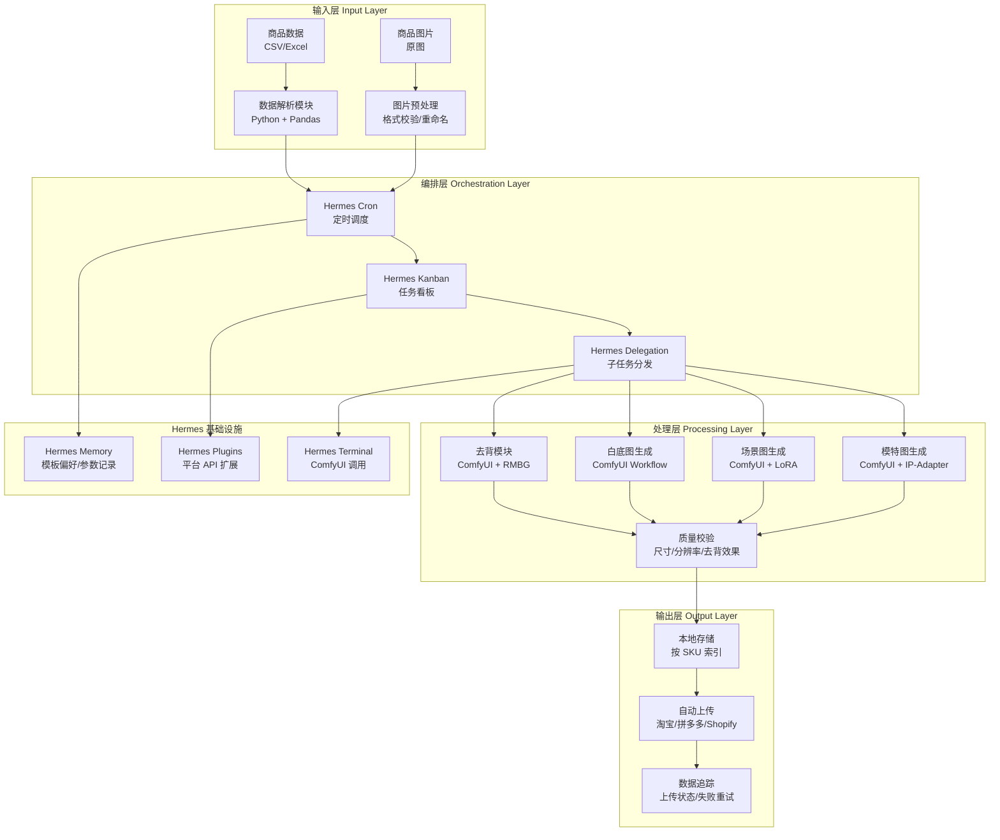
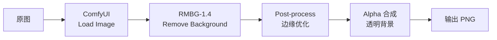
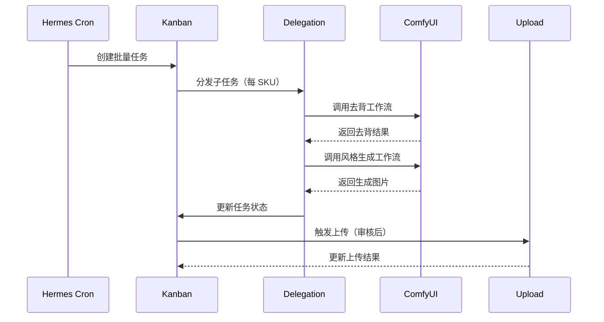
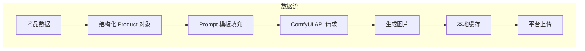

# 系统架构与模块设计

## 一、整体架构



## 二、模块详细设计

### 2.1 数据解析模块

**职责**：读取商品信息，校验数据完整性，转换为统一内部格式。

```python
# 数据模型示意
@dataclass
class Product:
    sku: str              # 商品编码
    name: str             # 商品名称
    category: str         # 类目
    original_image: str   # 原图路径
    description: str      # 商品描述（用于 Prompt 生成）
    attributes: dict      # 属性键值对
    target_platforms: list  # 目标平台列表
```

**输入格式支持**：
- CSV（UTF-8 BOM）
- Excel (.xlsx)
- JSON（Shopify 导出格式）
- API 实时拉取

### 2.2 去背模块

**技术方案**：ComfyUI + RMBG-1.4 / BRIA RMBG



**关键参数**：
| 参数 | 推荐值 | 说明 |
|------|--------|------|
| 模型 | RMBG-1.4 | 通用去背，电商场景表现最佳 |
| 后处理 | 边缘羽化 1px | 避免锯齿边缘 |
| 输出格式 | PNG | 保留透明通道 |
| 最小分辨率 | 800×800 | 满足主流平台要求 |

### 2.3 风格模板生成模块

支持三种核心风格模板：

#### 白底图模板
- **模型**：SDXL / Flux
- **特点**：纯白背景 + 商品居中 + 光影自然
- **适用**：主图、搜索展示
- **Workflow 节点**：`white_bg_workflow.json`

#### 场景图模板
- **模型**：SDXL + 场景 LoRA
- **特点**：根据商品类目自动匹配场景（家居/数码/食品/服饰）
- **适用**：详情页、广告素材
- **Workflow 节点**：`scene_workflow.json`

#### 模特图模板
- **模型**：SDXL + IP-Adapter + 模特 LoRA
- **特点**：保持商品一致性，替换模特/姿势
- **适用**：服饰、配饰类
- **Workflow 节点**：`model_workflow.json`

### 2.4 批量调度模块



### 2.5 自动上传模块

**平台适配器模式**：

```python
class PlatformAdapter(ABC):
    @abstractmethod
    def upload_image(self, sku: str, image_path: str, image_type: str) -> dict: ...

class TaobaoAdapter(PlatformAdapter): ...
class PddAdapter(PlatformAdapter): ...
class ShopifyAdapter(PlatformAdapter): ...
```

**上传策略**：
- 串行上传（避免触发平台限流）
- 失败自动重试（指数退避，最多 3 次）
- 上传结果写入 Hermes Memory

### 2.6 数据追踪模块

| 追踪维度 | 数据来源 | 用途 |
|----------|----------|------|
| 生成状态 | Kanban | 任务进度可视化 |
| 失败原因 | Terminal 日志 | 问题排查 |
| 上传结果 | 平台 API 回调 | 确认上架成功 |
| 耗时统计 | Hermes Memory | 性能优化参考 |

## 三、数据流



## 四、错误处理策略

| 错误类型 | 处理方式 | 通知方式 |
|----------|----------|----------|
| 数据格式错误 | 跳过该 SKU，记录日志 | Kanban 标记异常 |
| ComfyUI 超时 | 重试 2 次，超时 120s | Terminal 告警 |
| 上传失败 | 指数退避重试，最多 3 次 | Kanban 待人工处理 |
| 磁盘空间不足 | 暂停任务，清理缓存 | Hermes 通知 |
