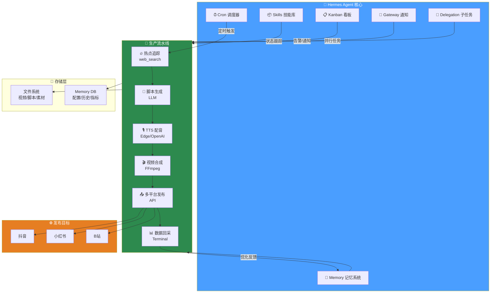
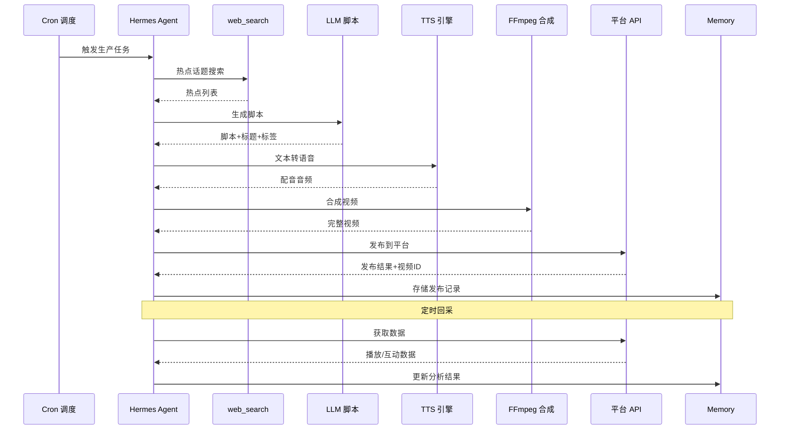
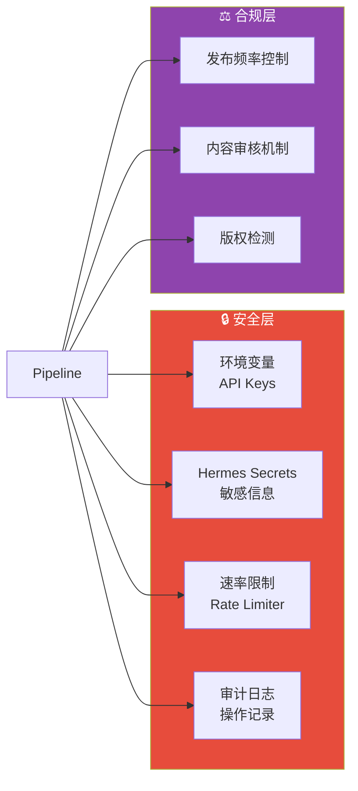
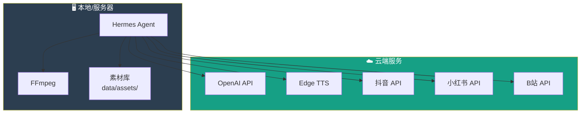

# 01 — 系统架构设计

## 1. 总体架构

本系统采用 **「Agent 驱动 + 流水线编排」** 架构，以 Hermes Agent 为核心调度引擎，串联热点追踪、内容生产、多平台发布、数据回采四大模块。



---

## 2. 模块划分

### 2.1 调度层（Hermes Core）

| 组件 | 职责 | 实现方式 |
|------|------|----------|
| **Cron 调度器** | 定时触发热点追踪、定时发布 | `hermes cron` 配置 YAML 规则 |
| **Skills 技能库** | 封装可复用的工作流 | `hermes skill install` 注册 |
| **Memory 记忆** | 存储历史热点、平台规则、用户偏好 | `hermes memory` 持久化 |
| **Kanban 看板** | 生产流水线可视化与状态管理 | `hermes kanban` 任务卡片 |
| **Gateway 通知** | 生产完成通知、异常告警 | Hermes Gateway 多通道 |
| **Delegation 分发** | 并行处理子任务（多视频同时生产） | `hermes delegate` 子 Agent |

### 2.2 生产流水线（Pipeline）

| 阶段 | 组件 | 输入 | 输出 |
|------|------|------|------|
| **热点追踪** | `web_search` + LLM 分析 | 关键词/领域 | 热点话题列表 |
| **脚本生成** | LLM Prompt 工程 | 热点话题 | 短视频脚本（含标题、文案、标签） |
| **TTS 配音** | Edge TTS / OpenAI TTS | 脚本文案 | 配音音频文件 |
| **视频合成** | FFmpeg + 素材库 | 音频 + 图片/视频素材 | 完整短视频 |
| **多平台发布** | 各平台 API | 视频文件 + 元数据 | 发布结果 |
| **数据回采** | API 请求 + 解析 | 发布后的视频 ID | 播放/互动数据 |

### 2.3 存储层

| 存储 | 内容 | 路径 |
|------|------|------|
| 脚本缓存 | 生成的文案 JSON | `data/scripts/` |
| 视频文件 | 合成的 MP4 | `data/videos/` |
| 素材库 | 图片/视频素材 | `data/assets/` |
| 配置 | 平台/TTS/Cron 配置 | `config/` |
| 记忆 | 历史数据、分析结果 | Hermes Memory |

---

## 3. 数据流设计

### 3.1 主数据流



### 3.2 配置数据流

```yaml
# 配置流转路径
config/platforms.yaml → Hermes Memory → 发布模块
config/tts_config.yaml → TTS 模块
config/cron_schedule.yaml → Cron 调度器
```

---

## 4. 技术选型说明

### 4.1 为什么选择 Hermes Agent？

| 需求 | Hermes 能力 | 替代方案对比 |
|------|-------------|-------------|
| 定时任务 | Cron 内置 | n8n（需额外部署）、Airflow（太重） |
| 工具调用 | Terminal/web_search 原生 | 需自行封装 |
| 多平台通知 | Gateway 多通道 | 需集成多个 SDK |
| 任务编排 | Skills + Delegation | LangGraph（学习成本高） |
| 状态管理 | Kanban 看板 | 需自建看板系统 |
| 记忆持久化 | Memory 系统 | 需自建数据库 |

### 4.2 TTS 方案对比

| 方案 | 音质 | 延迟 | 成本 | 语言支持 |
|------|------|------|------|----------|
| **Edge TTS** | ⭐⭐⭐⭐ | 低 | 免费 | 100+ 语言 |
| **OpenAI TTS** | ⭐⭐⭐⭐⭐ | 中 | 按字符计费 | 50+ 语言 |
| **Fish Speech** | ⭐⭐⭐⭐ | 中 | 自部署 | 中英文 |
| **CosyVoice** | ⭐⭐⭐⭐ | 低 | 自部署 | 中文最优 |

### 4.3 视频合成方案

| 方案 | 灵活性 | 速度 | 适用场景 |
|------|--------|------|----------|
| **FFmpeg 命令行** | ⭐⭐⭐⭐⭐ | ⭐⭐⭐⭐⭐ | 图文视频、字幕叠加 |
| **Python moviepy** | ⭐⭐⭐⭐ | ⭐⭐⭐ | 复杂特效、转场 |
| **视频生成 API** | ⭐⭐⭐ | ⭐⭐ | AI 生成视频画面 |
| **Remotion** | ⭐⭐⭐⭐⭐ | ⭐⭐ | React 驱动的动态视频 |

---

## 5. 安全架构



---

## 6. 部署拓扑



> **部署建议**：推荐在 Linux 服务器或 Windows WSL2 上运行，确保 FFmpeg 和网络连通性。素材库可挂载 NAS 或云存储实现团队共享。
