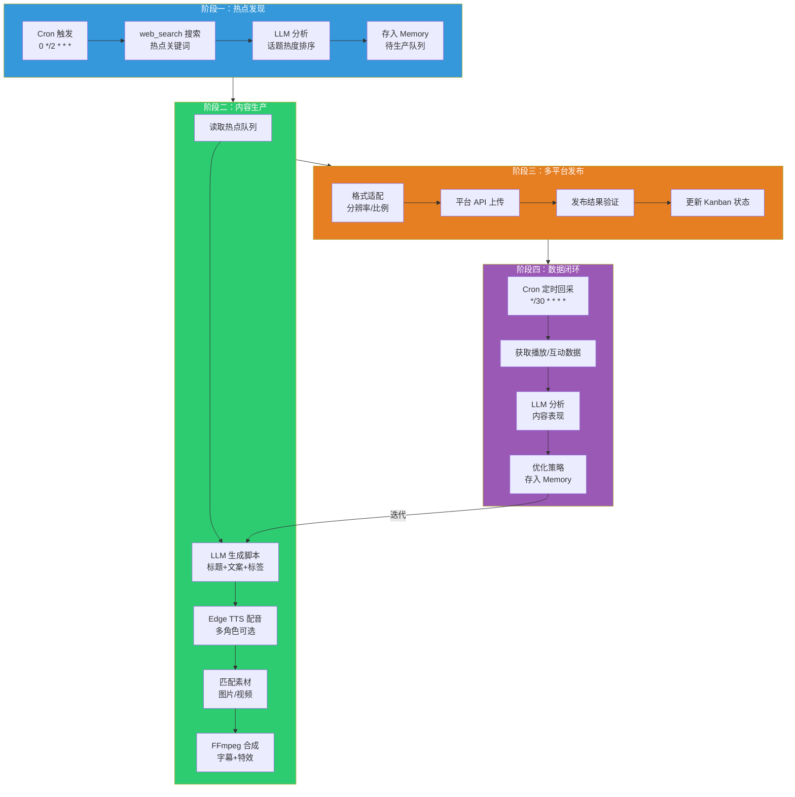
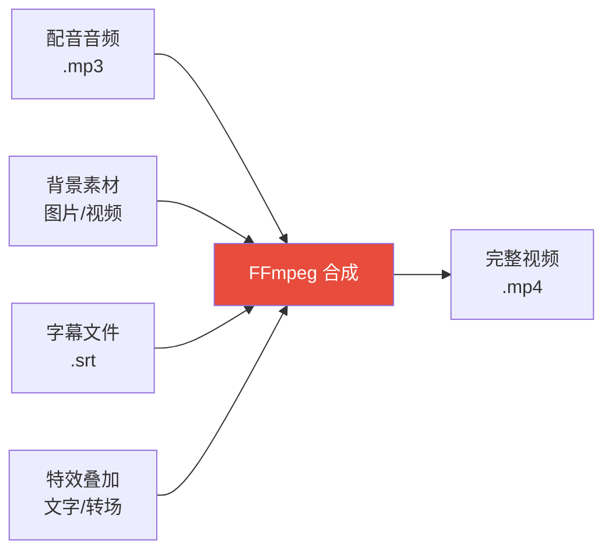
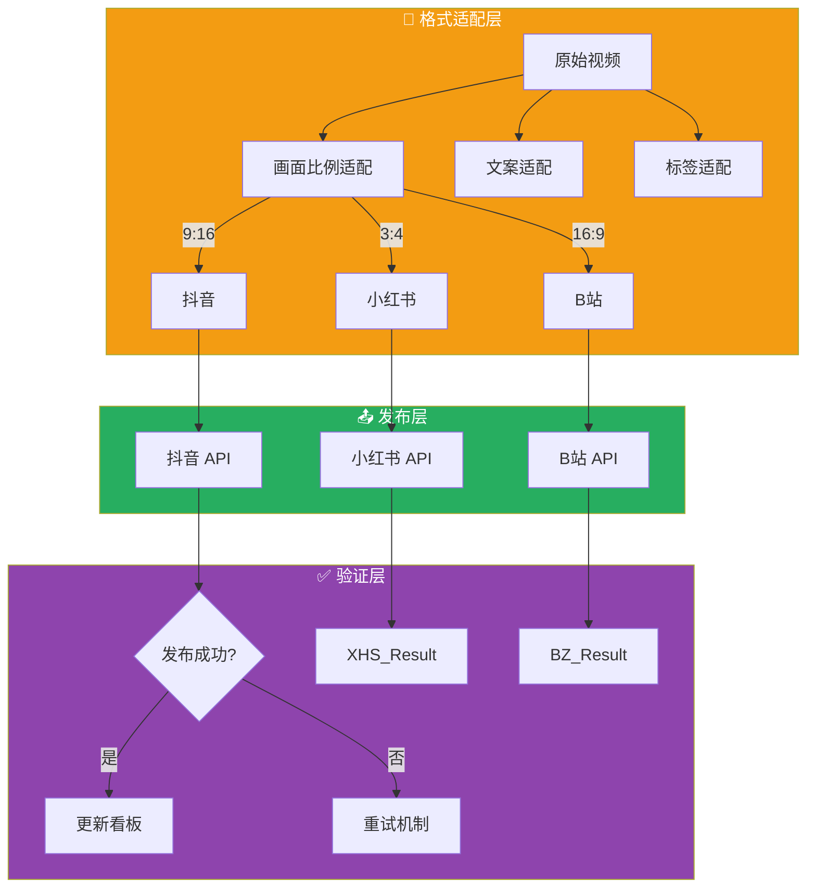

# 03 — 核心流程

## 1. 完整工作流总览



---

## 2. 阶段一：热点追踪

### 2.1 核心逻辑

使用 Hermes 的 `web_search` 工具定时搜索热点话题，结合 LLM 进行热度分析和排序。

### 2.2 热点追踪技能

```yaml
# skills/hot-topic-tracker/SKILL.md
---
name: hot-topic-tracker
description: 定时追踪网络热点话题，分析热度趋势
trigger: cron "0 */2 * * *"
---

# Hot Topic Tracker

## 使用方式
hermes run hot-topic-tracker --params '{"keywords": ["AI", "科技", "教程"]}'

## 工作流程
1. 使用 web_search 搜索指定关键词的热门内容
2. 使用 LLM 分析话题热度、时效性、受众匹配度
3. 将高价值话题存入 Memory 队列
4. 通过 Gateway 推送热点简报

## 参数
- keywords: 搜索关键词列表
- max_topics: 最大追踪话题数（默认 5）
- min_score: 最低热度阈值（默认 0.6）
```

### 2.3 实现代码

```python
# scripts/hot_topic_tracker.py
import json
from datetime import datetime
from hermes import HermesAgent

agent = HermesAgent()

async def track_hot_topics(keywords: list, max_topics: int = 5):
    """追踪热点话题"""
    topics = []

    for keyword in keywords:
        # 使用 web_search 搜索热点
        results = await agent.web_search(
            query=f"{keyword} 热点 最新",
            limit=10
        )

        # 使用 LLM 分析热度
        analysis = await agent.llm_analyze(f"""
        分析以下搜索结果的热度价值，返回 JSON 格式：
        {results}

        评估维度：
        - 话题新鲜度（0-1）
        - 搜索热度（0-1）
        - 受众覆盖面（0-1）
        - 内容可制作性（0-1）

        返回格式：[{{"title": "...", "score": 0.85, "reason": "..."}}]
        """)

        topics.extend(json.loads(analysis))

    # 按热度排序，取 Top N
    topics.sort(key=lambda x: x["score"], reverse=True)
    hot_topics = topics[:max_topics]

    # 存入 Memory
    await agent.memory.set(
        key="hot_topics_queue",
        value=json.dumps(hot_topics, ensure_ascii=False),
        ttl=7200  # 2 小时过期
    )

    # Gateway 推送热点简报
    await agent.gateway.send(
        channel="telegram",
        message=f"🔥 热点追踪简报\n"
                f"共发现 {len(hot_topics)} 个高价值话题\n"
                f"最高热度: {hot_topics[0]['title']} ({hot_topics[0]['score']})"
    )

    return hot_topics
```

---

## 3. 阶段二：内容生产

### 3.1 脚本生成

```python
# scripts/generate_script.py
async def generate_script(topic: dict) -> dict:
    """根据热点话题生成短视频脚本"""
    prompt = f"""
    你是一个短视频脚本专家。根据以下话题，生成一个 60 秒以内的短视频脚本。

    话题：{topic['title']}
    热度评分：{topic['score']}

    要求：
    - 开头 3 秒抓住注意力（黄金 3 秒原则）
    - 内容通俗易懂，适合短视频传播
    - 结尾引导互动（点赞、评论、关注）
    - 适配抖音/小红书/B站三个平台风格

    返回 JSON 格式：
    {{
        "title": "视频标题（不超过 20 字）",
        "description": "视频描述（含话题标签）",
        "script": "完整口播文案",
        "hashtags": ["#标签1", "#标签2"],
        "duration_seconds": 45,
        "style": "教程 | 科普 | 娱乐 | 资讯",
        "platform_adaptations": {{
            "douyin": "抖音适配版本",
            "xiaohongshu": "小红书适配版本",
            "bilibili": "B站适配版本"
        }}
    }}
    """

    script_data = await agent.llm_analyze(prompt)
    script = json.loads(script_data)

    # 保存脚本到文件
    timestamp = datetime.now().strftime("%Y%m%d_%H%M%S")
    filename = f"data/scripts/script_{timestamp}.json"
    with open(filename, "w", encoding="utf-8") as f:
        json.dump(script, f, ensure_ascii=False, indent=2)

    return script
```

### 3.2 TTS 配音

```python
# scripts/tts_generate.py
import edge_tts
import asyncio

async def generate_tts(script: dict, voice: str = "zh-CN-XiaoxiaoNeural") -> str:
    """生成配音音频"""
    text = script["script"]
    output_file = f"data/videos/audio_{datetime.now().strftime('%Y%m%d_%H%M%S')}.mp3"

    # Edge TTS
    tts = edge_tts.Communicate(
        text,
        voice=voice,
        rate="+0%",
        volume="+0%"
    )
    await tts.save(output_file)

    # 获取音频时长
    duration = await get_audio_duration(output_file)

    return {
        "audio_file": output_file,
        "duration": duration,
        "text_length": len(text)
    }

async def get_audio_duration(filepath: str) -> float:
    """获取音频时长（秒）"""
    import subprocess
    result = subprocess.run([
        "ffprobe", "-v", "error",
        "-show_entries", "format=duration",
        "-of", "default=noprint_wrappers=1:nokey=1",
        filepath
    ], capture_output=True, text=True)
    return float(result.stdout.strip())
```

### 3.3 视频合成



```python
# scripts/compose_video.py
import ffmpeg
import json

def compose_video(audio_path: str, script: dict, output_path: str):
    """合成短视频"""
    # 1. 生成字幕文件
    srt_path = generate_subtitles(script["script"], audio_path)

    # 2. 选择背景素材
    background = select_background(script["style"])

    # 3. FFmpeg 合成
    input_video = ffmpeg.input(background, loop=1, framerate=30)
    input_audio = ffmpeg.input(audio_path)

    # 视频参数
    video = (
        ffmpeg
        .output(
            input_video, input_audio,
            output_path,
            vcodec="libx264",
            acodec="aac",
            preset="medium",
            pix_fmt="yuv420p",
            r=30,
            **{
                "vf": f"subtitles={srt_path}:force_style='FontName=Microsoft YaHei,FontSize=24,PrimaryColour=&H00FFFFFF,OutlineColour=&H00000000,BorderStyle=3,Outline=1,Shadow=0,MarginV=50'",
                "shortest": None
            }
        )
        .overwrite_output()
    )

    video.run()

    return output_path

def generate_subtitles(text: str, audio_path: str) -> str:
    """根据文本和音频时长生成 SRT 字幕"""
    import subprocess

    # 获取音频时长
    result = subprocess.run([
        "ffprobe", "-v", "error",
        "-show_entries", "format=duration",
        "-of", "default=noprint_wrappers=1:nokey=1",
        audio_path
    ], capture_output=True, text=True)
    duration = float(result.stdout.strip())

    # 简单分句（按句号分割）
    sentences = [s.strip() for s in text.replace("。", "。\n").split("\n") if s.strip()]

    # 计算每句时长
    per_sentence_duration = duration / len(sentences)

    # 生成 SRT
    srt_lines = []
    start_time = 0.0
    for i, sentence in enumerate(sentences, 1):
        end_time = start_time + per_sentence_duration
        srt_lines.append(str(i))
        srt_lines.append(format_srt_time(start_time) + " --> " + format_srt_time(end_time))
        srt_lines.append(sentence)
        srt_lines.append("")
        start_time = end_time

    srt_path = audio_path.replace(".mp3", ".srt")
    with open(srt_path, "w", encoding="utf-8") as f:
        f.write("\n".join(srt_lines))

    return srt_path

def format_srt_time(seconds: float) -> str:
    """将秒数格式化为 SRT 时间格式"""
    h = int(seconds // 3600)
    m = int((seconds % 3600) // 60)
    s = int(seconds % 60)
    ms = int((seconds % 1) * 1000)
    return f"{h:02d}:{m:02d}:{s:02d},{ms:03d}"
```

---

## 4. 阶段三：多平台发布

### 4.1 平台适配策略



### 4.2 发布实现

```python
# scripts/publish_video.py
import requests
import time
from typing import Dict, List

class VideoPublisher:
    """多平台视频发布器"""

    def __init__(self, config_path: str = "config/platforms.yaml"):
        import yaml
        with open(config_path, "r") as f:
            self.config = yaml.safe_load(f)["platforms"]

    async def publish_to_all(self, video_path: str, script: dict) -> Dict:
        """发布到所有已启用的平台"""
        results = {}

        for platform, cfg in self.config.items():
            if not cfg.get("enabled", False):
                continue

            try:
                # 平台格式适配
                adapted_video = self._adapt_for_platform(video_path, platform)

                # 平台文案适配
                adapted_script = self._adapt_script(script, platform)

                # 发布
                result = await self._publish(platform, adapted_video, adapted_script)
                results[platform] = {
                    "status": "success",
                    "video_id": result.get("video_id"),
                    "url": result.get("url"),
                    "published_at": time.time()
                }

                # 遵守发布间隔
                interval = cfg.get("publish_interval_minutes", 30)
                time.sleep(interval * 60)

            except Exception as e:
                results[platform] = {
                    "status": "failed",
                    "error": str(e)
                }

        return results

    def _adapt_for_platform(self, video_path: str, platform: str) -> str:
        """根据平台要求调整视频格式"""
        requirements = self.config[platform].get("video_requirements", {})
        aspect = requirements.get("aspect_ratio", "9:16")

        output_path = video_path.replace(".mp4", f"_{platform}.mp4")

        # 使用 FFmpeg 调整比例
        import subprocess
        subprocess.run([
            "ffmpeg", "-i", video_path,
            "-vf", f"crop=ih*{aspect.replace(':', '/')}:ih",
            "-c:a", "copy",
            output_path
        ], check=True)

        return output_path

    def _adapt_script(self, script: dict, platform: str) -> dict:
        """根据平台调整文案"""
        adaptations = script.get("platform_adaptations", {})
        adapted = script.copy()

        if platform in adaptations:
            adapted["description"] = adaptations[platform]

        # 平台特定标签
        platform_tags = {
            "douyin": ["#抖音", "#短视频", "#热门"],
            "xiaohongshu": ["#小红书", "#干货", "#教程"],
            "bilibili": ["#B站", "#知识分享", "#科普"]
        }
        adapted["hashtags"].extend(platform_tags.get(platform, []))

        return adapted

    async def _publish(self, platform: str, video_path: str, script: dict) -> dict:
        """调用平台 API 发布视频"""
        cfg = self.config[platform]

        # 各平台 API 端点
        endpoints = {
            "douyin": "https://open.douyin.com/api/v1/video/upload/",
            "xiaohongshu": "https://api.xiaohongshu.com/api/v1/note/publish",
            "bilibili": "https://api.bilibili.com/x/v2/video/upload"
        }

        # 通用上传逻辑（实际需根据各平台 SDK 调整）
        with open(video_path, "rb") as f:
            files = {"video": f}
            headers = {
                "Authorization": f"Bearer {cfg['access_token']}",
                "Content-Type": "multipart/form-data"
            }
            data = {
                "title": script["title"],
                "description": script["description"],
                "hashtags": ",".join(script["hashtags"])
            }

            resp = requests.post(
                endpoints[platform],
                headers=headers,
                files=files,
                data=data,
                timeout=300
            )
            resp.raise_for_status()
            return resp.json()
```

---

## 5. 阶段四：数据回采与优化

### 5.1 数据回采

```python
# scripts/data_collector.py
async def collect_analytics(platform: str, video_id: str) -> dict:
    """回采单个视频的数据"""
    analytics_endpoints = {
        "douyin": f"https://open.douyin.com/api/v1/video/{video_id}/stats/",
        "xiaohongshu": f"https://api.xiaohongshu.com/api/v1/note/{video_id}/stats",
        "bilibili": f"https://api.bilibili.com/x/web-interface/archive/stat?aid={video_id}"
    }

    resp = requests.get(analytics_endpoints[platform], headers=headers)
    data = resp.json()

    return {
        "platform": platform,
        "video_id": video_id,
        "views": data.get("views", 0),
        "likes": data.get("likes", 0),
        "comments": data.get("comments", 0),
        "shares": data.get("shares", 0),
        "collected_at": datetime.now().isoformat()
    }

async def batch_collect():
    """批量回采所有已发布视频的数据"""
    # 从 Memory 读取已发布视频列表
    published = await agent.memory.get("published_videos")

    all_stats = []
    for video in published:
        stats = await collect_analytics(video["platform"], video["video_id"])
        all_stats.append(stats)

    # 保存分析数据
    timestamp = datetime.now().strftime("%Y%m%d")
    with open(f"data/analytics/stats_{timestamp}.json", "w") as f:
        json.dump(all_stats, f, indent=2)

    return all_stats
```

### 5.2 内容优化分析

```python
# scripts/content_optimizer.py
async def optimize_content_strategy():
    """分析历史数据，优化内容策略"""
    # 读取最近 7 天数据
    import glob
    stats_files = sorted(glob.glob("data/analytics/stats_*.json"))[-7:]

    all_stats = []
    for f in stats_files:
        with open(f) as fh:
            all_stats.extend(json.load(fh))

    # LLM 分析
    analysis = await agent.llm_analyze(f"""
    分析以下短视频数据，给出优化建议：

    {json.dumps(all_stats, ensure_ascii=False, indent=2)}

    请分析：
    1. 哪些类型的内容表现最好？
    2. 最佳发布时间段？
    3. 标题/标签优化建议
    4. 各平台内容策略差异

    返回 JSON 格式的优化建议。
    """)

    suggestions = json.loads(analysis)

    # 存入 Memory，供下次生产使用
    await agent.memory.set("content_strategy", json.dumps(suggestions, ensure_ascii=False))

    return suggestions
```

---

## 6. 主流水线编排

```python
# scripts/pipeline.py
from hermes import HermesAgent

agent = HermesAgent()

async def run_pipeline():
    """主流水线：热点 → 生产 → 发布 → 回采"""
    # 更新 Kanban
    await agent.kanban.create_card(
        title="短视频生产流水线",
        status="running",
        tags=["pipeline", "auto"]
    )

    try:
        # 1. 获取热点
        hot_topics = await track_hot_topics(["AI", "科技", "教程"])

        for topic in hot_topics[:3]:  # 每次最多生产 3 条
            # 2. 生成脚本
            script = await generate_script(topic)

            # 3. TTS 配音
            audio = await generate_tts(script)

            # 4. 视频合成
            video = compose_video(audio["audio_file"], script, "data/videos/output.mp4")

            # 5. 多平台发布
            publisher = VideoPublisher()
            results = await publisher.publish_to_all(video, script)

            # 6. 记录发布状态
            await agent.memory.append("published_videos", {
                "topic": topic["title"],
                "script_title": script["title"],
                "platforms": results,
                "published_at": datetime.now().isoformat()
            })

        # 7. 数据回采
        await batch_collect()

        # 更新 Kanban 状态
        await agent.kanban.update_card(status="completed")

        # Gateway 通知
        await agent.gateway.send(
            channel="telegram",
            message=f"✅ 短视频生产完成\n"
                    f"共生产 {len(hot_topics[:3])} 条视频\n"
                    f"发布平台: 抖音/小红书/B站"
        )

    except Exception as e:
        await agent.kanban.update_card(status="failed", error=str(e))
        await agent.gateway.send(
            channel="telegram",
            message=f"❌ 流水线异常: {str(e)}"
        )
        raise
```

---

## 7. 流水线执行时序

```mermaid
gantt
    title 短视频生产流水线执行时序
    dateFormat  HH:mm
    axisFormat  %H:%M

    section 热点追踪
    搜索热点话题           :a1, 00:00, 5min
    LLM 热度分析           :a2, after a1, 3min
    存入队列               :a3, after a2, 1min

    section 内容生产
    脚本生成（3条）        :b1, after a3, 6min
    TTS 配音（3条）        :b2, after b1, 9min
    视频合成（3条）        :b3, after b2, 15min

    section 多平台发布
    抖音发布               :c1, after b3, 3min
    小红书发布             :c2, after c1, 3min
    B站发布                :c3, after c2, 3min

    section 数据闭环
    数据回采               :d1, after c3, 2min
    内容优化分析           :d2, after d1, 3min
    策略更新               :d3, after d2, 1min
```



---

## 8. 关键设计要点

| 要点 | 说明 |
|------|------|
| **幂等性** | 每条视频生成有唯一 ID，避免重复发布 |
| **重试机制** | 发布失败自动重试 3 次，指数退避 |
| **限流保护** | 遵守各平台 API 频率限制，配置合理间隔 |
| **异常隔离** | 单条视频生产失败不影响批次中其他视频 |
| **可观测性** | 所有步骤记录日志，Kanban 可视化状态 |
| **优雅降级** | 某个平台不可用时，自动跳过不影响其他平台 |
