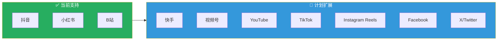
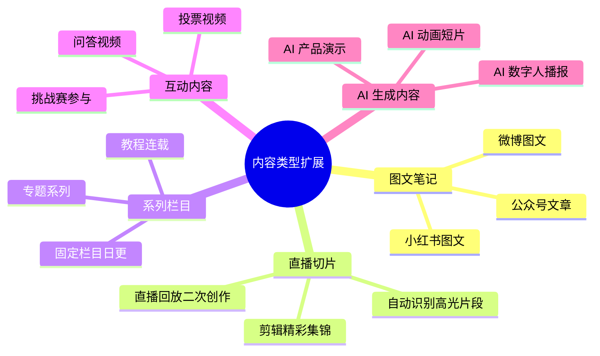
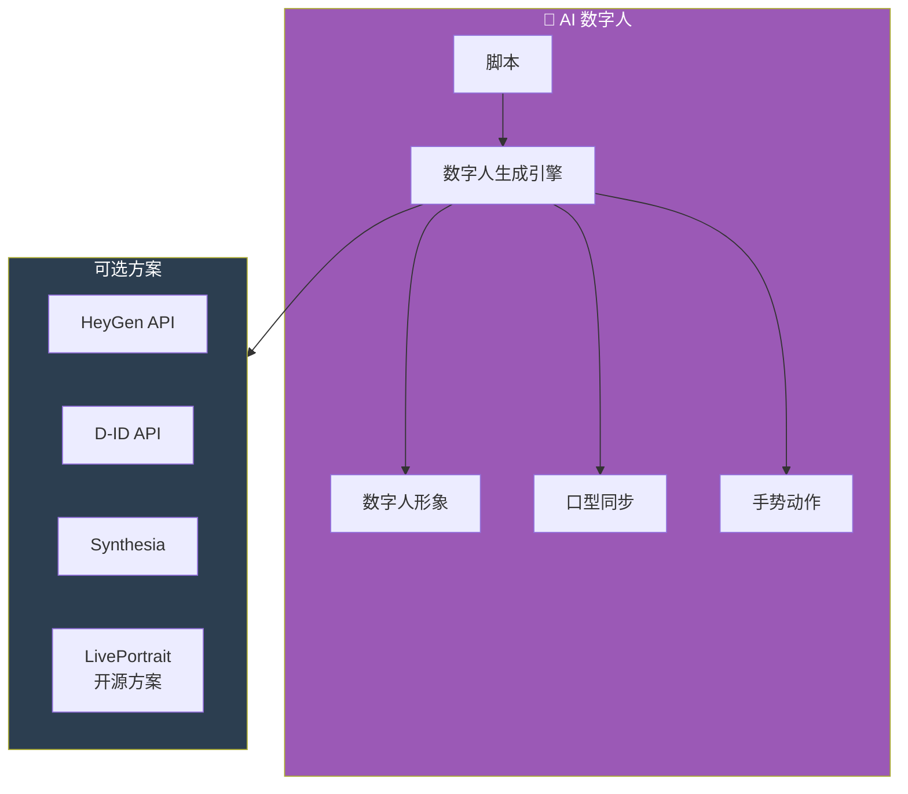
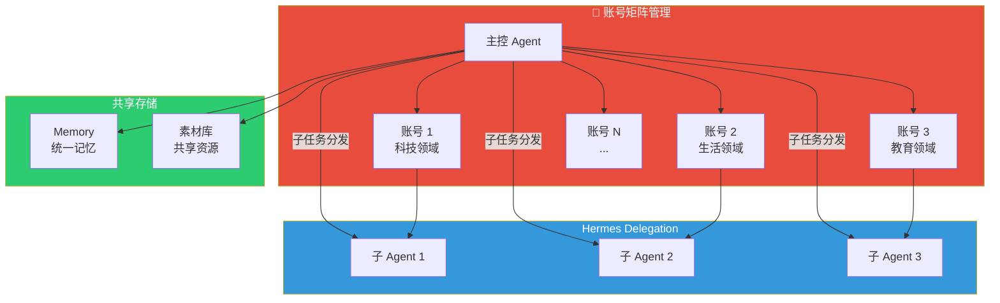
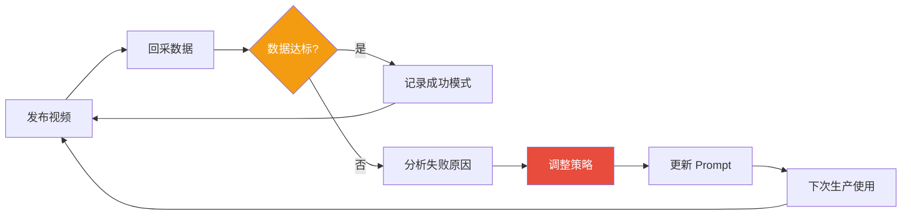
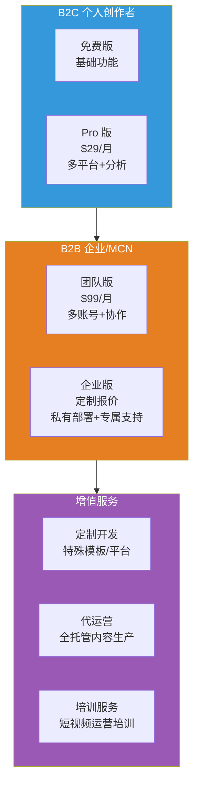
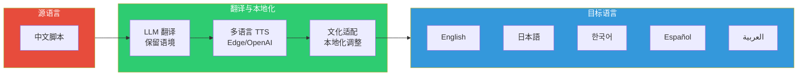
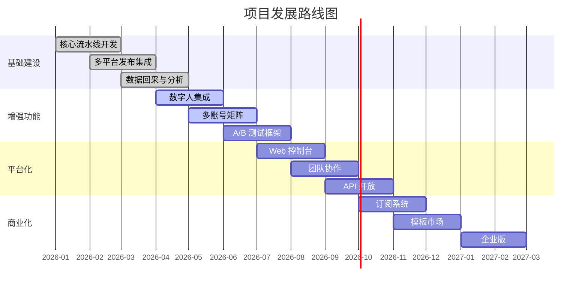

# 05 — 扩展思路

> 本文档探讨了在基础短视频自动生产流水线之上，可以进一步扩展的功能方向、性能优化策略以及商业化落地路径。

---

## 目录

1. [功能扩展](#1-功能扩展)
2. [AI 能力增强](#2-ai-能力增强)
3. [多模态内容生产](#3-多模态内容生产)
4. [多账号矩阵管理](#4-多账号矩阵管理)
5. [数据驱动优化](#5-数据驱动优化)
6. [性能与可靠性](#6-性能与可靠性)
7. [商业化方向](#7-商业化方向)
8. [出海与多语言](#8-出海与多语言)

---

## 1. 功能扩展

### 1.1 多平台适配扩展



| 平台 | 接入难度 | 优先级 | 备注 |
|------|----------|--------|------|
| **快手** | 🟢 低 | ⭐⭐⭐⭐⭐ | API 与抖音类似，适配成本低 |
| **视频号** | 🟡 中 | ⭐⭐⭐⭐ | 微信生态，需公众号关联 |
| **YouTube** | 🟢 低 | ⭐⭐⭐⭐ | 出海必备，API 文档完善 |
| **TikTok** | 🟢 低 | ⭐⭐⭐⭐⭐ | 出海核心平台，API 与抖音同源 |
| **Instagram Reels** | 🟡 中 | ⭐⭐⭐ | Meta 系，需 Facebook 开发者账号 |
| **X/Twitter** | 🟢 低 | ⭐⭐ | 短内容为主，视频非核心 |

### 1.2 内容类型扩展



### 1.3 定时发布策略

```python
# 智能发布时间调度
class SmartScheduler:
    """基于历史数据的智能发布时间调度"""

    def __init__(self):
        self.platform_windows = {
            "douyin": [(7, 9), (12, 14), (19, 22)],
            "xiaohongshu": [(8, 10), (11, 13), (18, 21)],
            "bilibili": [(10, 12), (16, 18), (20, 23)]
        }

    async def get_best_slot(self, platform: str, content_type: str) -> datetime:
        """获取最佳发布时间段"""
        # 基于历史数据优化
        historical = await agent.memory.get(f"best_times_{platform}")

        if historical:
            # 使用历史最优时间
            return self._parse_best_time(historical)
        else:
            # 使用默认时间窗口
            return self._random_in_window(self.platform_windows[platform])

    def _random_in_window(self, windows: list) -> datetime:
        """在时间窗口内随机选择"""
        import random
        from datetime import datetime, timedelta

        now = datetime.now()
        window = random.choice(windows)
        hour = random.randint(window[0], window[1] - 1)
        minute = random.randint(0, 59)

        return now.replace(hour=hour, minute=minute, second=0, microsecond=0)
```

---

## 2. AI 能力增强

### 2.1 脚本质量提升

| 方向 | 实现方式 | 效果 |
|------|----------|------|
| **多模型对比** | 同时使用 GPT-4o / Claude / DeepSeek 生成脚本，择优 | 脚本质量提升 30%+ |
| **风格迁移** | 分析爆款视频文案风格，迁移到新脚本 | 更符合平台调性 |
| **A/B 测试** | 同一话题生成多个版本脚本，对比发布效果 | 数据驱动优化 |
| **热点预测** | 基于趋势分析预测下一波热点，提前准备内容 | 抢占流量先机 |

### 2.2 AI 数字人播报



```python
# 数字人视频生成示例
async def generate_digital_human_video(script: str, avatar_id: str) -> str:
    """使用数字人 API 生成播报视频"""
    # HeyGen API 示例
    response = requests.post(
        "https://api.heygen.com/v2/video/generate",
        headers={
            "X-Api-Key": "${HEYGEN_API_KEY}",
            "Content-Type": "application/json"
        },
        json={
            "avatar_id": avatar_id,
            "script": script,
            "background": "solid",
            "background_color": "#FFFFFF",
            "ratio": "9:16"
        }
    )
    return response.json()["data"]["video_url"]
```

### 2.3 AI 素材生成

```python
# 全 AI 生成素材
class AIMaterialGenerator:
    """AI 素材生成器"""

    async def generate_background(self, style: str, keywords: str) -> str:
        """生成背景图"""
        # 使用 DALL-E 3 / Midjourney / Stable Diffusion
        prompt = f"短视频背景，{style}风格，{keywords}，竖屏9:16，柔和色调"
        # ... 调用图片生成 API

    async def generate_bgm(self, mood: str, duration: int) -> str:
        """生成背景音乐"""
        # 使用 Suno / MusicGen
        prompt = f"{mood}背景音乐，{duration}秒，无歌词"
        # ... 调用音乐生成 API

    async def generate_thumbnail(self, title: str) -> str:
        """生成视频封面图"""
        prompt = f"短视频封面，标题：{title}，吸引眼球，高对比度"
        # ... 调用图片生成 API
```

---

## 3. 多模态内容生产

### 3.1 视频模板系统

```yaml
# config/video_templates.yaml
templates:
  # 教程类模板
  tutorial:
    layout: "split_screen"
    duration: 45
    elements:
      - type: "background_video"
        source: "auto_generated"
      - type: "voiceover"
        source: "tts"
      - type: "subtitle"
        style: "bottom_center"
      - type: "step_number"
        position: "top_left"
      - type: "highlight_box"
        position: "center"

  # 资讯类模板
  news:
    layout: "full_screen"
    duration: 30
    elements:
      - type: "background_image"
        source: "news_related"
      - type: "voiceover"
        source: "tts"
      - type: "title_overlay"
        style: "bold_center"
      - type: "news_ticker"
        position: "bottom"

  # 产品展示模板
  product_showcase:
    layout: "product_focus"
    duration: 60
    elements:
      - type: "product_video"
        source: "uploaded"
      - type: "voiceover"
        source: "tts"
      - type: "price_tag"
        position: "top_right"
      - type: "cta_button"
        text: "点击购买"
```

### 3.2 视频风格迁移

```python
# 视频风格处理
class VideoStylizer:
    """视频风格化处理"""

    async def apply_style(self, video_path: str, style: str) -> str:
        """应用视频风格"""
        styles = {
            "cinematic": self._cinematic_style,
            "vlog": self._vlog_style,
            "tutorial": self._tutorial_style,
            "promotional": self._promotional_style
        }

        processor = styles.get(style, self._default_style)
        return await processor(video_path)

    async def _cinematic_style(self, video_path: str) -> str:
        """电影风格：宽屏黑边、胶片色调"""
        output = video_path.replace(".mp4", "_cinematic.mp4")
        # FFmpeg 滤镜链
        # - 添加上下黑边（2.35:1）
        # - 色彩分级（暖色调）
        # - 添加胶片颗粒
        return output

    async def _vlog_style(self, video_path: str) -> str:
        """Vlog 风格：明亮、高饱和度"""
        output = video_path.replace(".mp4", "_vlog.mp4")
        # FFmpeg 滤镜链
        # - 提高亮度和饱和度
        # - 轻微磨皮
        # - 添加文字水印
        return output
```

---

## 4. 多账号矩阵管理

### 4.1 账号矩阵架构



### 4.2 多账号配置

```yaml
# config/accounts.yaml
accounts:
  # 科技号
  tech_account:
    platform: "douyin"
    app_id: "${TECH_DOUYIN_APP_ID}"
    app_secret: "${TECH_DOUYIN_SECRET}"
    niche: "科技"
    publish_schedule: "0 8,12,19 * * *"
    content_style: "专业、深度"
    target_audience: "科技爱好者、程序员"

  # 生活号
  lifestyle_account:
    platform: "xiaohongshu"
    app_id: "${LIFE_XHS_APP_ID}"
    app_secret: "${LIFE_XHS_SECRET}"
    niche: "生活方式"
    publish_schedule: "0 9,13,20 * * *"
    content_style: "温馨、实用"
    target_audience: "年轻女性、上班族"

  # 教育号
  education_account:
    platform: "bilibili"
    app_id: "${EDU_BILI_APP_ID}"
    app_secret: "${EDU_BILI_SECRET}"
    niche: "知识教育"
    publish_schedule: "0 10,16,21 * * *"
    content_style: "系统、易懂"
    target_audience: "学生、自我提升人群"
```

### 4.3 内容去重与差异化

```python
class ContentDifferentiator:
    """多账号内容差异化处理"""

    async def differentiate(self, base_script: dict, account: dict) -> dict:
        """根据账号定位差异化内容"""
        prompt = f"""
        你是一个内容差异化专家。请根据以下账号定位，对原始脚本进行改编。

        原始脚本：
        {json.dumps(base_script, ensure_ascii=False)}

        账号定位：
        - 领域：{account['niche']}
        - 风格：{account['content_style']}
        - 受众：{account['target_audience']}

        要求：
        1. 保持核心信息不变
        2. 调整语言风格和表达方式
        3. 添加该领域特有的案例和术语
        4. 标题和标签需差异化
        5. 确保与同矩阵其他账号内容不重复
        """

        adapted = await agent.llm_analyze(prompt)
        return json.loads(adapted)
```

---

## 5. 数据驱动优化

### 5.1 智能分析仪表盘

```python
class AnalyticsDashboard:
    """数据分析和可视化"""

    async def generate_report(self, days: int = 7) -> dict:
        """生成内容分析报告"""
        stats = await self._collect_stats(days)

        report = {
            "summary": {
                "total_videos": len(stats),
                "total_views": sum(s["views"] for s in stats),
                "total_likes": sum(s["likes"] for s in stats),
                "avg_completion_rate": self._avg(stats, "completion_rate")
            },
            "top_performers": self._top_n(stats, "views", 5),
            "worst_performers": self._top_n(stats, "views", 5, reverse=True),
            "platform_breakdown": self._group_by_platform(stats),
            "time_analysis": self._analyze_by_time(stats),
            "topic_analysis": self._analyze_by_topic(stats),
            "recommendations": await self._generate_recommendations(stats)
        }

        return report

    async def _generate_recommendations(self, stats: list) -> list:
        """LLM 生成优化建议"""
        return await agent.llm_analyze(f"""
        基于以下数据，给出 5 条可执行的内容优化建议：

        {json.dumps(stats, ensure_ascii=False)}

        要求：
        - 每条建议具体可操作
        - 说明预期效果
        - 区分短期和长期建议
        """)
```

### 5.2 A/B 测试框架

```python
class ABTestFramework:
    """内容 A/B 测试"""

    async def run_ab_test(self, topic: str, variants: int = 3):
        """对同一话题生成多个版本进行对比测试"""
        # 生成多个版本
        scripts = []
        for i in range(variants):
            script = await generate_script({
                "title": topic,
                "variation": i,
                "style": ["教程", "娱乐", "资讯"][i]
            })
            scripts.append(script)

        # 生产视频
        videos = []
        for script in scripts:
            video = await produce_video(script)
            videos.append(video)

        # 在不同时间/账号发布
        results = []
        for i, video in enumerate(videos):
            result = await publish_to_platform(video, scripts[i])
            results.append(result)

        # 24 小时后对比数据
        await asyncio.sleep(86400)
        comparison = await self._compare_results(results)

        # 胜出版本策略存入 Memory
        winner = max(comparison, key=lambda x: x["engagement_rate"])
        await agent.memory.set(
            f"ab_test_winner_{topic}",
            json.dumps(winner)
        )

        return comparison
```

### 5.3 自动优化循环



---

## 6. 性能与可靠性

### 6.1 流水线并行化

```python
# 使用 Hermes Delegation 实现并行生产
async def parallel_production(topics: list):
    """并行生产多条视频"""
    from hermes import Delegation

    delegation = Delegation()

    # 为每个话题创建子任务
    tasks = []
    for topic in topics:
        task = await delegation.create_task(
            name=f"produce_{topic['title'][:10]}",
            skill="short-video-pipeline",
            params={"topic": topic}
        )
        tasks.append(task)

    # 等待所有子任务完成
    results = await delegation.wait_all(tasks)

    return results
```

### 6.2 缓存策略

```python
class CacheManager:
    """多级缓存管理"""

    def __init__(self):
        self.memory_cache = {}  # 内存缓存
        self.disk_cache_dir = "data/cache/"

    async def get_or_generate(self, key: str, generator_func, ttl: int = 3600):
        """缓存优先，避免重复生成"""
        # 1. 内存缓存
        if key in self.memory_cache:
            cached = self.memory_cache[key]
            if time.time() - cached["time"] < ttl:
                return cached["data"]

        # 2. 磁盘缓存
        disk_path = f"{self.disk_cache_dir}{key}.json"
        if os.path.exists(disk_path):
            with open(disk_path) as f:
                data = json.load(f)
                self.memory_cache[key] = {"data": data, "time": time.time()}
                return data

        # 3. 生成新内容
        data = await generator_func()

        # 4. 写入缓存
        self.memory_cache[key] = {"data": data, "time": time.time()}
        with open(disk_path, "w") as f:
            json.dump(data, f)

        return data
```

### 6.3 监控与告警

```yaml
# config/monitoring.yaml
monitoring:
  # 健康检查
  health_checks:
    - name: "ffmpeg_available"
      command: "ffmpeg -version"
      interval: 300  # 5 分钟
    - name: "disk_space"
      threshold_gb: 5
      interval: 600
    - name: "api_reachability"
      endpoints:
        - "https://open.douyin.com"
        - "https://api.xiaohongshu.com"
      interval: 600

  # 告警规则
  alerts:
    - name: "pipeline_failure"
      condition: "连续 3 次流水线失败"
      action: "Gateway 推送 + 邮件通知"
    - name: "low_engagement"
      condition: "最近 10 条视频平均互动率 < 1%"
      action: "Gateway 推送 + 自动暂停生产"
    - name: "api_quota_exceeded"
      condition: "API 返回 429 超过 5 次/小时"
      action: "自动降级 + Gateway 告警"

  # 日志
  logging:
    level: "INFO"
    retention_days: 30
    channels: ["file", "gateway"]
```

---

## 7. 商业化方向

### 7.1 产品化路径

| 阶段 | 目标 | 关键动作 | 收入来源 |
|------|------|----------|----------|
| **MVP** | 个人创作者工具 | 基础流水线 + 单平台发布 | 免费/开源 |
| **V1.0** | 小团队工具 | 多平台 + 多账号 + 数据分析 | 订阅制（$29/月） |
| **V2.0** | MCN 机构平台 | 矩阵管理 + A/B 测试 + 智能优化 | 按账号收费（$99/月） |
| **V3.0** | SaaS 平台 | Web 控制台 + 团队协作 + API | 分层订阅 + 用量计费 |

### 7.2 商业模式



### 7.3 竞品分析

| 产品 | 定位 | 优势 | 劣势 | 差异化机会 |
|------|------|------|------|------------|
| **剪映** | 视频编辑工具 | 用户量大、模板丰富 | 非自动化、需人工操作 | 全自动流水线 |
| **蝉妈妈** | 数据分析平台 | 数据维度全面 | 不涉及内容生产 | 生产+分析闭环 |
| **特赞** | 内容中台 | 企业级服务 | 价格高、部署复杂 | 轻量级 Agent 方案 |
| **HeyGen** | AI 数字人 | 数字人效果好 | 仅数字人、价格高 | 完整生产流水线 |

---

## 8. 出海与多语言

### 8.1 多语言内容生产



### 8.2 出海平台配置

```yaml
# config/overseas.yaml
overseas_platforms:
  youtube:
    enabled: false
    api_key: "${YOUTUBE_API_KEY}"
    category: "Education"
    default_language: "en"
    monetization: true

  tiktok:
    enabled: false
    api_key: "${TIKTOK_API_KEY}"
    region: "US"
    hashtag_strategy: "trending"

  instagram:
    enabled: false
    api_key: "${INSTAGRAM_API_KEY}"
    account_type: "creator"
    content_format: "reels"

# 多语言配音映射
multilingual_voices:
  en:
    edge: "en-US-JennyNeural"
    openai: "nova"
  ja:
    edge: "ja-JP-NanamiNeural"
    openai: "shimmer"
  ko:
    edge: "ko-KR-SunHiNeural"
    openai: "alloy"
  es:
    edge: "es-ES-ElviraNeural"
    openai: "onyx"
  fr:
    edge: "fr-FR-DeniseNeural"
    openai: "fable"
  de:
    edge: "de-DE-KatjaNeural"
    openai: "echo"
```

### 8.3 文化适配策略

```python
class CulturalAdapter:
    """跨文化内容适配"""

    async def adapt_for_region(self, script: dict, region: str) -> dict:
        """根据目标地区进行文化适配"""
        prompt = f"""
        将以下短视频脚本适配到 {region} 市场。

        原始脚本：
        {json.dumps(script, ensure_ascii=False)}

        适配要求：
        1. 翻译为当地语言，保持口语化
        2. 替换文化特定引用（节日、名人、梗）
        3. 调整案例和类比为当地受众熟悉的内容
        4. 适配当地的视频消费习惯（时长、节奏）
        5. 添加当地热门标签
        6. 注意文化禁忌和敏感话题

        目标地区特征：
        - 美国：快节奏、直接、幽默
        - 日本：礼貌、详细、视觉丰富
        - 韩国：时尚、简洁、互动性强
        - 中东：尊重宗教习俗、家庭导向
        """

        adapted = await agent.llm_analyze(prompt)
        return json.loads(adapted)
```

---

## 9. 社区与生态

### 9.1 插件系统

```python
# 插件接口示例
class VideoPlugin:
    """视频处理插件基类"""

    def name(self) -> str:
        raise NotImplementedError

    def hooks(self) -> list:
        """注册钩子"""
        return ["before_compose", "after_compose", "before_publish"]

    async def before_compose(self, context: dict) -> dict:
        """合成前处理"""
        return context

    async def after_compose(self, video_path: str) -> str:
        """合成后处理"""
        return video_path

    async def before_publish(self, video_path: str, metadata: dict) -> tuple:
        """发布前处理"""
        return video_path, metadata
```

### 9.2 模板市场

| 模板类型 | 适用场景 | 价格模式 |
|----------|----------|----------|
| 教程模板 | 知识分享、技能教学 | 免费/付费 |
| 资讯模板 | 新闻快讯、行业动态 | 免费 |
| 种草模板 | 产品测评、好物推荐 | 付费 |
| 娱乐模板 | 搞笑、挑战、Vlog | 免费 |
| 营销模板 | 品牌推广、活动宣传 | 付费 |
| 出海模板 | 多语言内容 | 付费 |

---

## 10. 路线图



---

## 总结

本项目从**个人创作者工具**出发，通过不断迭代可以演变为**MCN 机构级的内容生产平台**。核心扩展方向包括：

1. **横向扩展**：接入更多平台、支持更多内容类型
2. **纵向深化**：AI 数字人、智能优化、数据驱动
3. **规模化**：多账号矩阵、并行生产、团队协作
4. **商业化**：SaaS 订阅、模板市场、企业服务
5. **全球化**：多语言适配、出海平台、文化本地化

> 💡 **建议**：根据实际需求选择扩展方向，避免过度设计。建议优先实现「多账号矩阵」和「数据驱动优化」，这是 ROI 最高的两个方向。
