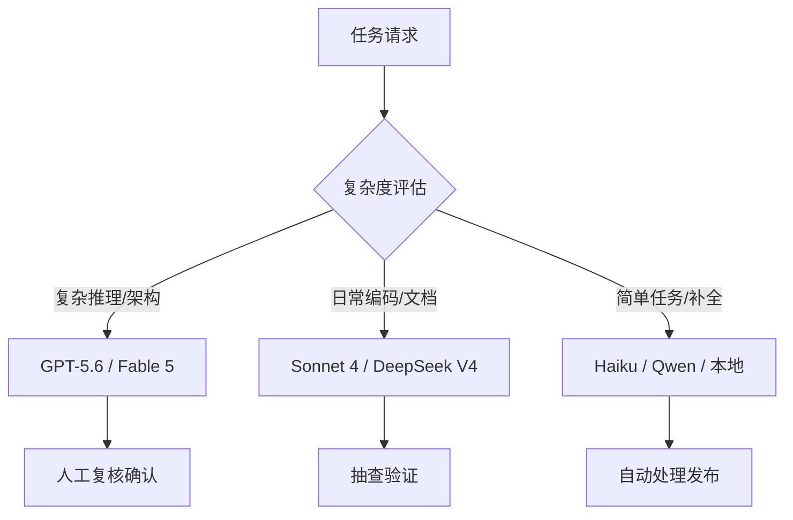

# 模型路由策略

> 不是所有任务都需要最强模型。三档路由帮你最大化性价比。

## 三档路由框架

| 档位 | 代表模型 | 适用场景 | 月成本估算 |
|:----:|---------|---------|-----------|
| 🥇 **高档** | GPT-5.6 / Claude Fable 5 | 复杂架构设计、安全审计、关键报告 | $50-200 |
| 🥈 **中档** | Claude Sonnet 4 / Gemini / DeepSeek V4 Pro | 日常编码、API设计、中等推理、文档 | $10-50 |
| 🥉 **低档** | Claude Haiku / Qwen / DeepSeek Flash / 本地模型 | 格式转换、简单分类、代码补全、草稿 | $0-10 |

## 路由工具选型

| 工具 | 类型 | 切换方式 | 适用场景 |
|------|------|---------|---------|
| **CC Switch** | 手动管理器 | Claude Code 内一键切换 | 开发者日常使用 |
| **9Router** | 免费自动路由 | 自动捕获API调用按规则分发 | 预算极紧/学习环境 |
| **OmniRoute** | 企业级智能网关 | 运行时决策+负载均衡+压缩 | 生产环境、团队共享（278供应商） |

## 决策流程

## 数据安全路由

| 数据级别 | 路由策略 | 模型选择 | 说明 |
|---------|---------|---------|------|
| 🔒 核心（PII/金融） | **强制本地** | Ollama:qwen-coder | 绝对不出域 |
| 🔐 敏感（内部文档） | 本地优先 | Ollama → vLLM fallback | 优先本地，备用内网 |
| 📋 一般（业务数据） | 国内云端默认 | DeepSeek V4 Pro | 国产合规 |
| 🌐 公开（通用查询） | 全球最优 | Claude / GPT | 无敏感信息 |

## 成本优化策略

1. **默认用中档**：80% 任务中档模型足够
2. **免费模型做预筛选**：Gemini Flash 先判断复杂度再决定
3. **本地模型跑批量**：Ollama 处理格式化、转换、分类
4. **OmniRoute 压缩**：RTK+Caveman 可减少 15-95% Token

## 常见场景路由

| 场景 | 首选用 | 备选 | 工具 |
|------|--------|------|------|
| 全自动出原型 | GPT-5.3 Codex | DeepSeek V4 Pro | Codex CLI |
| 复杂Bug分析 | Claude Fable 5 | DeepSeek V4 Pro | Claude Code |
| 写中文文档 | Kimi K3 | Qwen 3.7 | Hermes |
| 每天自动巡检 | DeepSeek V4 Flash | Qwen3 8B (本地) | Hermes + Cron |
| 完全离线开发 | Qwen-Coder 32B | — | Hermes + Ollama |

## 相关

- [[00-主流模型对比]] — 各模型详细能力与定价
- [[01-9router-快速入门手册]] — 免费路由配置实战
- [[02-CC-Switch-模型管理器]] — 手动切换操作指南
- [[03-omniRoute-使用指南]] — 企业级网关完整配置
- [[Agent学习与VibeCoding完全指南_2026年7月版|完全指南]] — 第7章 OmniRoute、第16章价格策略
