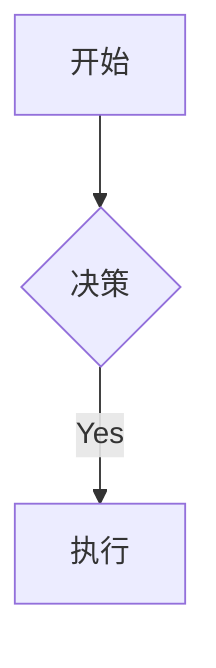

# obsidian-markdown 使用手册

## 概述

Obsidian 扩展了 CommonMark/GFM，增加了以下扩展语法。本手册仅覆盖 Obsidian 特有语法，标准 Markdown 为前置知识。

## 1. 内部链接 (Wikilinks)

```markdown
[[笔记名]]                          链接到笔记
[[笔记名|显示文字]]                  自定义显示文字
[[笔记名#标题]]                      链接到标题
[[笔记名#^块ID]]                     链接到块
[[#当前笔记的标题]]                  同笔记内标题跳转
```

定义块 ID（追加在段落后）：

```markdown
这一段可以被链接。^我的块ID
```

## 2. 嵌入 (Embeds)

```markdown
![[笔记名]]                          嵌入完整笔记
![[笔记名#标题]]                      嵌入特定段落
![[图片.png]]                        嵌入图片
![[图片.png|300]]                    指定宽度
![[文档.pdf#page=3]]                 嵌入 PDF 指定页
![[音频.mp3]]                        嵌入音频
![[Base.base#视图名]]                 嵌入 Base 视图
```

外部图片：

```markdown


```

搜索嵌入：

````markdown
```query
tag:#project status:done
```
````

## 3. Callouts (提示框)

```markdown
> [!note]
> 基础提示框。

> [!warning] 自定义标题
> 带自定义标题。

> [!faq]- 默认折叠
> 可折叠（`-` 折叠，`+` 展开）。
```

### 支持类型

| 类型 | 别名 | 颜色 |
|------|------|------|
| `note` | — | 蓝 |
| `abstract` | `summary`, `tldr` | 青绿 |
| `info` | — | 蓝 |
| `todo` | — | 蓝 |
| `tip` | `hint`, `important` | 青色 |
| `success` | `check`, `done` | 绿 |
| `question` | `help`, `faq` | 黄 |
| `warning` | `caution`, `attention` | 橙 |
| `failure` | `fail`, `missing` | 红 |
| `danger` | `error` | 红 |
| `bug` | — | 红 |
| `example` | — | 紫 |
| `quote` | `cite` | 灰 |

### 嵌套 Callouts

```markdown
> [!question] 外层
> > [!note] 内层
> > 嵌套内容
```

## 4. 属性 (Frontmatter)

```yaml
---
title: 我的笔记
date: 2024-01-15
tags:
  - project
  - active
aliases:
  - 别名
cssclasses:
  - custom-class
---
```

### 属性类型

| 类型 | 示例 |
|------|------|
| 文本 | `title: My Title` |
| 数字 | `rating: 4.5` |
| 布尔 | `completed: true` |
| 日期 | `date: 2024-01-15` |
| 日期时间 | `due: 2024-01-15T14:30:00` |
| 列表 | `tags: [one, two]` |
| 链接 | `related: "[[Other Note]]"` |

## 5. 标签 (Tags)

```markdown
#标签
#嵌套/标签
#带短横-的标签
```

## 6. 注释

```markdown
这是可见 %%但这是隐藏的%% 文字。

%%
整块在阅读视图隐藏。
%%
```

## 7. 其他语法

```markdown
==高亮文字==                      高亮

内联公式：$e^{i\pi} + 1 = 0$

块公式：
$$
\frac{a}{b} = c
$$

Mermaid 图表：


脚注[^1]。

[^1]: 脚注内容。
内联脚注。^[这是内联。]
```

## 8. 完整示例

```markdown
---
title: 项目 Alpha
date: 2024-01-15
tags:
  - project
  - active
status: in-progress
---

# 项目 Alpha

本项目旨在 [[优化工作流]]。

> [!important] 关键截止日
> 第一个里程碑在 ==1月30日==。

- [x] 初步规划
- [ ] 开发阶段

![[架构图.png|600]]
```

## 参考链接

- [Obsidian Flavored Markdown](https://help.obsidian.md/obsidian-flavored-markdown)
- [内部链接](https://help.obsidian.md/links)
- [嵌入文件](https://help.obsidian.md/embeds)
- [Callouts](https://help.obsidian.md/callouts)
- [属性](https://help.obsidian.md/properties)
