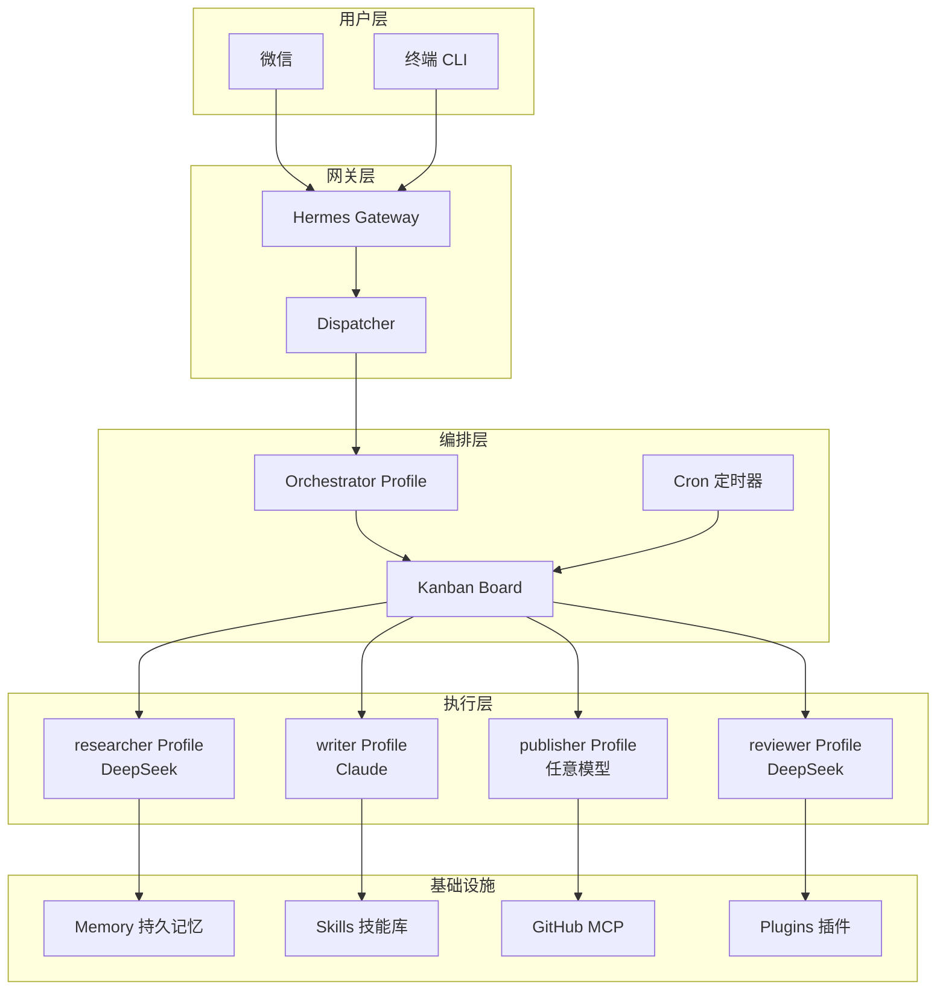

# 博客自动发布系统 — 项目总览

> **必读入口** — 本文档是整个项目实战的总览，建议按以下顺序阅读：
>
> 1. **README.md**（本文）→ 项目概览、架构、目录
> 2. **docs/01-架构设计.md** → 系统架构与模块详解
> 3. **docs/02-环境搭建.md** → 从零搭建环境
> 4. **docs/03-核心流程.md** → 完整工作流与运行机制
> 5. **docs/04-踩坑记录.md** → 常见问题与解决方案
> 6. **docs/05-扩展思路.md** → 进阶方向与扩展方案

---

## 项目背景

模拟一个两人技术团队维护的技术博客。需求：

- 每周发布 2~3 篇 AI / 前端领域的技术文章
- 文章质量要求较高，需要经过调研、撰写、审核三个环节
- 最终发布到 GitHub Pages 博客仓库
- 团队负责人通过微信随时随地跟进和审批
- 系统需要自主学习团队的写作风格和偏好

## 一句话描述

> **基于 Hermes Agent 的多 Profile 协作 + Kanban Swarm 任务编排 + Cron 定时流水线，实现从选题到发布的全自动博客运营系统。**

## 核心价值

| 价值 | 说明 |
|------|------|
| 🤖 **全自动选题** | Cron 定时采集热点 → 筛选 → 生成简报，每天早上推送微信 |
| 👥 **多角色协作** | 4 个 Profile（researcher/writer/reviewer/publisher）各司其职 |
| 🧠 **Orchestrator 编排** | 自动拆解写作任务为调研→写作→审核→发布子任务 |
| 📱 **微信交互** | 通过微信发起任务、接收审核通知、手动干预 |
| 📚 **持续进化** | 自动沉淀写作 Skill、Curator 维护、Memory 持久记忆 |
| 🔧 **25+ 功能串联** | 覆盖 Hermes Agent 大部分核心功能 |

## 技术栈概览

| 组件 | 技术选型 | 用途 |
|------|---------|------|
| **Hermes Agent** | v0.16+ | 核心 AI Agent 框架 |
| **Profile** | researcher / writer / reviewer / publisher / orchestrator | 多角色隔离 |
| **Provider** | DeepSeek v4 flash（调研）+ Claude Sonnet（写作） | 模型按需分配 |
| **Kanban** | Hermes 内置看板 | 任务状态管理与协作 |
| **Cron** | Hermes 定时任务 + `context_from` 依赖链 | 选题流水线 |
| **Gateway** | Hermes Gateway（微信） | 消息收发与通知 |
| **MCP** | GitHub MCP Server | 自动提交文章到仓库 |
| **Memory** | Hermes 内置持久记忆 | 记住博客配置与偏好 |
| **Skills** | blogwatcher + 自定义写作 skill | 工具与流程沉淀 |

## 架构图



## 目录结构

```
01-博客自动发布系统-Hermes实战/
├── README.md                    # 项目总览（本文）
├── docs/
│   ├── 01-架构设计.md           # 系统架构与模块详解
│   ├── 02-环境搭建.md           # 从零搭建完整环境
│   ├── 03-核心流程.md           # 完整工作流与运行机制
│   ├── 04-踩坑记录.md           # 常见问题与解决方案
│   └── 05-扩展思路.md           # 进阶方向与扩展方案
```

## 功能覆盖清单

本实战案例串联了 Hermes Agent 的 **25 项以上核心功能**：

| 序号 | 功能 | 所属模块 | 使用场景 |
|------|------|---------|----------|
| 1 | **Profile** | 协作篇 | 创建 researcher、writer、reviewer、publisher 四个角色 |
| 2 | **Provider** | 入门篇 | researcher 用 DeepSeek（便宜），writer 用 Claude（质量） |
| 3 | **Skills** | 进化篇 | 安装 blogwatcher；writer 加载写作风格 skill |
| 4 | **skill_manage** | 进化篇 | writer Agent 自动沉淀「技术博文写作规范」skill |
| 5 | **Curator** | 进化篇 | 维护自动生成的写作 skill，合并重复模板 |
| 6 | **Memory** | 能力篇 | 记住博客 Markdown 风格偏好、发布平台 API 配置 |
| 7 | **session_search** | 能力篇 | 回查历史会话中讨论过的选题 |
| 8 | **Cron** | 进化篇 | 每天早上收集 HN/知乎 AI 新闻；每周汇总热点 |
| 9 | **context_from** | 进化篇 | 新闻收集 → 选题筛选 → 文章撰写三阶段流水线 |
| 10 | **Delegation** | 协作篇 | 父 Agent 并行委派「调研技术背景」和「查竞品文章」 |
| 11 | **Kanban** | 协作篇 | 管理完整工作流看板 |
| 12 | **Kanban Swarm** | 协作篇 | 一键创建 researcher + writer + reviewer 协作拓扑 |
| 13 | **Orchestrator** | 协作篇 | 拆解「写一篇关于 X 的深度文章」为子任务 |
| 14 | **Gateway** | 协作篇 | 通过微信接收选题指令、审核草稿 |
| 15 | **MCP** | 能力篇 | 接入 GitHub MCP Server 自动提交文章 |
| 16 | **Toolsets** | 能力篇 | web_search 调研、browser 预览、terminal 构建 |
| 17 | **Hooks** | 进化篇 | post_tool_call hook 记录 token 消耗 |
| 18 | **Plugins** | 进化篇 | 自定义插件检查文章 SEO 元数据 |
| 19 | **Dashboard** | 能力篇 | Web 面板监控 Kanban 任务进度 |
| 20 | **TUI** | 协作篇 | 在 TUI 中观察 Agent 工作过程 |
| 21 | **API Server** | 协作篇 | 外部 CMS 通过 API 触发紧急发布 |
| 22 | **@ 上下文引用** | 能力篇 | `@file` 引用已有文章草稿作为风格参考 |
| 23 | **No-Agent Cron** | 进化篇 | 纯脚本监控博客站点健康状态 |
| 24 | **SOUL.md** | 能力篇 | 为每个 Profile 定制人格 |
| 25 | **上下文压缩** | 能力篇 | 长会话中自动压缩历史 |

---

> **下一步**：阅读 [[02-Knowledge(知识层)/20-核心能力-Core_Ability/10 技术能力-Technical_Capability/01-AI工具链与Agent实践/04-工作流与实践/Hermes-Agent案例/01-博客自动发布系统-Hermes实战/docs/01-架构设计|docs/01-架构设计.md]] 了解系统架构详解。
