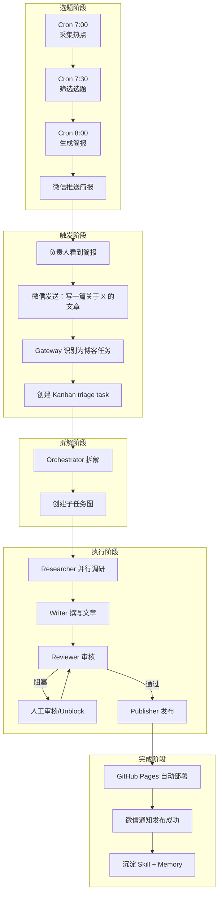
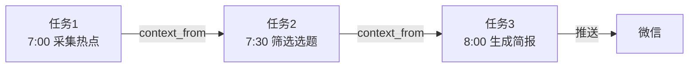
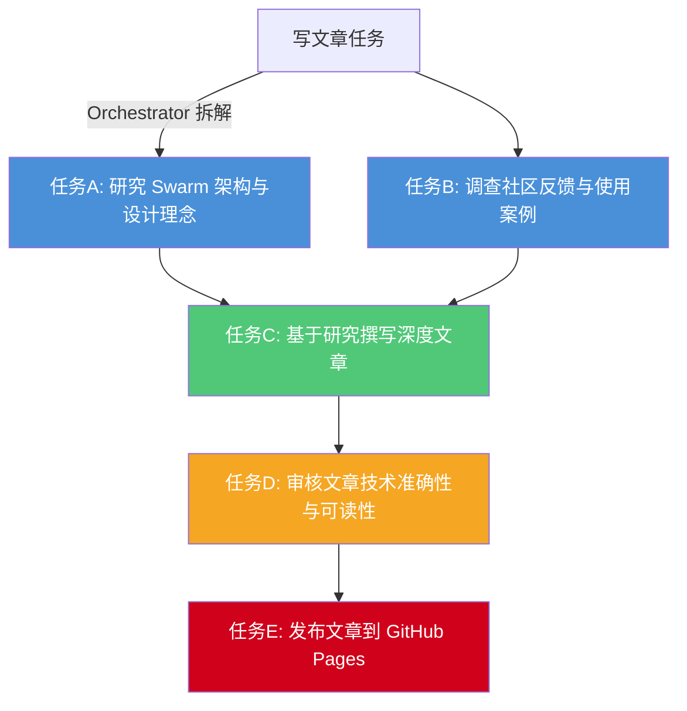

# 核心流程详解

## 完整工作流

从选题到发布的完整流程：



### 流程时间线

```
 7:00 ─── Cron 采集热点（HN + 知乎）
 7:30 ─── Cron 筛选 3 个选题
 8:00 ─── Cron 生成简报 → 推送微信
 8:30 ─── 负责人看到简报，挑选选题
 9:00 ─── 微信发送写作指令
 9:01 ─── Orchestrator 拆解任务
 9:05 ─── Researcher 并行调研
 9:30 ─── Writer 开始撰写
10:00 ─── Reviewer 审核
10:05 ─── 人工确认 / Unblock
10:10 ─── Publisher 发布到 GitHub
10:15 ─── 博客自动部署上线
```

## Cron 选题流水线（3 阶段）

### 设计思路

三阶段流水线设计，通过 `context_from` 建立依赖链：



### 创建 Cron 任务

在 default profile 中进入对话：

```bash
hermes
```

然后让 Agent 创建三个 Cron 任务：

```text
请帮我创建一组 Cron 任务，用于技术博客选题流水线：

1. 每天早上 7:00，收集 Hacker News 和知乎上的 AI/前端热门内容，
   用 web_search 工具获取，输出包含标题、链接、简要说明
2. 每天早上 7:30，读取任务 1 的最新输出，筛选 3 个最适合我们博客的选题，
   评估标准：技术深度、读者兴趣度、与已有文章的差异化
3. 每天早上 8:00，读取任务 2 的筛选结果，为每个选题生成一份简报，
   包含：文章大纲、核心观点、推荐参考链接、预估字数

所有任务结果投递到微信网关。
```

Agent 内部会依次调用创建三个任务：

```text
# Job 1 - 采集热点
cronjob(action="create", name="blog-news-collect",
        schedule="0 7 * * *",
        prompt="收集 Hacker News 和知乎 AI/前端热门内容，输出标题、链接、简要说明。",
        deliver="telegram", skills=["web_search"])

# Job 2 - 筛选选题
cronjob(action="create", name="blog-topic-select",
        schedule="30 7 * * *",
        context_from="<job1_id>",
        prompt="从上一步的新闻中筛选 3 个最适合我们博客的选题。评估标准：技术深度、读者兴趣度、与已有文章的差异化。",
        deliver="telegram")

# Job 3 - 生成简报
cronjob(action="create", name="blog-brief-generate",
        schedule="0 8 * * *",
        context_from="<job2_id>",
        prompt="为每个选题生成简报：文章大纲、核心观点、推荐参考链接、预估字数。",
        deliver="telegram")
```

### 手动触发第一次执行

不等明天早上，立即执行：

```text
现在依次执行任务 1、2、3
```

### 优化推送策略

微信有推送频率限制，建议优化：

```text
因为微信会限制发送的消息，所以任务一采集热点和任务二筛选选题不再发送到微信
```

```text
限制定时任务生成简报的最终输出字数在 500 字以内
```

这样只有任务三（简报）会推送到微信，每天一条，不会被限流。

## Kanban Swarm 协作

### 配置 SOUL.md 路由规则

当用户在微信上发 "写一篇关于 X 的文章" 时，Agent 需要识别这是博客任务，而不是自己回答。

**编辑两个 SOUL.md 文件**（都要改，确保生效）：

**文件1：`~/.hermes/SOUL.md`（全局）**

```markdown
# Hermes Agent Soul

你是Hermes Agent, 你有一个完整的博客多智能体协作系统。

## 博客任务路由规则

当用户通过微信发送以下类型的请求时，**不要自己回答内容，不要自己写文章**，而是触发 Kanban Swarm 流程：

**触发关键词：**
- "写一篇关于...的文章/博客"
- "写一篇...深度文章"
- "写博客/写文章 主题"
- 任何明确的博客/文章创作请求

**执行步骤：**
1. 调用 `hermes kanban --board blog create "文章主题" --assignee orchestrator`
2. 回复用户："已创建博客写作任务，Orchestrator 正在拆解，稍后流程自动推进。"

**常规对话：**
非博客创作类的咨询、问候、闲聊，正常回答即可。
```

**文件2：`~/.hermes/profiles/default/SOUL.md`（default profile）**

同样内容也写一份。

> ⚠️ **重要**：修改 SOUL.md 后，必须在微信中发送 `/new` 重置会话，否则 Agent 仍用旧记忆。

### 微信发起任务

配置完成后，在微信中发送：

```text
写一篇关于 Hermes Agent Kanban Swarm 功能的深度文章，面向 AI 开发者
```

Agent 应该回复 "已创建博客写作任务"，然后自动触发看板流程。

### 验证任务创建

```bash
hermes kanban list
# 应该能看到新创建的任务
```

## Orchestrator 拆解

Orchestrator 被启动后，自动执行以下步骤：

1. 读取 triage task 的标题和正文
2. 扫描可用 profile（researcher、writer、reviewer、publisher）
3. 调用 LLM 生成 task graph JSON
4. 创建子任务并在 Kanban board 上建立依赖关系

### 拆解结果示例



```text
# 拆解后的子任务
task: "研究 Hermes v0.16 Swarm 架构与设计理念"
  assignee=researcher
  workspace=scratch

task: "调查社区对 Kanban Swarm 的反馈与使用案例"
  assignee=researcher
  workspace=scratch

task: "基于研究报告撰写深度文章"
  assignee=writer
  depends_on=[research_task_1, research_task_2]

task: "审核文章的技术准确性与可读性"
  assignee=reviewer
  depends_on=[write_task]

task: "发布文章到 GitHub Pages"
  assignee=publisher
  depends_on=[review_task]
```

## 多 Agent 并行执行

### 研究阶段：并行调研

两个 researcher task 进入 `ready` 后被 dispatcher 并行启动。每个 researcher worker：

1. 调用 `kanban_show()` 读取 task 上下文
2. 使用 `web_search` 搜索相关资料
3. 可能使用 `delegate_task` 进一步并行搜索子方向
4. 完成时调用 `kanban_complete(summary="...")` 提交研究摘要

```text
# researcher Worker A 内部发起的并行委派：
delegate_task(tasks=[
    {"goal": "搜索 Hermes Agent v0.15/v0.16 release notes 中 Swarm 相关内容",
     "toolsets": ["web"]},
    {"goal": "搜索 GitHub 上 Kanban Swarm 的 PR 和 issue 讨论",
     "toolsets": ["web"]},
    {"goal": "搜索社区（Reddit、Hacker News）的讨论和反馈",
     "toolsets": ["web"]},
])
```

### 撰写阶段：自动写作与风格引用

两个研究 task 都完成后，writer task 进入 `ready`。Writer worker 启动后：

1. 读取两个研究子任务的 `kanban_complete` 摘要
2. 使用 `session_search` 回查之前的文章风格

```text
# Writer Agent 内部调用：
session_search(query="技术文章 深度分析 写作风格")
```

3. 如果之前有类似文章草稿，使用 `@file` 注入作为风格参考：

```text
@file:content/posts/2026-05-hermes-v0.15-deep-dive.md
参考这篇文章的结构和语言风格，写新文章。
```

4. 调用 `web_extract` 提取关键参考页面完整内容
5. 撰写完成，通过 `patch` 写入文章草稿

```text
patch(file="content/posts/2026-06-hermes-swarm-deep-dive.md", ...)
```

### 审核阶段：自动检查与人工审批

Reviewer worker 启动后：

1. 读取 writer 的文章草稿
2. 调用 SEO 插件检查元数据质量
3. 使用 Post-Write Linting 自动检查 YAML frontmatter 格式
4. 发现问题后通过 `kanban_comment()` 留下审核意见
5. 如果文章质量达标，`kanban_complete(summary="审核通过，建议发布")`
6. 如果有问题，`kanban_block(reason="代码示例缺少错误处理")`

当 reviewer 将 task 设为 `blocked` 时，负责人在微信会收到通知，然后可以：

```text
# 在微信中回复：
/kanban comment t_abc123 "第 3 节的代码示例需要用 try/catch 包裹"
/kanban unblock t_abc123
```

Writer 重新启动后，会读取评论串中的修改意见并修正。

### 发布阶段：自动提交到 GitHub

Publisher worker 启动后：

1. 读取 writer 的最终草稿和 reviewer 的审核意见
2. 进入 workspace，用 terminal 工具执行 git 操作：

```bash
cd $HERMES_KANBAN_WORKSPACE
git clone https://github.com/team/tech-blog.git
cd tech-blog
cp /path/to/draft.md content/posts/2026-06-hermes-swarm-deep-dive.md
git add content/posts/
git commit -m "Add: Hermes Agent v0.16 Kanban Swarm 深度分析"
git push origin main
```

也可以直接使用 GitHub MCP 工具：

```text
mcp_github_create_or_update_file(
    owner="team",
    repo="tech-blog",
    path="content/posts/2026-06-hermes-swarm-deep-dive.md",
    content="<文章内容>",
    message="Add: Hermes Agent v0.16 Kanban Swarm 深度分析"
)
```

完成后 `kanban_complete(result="已发布到 GitHub Pages")`。

## 持续进化

### Skill 自动沉淀

在一次特别成功的文章发布后，后台 review agent 会检测到这是一个值得沉淀的模式：

```text
# 后台 review agent 自动触发：
skill_manage(action="create", name="tech-deep-dive-writing",
    category="writing",
    description="写作 AI 技术深度分析文章的标准流程",
    content="..."
)
```

### 手动沉淀 Skill（推荐首次使用）

自动沉淀需要等一段时间，首次建议手动触发：

```bash
hermes
```

```text
刚才已经实现了完整的发布博客的流程，将整个流程整合多个 Profile 记下来，后续的话可以让它做成 Skill
```

然后分别进入每个 Profile 告诉它记住流程：

```bash
researcher chat -q "刚才已经完成了一个总的看板发布博客任务，将流程记忆下来"
writer chat -q "刚才已经完成了一个总的看板发布博客任务，将流程记忆下来"
reviewer chat -q "刚才已经完成了一个总的看板发布博客任务，将流程记忆下来"
publisher chat -q "刚才已经完成了一个总的看板发布博客任务，将流程记忆下来"
```

### Curator 自动维护

一周后，Curator 在后台启动，发现重复的 skill 并自动合并：

```bash
# 查看 Curator 运行结果
hermes curator status
cat ~/.hermes/logs/curator/$(date +%Y%m%d)-030000/REPORT.md
```

---

> **下一步**：阅读 [[02-Knowledge(知识层)/20-核心能力-Core_Ability/10 技术能力-Technical_Capability/01-AI工具链与Agent实践/04-工作流与实践/Hermes-Agent案例/01-博客自动发布系统-Hermes实战/docs/04-踩坑记录|04-踩坑记录.md]] 了解常见问题与解决方案。
