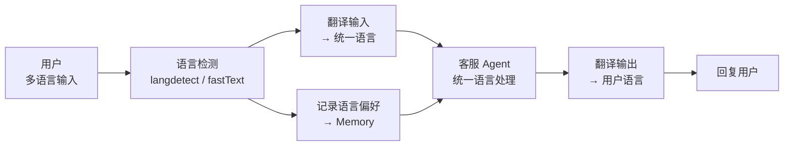
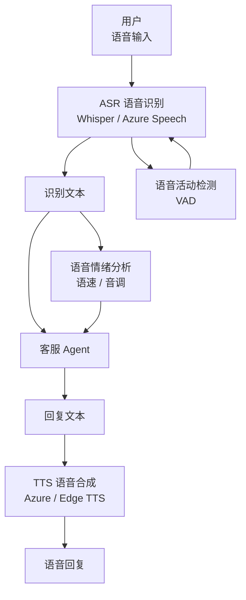
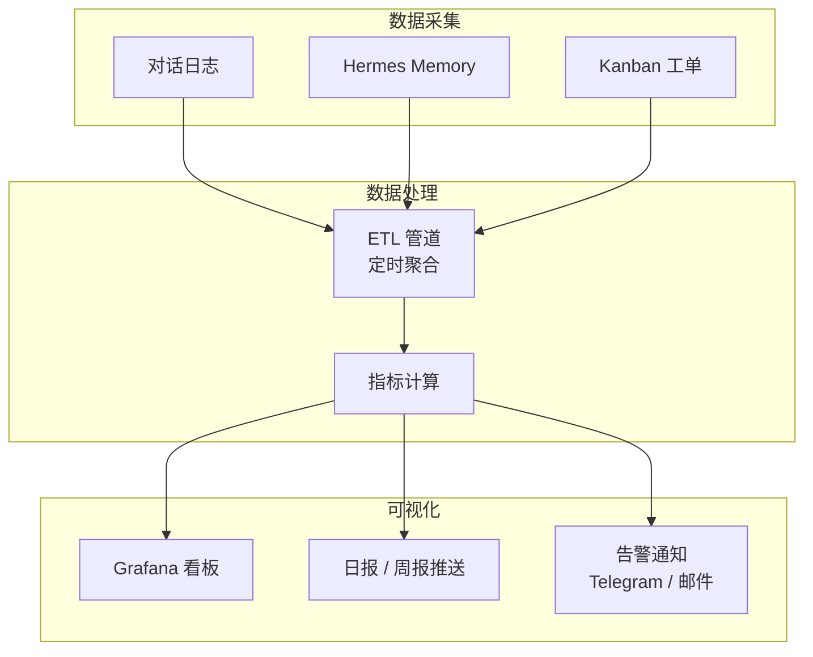
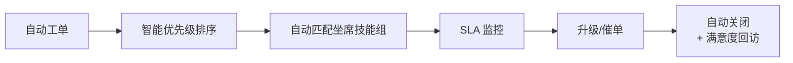
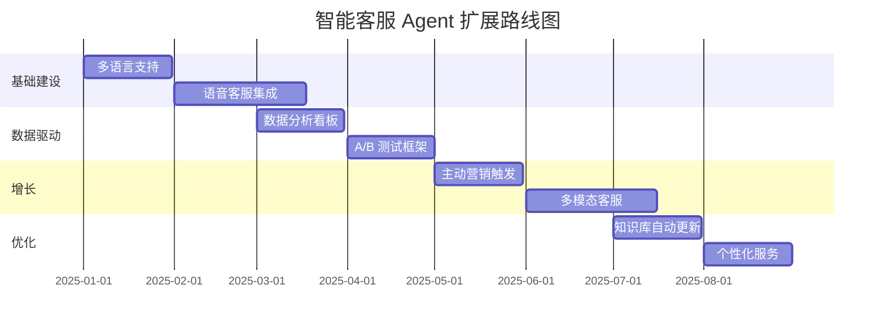

# 扩展思路

> 本文探讨智能客服 Agent 系统在基础功能之上的扩展方向，涵盖多语言、语音、数据分析、实验与营销等场景。

## 目录

1. [多语言支持](#一多语言支持)
2. [语音客服集成](#二语音客服集成)
3. [数据分析看板](#三数据分析看板)
4. [A/B 测试](#四ab-测试)
5. [主动营销触发](#五主动营销触发)
6. [更多扩展方向](#六更多扩展方向)

---

## 一、多语言支持

### 1.1 场景描述

企业面向全球用户时，客服系统需要支持中、英、日、韩、法、德等多语言。核心需求：
- 用户用什么语言提问，Agent 就用什么语言回答
- 知识库可能只有中文，但能回答英文问题
- 转人工时，坐席能看到原文和翻译

### 1.2 架构方案



### 1.3 实现方案

#### 方案 A：统一语言处理（推荐）

```yaml
# 所有消息统一翻译为中文处理，再翻译回用户语言
multi_language:
  enabled: true
  target_language: zh-CN  # 内部统一语言
  translation_provider: openai  # 或 deepl / google
  
  # 语言检测
  detection:
    provider: fasttext
    model: lid.176.bin  # 支持 176 种语言
  
  # 缓存翻译结果
  cache:
    enabled: true
    ttl: 86400  # 24小时
```

#### 方案 B：多语言 Prompt（高质量场景）

```python
# 根据用户语言动态选择 Prompt
LANGUAGE_PROMPTS = {
    "zh": "请用中文回答...",
    "en": "Please answer in English...",
    "ja": "日本語で回答してください...",
    "ko": "한국어로 답변해 주세요...",
}

def get_language_prompt(user_id: str) -> str:
    lang = hermes.memory.get(f"user:{user_id}:language") or "zh"
    return LANGUAGE_PROMPTS.get(lang, LANGUAGE_PROMPTS["en"])
```

### 1.4 多语言知识库

```bash
# 为不同语言建立独立的知识库索引
hermes config set knowledge.multi_lang.enabled true
hermes config set knowledge.multi_lang.languages "zh,en,ja"

# 或使用跨语言 Embedding（推荐）
hermes config set knowledge.embedding.model "intfloat/multilingual-e5-large"
```

---

## 二、语音客服集成

### 2.1 场景描述

将智能客服从文字扩展到语音通道，支持：
- 用户语音输入 → ASR 转文字 → Agent 处理 → TTS 语音回复
- 电话客服场景（通过 SIP/PSTN 网关）
- 语音情绪识别（语速、语调辅助判断用户状态）

### 2.2 架构方案



### 2.3 技术选型

| 组件 | 推荐方案 | 备选方案 |
|------|----------|----------|
| ASR（语音识别） | OpenAI Whisper（本地或 API） | Azure Speech / 讯飞 |
| TTS（语音合成） | Edge TTS（免费） | Azure TTS / OpenAI TTS |
| VAD（语音检测） | Silero VAD | WebRTC VAD |
| 情绪分析 | 语音特征 + LLM 联合判断 | 仅文本情绪分析 |

### 2.4 集成示例

```bash
# 配置语音通道
hermes config set gateway.voice.enabled true
hermes config set gateway.voice.asr_provider whisper
hermes config set gateway.voice.tts_provider edge-tts
hermes config set gateway.voice.vad_enabled true

# 启动语音 Gateway
hermes gateway start --voice
```

```python
# 语音客服 Skill 片段
VOICE_SKILL = """
## 语音客服特殊规则
1. 回复尽量简短（语音场景用户耐心更低）
2. 复杂信息分段播报（"第一...第二...第三..."）
3. 数字和金额慢速重复确认
4. 检测到背景噪音时引导用户到安静环境
5. 语音情绪为愤怒时优先转人工
"""
```

---

## 三、数据分析看板

### 3.1 场景描述

通过数据看板实时监控客服系统运行状态，辅助运营决策。

### 3.2 核心指标

| 指标 | 定义 | 目标值 |
|------|------|--------|
| **解决率** | 未转人工的对话占比 | ≥ 85% |
| **满意度** | 用户满意度评分均值 | ≥ 4.0 / 5.0 |
| **平均响应时间** | 从用户发消息到收到回复的时间 | ≤ 3s |
| **转人工率** | 转人工对话占比 | ≤ 15% |
| **意图识别准确率** | 意图识别正确的比例 | ≥ 90% |
| **知识库命中率** | 检索到有效知识的比例 | ≥ 80% |
| **多轮对话深度** | 平均每轮对话的交互次数 | 3-5 轮 |
| **峰值并发** | 同时服务用户数 | 视资源而定 |

### 3.3 看板实现



### 3.4 配置示例

```bash
# 启用分析日志
hermes config set analytics.enabled true
hermes config set analytics.log_dir ~/.hermes/analytics

# 配置告警
hermes config set analytics.alerts.satisfaction_below 3.5
hermes config set analytics.alerts.handoff_rate_above 0.2
hermes config set analytics.alerts.notify_channel telegram
```

### 3.5 关键查询示例

```sql
-- 日解决率统计
SELECT 
    DATE(timestamp) as day,
    COUNT(*) as total_conversations,
    SUM(CASE WHEN handoff = false THEN 1 ELSE 0 END) as resolved,
    ROUND(AVG(CASE WHEN handoff = false THEN 1.0 ELSE 0.0 END) * 100, 2) as resolution_rate
FROM conversations
GROUP BY day
ORDER BY day DESC;

-- 高频意图分布
SELECT 
    intent,
    COUNT(*) as count
FROM conversations
GROUP BY intent
ORDER BY count DESC;
```

---

## 四、A/B 测试

### 4.1 场景描述

对客服系统的不同策略进行实验对比，用数据驱动决策。

### 4.2 可测试的变量

| 实验变量 | 对照组 | 实验组 | 评估指标 |
|----------|--------|--------|----------|
| 意图识别 Prompt | 基础 Prompt | 增强 Few-shot | 准确率 |
| 回答风格 | 简洁风格 | 详细风格 | 满意度 |
| 转人工阈值 | 置信度 < 0.5 | 置信度 < 0.6 | 转人工率 |
| 知识库 Top-K | Top-3 | Top-5 | 命中率 |
| 模型 | GPT-4o | Claude 3.5 | 质量 + 成本 |

### 4.3 实现方案

```python
# A/B 测试框架示例
class ABTest:
    def __init__(self, experiment_name: str):
        self.experiment_name = experiment_name
        self.config = self.load_config()
    
    def assign_group(self, user_id: str) -> str:
        """基于用户 ID 哈希分桶，保证同一用户始终在同一组"""
        hash_val = hash(f"{self.experiment_name}:{user_id}") % 100
        return "control" if hash_val < 50 else "treatment"
    
    def get_config(self, user_id: str) -> dict:
        group = self.assign_group(user_id)
        return self.config["groups"][group]
    
    def record_result(self, user_id: str, metrics: dict):
        """记录实验结果"""
        group = self.assign_group(user_id)
        hermes.memory.set(
            f"abtest:{self.experiment_name}:{user_id}",
            {"group": group, **metrics}
        )

# 使用示例
ab_test = ABTest("handoff_threshold")
user_config = ab_test.get_config(user_id)
# user_config = {"handoff_threshold": 0.5}  # 或 0.6
```

### 4.4 实验配置

```yaml
# A/B 测试配置示例
experiments:
  - name: handoff_threshold_v2
    status: running
    groups:
      control:
        handoff_threshold: 0.5
        traffic: 50%
      treatment:
        handoff_threshold: 0.6
        traffic: 50%
    metrics:
      - handoff_rate
      - satisfaction
      - avg_conversation_length
    min_sample_size: 1000
    duration_days: 7
```

---

## 五、主动营销触发

### 5.1 场景描述

在客服对话中，根据用户意图和上下文，智能触发营销推荐，实现"服务即营销"。

### 5.2 触发场景

| 用户行为 | 营销触发 | 示例 |
|----------|----------|------|
| 咨询产品功能 | 推荐相关产品 | "您提到的这个功能，我们的 Pro 版本支持得更好" |
| 询问价格 | 推送优惠活动 | "目前有周年庆活动，购买年卡享 7 折" |
| 表达不满 | 提供补偿方案 | "为了表示歉意，为您申请了一张优惠券" |
| 咨询竞品 | 对比推荐 | "相比 XX 产品，我们的优势在于..." |
| 续费/到期前 | 续费提醒 | "您的会员即将到期，现在续费可锁定当前价格" |

### 5.3 实现方案

```python
MARKETING_RULES = [
    {
        "trigger": {"intent": "query_product", "keywords": ["价格", "多少钱"]},
        "action": "推荐当前优惠活动",
        "template": "目前 {product} 正在开展 {promotion} 活动，{detail}，需要为您介绍一下吗？"
    },
    {
        "trigger": {"sentiment": "negative", "turn_count": ">3"},
        "action": "提供补偿方案",
        "template": "非常抱歉给您带来不好的体验，为您申请了一张 {coupon} 优惠券，希望能弥补您的不愉快。"
    },
    {
        "trigger": {"intent": "complaint", "keywords": ["竞品", "别家"]},
        "action": "竞品对比推荐",
        "template": "相比其他产品，我们的 {advantage} 是独特优势，具体来说..."
    }
]

def check_marketing_trigger(context: dict) -> dict | None:
    """检查是否触发营销规则"""
    for rule in MARKETING_RULES:
        if match_trigger(rule["trigger"], context):
            return rule
    return None
```

### 5.4 注意事项

```yaml
# 主动营销配置
marketing:
  enabled: true
  
  # 频率控制（避免过度营销）
  rate_limit:
    max_per_session: 2       # 每轮对话最多 2 次
    min_interval: 180        # 两次营销至少间隔 3 分钟
    max_per_day: 5           # 每日最多 5 次
  
  # 黑名单
  blacklist:
    intents: ["complaint", "refund"]  # 投诉退款场景不营销
    sentiments: ["angry"]              # 愤怒情绪不营销
  
  # 合规
  compliance:
    require_opt_in: true     # 需要用户同意接收营销
    opt_out_keyword: "取消营销"
```

---

## 六、更多扩展方向

### 6.1 多模态客服

| 模态 | 能力 | 实现方式 |
|------|------|----------|
| 图片识别 | 用户发截图，Agent 理解问题 | GPT-4o Vision / Claude Vision |
| 文档解析 | 用户上传 PDF/Word，Agent 分析内容 | Hermes OCR Skill |
| 屏幕共享 | 远程协助查看用户操作 | WebRTC + Agent 指导 |
| 视频客服 | 视频通话 + 实时 Agent 辅助 | 视频 Gateway |

### 6.2 智能工单升级



### 6.3 知识库自动更新

```bash
# 自动从 FAQ 中学习新知识
hermes config set knowledge.auto_learn.enabled true
hermes config set knowledge.auto_learn.source "conversations"
hermes config set knowledge.auto_learn.min_confidence 0.9
hermes config set knowledge.auto_learn.review_required true
```

### 6.4 个性化服务

```python
# 基于用户画像的个性化
def personalize_response(user_id: str, response: str) -> str:
    profile = hermes.memory.get(f"user:{user_id}:profile")
    
    if profile:
        # 老用户：省略基础介绍
        if profile["visit_count"] > 10:
            response = remove_basic_intro(response)
        
        # VIP 用户：附加专属信息
        if profile["tier"] == "vip":
            response += "\n\n💎 作为 VIP 用户，您可以享受专属客服通道。"
        
        # 历史问题关联
        if profile.get("known_issues"):
            response += f"\n\n📌 您上次提到的 {profile['known_issues'][-1]} 问题已更新，需要了解吗？"
    
    return response
```

### 6.5 行业定制

| 行业 | 特殊需求 | 定制方向 |
|------|----------|----------|
| 金融/银行 | 合规严格、安全性高 | 本地模型、审计日志、敏感词过滤 |
| 电商 | 高并发、订单查询 | 缓存优化、工单自动流转 |
| 医疗 | 隐私保护、专业术语 | 脱敏处理、医学知识库 |
| 教育 | 多轮辅导、学习跟踪 | 长期记忆、学习进度追踪 |
| 游戏 | 7×24 实时响应 | 多语言、情绪安抚、高频缓存 |

---

## 扩展路线图



---

*相关文档：[[02-Knowledge(知识层)/20-核心能力-Core_Ability/10 技术能力-Technical_Capability/01-AI工具链与Agent实践/04-工作流与实践/Hermes-Agent案例/02-智能客服Agent系统/docs/01-架构设计|01-架构设计.md]] | [[02-Knowledge(知识层)/20-核心能力-Core_Ability/10 技术能力-Technical_Capability/01-AI工具链与Agent实践/04-工作流与实践/Hermes-Agent案例/02-智能客服Agent系统/docs/04-踩坑记录|04-踩坑记录.md]]*
