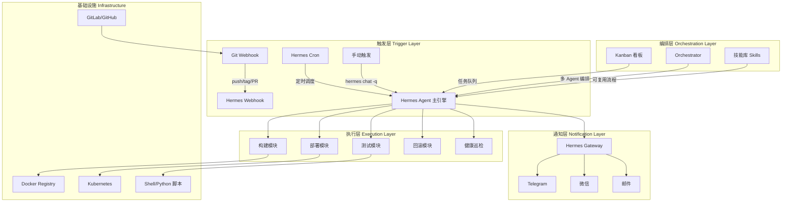
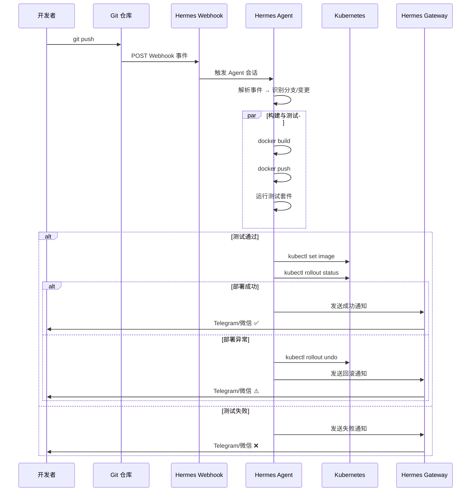

# 系统架构与核心模块

## 一、整体架构

### 架构分层



### 架构说明

| 层级 | 职责 | 核心组件 |
|------|------|----------|
| **触发层** | 接收外部事件或定时触发流水线 | Webhook、Cron、手动指令 |
| **编排层** | 任务解析、Agent 调度、流程编排 | Hermes Agent、Kanban、Orchestrator |
| **执行层** | 执行具体的构建、测试、部署操作 | Terminal 工具、Shell 脚本、Kubectl |
| **通知层** | 多平台消息推送、告警通知 | Hermes Gateway |
| **基础设施** | 底层依赖服务 | Git、Docker、K8s |

---

## 二、核心模块

### 2.1 Webhook 事件驱动模块

接收 Git 仓库的 Push、Tag、Merge Request 等事件，触发 Agent 会话。

```yaml
# configs/webhook-gitlab.yaml
# Hermes Webhook 订阅配置示例
webhook:
  routes:
    - name: gitlab-push
      path: /webhooks/gitlab-push
      method: POST
      prompt: |
        收到 GitLab Push 事件：
        - 仓库: {{.body.project.path_with_namespace}}
        - 分支: {{.body.ref}}
        - 提交者: {{.body.user_username}}
        
        请执行以下操作：
        1. 拉取最新代码
        2. 检查变更文件
        3. 执行 Docker 构建
        4. 运行测试套件
        5. 如为主分支则部署到预发布环境
      channel: telegram
```

### 2.2 Cron 定时调度模块

定时执行健康检查、日志清理、证书续期等运维任务。

```bash
# 创建定时任务示例
hermes cron create "*/5 * * * *" \
  --prompt "执行 K8s 集群健康巡检：检查所有 Namespace 下的 Pod 状态、Node 资源使用率、Service 端点连通性" \
  --channel telegram \
  --skills "cicd-ops"

# No-Agent Cron（纯脚本模式，不启动 Agent）
hermes cron create "0 3 * * *" \
  --script "/opt/scripts/cleanup-old-images.sh" \
  --no-agent
```

### 2.3 构建与部署模块

核心执行逻辑，通过 Hermes Terminal 工具调用 Shell 脚本。

```bash
# 构建脚本示例 scripts/build.sh
#!/bin/bash
set -e

APP_NAME=$1
VERSION=$2
REGISTRY="registry.example.com"

echo "=== 构建 Docker 镜像 ==="
docker build -t ${REGISTRY}/${APP_NAME}:${VERSION} -t ${REGISTRY}/${APP_NAME}:latest .
docker push ${REGISTRY}/${APP_NAME}:${VERSION}
docker push ${REGISTRY}/${APP_NAME}:latest

echo "=== 部署到 K8s ==="
kubectl set image deployment/${APP_NAME} \
  ${APP_NAME}=${REGISTRY}/${APP_NAME}:${VERSION} \
  --record

kubectl rollout status deployment/${APP_NAME} --timeout=300s
```

### 2.4 异常回滚模块

监控部署状态，自动触发回滚。

```bash
# 回滚脚本 scripts/rollback.sh
#!/bin/bash

DEPLOY_NAME=$1
NAMESPACE=${2:-default}

echo "=== 检测到部署异常，执行回滚 ==="
PREVIOUS_VERSION=$(kubectl rollout history deployment/${DEPLOY_NAME} -n ${NAMESPACE} | tail -2 | head -1 | awk '{print $1}')

kubectl rollout undo deployment/${DEPLOY_NAME} -n ${NAMESPACE} --to-revision=${PREVIOUS_VERSION}

if kubectl rollout status deployment/${DEPLOY_NAME} -n ${NAMESPACE} --timeout=300s; then
  echo "回滚成功至 revision ${PREVIOUS_VERSION}"
  exit 0
else
  echo "回滚失败，需要人工介入"
  exit 1
fi
```

### 2.5 告警通知模块

通过 Hermes Gateway 向多平台发送通知。

```yaml
# configs/alert-templates.yaml
alerts:
  build_failed:
    title: "❌ 构建失败"
    template: |
      🚨 *构建失败通知*
      
      - 项目: {{.project}}
      - 分支: {{.branch}}
      - 提交: {{.commit}}
      - 错误: {{.error}}
      - 时间: {{.timestamp}}
      
      请及时查看日志：{{.log_url}}
  
  deploy_success:
    title: "✅ 部署成功"
    template: |
      ✅ *部署成功*
      
      - 服务: {{.service}}
      - 版本: {{.version}}
      - 环境: {{.environment}}
      - 耗时: {{.duration}}
  
  rollback_triggered:
    title: "⚠️ 自动回滚"
    template: |
      ⚠️ *自动回滚已触发*
      
      - 服务: {{.service}}
      - 原因: {{.reason}}
      - 回滚至: revision {{.revision}}
      - 状态: {{.status}}
```

---

## 三、模块交互流程



---

## 四、关键设计决策

| 决策 | 方案 | 理由 |
|------|------|------|
| Agent 框架 | Hermes Agent | 原生支持 Cron/Webhook/Gateway/Kanban |
| 事件驱动 | Webhook + Cron | 兼顾实时触发与定时任务 |
| 部署方式 | K8s 滚动更新 | 零停机部署，支持快速回滚 |
| 通知渠道 | Telegram + 微信 | 覆盖团队主流即时通讯工具 |
| 任务编排 | Kanban + Orchestrator | 支持复杂多步骤流程和多 Agent 协同 |
| 脚本语言 | Shell + Python | 运维场景原生支持，零额外依赖 |

---

## 五、安全设计

1. **Webhook 签名验证** — 校验 GitLab/GitHub 的 HMAC 签名
2. **最小权限原则** — K8s ServiceAccount 仅授予必要 RBAC 权限
3. **密钥管理** — 敏感信息通过 Hermes `.env` 管理，不硬编码
4. **操作审计** — 所有 Agent 操作记录到 Hermes 会话日志
5. **命令审批** — 高危操作（回滚、删除）需人工确认
