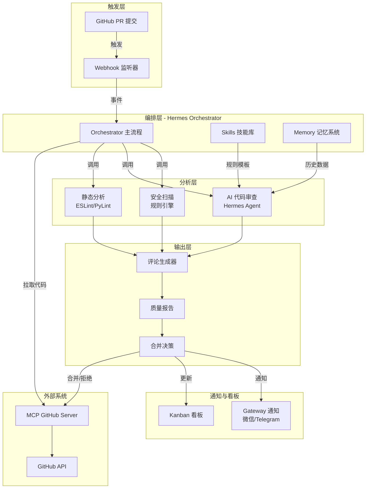

# 代码审查 Agent（Code Review）

## 📋 项目背景

在现代软件开发中，代码审查是保证代码质量的核心环节，但传统人工审查存在以下痛点：

- **时间成本高**：资深开发者每天花费 2-4 小时进行代码审查
- **标准不统一**：不同审查者的标准、风格和关注点各异
- **遗漏风险**：人工审查容易遗漏安全漏洞、性能问题和代码异味
- **反馈延迟**：PR 等待审查时间过长，影响开发效率
- **重复劳动**：大量基础性问题（格式、命名、简单逻辑错误）消耗审查者精力

本项目基于 **Hermes Agent** 构建一个智能代码审查 Agent，利用 AI + 静态分析工具，自动完成 PR 审查流程，将人工审查从重复劳动中解放出来，聚焦于更高层次的架构和业务逻辑评审。

## 🎯 核心价值

| 价值 | 说明 |
|------|------|
| **自动化审查** | PR 提交后自动触发审查，秒级反馈 |
| **质量评分** | 对每次提交生成量化质量报告 |
| **安全扫描** | 自动检测常见安全漏洞和敏感信息泄露 |
| **标准统一** | 基于配置的规则引擎，确保审查标准一致 |
| **合并建议** | 基于审查结果给出自动合并/需修改/拒绝建议 |
| **团队协作** | 通过微信/Telegram 实时通知审查结果 |
| **持续学习** | 利用 Hermes Memory 记录审查历史，持续优化 |

## 🏗️ 技术栈概览

| 组件 | 技术选型 | 用途 |
|------|----------|------|
| **Agent 框架** | Hermes Agent | 核心编排、Webhook 监听、MCP 集成 |
| **代码托管** | GitHub | PR 管理、Webhook 触发 |
| **MCP 服务** | MCP GitHub Server | GitHub API 操作（PR 读取、评论、合并） |
| **静态分析** | ESLint / PyLint / ESLint | 代码风格和基础错误检查 |
| **AI 审查** | Hermes Agent Skills | 代码逻辑、架构、安全 AI 审查 |
| **通知** | Hermes Gateway | 微信/Telegram 实时通知 |
| **看板** | Hermes Kanban | 审查任务可视化管理 |
| **记忆** | Hermes Memory | 审查历史和学习优化 |
| **编排** | Hermes Orchestrator | 多 Agent 协作工作流 |

## 🧩 架构图



## 📁 目录结构

```
04-代码审查Agent-CodeReview/
├── README.md                 # 项目总览（本文档）
├── docs/
│   ├── 01-架构设计.md        # 系统架构与模块设计
│   ├── 02-环境搭建.md        # 环境配置与部署指南
│   ├── 03-核心流程.md        # 工作流与业务逻辑
│   ├── 04-踩坑记录.md        # 常见问题与解决方案
│   └── 05-扩展思路.md        # 功能扩展与未来规划
└── .hermes/
    └── profiles/
        ├── reviewer/         # 审查者 Profile
        │   ├── SOUL.md
        │   └── skills/
        └── approver/         # 审批者 Profile
            ├── SOUL.md
            └── skills/
```

## 🔄 核心工作流

```
PR 提交 → Webhook 触发 → 代码拉取 → 静态分析 → AI 审查 
→ 评论生成 → 质量报告 → 合并建议 → 自动合并/通知
```

## 🚀 快速开始

```bash
# 1. 创建审查者 Profile
hermes profile create reviewer
hermes profile create approver

# 2. 配置 GitHub Webhook
# 在仓库 Settings → Webhooks 中添加：
# URL: http://your-hermes-server:8080/webhook/github
# 事件: Pull Request

# 3. 配置 MCP GitHub
hermes config set mcp.github.command "npx @modelcontextprotocol/server-github"

# 4. 启动 Hermes
hermes start

# 5. 提交 PR 测试
git checkout -b feature/test-review
# ... 修改代码 ...
gh pr create --title "测试代码审查" --body "测试自动审查功能"
```

## 📊 质量指标

| 指标 | 说明 | 目标值 |
|------|------|--------|
| 审查覆盖率 | 代码行审查比例 | ≥ 95% |
| 误报率 | 错误标记为问题的比例 | ≤ 10% |
| 响应时间 | PR 提交到首次反馈 | ≤ 30 秒 |
| 用户满意度 | 开发者对审查反馈的评价 | ≥ 4.0/5.0 |

---

> **状态**: 草稿 | **领域**: Core_Ability | **版本**: v0.1.0
