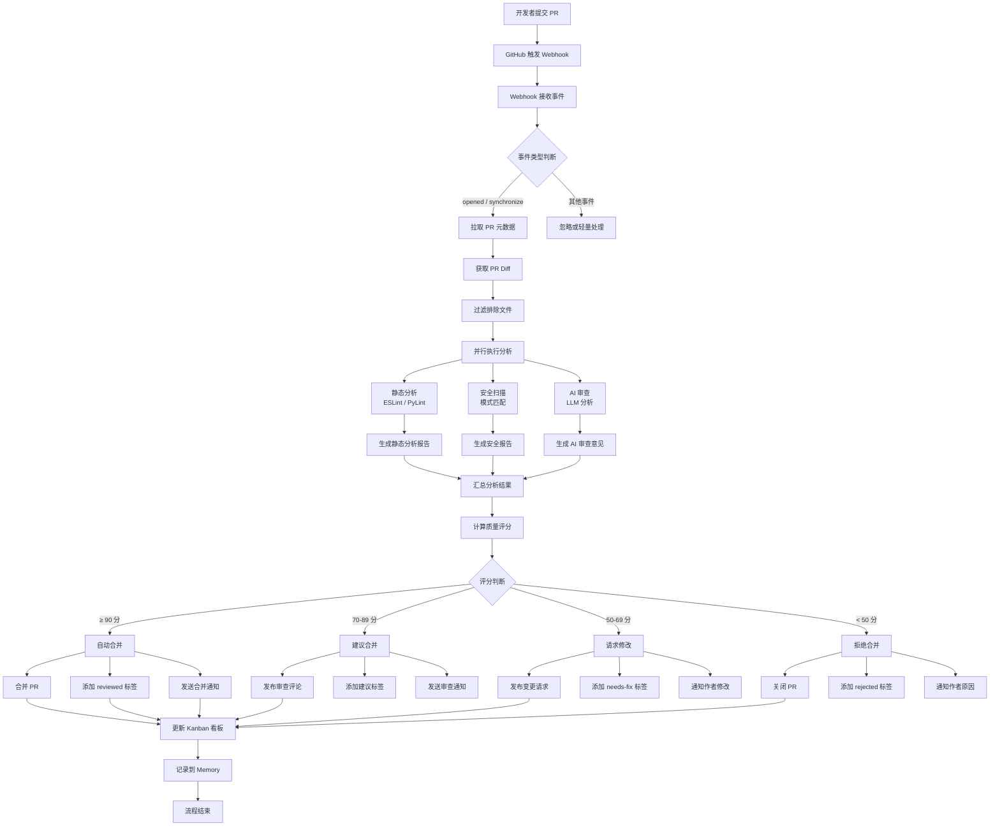
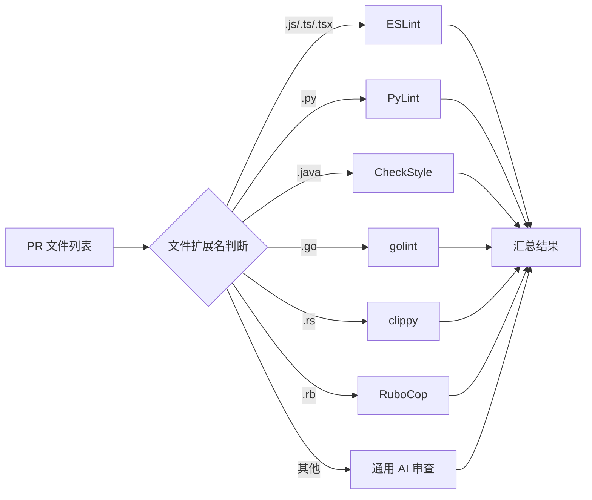

# 核心工作流程

## 1. 完整工作流



### 1.1 步骤详解

#### 步骤 1：PR 提交与 Webhook 触发

当开发者在 GitHub 上创建或更新 Pull Request 时，GitHub 向配置的 Webhook 地址发送 POST 请求。

```json
{
  "action": "opened",
  "number": 42,
  "pull_request": {
    "title": "feat: add user authentication",
    "head": { "ref": "feature/auth", "sha": "abc123" },
    "base": { "ref": "main" },
    "changed_files": 15,
    "additions": 350,
    "deletions": 120
  },
  "repository": {
    "full_name": "org/my-project"
  }
}
```

#### 步骤 2：事件解析与路由

Hermes Webhook 服务解析事件，根据事件类型路由到对应处理器：

```python
# 伪代码：事件路由逻辑
async def handle_github_webhook(event):
    action = event["action"]
    pr_number = event["number"]
    
    if action in ["opened", "synchronize", "reopened", "ready_for_review"]:
        await start_code_review(pr_number)
    elif action == "closed":
        await handle_pr_closed(pr_number)
    elif action == "labeled":
        await handle_label_change(pr_number, event["label"])
```

#### 步骤 3：代码拉取

通过 MCP GitHub Server 获取 PR 的详细信息和代码变更：

```bash
# 通过 MCP 获取 PR 信息
hermes mcp call github get_pull_request \
  --args '{"owner": "org", "repo": "my-project", "pull_number": 42}'

# 获取 PR 文件变更列表
hermes mcp call github list_pull_request_files \
  --args '{"owner": "org", "repo": "my-project", "pull_number": 42}'
```

#### 步骤 4：静态分析

对 PR 中的代码变更执行静态分析：

```bash
# 克隆 PR 分支到临时目录
git clone --branch feature/auth --depth 1 https://github.com/org/my-project.git /tmp/pr-42
cd /tmp/pr-42

# 获取 main 分支的变更文件列表
CHANGED_FILES=$(gh pr diff 42 --name-only)

# 对 JS/TS 文件执行 ESLint
echo "$CHANGED_FILES" | grep -E '\.(js|ts|tsx)$' | xargs npx eslint --format json > /tmp/pr-42/eslint-report.json

# 对 Python 文件执行 PyLint
echo "$CHANGED_FILES" | grep -E '\.py$' | xargs pylint --output-format=json > /tmp/pr-42/pylint-report.json
```

#### 步骤 5：AI 审查

使用 Hermes Agent 的 AI 能力进行语义级别的代码审查：

```yaml
# .hermes/skills/code-review-ai.yaml
name: code-review-ai
description: AI 驱动的代码语义审查
prompt: |
  你是一个专业的代码审查者。请审查以下代码变更，关注：
  
  1. **逻辑错误**：是否存在潜在的逻辑缺陷或边界条件处理不当
  2. **性能问题**：是否存在性能瓶颈或不必要的计算
  3. **架构问题**：代码结构是否合理，是否符合设计模式
  4. **可维护性**：代码是否易于理解和维护
  5. **最佳实践**：是否遵循语言/框架的最佳实践
  
  请按以下格式输出：
  
  ## 问题列表
  
  ### 🔴 严重问题
  - [行号] 描述 | 建议修复方案
  
  ### 🟡 建议改进
  - [行号] 描述 | 建议修复方案
  
  ### ✅ 通过项
  - 确认通过的项目
```

#### 步骤 6：评论生成

将分析结果格式化为结构化的 GitHub PR 评论：

```python
# 伪代码：评论生成逻辑
def generate_review_comment(eslint_report, pylint_report, ai_review, security_report):
    score = calculate_quality_score(
        eslint=eslint_report,
        pylint=pylint_report,
        ai=ai_review,
        security=security_report
    )
    
    comment = f"""
## 🤖 代码审查报告

### 📊 总体评分：{score}/100

### 问题列表
{format_issues(eslint_report, pylint_report, ai_review, security_report)}

### 安全扫描结果
{format_security(security_report)}

---
> 🤖 由 Code Review Agent 自动生成
"""
    return comment
```

#### 步骤 7：质量报告

```markdown
# 代码审查质量报告

## PR 信息
- **仓库**: org/my-project
- **PR #**: 42
- **标题**: feat: add user authentication
- **变更**: +350 / -120 行，15 个文件

## 质量评分

| 维度 | 评分 | 权重 | 加权得分 |
|------|------|------|----------|
| 代码风格 | 92 | 15% | 13.8 |
| 代码复杂度 | 85 | 20% | 17.0 |
| 安全性 | 95 | 25% | 23.8 |
| 测试覆盖 | 70 | 15% | 10.5 |
| AI 逻辑审查 | 82 | 25% | 20.5 |
| **总分** | **85.6** | 100% | **85.6** |

## 决策：建议合并 ✅
```

#### 步骤 8：合并建议与自动合并

```python
# 伪代码：合并决策逻辑
async def make_merge_decision(score, security_issues, review_blocks):
    # 安全否决：任何安全问题都阻止合并
    if security_issues.critical > 0:
        return Decision.REJECT, "存在严重安全漏洞"
    
    # 评分决策
    if score >= 90:
        return Decision.AUTO_MERGE, "质量优秀，自动合并"
    elif score >= 70:
        return Decision.APPROVE, "质量良好，建议合并"
    elif score >= 50:
        return Decision.CHANGES_REQUESTED, "需要修改后重新审查"
    else:
        return Decision.REJECT, "质量不达标，拒绝合并"
```

## 2. 多语言支持策略

### 2.1 语言检测与路由



### 2.2 语言配置表

| 语言 | 静态分析工具 | 安装命令 | 配置文件 |
|------|-------------|----------|----------|
| JavaScript | ESLint | `npm i -g eslint` | `.eslintrc.js` |
| TypeScript | ESLint + @typescript-eslint | `npm i -g eslint @typescript-eslint/*` | `.eslintrc.js` |
| Python | PyLint | `pip install pylint` | `.pylintrc` |
| Java | CheckStyle | `brew install checkstyle` | `checkstyle.xml` |
| Go | golint | `go install golang.org/x/lint/golint` | 内置规则 |
| Rust | Clippy | `rustup component add clippy` | `clippy.toml` |
| Ruby | RuboCop | `gem install rubocop` | `.rubocop.yml` |

### 2.3 扩展新语言

```yaml
# .hermes/config.yaml 中添加语言支持
languages:
  javascript:
    linter: eslint
    extensions: [".js", ".jsx", ".mjs"]
    config: ".eslintrc.js"
  typescript:
    linter: eslint
    extensions: [".ts", ".tsx"]
    config: ".eslintrc.js"
  python:
    linter: pylint
    extensions: [".py"]
    config: ".pylintrc"
  java:
    linter: checkstyle
    extensions: [".java"]
    config: "checkstyle.xml"
  go:
    linter: golint
    extensions: [".go"]
    config: ""
```

## 3. 安全扫描规则

### 3.1 扫描规则定义

```yaml
# .hermes/skills/security-scanner.yaml
name: security-scanner
description: 代码安全漏洞扫描
rules:
  - id: SEC-001
    name: 硬编码密钥检测
    severity: critical
    patterns:
      - "(?i)(api[_-]?key|secret|password|token|credential)\\s*[:=]\\s*['\"][^'\"]+['\"]"
      - "(?i)sk-[a-zA-Z0-9]{20,}"  # OpenAI API Key
      - "(?i)ghp_[a-zA-Z0-9]{36}"  # GitHub Token
      - "(?i)AKIA[0-9A-Z]{16}"     # AWS Access Key
    exclude_patterns:
      - "test_"
      - "_test."
      - "*.test.*"
      - "*.spec.*"
    remediation: "使用环境变量或密钥管理服务存储敏感信息"

  - id: SEC-002
    name: SQL 注入检测
    severity: critical
    patterns:
      - "execute\\s*\\(\\s*['\"]\\s*SELECT.*\\+"
      - "execute\\s*\\(f['\"]"
      - "raw\\s*\\(.*\\+.*request"
      - "\\$\\{.*\\s*\\+\\s*.*\\}"
    exclude_patterns: []
    remediation: "使用参数化查询或 ORM 防止 SQL 注入"

  - id: SEC-003
    name: XSS 漏洞检测
    severity: high
    patterns:
      - "innerHTML\\s*="
      - "dangerouslySetInnerHTML"
      - "v-html"
      - "document\\.write\\("
    exclude_patterns:
      - "sanitize"
      - "dompurify"
      - "DOMPurify"
    remediation: "使用安全的 DOM 操作方法，对用户输入进行转义"

  - id: SEC-004
    name: 路径遍历检测
    severity: high
    patterns:
      - "readFile\\(.*\\+.*\\.\\./"
      - "readFileSync\\(.*\\+.*\\.\\./"
      - "open\\(.*\\+.*\\.\\./"
      - "path\\.join\\(.*\\.\\./"
    exclude_patterns: []
    remediation: "验证用户输入路径，限制在允许的目录范围内"

  - id: SEC-005
    name: 敏感文件检测
    severity: medium
    patterns:
      - "\\.env"
      - "credentials\\.json"
      - "config\\.json.*password"
      - "\\.pem"
      - "\\.key"
      - "id_rsa"
    exclude_patterns: []
    remediation: "将敏感文件添加到 .gitignore，使用 .env.example 作为模板"
```

### 3.2 安全扫描执行

```bash
# 执行安全扫描
hermes skill run security-scanner \
  --args '{"path": "/tmp/pr-42", "diff_only": true}'
```

### 3.3 安全评分规则

| 严重级别 | 扣分 | 合并影响 |
|----------|------|----------|
| Critical | -30 分/个 | 阻止合并 |
| High | -15 分/个 | 阻止合并 |
| Medium | -5 分/个 | 建议修复 |
| Low | -2 分/个 | 仅记录 |

### 3.4 安全报告示例

```markdown
## 🔒 安全扫描报告

### 🔴 Critical（0 个）
无严重安全问题

### 🟠 High（1 个）
| 规则 | 文件 | 行号 | 说明 |
|------|------|------|------|
| SEC-003 | src/components/UserInput.tsx | 42 | 使用 `innerHTML` 可能导致 XSS 攻击 |

### 🟡 Medium（2 个）
| 规则 | 文件 | 行号 | 说明 |
|------|------|------|------|
| SEC-005 | .env.example | 1 | 示例环境变量文件不应包含真实值 |

### 🟢 Low（0 个）
无低风险问题
```

---

> **状态**: 草稿 | **版本**: v0.1.0
