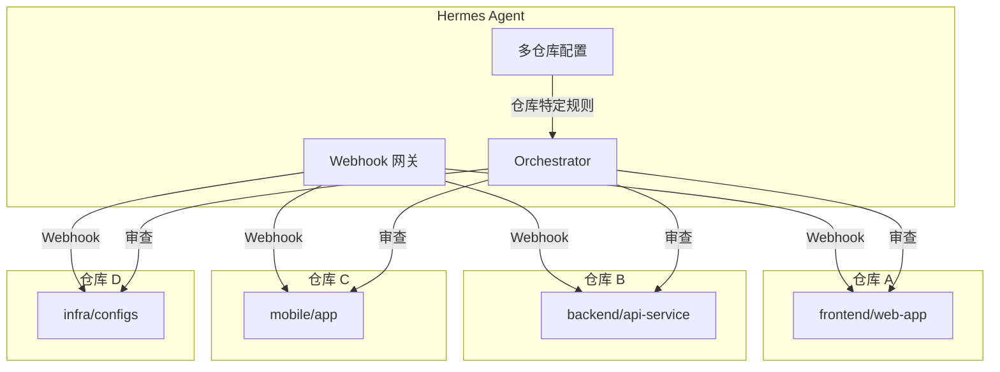
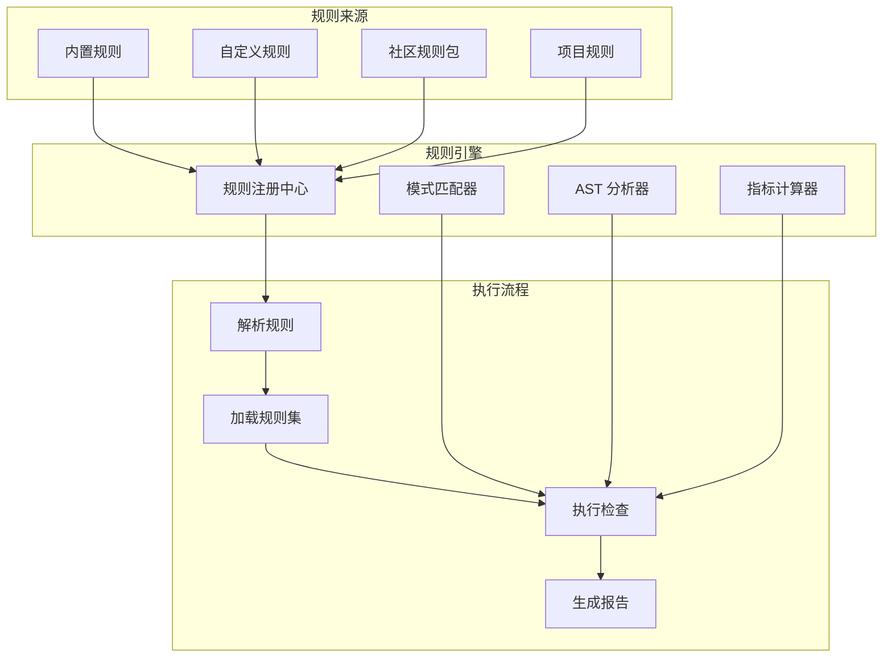
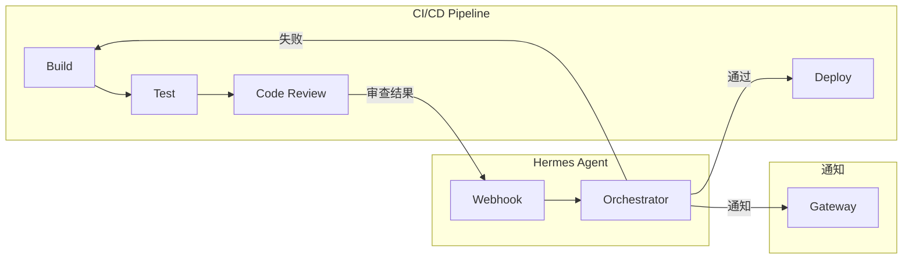
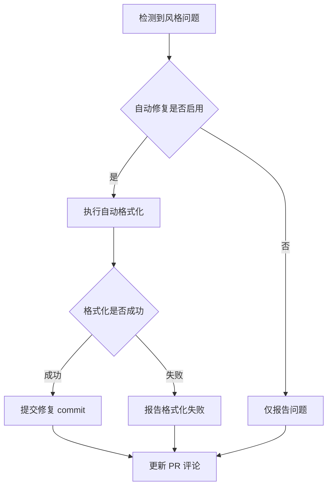
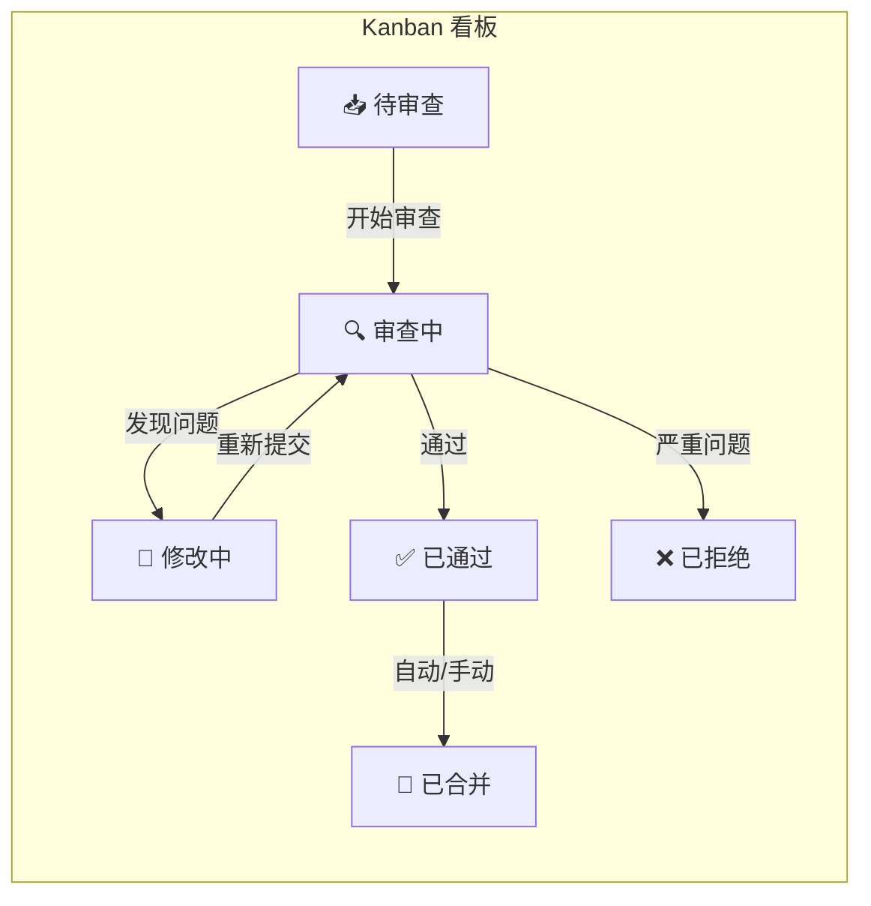
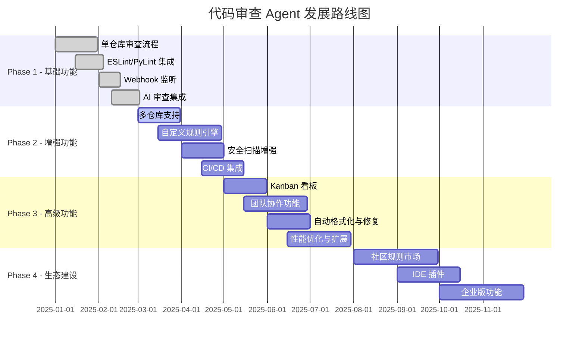

# 扩展思路与未来规划

## 1. 多仓库支持

### 1.1 集中式管理架构



### 1.2 多仓库配置

```yaml
# .hermes/config.yaml
repositories:
  - name: "frontend/web-app"
    language: "typescript"
    linter: "eslint"
    review_rules: "frontend-rules"
    auto_merge_threshold: 85
    notify_channels: ["wechat-frontend"]
    
  - name: "backend/api-service"
    language: "python"
    linter: "pylint"
    review_rules: "backend-rules"
    auto_merge_threshold: 90
    notify_channels: ["telegram-backend"]
    
  - name: "mobile/app"
    language: "typescript"
    linter: "eslint"
    review_rules: "mobile-rules"
    auto_merge_threshold: 88
    notify_channels: ["wechat-mobile"]
    
  - name: "infra/configs"
    language: "yaml"
    linter: "none"
    review_rules: "infra-rules"
    auto_merge_threshold: 95
    notify_channels: ["telegram-infra"]
```

### 1.3 组织级 Webhook 配置

```bash
# 在 GitHub 组织级别配置 Webhook（而非单个仓库）
# 组织 Settings → Webhooks → Add webhook
# Payload URL: http://your-server:8080/webhook/github
# Events: Pull requests

# 通过 GitHub API 批量添加
for repo in repo-a repo-b repo-c; do
  gh api "/repos/org/$repo/hooks" \
    --method POST \
    --field name="web" \
    --field active=true \
    --field config[url]="http://your-server:8080/webhook/github" \
    --field config[content_type]="json" \
    --field events[]="pull_request"
done
```

## 2. 自定义规则引擎

### 2.1 规则 DSL 设计

```yaml
# .hermes/skills/custom-rules.yaml
name: custom-rules-engine
description: 自定义代码审查规则引擎
version: 1.0

rules:
  - id: CUSTOM-001
    name: "禁止使用 var 声明"
    description: "使用 const/let 替代 var"
    language: ["javascript", "typescript"]
    pattern: "\\bvar\\s+"
    severity: "warning"
    auto_fix: true
    fix: "const"
    
  - id: CUSTOM-002
    name: "函数复杂度检查"
    description: "函数行数不应超过 50 行"
    language: ["javascript", "typescript", "python"]
    check: "function_length"
    max_lines: 50
    severity: "warning"
    
  - id: CUSTOM-003
    name: "导入顺序检查"
    description: "导入语句应按类型分组排序"
    language: ["javascript", "typescript"]
    check: "import_order"
    groups:
      - "react|vue|angular"
      - "lodash|moment|axios"
      - "../"
      - "./"
    severity: "info"
    
  - id: CUSTOM-004
    name: "禁止硬编码 URL"
    description: "API URL 应使用配置文件或环境变量"
    language: ["*"]
    pattern: "https?://[\\w.-]+\\.[a-z]{2,}/api/"
    severity: "error"
    exclude_patterns:
      - "config"
      - ".env"
      - "constants"
```

### 2.2 规则引擎架构



### 2.3 规则优先级与覆盖

```yaml
# 规则优先级：项目级 > 组织级 > 默认
# 规则覆盖机制
rules:
  # 默认规则（宽松）
  default:
    function_length: 100
    file_length: 500
    
  # 组织级规则（中等）
  organization:
    function_length: 60
    file_length: 300
    
  # 项目级规则（严格）
  project:
    function_length: 40  # 覆盖默认和组织规则
    file_length: 200     # 覆盖默认和组织规则
```

## 3. 与 CI/CD 集成

### 3.1 GitHub Actions 集成

```yaml
# .github/workflows/code-review.yml
name: Code Review Agent
on:
  pull_request:
    types: [opened, synchronize, reopened]

jobs:
  code-review:
    runs-on: ubuntu-latest
    steps:
      - uses: actions/checkout@v4
        with:
          fetch-depth: 0
      
      - name: Run Code Review Agent
        uses: hermes-agent/code-review-action@v1
        with:
          github-token: ${{ secrets.GITHUB_TOKEN }}
          hermes-webhook: ${{ secrets.HERMES_WEBHOOK_URL }}
          auto-merge-threshold: 90
```

### 3.2 GitLab CI 集成

```yaml
# .gitlab-ci.yml
code-review:
  stage: test
  image: node:18
  script:
    - npm install -g eslint
    - npx eslint src/ --format json > eslint-report.json
    - |
      curl -X POST $HERMES_WEBHOOK_URL \
        -H "Content-Type: application/json" \
        -d @- << EOF
        {
          "source": "gitlab-ci",
          "project": "$CI_PROJECT_PATH",
          "merge_request_iid": "$CI_MERGE_REQUEST_IID",
          "report": $(cat eslint-report.json)
        }
  only:
    - merge_requests
```

### 3.3 CI/CD 集成架构



### 3.4 质量门禁（Quality Gate）

```yaml
# .hermes/config.yaml
quality_gates:
  # 阻止合并的条件
  block_merge:
    - critical_security_issues > 0
    - high_security_issues > 2
    - quality_score < 50
    - lint_errors > 10
    
  # 警告但不阻止
  warn:
    - test_coverage < 60
    - quality_score < 70
    - lint_warnings > 20
    
  # 自动跳过审查（小改动）
  skip_review:
    - changed_files <= 1
    - additions + deletions <= 10
    - "*.md" only
    - "*.yml" only
```

## 4. 安全漏洞扫描增强

### 4.1 依赖漏洞扫描

```yaml
# .hermes/skills/dependency-scanner.yaml
name: dependency-scanner
description: 依赖包安全漏洞扫描
scanners:
  - name: npm-audit
    command: "npm audit --json"
    file: "package-lock.json"
    severity_map:
      critical: critical
      high: high
      moderate: medium
      low: low
      
  - name: pip-audit
    command: "pip-audit --format json"
    file: "requirements.txt"
    severity_map:
      critical: critical
      high: high
      moderate: medium
      low: low
      
  - name: trivy
    command: "trivy fs --format json ."
    file: "*"
    severity_map:
      CRITICAL: critical
      HIGH: high
      MEDIUM: medium
      LOW: low
```

### 4.2 SAST 集成

```bash
# 集成 Semgrep（轻量级 SAST 工具）
pip install semgrep

# 运行 Semgrep 扫描
semgrep --config=auto --json pr_diff/ > semgrep-report.json

# 集成 CodeQL（GitHub 官方）
# 在 GitHub Actions 中配置
```

### 4.3 密钥扫描增强

```yaml
# 使用 git-secrets 或 truffleHog 进行深度密钥扫描
scanners:
  - name: trufflehog
    command: "trufflehog filesystem --directory=. --json"
    enabled: true
  - name: git-secrets
    command: "git secrets --scan"
    enabled: true
```

## 5. 代码风格强制执行

### 5.1 自动格式化

```yaml
# .hermes/skills/auto-formatter.yaml
name: auto-formatter
description: 自动修复代码风格问题
formatters:
  javascript:
    command: "npx prettier --write"
    config: ".prettierrc"
  python:
    command: "black"
    config: "pyproject.toml"
  go:
    command: "gofmt -w"
    config: ""
  rust:
    command: "rustfmt"
    config: "rustfmt.toml"
```

### 5.2 自动修复工作流



### 5.3 风格配置文件模板

```javascript
// .prettierrc（JavaScript/TypeScript）
{
  "semi": true,
  "singleQuote": true,
  "tabWidth": 2,
  "trailingComma": "es5",
  "printWidth": 100,
  "arrowParens": "always"
}
```

```ini
# .pylintrc（Python）
[MASTER]
max-line-length=100

[FORMAT]
max-line-length=100
indent-string='    '
```

## 6. 团队协作看板

### 6.1 Kanban 看板设计



### 6.2 Hermes Kanban 配置

```yaml
# .hermes/kanban/code-review.yaml
name: code-review-board
columns:
  - name: "待审查"
    id: todo
    limit: 10
    auto_add: true
    triggers:
      - event: "pull_request.opened"
        
  - name: "审查中"
    id: reviewing
    auto_move_from: todo
    triggers:
      - event: "review.started"
        
  - name: "修改中"
    id: fixing
    auto_move_from: reviewing
    triggers:
      - event: "review.changes_requested"
        
  - name: "已通过"
    id: approved
    auto_move_from: reviewing
    triggers:
      - event: "review.approved"
        
  - name: "已合并"
    id: merged
    auto_move_from: approved
    triggers:
      - event: "pull_request.closed"
        
  - name: "已拒绝"
    id: rejected
    auto_move_from: reviewing
    triggers:
      - event: "review.rejected"
```

### 6.3 团队协作增强

**功能列表**：
1. **审查分配**：自动将 PR 分配给合适的审查者
2. **SLA 跟踪**：记录每个 PR 的审查等待时间
3. **统计面板**：团队审查效率、质量趋势
4. **提醒机制**：超时未审查的 PR 自动提醒
5. **周报生成**：自动生成审查统计周报

```yaml
# .hermes/config.yaml
team:
  reviewers:
    - name: "Alice"
      expertise: ["frontend", "typescript"]
      max_concurrent: 3
    - name: "Bob"
      expertise: ["backend", "python", "security"]
      max_concurrent: 2
    - name: "Charlie"
      expertise: ["infra", "devops"]
      max_concurrent: 4
      
  sla:
    max_review_time: 240  # 最大审查等待时间（分钟）
    reminder_interval: 60  # 提醒间隔（分钟）
    
  statistics:
    enabled: true
    report_schedule: "0 9 * * 1"  # 每周一早上 9 点
    metrics:
      - avg_review_time
      - pr_throughput
      - quality_trend
      - reviewer_workload
```

## 7. 未来规划路线图



### 阶段总结

| 阶段 | 时间 | 目标 | 关键交付 |
|------|------|------|----------|
| **Phase 1** | Q1 2025 | 基础可用 | 单仓库审查、静态分析、AI 审查 |
| **Phase 2** | Q2 2025 | 功能完善 | 多仓库、规则引擎、安全扫描、CI/CD |
| **Phase 3** | Q3 2025 | 团队协作 | 看板、协作、自动修复、性能优化 |
| **Phase 4** | Q4 2025 | 生态建设 | 社区市场、IDE 插件、企业版 |

---

> **状态**: 草稿 | **版本**: v0.1.0
