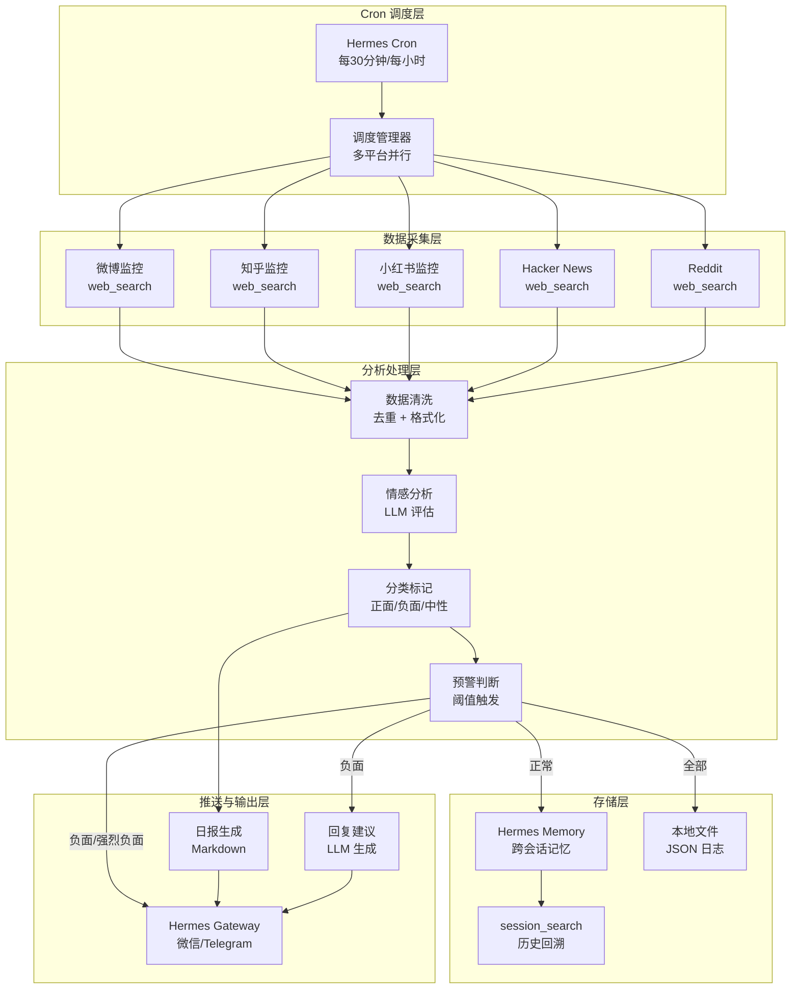
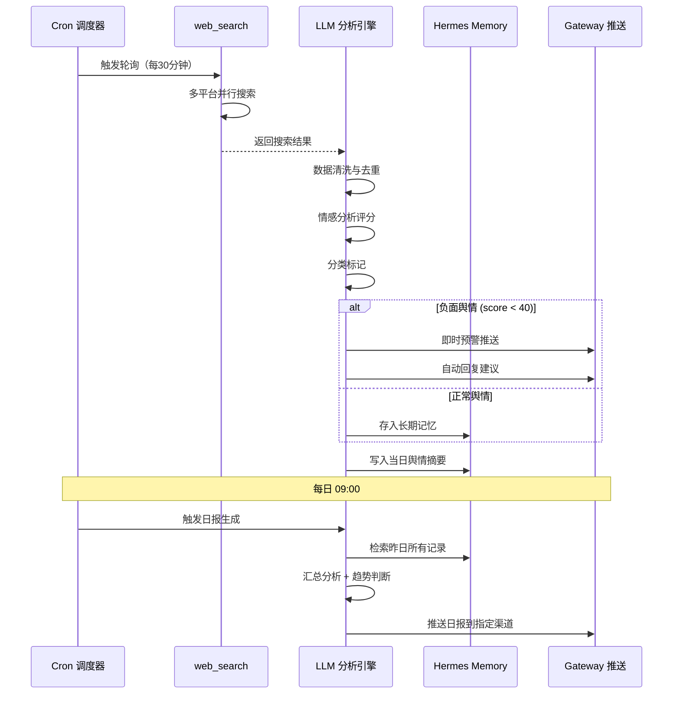

# 系统架构设计

## 1. 整体架构



## 2. 模块职责

### 2.1 数据采集层

使用 Hermes Agent 内置的 `web_search` 工具，通过关键词 + 站点限定实现多平台搜索。

**平台搜索策略：**

| 平台 | 搜索方式 | 频率 | 特点 |
|------|---------|------|------|
| 微博 | `web_search` + `site:weibo.com` | 30 分钟 | 实时性强，短文本 |
| 知乎 | `web_search` + `site:zhihu.com` | 30 分钟 | 长文本，深度分析 |
| 小红书 | `web_search` + `site:xiaohongshu.com` | 30 分钟 | 图文混合，种草内容 |
| Hacker News | `web_search` + `site:news.ycombinator.com` | 60 分钟 | 英文技术讨论 |
| Reddit | `web_search` + `site:reddit.com` | 60 分钟 | 英文社区讨论 |

### 2.2 Cron 调度层

利用 Hermes Cron 的灵活调度能力：

- **高频轮询（30 分钟）**：微博、知乎、小红书 — 国内平台舆情变化快
- **中频轮询（60 分钟）**：Hacker News、Reddit — 英文平台节奏较慢
- **日报生成（每日 09:00）**：汇总昨日所有平台舆情

### 2.3 分析处理层

在 Cron 任务的 Prompt 中直接使用 LLM 进行情感分析，无需额外模型部署。

**情感分类体系：**

```
强烈负面 (score: 0-20)  → 立即预警 + 回复建议
负面     (score: 21-40) → 预警 + 记录
中性     (score: 41-60) → 仅记录
正面     (score: 61-80) → 记录 + 日报亮点
强烈正面 (score: 81-100) → 记录 + 日报亮点
```

### 2.4 推送与输出层

通过 Hermes Gateway 实现多渠道推送：

- **微信**：企业微信/个人微信（通过 Hermes Gateway 微信适配器）
- **Telegram**：即时消息推送
- **日报**：每日定时推送到指定群组或频道

## 3. 数据流设计



## 4. 配置设计

### 4.1 关键词配置 (`configs/keywords.yaml`)

```yaml
# 监控关键词分组
keywords:
  brand:
    - "品牌名"
    - "产品名"
    - "公司名"
  product:
    - "产品名 评测"
    - "产品名 体验"
    - "产品名 吐槽"
  competitor:
    - "竞品名"
    - "竞品名 对比"
  industry:
    - "行业关键词"
    - "行业趋势"

# 各平台搜索模板
platforms:
  weibo:
    search_template: "site:weibo.com {keyword}"
    max_results: 10
  zhihu:
    search_template: "site:zhihu.com {keyword}"
    max_results: 10
  xiaohongshu:
    search_template: "site:xiaohongshu.com {keyword}"
    max_results: 10
  hackernews:
    search_template: "site:news.ycombinator.com {keyword}"
    max_results: 5
  reddit:
    search_template: "site:reddit.com {keyword}"
    max_results: 5
```

### 4.2 情感分析阈值 (`configs/sentiment.yaml`)

```yaml
sentiment:
  levels:
    critical_negative:
      range: [0, 20]
      action: alert_immediately
      color: red
    negative:
      range: [21, 40]
      action: alert
      color: orange
    neutral:
      range: [41, 60]
      action: log_only
      color: gray
    positive:
      range: [61, 80]
      action: log_and_highlight
      color: green
    strong_positive:
      range: [81, 100]
      action: log_and_highlight
      color: bright_green

  # 触发预警的附加条件
  alert_rules:
    volume_spike: true        # 短时间内同类负面激增
    influential_user: true    # 大 V / KOL 发布的负面
    viral_threshold: 5        # 同一关键词出现 5 条以上负面
```

## 5. 安全与隐私

- **关键词脱敏**：敏感关键词通过 Hermes 的 `security.redact_secrets` 机制保护
- **数据留存**：舆情数据默认保留 30 天，可通过 Cron 清理任务归档
- **推送范围控制**：预警消息仅推送到授权群组，避免信息泄露
