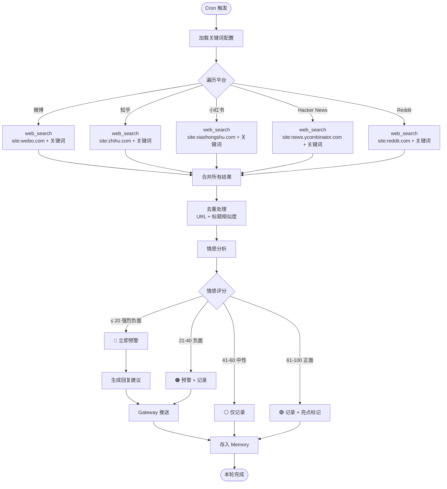
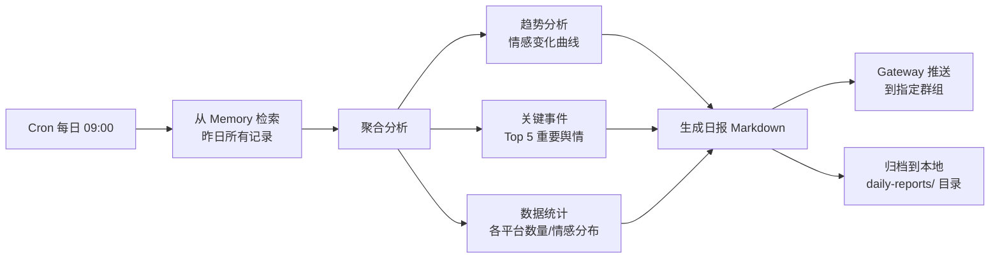
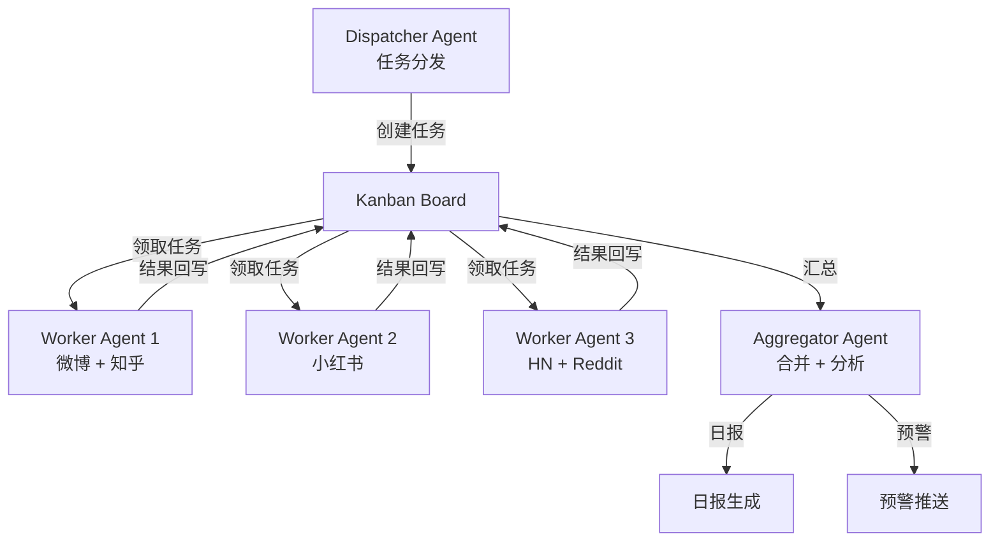

# 核心流程详解

## 1. 监控轮询流程



## 2. 情感分析策略

### 2.1 分析维度

每条舆情从以下维度进行综合评分（0-100）：

| 维度 | 权重 | 说明 |
|------|------|------|
| 情感极性 | 40% | 正面/负面/中性的语言表达 |
| 情绪强度 | 20% | 用词激烈程度（愤怒、失望 vs 平静） |
| 影响范围 | 20% | 转发量、点赞数、评论数 |
| 发布者影响力 | 10% | 粉丝数、认证状态、历史言论 |
| 时效性 | 10% | 发布时间越近权重越高 |

### 2.2 Cron Prompt 中的分析指令

在 Cron 任务的 Prompt 中，通过自然语言指令让 LLM 执行情感分析。以下是完整的 Prompt 模板：

```text
## 社交媒体舆情监控任务

### 当前时间
{current_time}

### 监控关键词
{brand_keywords}
{product_keywords}
{competitor_keywords}
{industry_keywords}

### 执行步骤

#### 步骤 1：多平台搜索
使用 web_search 工具搜索以下平台：
1. **微博** — 搜索 "site:weibo.com {keyword}"
2. **知乎** — 搜索 "site:zhihu.com {keyword}"
3. **小红书** — 搜索 "site:xiaohongshu.com {keyword}"
4. **Hacker News** — 搜索 "site:news.ycombinator.com {keyword}"
5. **Reddit** — 搜索 "site:reddit.com {keyword}"

每个平台取前 10 条结果（海外平台前 5 条）。

#### 步骤 2：数据清洗与去重
- 去除 URL 完全相同的重复条目
- 合并标题相似度 > 80% 的条目
- 过滤无关广告和垃圾内容

#### 步骤 3：情感分析
对每条结果进行情感分析，输出 JSON 格式：

```json
{
  "platform": "weibo",
  "title": "帖子标题",
  "url": "帖子链接",
  "summary": "内容摘要",
  "sentiment_score": 0-100,
  "sentiment_label": "strong_positive|positive|neutral|negative|critical_negative",
  "key_topics": ["话题1", "话题2"],
  "influencer_level": "high|medium|low",
  "engagement": "high|medium|low"
}
```

#### 步骤 4：预警判断
- **强烈负面 (0-20)**：立即通过 Gateway 推送预警 + 生成回复建议
- **负面 (21-40)**：推送预警，记录详情
- **中性/正面**：仅记录到 Memory

#### 步骤 5：结果输出
1. 将完整结果通过 Gateway 推送（仅负面）
2. 将摘要存入 Hermes Memory
3. 如检测到负面舆情，生成回复建议
```

### 2.3 回复建议生成策略

当检测到负面舆情时，LLM 自动生成品牌回复建议：

```text
## 回复建议生成

针对以下负面舆情，请生成品牌回复建议：

舆情内容：{负面舆情原文}
平台：{平台名称}
发布者影响力：{高/中/低}
情感评分：{分数}

请输出：
1. **回复策略**：道歉/解释/引导私信/不回应
2. **回复话术**：具体回复文案（50-150字）
3. **优先级**：紧急/高/中/低
4. **建议处理时限**：例如"2小时内回复"
```

## 3. 日报生成流程



### 3.1 日报模板

```markdown
# 社交媒体舆情日报

**日期**: {date}
**生成时间**: {generated_time}

---

## 📊 今日概览

| 指标 | 数值 |
|------|------|
| 监控关键词数 | {keyword_count} |
| 覆盖平台数 | {platform_count} |
| 采集总条数 | {total_mentions} |
| 负面舆情数 | {negative_count} |
| 平均情感分 | {avg_sentiment} |

## 📈 情感趋势

{trend_chart_placeholder}

## 🔴 负面舆情列表

| 平台 | 标题 | 情感分 | 链接 |
|------|------|--------|------|
| ... | ... | ... | ... |

## 🟢 正面亮点

| 平台 | 标题 | 情感分 | 链接 |
|------|------|--------|------|
| ... | ... | ... | ... |

## 📝 关键事件回顾

1. **事件一**：{描述}
   - 平台：{platform}
   - 影响：{impact}
   - 建议行动：{action}

## 🎯 建议关注

- 趋势预警：{warning}
- 竞品动态：{competitor_news}
- 行业热点：{industry_trend}
```

## 4. 跨会话记忆与回溯

### 4.1 Memory 存储策略

每次监控轮询完成后，将摘要写入 Hermes Memory：

```text
[社交媒体舆情] {timestamp}
- 平台: {platform}
- 关键词: {keyword}
- 采集条数: {count}
- 负面条数: {negative_count}
- 平均情感分: {avg_score}
- 关键条目: {top_items}
```

### 4.2 历史回溯

使用 `session_search` 回溯历史舆情：

```bash
# 在 Hermes 会话中查询历史舆情
hermes chat -q "
使用 session_search 搜索过去7天内关于'品牌名'的舆情记录，
分析情感变化趋势，并输出摘要报告。
"
```

## 5. Kanban 工作流（多 Agent 协作）

对于大规模监控场景，可以使用 Kanban 编排多个 Agent：



**Kanban 配置示例**：

```bash
# 初始化 Kanban 看板
hermes kanban init social-monitor

# 创建监控任务
hermes kanban create \
  --board social-monitor \
  --title "微博+知乎 舆情轮询" \
  --assign worker-1

hermes kanban create \
  --board social-monitor \
  --title "小红书 舆情轮询" \
  --assign worker-2

hermes kanban create \
  --board social-monitor \
  --title "HN+Reddit 舆情轮询" \
  --assign worker-3
```
