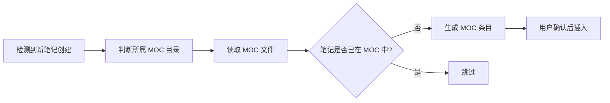
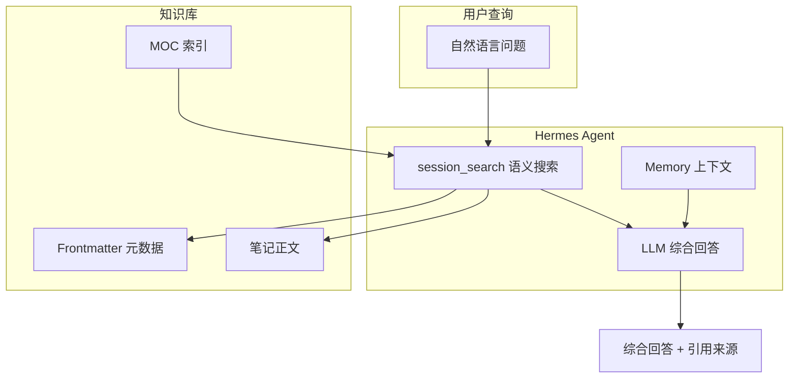
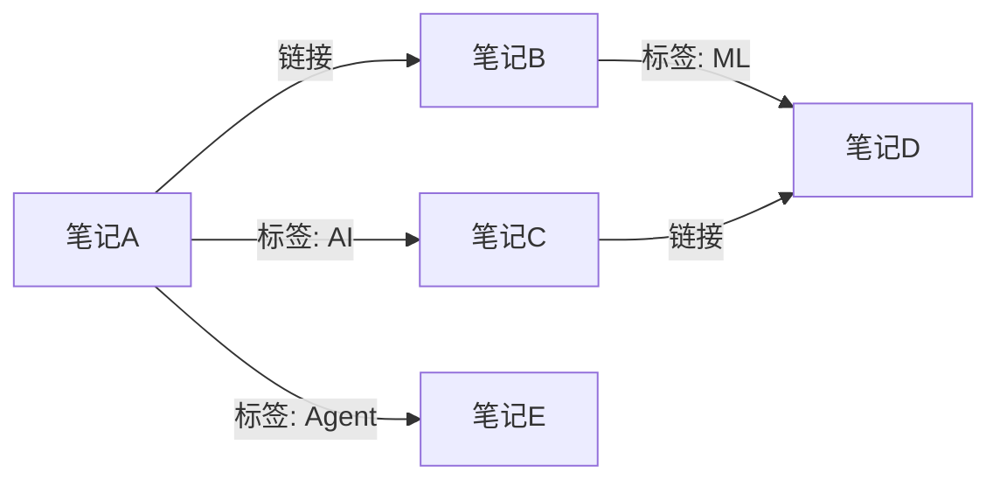
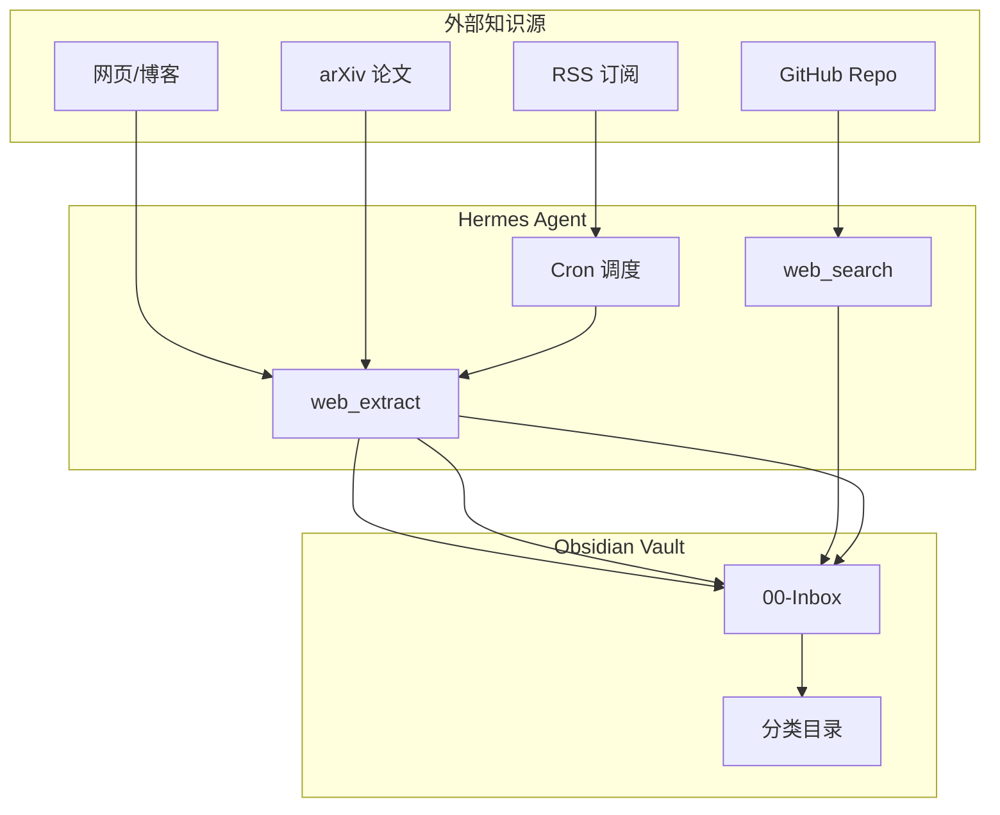
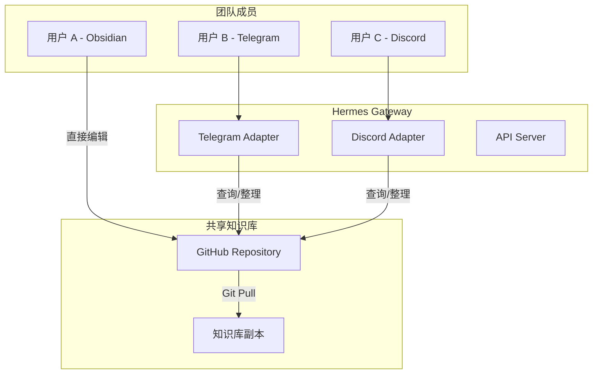
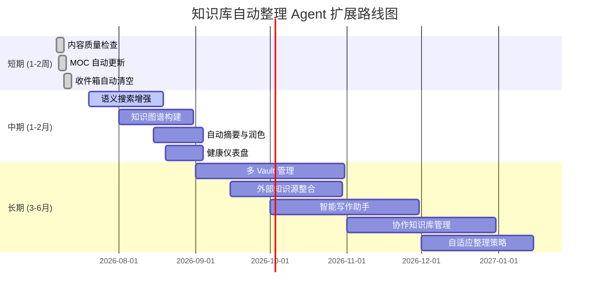

# 扩展思路

> 本文档探讨基于当前架构的未来扩展方向，从短期可实施的增强到长期愿景。

## 1. 短期扩展（1-2 周可实施）

### 1.1 内容质量检查 Agent

在 frontmatter 检测的基础上，增加内容质量评估：

```yaml
检查维度:
  - 标题质量: 是否包含有意义的标题，而非默认文件名
  - 段落长度: 是否存在过短（<50字）或过长（>1000字）的段落
  - 完整性: 是否有 TODO、FIXME 等标记
  - 引用质量: 外部引用是否包含来源说明
  - 图片: 是否包含 alt text
```

**Hermes 实现**：

```bash
hermes cron create "0 9 * * 3" \
  --name "content-quality-check" \
  --prompt "检查 vault 中最近一周修改的笔记的内容质量，按以上维度评分，输出质量报告和改进建议。" \
  --deliver chat
```

### 1.2 MOC 自动更新 Agent

当笔记数量增长时，自动更新 MOC（Map of Content）索引文件：



**Dataview 自动生成 MOC**：

```dataview
TABLE 
  file.etags as "标签",
  file.mtime as "最后修改"
FROM "02-Knowledge(知识层)/20-核心能力-Core_Ability"
SORT file.name ASC
```

**Templater 模板 - 自动 MOC 页面**：

```markdown
---
title: MOC - <% tp.system.prompt("领域名称") %>
description: <% tp.system.prompt("领域描述") %> 的 Map of Content
created: <% tp.date.now("YYYY-MM-DD") %>
updated: <% tp.date.now("YYYY-MM-DD") %>
tags:
  - moc
  - <% tp.system.prompt("领域标签") %>
status: published
---

# MOC - <% tp.file.title %>

## 概述

<!-- 领域简介 -->

## 笔记索引

```dataview
TABLE 
  file.etags as "标签",
  file.mtime as "最后修改",
  file.frontmatter.status as "状态"
FROM "<% tp.system.prompt("查询路径") %>"
SORT file.name ASC
```

## 核心概念

<!-- 列出该领域的核心概念和对应笔记链接 -->

## 待办

- [ ] 补充未完成的笔记
- [ ] 建立跨领域关联
```

### 1.3 收件箱自动清空 Agent

定期处理 `00-Inbox(收件箱)` 中的笔记：

```bash
hermes cron create "0 20 * * 5" \
  --name "inbox-cleanup" \
  --prompt "分析 00-Inbox(收件箱) 中的笔记，对每条笔记建议：1) 移动到哪个目录 2) 补全 frontmatter 3) 建议标签。输出处理建议列表，用户确认后执行移动。" \
  --deliver chat
```

## 2. 中期扩展（1-2 个月）

### 2.1 语义搜索增强

利用 Hermes 的 `session_search` 和向量搜索能力，构建知识库语义搜索引擎：



**实现方式**：创建一个专门的 Hermes 技能（skill）：

```yaml
# ~/.hermes/skills/knowledge-qa/SKILL.md
---
name: knowledge-qa
description: 基于 Obsidian 知识库的语义问答
---
```

### 2.2 知识图谱构建

从笔记间的 `[[wikilink]]` 和标签关系构建知识图谱：



**实现思路**：

1. 使用 `terminal` 提取所有 `[[wikilink]]` 关系
2. 使用 Dataview 导出标签关系
3. 生成 Graphviz DOT 或 Mermaid 格式的可视化
4. 通过 Hermes 定期更新知识图谱

```bash
# 提取链接关系并生成 DOT 文件
echo "digraph KnowledgeGraph {" > /tmp/kg.dot
find "X:/KMS/yeyunby" -name "*.md" -not -path "*/.obsidian/*" | while read f; do
  filename=$(basename "$f" .md)
  grep -oh '\[\[[^]]*\]\]' "$f" | sed 's/\[\[//;s/\]\]//;s/|.*//' | while read target; do
    echo "  \"$filename\" -> \"$target\";" >> /tmp/kg.dot
  done
done
echo "}" >> /tmp/kg.dot
```

### 2.3 自动摘要与笔记润色

为长笔记自动生成摘要，填充 `description` 字段：

```bash
hermes cron create "0 10 * * 1" \
  --name "auto-summarize" \
  --prompt "扫描 vault 中 description 字段为空或过短的笔记，读取正文内容，生成 1-2 句摘要并更新 frontmatter 的 description 字段。每次处理不超过 10 篇笔记，更新前需用户确认。" \
  --deliver chat
```

### 2.4 知识库健康仪表盘

通过 Hermes 生成定期健康报告：

```bash
hermes cron create "0 9 * * 1" \
  --name "weekly-health-report" \
  --prompt "生成本周知识库健康报告，包含以下指标：
1. 新增笔记数
2. 修改笔记数
3. Frontmatter 完整率
4. 链接健康率
5. 标签总数与新增标签数
6. 收件箱待处理数
7. 建议归档数
输出格式化为 Markdown 表格。" \
  --deliver chat
```

## 3. 长期扩展（3-6 个月）

### 3.1 多 Vault 统一管理

通过 Hermes 配置文件管理多个 Obsidian vault：

```yaml
# ~/.hermes/config.yaml 扩展
knowledge_bases:
  main:
    path: "X:/KMS/yeyunby"
    cron_enabled: true
   整理范围:
      - frontmatter
      - links
      - tags
  work:
    path: "X:/WorkDocs/knowledge"
    cron_enabled: true
   整理范围:
      - frontmatter
      - links
```

### 3.2 外部知识源整合

通过 `web_extract` 和 `web_search` 工具，将外部知识纳入整理流程：



### 3.3 智能写作助手

基于 Memory 中的用户写作风格和知识库内容，提供写作辅助：

- **草稿生成**：根据 MOC 和已有笔记生成初稿
- **风格统一**：检查新笔记与已有笔记的风格一致性
- **引用建议**：推荐可引用的内部笔记和外部资料
- **术语检查**：确保术语使用与知识库一致

### 3.4 协作知识库管理

通过 Hermes Gateway 的多平台能力，支持团队协作：



### 3.5 自适应整理策略

基于 Machine Learning 分析用户行为，自动调整整理策略：

```yaml
自适应策略:
  整理频率:
    - 活跃期（用户频繁修改）→ 增加整理频率
    - 静默期（用户少访问）→ 降低整理频率
  标签推荐:
    - 学习用户接受/拒绝模式
    - 调整推荐算法权重
  归档阈值:
    - 根据用户归档行为动态调整天数
    - 不同目录设置不同阈值
```

## 4. 技术深度扩展

### 4.1 自定义 Hermes 插件

开发专门的 Obsidian 整理插件：

```python
# plugins/obsidian-kb-organizer/plugin.py
from hermes.plugin import HermesPlugin

class ObsidianKBOrganizer(HermesPlugin):
    """Obsidian 知识库自动整理插件"""
    
    def on_cron_tick(self, job_name: str):
        if job_name == "frontmatter-check":
            return self.check_frontmatter()
        elif job_name == "link-check":
            return self.check_links()
    
    def check_frontmatter(self):
        # 自定义 frontmatter 检测逻辑
        pass
```

### 4.2 本地 Embedding 模型

使用本地 embedding 模型（如 BGE、E5）进行笔记相似度计算，避免 API 调用：

```bash
# 安装 sentence-transformers
pip install sentence-transformers

# 生成笔记 embeddings
python -c "
from sentence_transformers import SentenceTransformer
model = SentenceTransformer('BAAI/bge-small-zh-v1.5')
# ... 处理笔记
"
```

### 4.3 增量处理引擎

只处理变更的文件，避免全量扫描：

```bash
# 基于 Git 变更的增量处理
cd "X:/KMS/yeyunby"

# 获取最近一次整理后的变更文件
CHANGED_FILES=$(git diff --name-only HEAD~1 -- '*.md')

# 只处理这些文件
for f in $CHANGED_FILES; do
  echo "处理: $f"
  # 执行 frontmatter 检测、标签推荐等
done
```

## 5. 社区与生态

### 5.1 共享技能包

将本项目封装为 Hermes 技能，发布到技能市场：

```bash
# 发布技能
hermes skills publish "X:/KMS/yeyunby/.../06-个人知识库自动整理Agent"

# 其他用户安装
hermes skills install obsidian-kb-organizer
```

### 5.2 模板市场

创建可共享的 Templater 模板集合：

```
_templates/
├── frontmatter.md          # 基础 frontmatter
├── note-standard.md        # 标准笔记
├── moc-page.md             # MOC 页面
├── project-overview.md     # 项目概览
├── meeting-notes.md        # 会议记录
├── daily-log.md            # 每日日志
└── book-note.md            # 读书笔记
```

### 5.3 Dataview 查询库

整理常用 Dataview 查询为可复用的查询库：

```dataview
TABLE 
  file.link as "笔记",
  file.frontmatter.status as "状态",
  date(today) - file.mtime as "未更新天数",
  length(file.inlinks) as "入链",
  length(file.outlinks) as "出链",
  length(file.etags) as "标签数"
FROM ""
WHERE file.name != "README"
  AND file.folder != "50-归档-Archive"
  AND file.folder != ".obsidian"
SORT file.mtime DESC
```

## 6. 路线图总览



## 7. 贡献指南

欢迎通过以下方式参与项目扩展：

1. **提交 Issue**：在知识库中创建笔记，记录遇到的问题或扩展想法
2. **分享技能**：将你的 Hermes 技能发布到社区
3. **改进文档**：补充踩坑记录、优化流程描述
4. **代码贡献**：开发辅助脚本、Hermes 插件

---

> **思考**：知识库整理不是一次性工作，而是一个持续演进的过程。随着笔记数量的增长和 AI 能力的提升，整理 Agent 也会越来越智能。关键在于建立一个可持续的自动化循环——让 Agent 在整理中学习，在学习中更好地整理。
