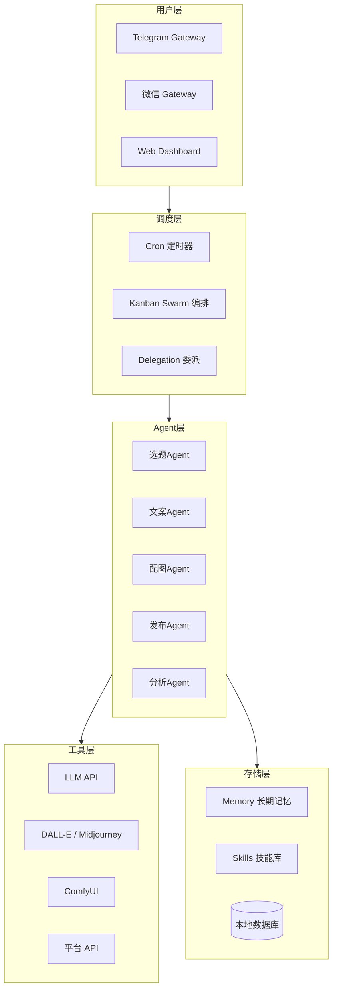
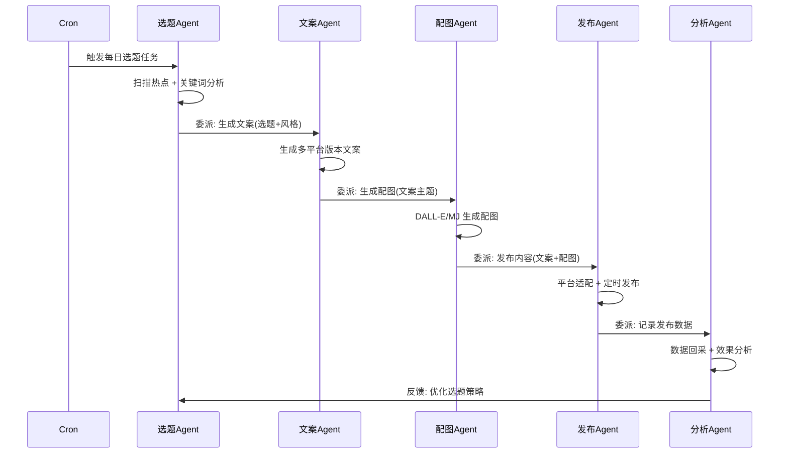
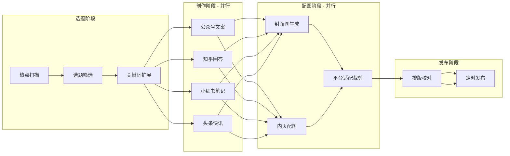

# 架构设计

## 1. 总体架构

### 1.1 分层模型



### 1.2 多 Profile 设计

每个 Agent 对应一个独立的 Hermes Profile，拥有独立的 System Prompt、Memory 空间和 Skills。

| Profile 名称 | 角色 | 模型偏好 | 核心职责 |
|-------------|------|---------|---------|
| `topic-agent` | 选题策划 | Claude / GPT-4 | 热点追踪、选题挖掘、关键词分析 |
| `copy-agent` | 文案创作 | GPT-4 / DeepSeek | 多风格文案生成、改写、润色 |
| `image-agent` | 配图设计 | DALL-E 3 / MJ | 提示词工程、图生图、风格统一 |
| `publish-agent` | 发布管理 | GPT-4o-mini | 平台适配、排版、定时发布 |
| `analytics-agent` | 数据分析 | GPT-4o-mini | 数据回采、效果分析、策略优化 |

## 2. Profile 配置示例

### 2.1 创建 Profile

```bash
# 创建选题 Agent Profile
hermes profile create topic-agent \
  --model claude-sonnet-4 \
  --system-prompt "你是一位资深新媒体选题策划专家..."

# 创建文案 Agent Profile
hermes profile create copy-agent \
  --model gpt-4o \
  --system-prompt "你是一位多风格文案创作专家..."

# 创建配图 Agent Profile
hermes profile create image-agent \
  --model gpt-4o \
  --system-prompt "你是一位 AI 视觉设计师..."

# 创建发布 Agent Profile
hermes profile create publish-agent \
  --model gpt-4o-mini \
  --system-prompt "你是一位多平台内容运营专家..."

# 创建分析 Agent Profile
hermes profile create analytics-agent \
  --model gpt-4o-mini \
  --system-prompt "你是一位数据驱动的内容策略分析师..."
```

### 2.2 Profile 切换与委派

```bash
# 在 topic-agent 下工作
hermes profile use topic-agent

# 委派任务给文案 Agent
hermes delegate --profile copy-agent \
  --task "根据以下选题生成小红书风格文案: ..."
```

## 3. Agent 通信机制

### 3.1 Delegation 数据流



### 3.2 数据结构定义

```json
{
  "topic": {
    "id": "topic-20260707-001",
    "title": "选题标题",
    "keywords": ["关键词1", "关键词2"],
    "source": "微博热搜 / 知乎热榜 / 公众号",
    "urgency": "high|medium|low",
    "platforms": ["wechat", "zhihu", "xiaohongshu", "toutiao"]
  },
  "article": {
    "id": "article-20260707-001",
    "topic_id": "topic-20260707-001",
    "versions": {
      "wechat": { "title": "...", "content": "...", "style": "深度长文" },
      "zhihu": { "title": "...", "content": "...", "style": "专业回答" },
      "xiaohongshu": { "title": "...", "content": "...", "style": "种草笔记" },
      "toutiao": { "title": "...", "content": "...", "style": "资讯快讯" }
    },
    "images": ["url1", "url2"],
    "status": "draft|review|published"
  },
  "analytics": {
    "article_id": "article-20260707-001",
    "platform_stats": {
      "wechat": { "views": 0, "likes": 0, "shares": 0 },
      "zhihu": { "views": 0, "upvotes": 0, "comments": 0 },
      "xiaohongshu": { "views": 0, "likes": 0, "collects": 0 },
      "toutiao": { "views": 0, "reads": 0, "comments": 0 }
    }
  }
}
```

## 4. Kanban Swarm 任务编排

使用 Hermes Kanban Swarm 实现多 Agent 并行工作：



## 5. Memory 策略

每个 Profile 拥有独立的 Memory 空间，用于记录：

| Memory 类型 | 内容 | 用途 |
|------------|------|------|
| **平台调性** | 各平台内容偏好、格式要求 | 指导文案生成 |
| **爆款特征** | 历史高互动内容的特征分析 | 优化选题与标题 |
| **用户画像** | 目标受众兴趣标签 | 内容定向 |
| **风格库** | 已积累的写作风格模板 | 快速风格迁移 |
| **黑名单** | 低效选题、违规词 | 避坑 |

```bash
# 写入 Memory
hermes memory add --profile copy-agent \
  --key "xiaohongshu-style" \
  --value "小红书风格: 口语化、emoji丰富、分段短、首图吸引人"

# 查询 Memory
hermes memory get --profile topic-agent --key "hot-trends"
```

## 6. Skills 封装

将重复性工作封装为 Skills，便于复用：

```bash
# 创建各平台文案 Skill
hermes skill create wechat-article --content "..."
hermes skill create xiaohongshu-note --content "..."
hermes skill create zhihu-answer --content "..."

# 创建配图提示词 Skill
hermes skill create image-prompt-master --content "..."

# 创建发布流程 Skill
hermes skill create publish-workflow --content "..."
```

## 7. 安全与权限

- **API Key 管理**: 通过 Hermes 配置管理，不硬编码
- **Profile 隔离**: 各 Agent 独立 Profile，互不干扰
- **发布审核**: 关键发布操作需人工确认（Gateway 推送审核）
- **数据脱敏**: 用户数据回采时脱敏处理
