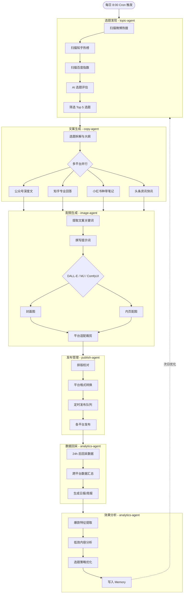
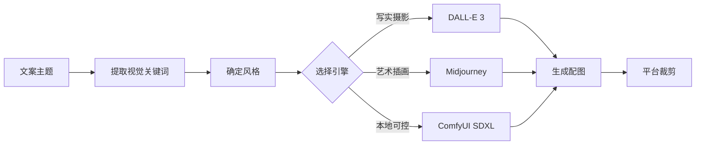
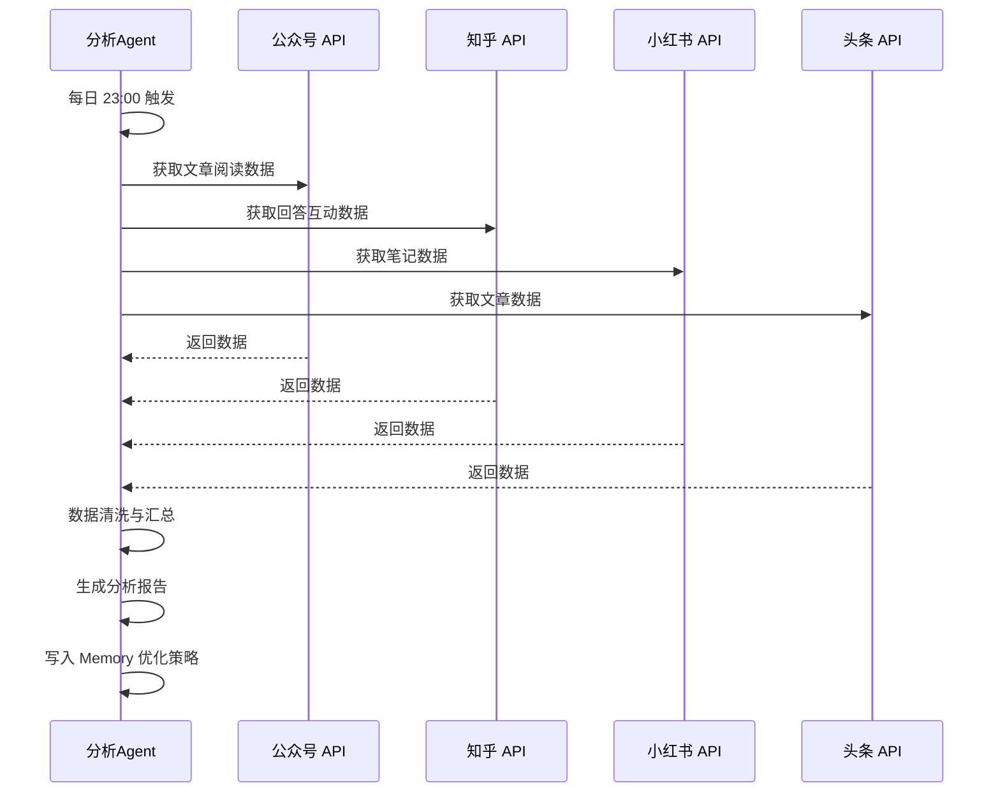

# 核心流程

## 1. 全链路流程图



## 2. 选题发现（topic-agent）

### 2.1 数据源配置

```yaml
# configs/topic-sources.yaml
sources:
  weibo_hot:
    type: api
    url: "https://api.weibo.com/2/statuses/public_timeline.json"
    interval: 30m
    
  zhihu_hot:
    type: api
    url: "https://www.zhihu.com/api/v3/feed/topstory/hot-lists"
    interval: 30m
    
  baidu_index:
    type: api
    url: "https://index.baidu.com/api/SearchApi/index"
    interval: 60m
    
  wechat_articles:
    type: rss
    urls:
      - "https://rsshub.app/wechat/mp/..."
    interval: 60m
```

### 2.2 选题评估 Prompt

```markdown
你是一位资深新媒体选题策划专家。请根据以下热点信息，评估并筛选出最佳选题。

评估维度（每项 1-10 分）：
1. **热度**：当前搜索量/讨论量
2. **持久度**：话题生命周期（短/中/长）
3. **相关性**：与目标受众的匹配度
4. **差异化**：是否有独特切入角度
5. **可转化性**：能否产出 4 平台适配内容

今日热点数据：
{hot_data}

请返回 JSON 格式的 Top 5 选题：
{
  "topics": [
    {
      "title": "选题标题",
      "score": 8.5,
      "angle": "独特切入角度",
      "platform_strategy": {
        "wechat": "深度分析方向",
        "zhihu": "专业回答方向",
        "xiaohongshu": "种草/教程方向",
        "toutiao": "资讯快讯方向"
      },
      "keywords": ["关键词1", "关键词2"]
    }
  ]
}
```

## 3. 文案生成（copy-agent）

### 3.1 多平台风格对比

| 维度 | 公众号 | 知乎 | 小红书 | 头条 |
|------|--------|------|--------|------|
| **字数** | 2000-5000 字 | 800-3000 字 | 300-800 字 | 500-1500 字 |
| **风格** | 深度、结构化 | 专业、论证充分 | 口语化、种草 | 快节奏、信息密度高 |
| **标题** | 悬念式、数字式 | 问题式、观点式 | 场景式、情绪式 | 热点式、对比式 |
| **段落** | 长段落 + 小标题 | 论点 + 论据 | 短段落 + emoji | 短句 + 加粗 |
| **配图** | 3-5 张内页图 | 2-3 张示意图 | 5-8 张精美图 | 1-2 张新闻图 |
| **发布时间** | 12:00 / 20:00 | 10:00 / 15:00 | 07:30 / 18:00 | 07:00 / 12:00 / 18:00 |

### 3.2 各平台文案 Skill 封装

#### 公众号深度文 Skill

```yaml
# skill: wechat-article
name: wechat-article
description: 生成微信公众号深度长文
prompt: |
  你是一位公众号深度内容作者。请根据以下选题生成一篇公众号文章。
  
  格式要求：
  - 标题：20 字以内，含数字或悬念
  - 摘要：100 字以内
  - 正文：2000-5000 字，分 4-6 个小标题
  - 开头：Hook 式开头，前 100 字抓住注意力
  - 结尾：总结 + 引导关注/在看
  
  风格：专业但不晦涩，有观点有案例
  避免：过度营销感、标题党
  
  选题：{topic}
  关键词：{keywords}
```

#### 小红书种草笔记 Skill

```yaml
# skill: xiaohongshu-note
name: xiaohongshu-note
description: 生成小红书种草笔记
prompt: |
  你是一位小红书内容创作者。请根据以下选题生成一篇种草笔记。
  
  格式要求：
  - 标题：20 字以内，含 emoji
  - 正文：300-800 字，每段 2-3 行
  - 每段开头用 emoji 装饰
  - 使用大量换行，避免长段落
  - 结尾：话题标签 #xxx #xxx
  
  风格：真实分享感、口语化、有温度
  避免：硬广语气、过于正式
  
  选题：{topic}
  关键词：{keywords}
```

#### 知乎专业回答 Skill

```yaml
# skill: zhihu-answer
name: zhihu-answer
description: 生成知乎专业回答
prompt: |
  你是一位知乎答主。请根据以下问题生成一篇专业回答。
  
  格式要求：
  - 开头：直接亮明观点/结论
  - 正文：800-3000 字，分论点 + 论据
  - 引用数据/案例增强说服力
  - 结尾：总结 + 引导讨论
  
  风格：专业可信、逻辑清晰、有理有据
  避免：情绪化表达、无数据支撑的断言
  
  问题：{topic}
  关键词：{keywords}
```

#### 头条快讯 Skill

```yaml
# skill: toutiao-news
name: toutiao-news
description: 生成今日头条资讯快讯
prompt: |
  你是一位头条号作者。请根据以下选题生成一篇资讯文章。
  
  格式要求：
  - 标题：25 字以内，含数字或对比
  - 正文：500-1500 字
  - 开头：直接给核心信息
  - 正文：短句为主，重要信息加粗
  - 结尾：引导评论/转发
  
  风格：信息密度高、节奏快、观点鲜明
  避免：长篇大论、铺垫过多
  
  选题：{topic}
  关键词：{keywords}
```

### 3.3 文案生成调用示例

```bash
# 生成公众号文章
hermes skill run wechat-article \
  --param topic="AI 工具如何改变自媒体创作" \
  --param keywords="AI写作,内容自动化,效率提升"

# 生成小红书笔记
hermes skill run xiaohongshu-note \
  --param topic="5 款超好用的 AI 写作工具推荐" \
  --param keywords="AI工具,写作神器,效率工具"
```

## 4. 配图生成（image-agent）

### 4.1 提示词工程策略



### 4.2 配图提示词模板

```markdown
# DALL-E 3 提示词模板
任务：根据以下文案主题生成配图

主题：{topic}
风格：{style}（摄影/插画/3D渲染/扁平设计）
构图：{composition}（特写/全景/三分法）
色彩：{color_scheme}（暖色/冷色/高对比/柔和）
文字区域：需预留 {position} 位置放置标题文字

要求：
- 适合自媒体配图，比例 16:9 / 1:1 / 3:4
- 画面干净，主体突出
- 避免文字和复杂符号
```

### 4.3 平台配图规格

| 平台 | 封面图比例 | 内页图比例 | 建议尺寸 | 数量 |
|------|-----------|-----------|---------|------|
| 公众号 | 2.35:1 | 16:9 / 1:1 | 900×383 / 1080×1080 | 3-5 张 |
| 知乎 | 16:9 | 4:3 | 1920×1080 | 2-3 张 |
| 小红书 | 3:4 | 1:1 / 3:4 | 1242×1660 | 5-8 张 |
| 头条 | 16:9 | 16:9 | 1920×1080 | 1-2 张 |

## 5. 发布管理（publish-agent）

### 5.1 定时发布策略

```mermaid
gantt
    title 各平台最佳发布时间
    dateFormat  HH:mm
    axisFormat  %H:%M
    
    section 公众号
    午间发布     :wechat1, 12:00, 30m
    晚间发布     :wechat2, 20:00, 30m
    
    section 知乎
    上午发布     :zhihu1, 10:00, 30m
    下午发布     :zhihu2, 15:00, 30m
    
    section 小红书
    早间发布     :xhs1, 07:30, 30m
    晚间发布     :xhs2, 18:00, 30m
    
    section 头条
    早间发布     :tt1, 07:00, 30m
    午间发布     :tt2, 12:00, 30m
    晚间发布     :tt3, 18:00, 30m
```



### 5.2 发布流程

```bash
# 1. 排版校对
hermes delegate --profile publish-agent \
  --task "校对并排版以下文章，适配公众号格式: {article}"

# 2. 平台格式转换
hermes skill run format-converter \
  --param input_format="markdown" \
  --param output_format="wechat-html"

# 3. 加入发布队列
hermes cron trigger schedule-publish

# 4. 查看发布状态
hermes kanban show content-factory-pipeline --lane "发布"
```

## 6. 数据回采与分析（analytics-agent）

### 6.1 数据回采流程



### 6.2 分析报告模板

```markdown
# 内容日报 — {date}

## 📊 总览
- 发布文章数：{total_articles}
- 总阅读量：{total_views}
- 总互动量：{total_interactions}
- 爆款文章（>1万阅读）：{viral_count}

## 📈 平台表现
| 平台 | 发布数 | 总阅读 | 平均阅读 | 互动率 | Top1 文章 |
|------|--------|--------|---------|-------|----------|
| 公众号 | 5 | 12000 | 2400 | 3.2% | {title} |
| 知乎 | 5 | 8000 | 1600 | 5.1% | {title} |
| 小红书 | 5 | 15000 | 3000 | 8.5% | {title} |
| 头条 | 5 | 20000 | 4000 | 2.1% | {title} |

## 🔥 爆款特征
{insights}

## 💡 优化建议
{suggestions}
```

### 6.3 Memory 反馈闭环

```bash
# 记录爆款特征
hermes memory add --profile topic-agent \
  --key "viral-patterns" \
  --value "小红书: 标题含数字+emoji, 首图对比色, 正文有清单"

# 记录低效选题
hermes memory add --profile topic-agent \
  --key "low-performers" \
  --value "避免: 纯技术教程类在头条表现差"

# 更新风格偏好
hermes memory add --profile copy-agent \
  --key "platform-tuning" \
  --value "公众号: 增加案例故事比例, 减少理论阐述"
```

## 7. 完整流水线一键执行

```bash
#!/bin/bash
# run-pipeline.sh - 手动触发完整内容流水线

echo "🚀 启动 AI 内容工厂流水线..."

echo "1️⃣ 选题发现..."
hermes delegate --profile topic-agent --task "扫描热点，筛选今日 Top 5 选题"

echo "2️⃣ 文案生成..."
hermes delegate --profile copy-agent --task "为今日选题生成 4 平台文案"

echo "3️⃣ 配图生成..."
hermes delegate --profile image-agent --task "为今日文案生成配图"

echo "4️⃣ 发布管理..."
hermes delegate --profile publish-agent --task "排版并定时发布今日内容"

echo "5️⃣ 数据回采（次日执行）..."
echo "✅ 流水线已启动！查看 Kanban 看板获取进度。"
hermes kanban show content-factory-pipeline
```
