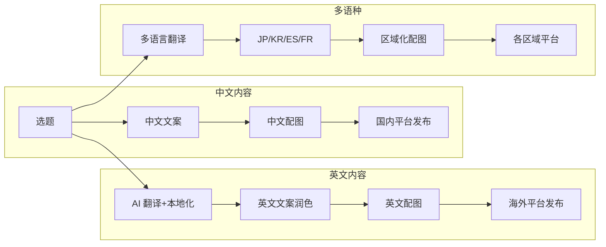
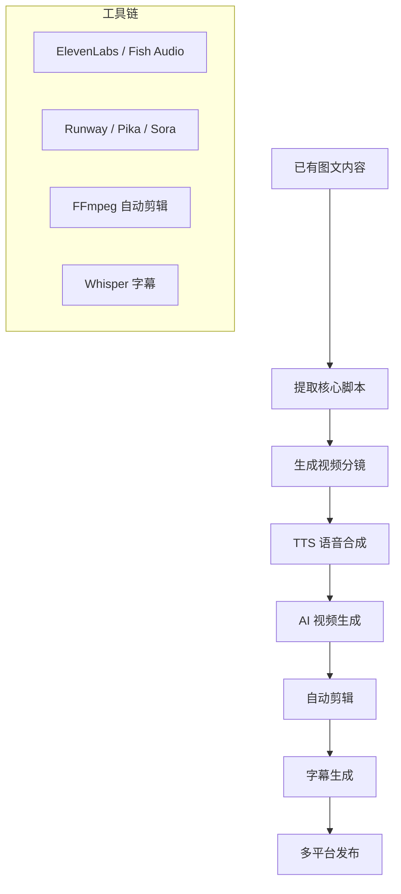
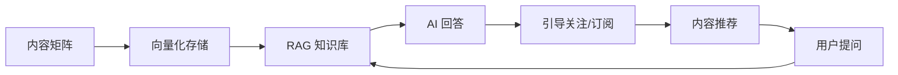
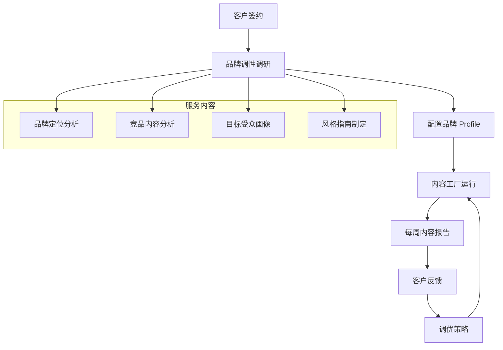
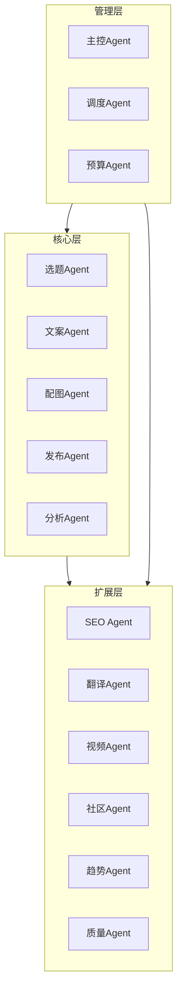
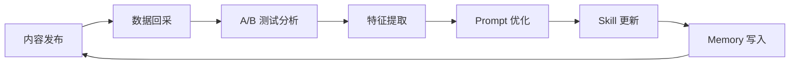
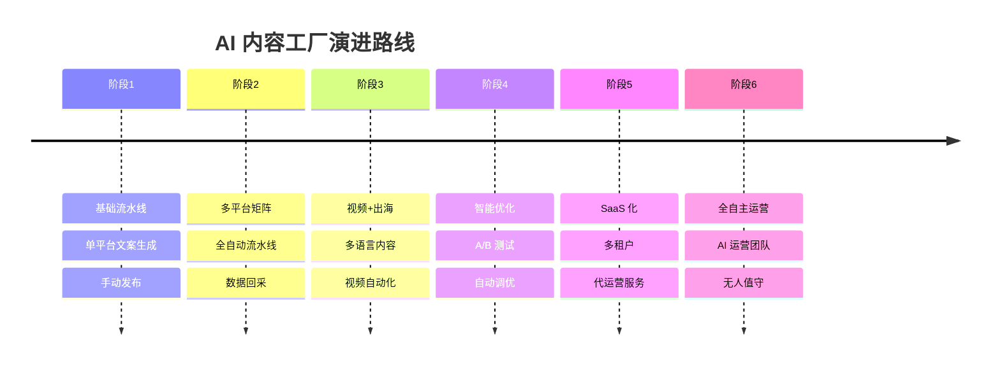

# 扩展思路

> 本文探讨 AI 内容工厂的进阶玩法与商业化方向，适合已跑通基础流水线的团队参考。

## 1. 多语言出海内容矩阵

### 1.1 海外平台扩展



### 1.2 海外平台适配

| 平台 | 地区 | 内容风格 | 发布策略 |
|------|------|---------|---------|
| **Medium** | 全球 | 深度长文、观点文 | 每周 3-5 篇 |
| **Substack** | 欧美 | 邮件通讯、专栏 | 每周 1-2 期 |
| **X (Twitter)** | 全球 | 短帖、Thread | 每日 5-10 条 |
| **LinkedIn** | 欧美 | 专业内容、行业洞察 | 每周 3-5 篇 |
| **Instagram** | 全球 | 图文、Reels | 每日 1-2 条 |
| **YouTube** | 全球 | 视频脚本 + 字幕 | 每周 2-3 条 |
| **TikTok** | 全球 | 短视频脚本 | 每日 1-3 条 |

### 1.3 本地化策略

```yaml
# 本地化配置
localization:
  en_us:
    translator: "gpt-4o"
    reviewer: "native-speaker-agent"
    cultural_adaptation:
      - "替换中国特有的案例为国际通用案例"
      - "调整语气为更直接的表达方式"
      - "添加西方读者熟悉的引用来源"
      
  ja_jp:
    translator: "claude-sonnet"
    reviewer: "jp-native-agent"
    cultural_adaptation:
      - "使用敬语体（ですます調）"
      - "引用日本本土数据"
      - "注意排版：纵書き対応"
```

## 2. 视频内容自动化

### 2.1 图文转视频



### 2.2 视频平台适配

| 平台 | 视频时长 | 比例 | 风格 |
|------|---------|------|------|
| 视频号 | 1-30 min | 16:9 / 9:16 | 知识分享、生活记录 |
| B站 | 3-30 min | 16:9 | 深度内容、教程 |
| 抖音 | 15-60 sec | 9:16 | 快节奏、强钩子 |
| YouTube | 8-20 min | 16:9 | 高质量、SEO 优化 |
| TikTok | 15-60 sec | 9:16 | 娱乐化、趋势跟随 |

### 2.3 视频流水线 Skill

```yaml
# skill: video-script-generator
name: video-script-generator
description: 将图文内容转为视频脚本
prompt: |
  你是一位视频脚本创作专家。请将以下文章转为 {platform} 视频脚本。
  
  要求：
  - 时长：{duration}
  - 分镜：每个场景 5-15 秒
  - 旁白：口语化、有节奏感
  - 视觉：描述每个场景的画面构图
  - 字幕：生成 SRT 格式字幕
  
  原文：{article}
```

## 3. 互动式内容

### 3.1 AI 问答机器人

将内容矩阵与 AI 问答结合：



### 3.2 个性化内容推荐

```bash
# 基于用户互动数据，个性化生成内容
hermes memory add --profile copy-agent \
  --key "user-123-preferences" \
  --value "偏好: AI工具教程, 效率提升, 案例分享"

# 生成个性化内容
hermes delegate --profile copy-agent \
  --task "为用户 user-123 生成一篇个性化内容推荐"
```

## 4. 商业化变现路径

### 4.1 变现模式对比

| 模式 | 难度 | 收益潜力 | 适合阶段 |
|------|------|---------|---------|
| **平台广告分成** | ⭐ | 💰💰 | 起步期 |
| **品牌合作/软文** | ⭐⭐⭐ | 💰💰💰💰 | 成长期 |
| **知识付费** | ⭐⭐ | 💰💰💰 | 成长期 |
| **社群运营** | ⭐⭐⭐ | 💰💰💰💰 | 成熟期 |
| **SaaS 工具** | ⭐⭐⭐⭐ | 💰💰💰💰💰 | 成熟期 |
| **代运营服务** | ⭐⭐ | 💰💰💰 | 成长期 |

### 4.2 内容工厂 SaaS 化

将内容工厂能力封装为 SaaS 服务：

```yaml
# SaaS 产品规划
saas_product:
  name: "ContentForge AI"
  pricing:
    starter: "$99/月 - 每日 10 篇内容，1 个品牌"
    pro: "$299/月 - 每日 50 篇内容，3 个品牌"
    enterprise: "定制 - 无限量，专属 Agent 集群"
  
  features:
    - "AI 选题发现"
    - "多风格文案生成"
    - "自动配图"
    - "多平台发布"
    - "数据分析看板"
    - "品牌风格定制"
```

### 4.3 代运营服务流程



## 5. 多账号矩阵运营

### 5.1 矩阵架构

```yaml
# 矩阵账号配置
matrix:
  main_account:
    name: "品牌主号"
    purpose: "品牌形象、深度内容"
    platforms: ["公众号", "知乎", "B站"]
    
  sub_account_1:
    name: "干货分享号"
    purpose: "教程、工具推荐"
    platforms: ["小红书", "头条"]
    
  sub_account_2:
    name: "行业资讯号"
    purpose: "快讯、行业动态"
    platforms: ["头条", "微博"]
    
  sub_account_3:
    name: "出海内容号"
    purpose: "英文内容、海外市场"
    platforms: ["Medium", "LinkedIn", "X"]
```

### 5.2 矩阵协同策略

```yaml
# 内容协同
collaboration:
  content_cascade:
    - "主号发布深度长文"
    - "子号1提取干货做成教程"
    - "子号2提取资讯做成快讯"
    - "出海号翻译并本地化"
    
  cross_promotion:
    - "子号内容中引导关注主号"
    - "主号内容中提及子号特色"
    - "矩阵内互相转载优质内容"
```

## 6. AI Agent 团队扩展

### 6.1 新增 Agent 角色

| Agent | 职责 | 模型 | 依赖 |
|-------|------|------|------|
| **SEO Agent** | 关键词研究、SEO 优化 | GPT-4o-mini | 搜索引擎 API |
| **Translation Agent** | 多语言翻译与本地化 | Claude | 翻译记忆库 |
| **Video Agent** | 视频脚本与分镜 | GPT-4o | 视频生成工具 |
| **Community Agent** | 评论回复、社群互动 | Claude | 平台 API |
| **Trend Agent** | 趋势预测、内容日历 | GPT-4o | 历史数据 |
| **Quality Agent** | 内容审核、事实核查 | Claude | 联网搜索 |

### 6.2 扩展后的架构



## 7. 技术深度扩展

### 7.1 RAG 增强内容质量

```yaml
# RAG 配置
rag:
  vector_store: "chromadb / qdrant"
  embedding_model: "text-embedding-3-large"
  
  knowledge_bases:
    - name: "行业报告库"
      sources: ["行业白皮书", "研究报告"]
      update: "weekly"
      
    - name: "爆款文库"
      sources: ["历史爆款文章"]
      update: "daily"
      
    - name: "品牌资料库"
      sources: ["品牌文档", "产品说明"]
      update: "on-change"
```

### 7.2 A/B 测试框架

```yaml
# 内容 A/B 测试
ab_testing:
  enabled: true
  
  test_dimensions:
    - "标题风格（悬念 vs 数字 vs 问题）"
    - "开头方式（故事 vs 数据 vs 提问）"
    - "配图风格（摄影 vs 插画 vs 文字海报）"
    - "发布时间（早 vs 中 vs 晚）"
    
  evaluation:
    metrics: ["阅读量", "互动率", "转化率"]
    sample_size: 1000
    significance_level: 0.05
```

### 7.3 自动优化循环



## 8. 参考案例

### 8.1 TapNow 模式

TapNow 的内容自动化策略：
- **内容原子化**: 将内容拆解为可复用的原子组件
- **模板化生产**: 80% 模板 + 20% AI 个性化
- **数据驱动**: 每篇内容都经过 A/B 测试
- **规模化**: 单日千篇内容产出

### 8.2 出海营销团队模式

出海营销团队的内容矩阵策略：
- **多语言并行**: 同一内容翻译为 5-10 种语言
- **本地化运营**: 每个市场有独立的内容策略
- **SEO 优先**: 内容围绕关键词布局
- **自动化工具链**: 从生产到发布全自动化

### 8.3 自媒体矩阵运营

成熟自媒体矩阵的运营经验：
- **账号分层**: 主号 + 垂直号 + 流量号
- **内容互补**: 同一选题多角度覆盖
- **流量互导**: 矩阵内互相引流
- **数据中台**: 统一数据看板

## 9. 未来展望



---

> **思考**: AI 内容工厂的终极形态不是替代人类创作者，而是将创作者从重复劳动中解放出来，专注于策略、创意和品牌建设。
