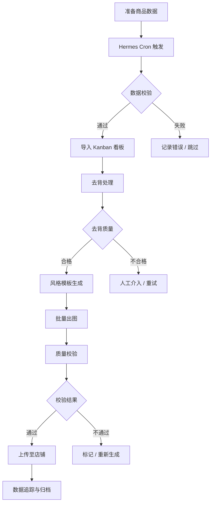

# 批量生成核心流程

## 一、流程总览



## 二、步骤详解

### 步骤 1：准备商品数据

**商品 CSV 模板**：

```csv
sku,name,category,original_image,description,platforms
SKU001,无线蓝牙耳机,数码,./images/sku001.jpg,"黑色无线蓝牙耳机 降噪 续航30小时",taobao;shopify
SKU002,纯棉T恤男款,服饰,./images/sku002.jpg,"白色纯棉圆领T恤 夏季透气",pdd;shopify
SKU003,北欧台灯,家居,./images/sku003.jpg,"北欧风格木质台灯 暖光",taobao;pdd
```

**Hermes 命令导入**：

```bash
# 通过 Hermes Terminal 执行导入
hermes terminal -- python scripts/import_products.py \
    --input products.csv \
    --output ./output/imported.json
```

### 步骤 2：Cron 定时调度

**Cron 配置**：

```yaml
# hermes cron 配置
jobs:
  - name: ecommerce-batch-generate
    schedule: "0 2 * * *"      # 每天凌晨 2 点执行
    command: |
      python scripts/batch_generate.py \
        --input ./data/today_products.csv \
        --template white_bg,scene,model \
        --upload true
    timeout: 7200               # 最长 2 小时
    retry: 2                    # 失败重试 2 次
    notify_on_complete: true
```

**手动触发**：

```bash
hermes cron run ecommerce-batch-generate
```

### 步骤 3：Kanban 任务看板

**看板列定义**：

| 列名 | 说明 | 自动操作 |
|------|------|----------|
| 📥 待处理 | 新导入的商品 | Cron 触发后自动填充 |
| 🔄 去背中 | 正在执行去背 | Delegation 分发后移入 |
| ✅ 去背完成 | 去背通过 | 质量校验后移入 |
| 🎨 生成中 | 风格图生成 | 自动触发 ComfyUI |
| 🖼 待审核 | 生成完成待人工确认 | 通知运营审核 |
| ☁ 上传中 | 上传至平台 | 审核通过后自动触发 |
| ✅ 已完成 | 全部流程结束 | 上传成功自动归档 |
| ❌ 异常 | 处理失败 | 自动移入，记录原因 |

**Kanban 操作命令**：

```bash
# 查看看板
hermes kanban view

# 移动任务
hermes kanban move SKU001 --to "🔄 去背中"

# 批量操作
hermes kanban batch-move --from "🔄 去背中" --to "✅ 去背完成" --status success
```

### 步骤 4：Delegation 子任务分发

```python
# scripts/batch_generate.py 核心逻辑
from hermes_sdk import Delegation, Kanban, Terminal

def dispatch_tasks(products: list):
    """将每个 SKU 拆分为独立子任务"""
    for product in products:
        # 创建去背子任务
        Delegation.create(
            name=f"rembg-{product.sku}",
            command=f"python scripts/rembg_single.py --input {product.image}",
            depends_on=[],
            on_complete=f"python scripts/on_rembg_done.py --sku {product.sku}"
        )

        # 创建生成子任务（依赖去背完成）
        Delegation.create(
            name=f"generate-{product.sku}",
            command=f"python scripts/generate_single.py --sku {product.sku} --template white_bg",
            depends_on=[f"rembg-{product.sku}"],
        )

        # 创建上传子任务（依赖生成完成）
        Delegation.create(
            name=f"upload-{product.sku}",
            command=f"python scripts/upload_single.py --sku {product.sku}",
            depends_on=[f"generate-{product.sku}"],
        )
```

### 步骤 5：ComfyUI 工作流调用

**API 调用示例**：

```python
# scripts/comfyui_client.py
import json
import httpx
import websocket
from PIL import Image
import io

class ComfyUIClient:
    def __init__(self, base_url="http://localhost:8188"):
        self.base_url = base_url
        self.ws_url = base_url.replace("http", "ws")

    def queue_workflow(self, workflow_json: dict) -> str:
        """提交工作流到 ComfyUI 队列"""
        resp = httpx.post(
            f"{self.base_url}/prompt",
            json={"prompt": workflow_json}
        )
        return resp.json()["prompt_id"]

    def wait_for_result(self, prompt_id: str, timeout=120) -> list[str]:
        """等待生成完成，返回图片路径列表"""
        ws = websocket.create_connection(f"{self.ws_url}/ws")
        images = []
        while True:
            msg = json.loads(ws.recv())
            if msg.get("type") == "executed" and msg["data"]["node"] == "SaveImage":
                images.append(msg["data"]["output"]["images"][0])
            if msg.get("type") == "execution_complete" and msg["data"]["prompt_id"] == prompt_id:
                break
        return images

    def generate(self, workflow: dict) -> list[str]:
        """完整调用：提交 + 等待 + 返回"""
        prompt_id = self.queue_workflow(workflow)
        return self.wait_for_result(prompt_id)
```

### 步骤 6：批量生成策略

**并行控制**：

```python
# scripts/batch_generate.py
import asyncio
from tqdm import tqdm

BATCH_SIZE = 4  # 同时生成的并发数（根据 VRAM 调整）

async def batch_generate(products: list, template: str):
    semaphore = asyncio.Semaphore(BATCH_SIZE)

    async def process_one(product):
        async with semaphore:
            workflow = load_template(template, product)
            client = ComfyUIClient()
            images = client.generate(workflow)
            return product.sku, images

    tasks = [process_one(p) for p in products]
    results = []

    for coro in tqdm(asyncio.as_completed(tasks), total=len(tasks)):
        sku, images = await coro
        results.append((sku, images))
        # 更新 Kanban
        Kanban.move(sku, "🎨 生成中")

    return results
```

### 步骤 7：质量校验

```python
# scripts/quality_check.py
def check_image(image_path: str) -> dict:
    img = Image.open(image_path)
    w, h = img.size
    result = {
        "path": image_path,
        "width": w,
        "height": h,
        "min_resolution_ok": min(w, h) >= 800,
        "aspect_ratio_ok": 0.5 <= (w / h) <= 2.0,
        "file_size_mb": os.path.getsize(image_path) / 1024 / 1024,
        "has_alpha": img.mode == "RGBA",
    }
    result["pass"] = all([
        result["min_resolution_ok"],
        result["aspect_ratio_ok"],
        result["file_size_mb"] <= 10,
    ])
    return result
```

### 步骤 8：自动上传

```python
# scripts/upload_assets.py
def upload_to_platforms(sku: str, images: dict, platforms: list):
    """上传到指定平台"""
    for platform in platforms:
        adapter = get_platform_adapter(platform)
        for image_type, image_path in images.items():
            try:
                result = adapter.upload_image(sku, image_path, image_type)
                Memory.set(f"upload:{sku}:{platform}:{image_type}", result)
                Kanban.add_comment(sku, f"{platform} {image_type} 上传成功")
            except Exception as e:
                Kanban.move(sku, "❌ 异常")
                Memory.set(f"error:{sku}:{platform}", str(e))
```

## 三、完整运行命令

```bash
# 一键全流程
hermes terminal -- python scripts/pipeline.py \
    --input ./data/products.csv \
    --templates white_bg,scene \
    --upload \
    --notify

# 分步执行
# 1. 仅去背
python scripts/batch_generate.py --input products.csv --step rembg

# 2. 仅生成
python scripts/batch_generate.py --input products.csv --step generate --template white_bg

# 3. 仅上传
python scripts/upload_assets.py --input ./output/generated.json --platforms taobao,shopify
```

## 四、性能参考

| 商品数 | 模板数 | 总图片数 | 耗时（RTX 4090） |
|--------|--------|----------|-------------------|
| 10     | 1      | 10       | ~5 分钟           |
| 10     | 3      | 30       | ~15 分钟          |
| 50     | 1      | 50       | ~25 分钟          |
| 50     | 3      | 150      | ~75 分钟          |
| 100    | 3      | 300      | ~2.5 小时         |
