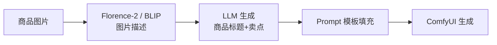
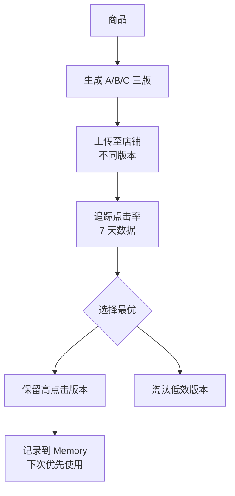
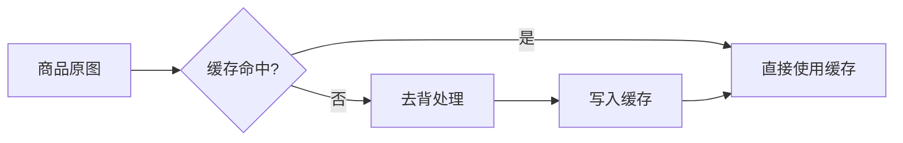
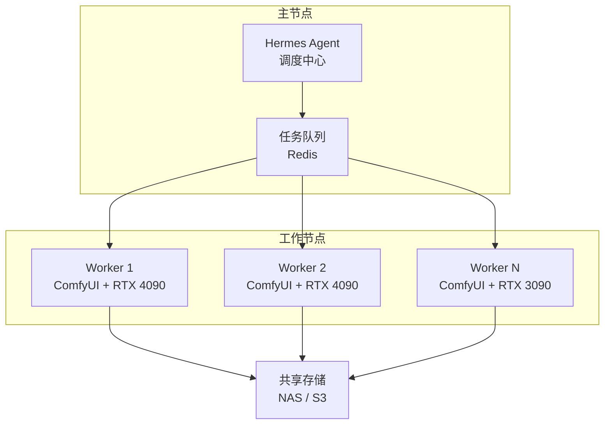
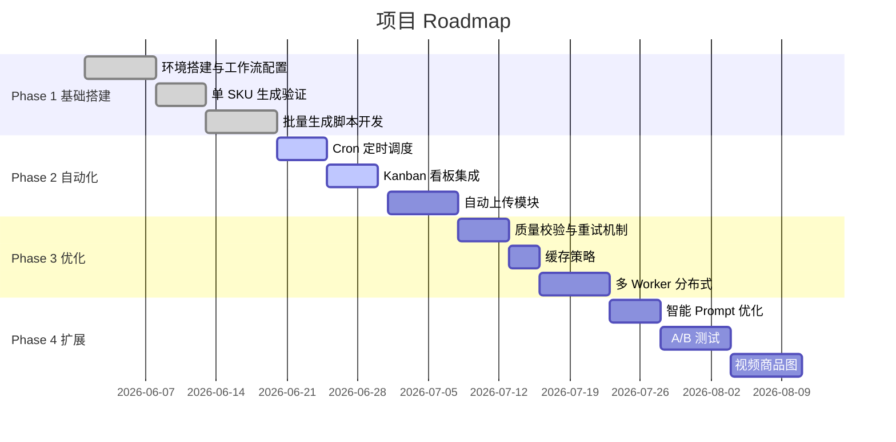

# 功能扩展与优化方向

## 一、功能扩展

### 1.1 AI 商品描述生成

**现状**：商品描述需手动填写，Prompt 模板固定。

**扩展方案**：



**实现思路**：
- 使用 Florence-2 或 BLIP 模型自动识别商品类别、颜色、材质
- 接入 LLM（如 GPT-4 / Claude）生成优化后的商品标题和卖点文案
- 将文案自动填充到 ComfyUI 的 Prompt 模板中
- 生成图片时自动叠加商品标题水印

### 1.2 多语言商品图

**场景**：跨境电商需要不同语言的商品图（英文/日文/东南亚语种）。

**方案**：
- 在图片上叠加对应语言的文案
- 使用 ComfyUI 的 Text Overlay 节点
- 通过 LLM 翻译商品描述并适配本地化表达

### 1.3 A/B 测试自动优化

**场景**：同一商品生成多个风格版本，测试点击率。



### 1.4 视频商品图

**场景**：电商平台支持短视频主图（淘宝主图视频、Shopify 视频）。

**方案**：
- 使用 ComfyUI AnimateDiff 生成商品展示动画
- 或使用 ComfyUI 的 Image Interpolation 生成旋转展示视频
- 输出 MP4 格式，自动上传

### 1.5 批量风格迁移

**场景**：同一批商品统一风格（如「国潮风」「ins 风」「日系简约」）。

**方案**：
- 定义风格 LoRA 模板库
- 一键切换所有商品的生成风格
- 支持风格组合（如「国潮 + 春节促销」）

## 二、性能优化

### 2.1 图片缓存策略



**实现**：
- 去背结果按图片 MD5 哈希缓存
- 相同原图多次使用无需重复去背
- 缓存有效期 7 天，自动清理过期

```python
import hashlib

def get_cache_key(image_path: str) -> str:
    with open(image_path, "rb") as f:
        return hashlib.md5(f.read()).hexdigest()

def get_rembg_result(image_path: str) -> str:
    key = get_cache_key(image_path)
    cache_path = f"./cache/rembg/{key}.png"
    if os.path.exists(cache_path):
        return cache_path
    # ... 执行去背 ...
    return cache_path
```

### 2.2 队列优先级

| 优先级 | 场景 | 处理策略 |
|--------|------|----------|
| P0 紧急 | 大促活动、限时秒杀 | 立即执行，独占资源 |
| P1 高 | 新品上架 | 当天排期 |
| P2 中 | 日常更新 | 夜间批量处理 |
| P3 低 | 历史商品优化 | 空闲时处理 |

### 2.3 分布式部署

**单机瓶颈**：单张 RTX 4090 一天最多生成 500-1000 张图。

**分布式方案**：



**实现**：
- 主节点 Hermes Agent 负责任务分发
- Redis 作为任务队列（支持优先级）
- 每个 Worker 独立运行 ComfyUI 实例
- 共享存储（NAS / S3）统一管理生成结果

### 2.4 增量生成

**场景**：仅修改了部分商品信息，无需全部重新生成。

**策略**：
- 比较商品数据的 MD5 变化
- 仅重新生成有变更的商品
- 保留历史生成结果

## 三、平台集成

### 3.1 更多电商平台

| 平台 | API 类型 | 集成难度 |
|------|----------|----------|
| 京东 | 京东开放平台 | ⭐⭐⭐ |
| 抖音电商 | 抖店开放平台 | ⭐⭐⭐ |
| Amazon | SP-API | ⭐⭐⭐⭐ |
| Lazada | Lazada API | ⭐⭐⭐ |
| Shopee | Shopee API | ⭐⭐⭐ |
| Temu | 半托管 API | ⭐⭐⭐⭐ |

### 3.2 CMS / DAM 集成

- **WordPress / WooCommerce**：通过 REST API 自动上传商品图
- **Shopify 的 Metafields**：存储图片的 AI 生成元数据
- **Bynder / Cloudinary**：数字资产管理平台对接

### 3.3 设计工具联动

- **Figma**：通过 Figma API 将生成图片直接导入设计稿
- **Canva**：批量导入 Canva 模板
- **Photoshop**：生成 PSD 分层文件（需扩展）

## 四、AI 能力增强

### 4.1 智能 Prompt 优化

```python
# 根据商品属性自动生成高质量 Prompt
def generate_prompt(product: Product, style: str) -> str:
    base_prompt = {
        "white_bg": f"Professional product photography, {product.name}, {product.description}, white background, studio lighting, high quality, 8K",
        "scene": f"{product.name} in lifestyle scene, {product.description}, {get_scene_by_category(product.category)}, natural lighting, photorealistic",
        "model": f"Model wearing {product.name}, {product.description}, fashion photography, studio lighting, full body shot",
    }
    return base_prompt.get(style, base_prompt["white_bg"])
```

### 4.2 质量控制 AI

- 使用 CLIP 评分评估生成图与商品描述的匹配度
- 自动检测生成图中的 artifacts（手指畸形、文字错误）
- 低于阈值的图片自动重新生成

### 4.3 商品图合规检查

- 检测图片中是否包含违规内容（敏感词、侵权元素）
- 检查图片尺寸/格式是否符合平台要求
- 自动标注不合规项供人工确认

## 五、商业价值

### 5.1 成本对比

| 方式 | 单张成本 | 100 张成本 | 1000 张成本 | 时效 |
|------|----------|------------|-------------|------|
| 外包设计 | ¥50-200 | ¥5,000-20,000 | ¥50,000-200,000 | 3-7 天 |
| 内部美工 | ¥20-50 | ¥2,000-5,000 | ¥20,000-50,000 | 1-3 天 |
| AI 自动生成 | ¥0.5-2 | ¥50-200 | ¥500-2,000 | 1-3 小时 |

### 5.2 ROI 估算

**投入**：
- 硬件：RTX 4090 × 1 ≈ ¥14,000
- 开发：1-2 人周 ≈ ¥5,000-10,000
- 运营：电费 + API 费用 ≈ ¥500/月

**产出**：
- 月均处理 3,000 张商品图
- 节省美工成本 ≈ ¥60,000-150,000/月
- 新品上架速度提升 10-20 倍

### 5.3 适用团队规模

| 团队规模 | 月商品图需求 | 推荐配置 |
|----------|-------------|----------|
| 个人卖家 | 100-300 张 | 单机 ComfyUI + 云 GPU |
| 小型团队 | 500-2000 张 | RTX 4090 + Hermes 单机 |
| 中型团队 | 2000-10000 张 | 多 Worker 分布式 |
| 代运营公司 | 10000+ 张 | 集群部署 + 负载均衡 |

## 六、Roadmap


