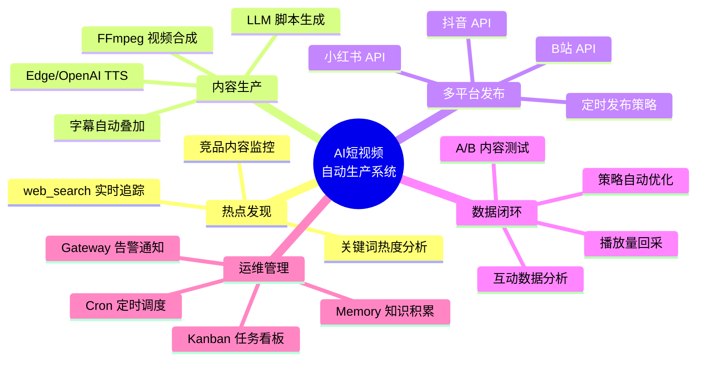
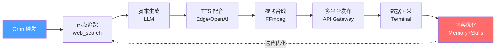

# 🎬 AI 短视频自动生成与发布 Agent

> 基于 **Hermes Agent** 构建的全自动短视频生产流水线——从热点追踪到脚本生成、AI 配音、视频合成、多平台发布，再到数据回采与内容优化，实现「选题 → 生产 → 发布 → 优化」的完整闭环。

---

## 📋 项目概览

本项目利用 Hermes Agent 的 **Cron 定时任务**、**web_search 热点追踪**、**Terminal 工具链编排**、**Gateway 多平台消息推送**、**Delegation 子任务分发**、**Kanban 看板管理**、**Memory 记忆存储** 和 **Skills 技能封装** 八大核心能力，构建一套可独立运行的 AI 短视频自动生产与发布系统。

### 核心场景

```
热点追踪 → 脚本生成 → AI 配音(TTS) → 视频合成(素材+字幕) → 多平台发布 → 数据回采 → 内容优化
```

### 适用对象

| 角色 | 场景 |
|------|------|
| 🏢 短视频运营团队 | 批量生产短视频内容，降低人力成本 |
| 🏪 MCN 机构 | 多账号矩阵管理，统一发布与数据监控 |
| 🌍 出海营销团队 | 多语言内容生产，跨平台分发 |
| 👤 个人创作者 | 自动化内容创作，专注创意与策略 |

---

## 🏗️ 项目结构

```
09-AI短视频自动生成与发布Agent/
├── README.md                  # 项目总览（本文档）
├── docs/
│   ├── 01-架构设计.md         # 系统架构设计
│   ├── 02-环境搭建.md         # 环境搭建与配置
│   ├── 03-核心流程.md         # 核心工作流详解
│   ├── 04-踩坑记录.md         # 踩坑与解决方案
│   └── 05-扩展思路.md         # 功能扩展与优化方向
├── skills/
│   ├── short-video-pipeline   # 短视频生产流水线技能
│   ├── hot-topic-tracker      # 热点追踪技能
│   └── multi-platform-publish # 多平台发布技能
├── scripts/
│   ├── generate_video.sh      # 视频合成脚本
│   ├── publish_to_douyin.sh   # 抖音发布脚本
│   ├── publish_to_xiaohongshu.sh # 小红书发布脚本
│   └── publish_to_bilibili.sh # B站发布脚本
├── config/
│   ├── platforms.yaml         # 多平台配置
│   ├── tts_config.yaml        # TTS 配置
│   └── cron_schedule.yaml     # 定时任务配置
└── data/
    ├── scripts/               # 生成的脚本缓存
    ├── videos/                # 生成的视频文件
    └── analytics/             # 数据回采与分析结果
```

---

## 🔧 技术栈

| 模块 | 技术/工具 | 说明 |
|------|-----------|------|
| 🤖 Agent 框架 | **Hermes Agent** | 任务编排、技能管理、定时调度 |
| ⏰ 定时任务 | **Hermes Cron** | 热点追踪、定时发布 |
| 🔍 热点追踪 | **web_search** | 实时搜索热点话题 |
| 🎙️ 语音合成 | **Edge TTS / OpenAI TTS** | 高质量 AI 配音 |
| 🎬 视频合成 | **FFmpeg + 视频生成 API** | 图片/视频素材拼接、字幕叠加 |
| 📤 多平台发布 | **平台开放 API** | 抖音、小红书、B站 |
| 📊 数据回采 | **Hermes Terminal + API** | 播放量、点赞、评论数据采集 |
| 🔔 消息通知 | **Hermes Gateway** | 生产状态推送、异常告警 |
| 📋 任务管理 | **Hermes Kanban** | 生产流水线看板 |
| 🧠 记忆存储 | **Hermes Memory** | 历史数据、用户偏好、平台规则 |
| 📦 技能封装 | **Hermes Skills** | 可复用工作流模块 |
| 👥 任务分发 | **Hermes Delegation** | 子任务并行处理 |

---

## 🚀 快速开始

```bash
# 1. 克隆项目
git clone <repo-url> 09-AI短视频自动生成与发布Agent
cd 09-AI短视频自动生成与发布Agent

# 2. 安装依赖
pip install edge-tts openai ffmpeg-python pyyaml requests

# 3. 配置平台 API（编辑 config/platforms.yaml）
# 填入抖音、小红书、B站的 API Key 与 Secret

# 4. 安装 Hermes 技能
hermes skill install skills/short-video-pipeline
hermes skill install skills/hot-topic-tracker
hermes skill install skills/multi-platform-publish

# 5. 启动定时任务
hermes cron load config/cron_schedule.yaml

# 6. 手动触发一次生产流水线
hermes run short-video-pipeline
```

> 📖 详细步骤请参阅 [[02-Knowledge(知识层)/20-核心能力-Core_Ability/10 技术能力-Technical_Capability/01-AI工具链与Agent实践/04-工作流与实践/Hermes-Agent案例/09-AI短视频自动生成与发布Agent/docs/02-环境搭建|docs/02-环境搭建.md]]

---

## 📚 文档导航

| 文档 | 内容 |
|------|------|
| [[02-Knowledge(知识层)/20-核心能力-Core_Ability/10 技术能力-Technical_Capability/01-AI工具链与Agent实践/04-工作流与实践/Hermes-Agent案例/09-AI短视频自动生成与发布Agent/docs/01-架构设计\|01-架构设计.md]] | 系统架构、模块划分、数据流、技术选型 |
| [[02-Knowledge(知识层)/20-核心能力-Core_Ability/10 技术能力-Technical_Capability/01-AI工具链与Agent实践/04-工作流与实践/Hermes-Agent案例/09-AI短视频自动生成与发布Agent/docs/02-环境搭建\|02-环境搭建.md]] | 环境准备、依赖安装、平台配置、技能注册 |
| [[02-Knowledge(知识层)/20-核心能力-Core_Ability/10 技术能力-Technical_Capability/01-AI工具链与Agent实践/04-工作流与实践/Hermes-Agent案例/09-AI短视频自动生成与发布Agent/docs/03-核心流程\|03-核心流程.md]] | 热点追踪→脚本→配音→合成→发布→回采全流程 |
| [[02-Knowledge(知识层)/20-核心能力-Core_Ability/10 技术能力-Technical_Capability/01-AI工具链与Agent实践/04-工作流与实践/Hermes-Agent案例/09-AI短视频自动生成与发布Agent/docs/04-踩坑记录\|04-踩坑记录.md]] | 实际开发中遇到的问题与解决方案 |
| [[02-Knowledge(知识层)/20-核心能力-Core_Ability/10 技术能力-Technical_Capability/01-AI工具链与Agent实践/04-工作流与实践/Hermes-Agent案例/09-AI短视频自动生成与发布Agent/docs/05-扩展思路\|05-扩展思路.md]] | 功能扩展、性能优化、商业化方向 |

---

## 🎯 核心能力矩阵



---

## 🔄 工作流总览



---

## 📊 生产指标参考

| 指标 | 参考值 | 说明 |
|------|--------|------|
| 单条视频生产耗时 | 3-8 分钟 | 含脚本+TTS+合成 |
| 日产量（单 Agent） | 50-100 条 | 取决于素材缓存 |
| 多平台发布耗时 | 1-3 分钟/平台 | 含上传+审核等待 |
| 数据回采频率 | 每 30 分钟 | Cron 定时执行 |
| 热点更新频率 | 每 2 小时 | 自动追踪刷新 |

---

## ⚠️ 注意事项

1. **平台合规**：各平台对自动化发布有严格限制，请遵守平台规则，控制发布频率
2. **内容审核**：AI 生成内容需人工抽检，避免违规风险
3. **API 限额**：注意各平台 API 调用频率限制，配置合理的退避策略
4. **素材版权**：使用的图片/视频素材需确保有合法授权
5. **账号安全**：API Key 等敏感信息请使用环境变量或 Hermes Secrets 管理

---

## 📝 License

本项目仅供学习和参考，请遵守相关平台服务条款与法律法规。

---

*基于 Hermes Agent 构建 · 2026*
