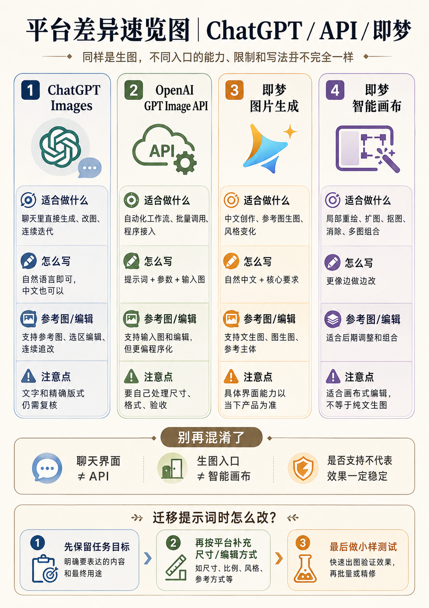

# 即梦图像生成执行模板


## 平台差异速览

> [!note] 使用边界
> 下图用于快速区分四个执行入口。具体模型、尺寸、编辑方式和界面能力仍以本笔记正文及当前产品界面为准。



> [!important] 首先区分入口
> - **图片生成 / 智能参考**：输入中文提示词，选择模型、比例、质量和参考图后生成；
> - **智能画布**：通过图层、区域与画布操作完成局部重绘、扩图、消除、抠图和多图融合。
>
> 同一段长提示词不应原样用于两个入口。图片生成需要完整画面描述；智能画布需要短而精确的区域编辑指令。

## 一、官方公开能力基线（2026-08-05）

官方产品页可以确认：

- 支持中文提示词创作；
- 支持文字或图片生成图片；
- 可以对现有图片进行创意改造；
- 可以表达保留人物或主体形象特征、背景替换、风格联想、画风保持和姿势保持；
- 当前首页展示图片生成支持多图参考和系列组图；
- 智能画布提供多图 AI 融合、多图层编辑、局部重绘、一键扩图、图像消除和抠图；
- 官方站内公开作品可见图片 4.0、图片 4.1、智能参考和局部重绘等标识。

> [!warning] 不写成固定规则的内容
> 公开资料没有稳定列出所有账号、地区和入口统一的参考图上限、负面词字段、输出像素约束、固定权重语法或通用图片 API。因此这些内容必须以当前界面为准。

## 二、图片生成 / 智能参考提示词规则


> [!image-plan]- 教学图规划｜即梦图片生成的提示词顺序
> - **图型**：五段式流程图
> - **学习目标**：用中文自然语言依次说明主体、动作、场景、风格光影和输出。
> - **画面结构**：五个横向卡片对应填写顺序，并附一个人物与商品的迷你示例。
> - **圈注重点**：标出核心目标前置、参考图职责写清、界面参数单独设置。
> - **建议文件名**：`即梦图片生成_提示词填写顺序.png`
> - **建议位置**：本子标题的概念说明之后、详细表格或模板之前。
> - **状态**：待生成；生成后存入当前目录的 `示意图/`，再替换本规划块或在其下方嵌入图片。

### 2.1 推荐顺序

```text
主体与行为
→ 环境与空间
→ 风格与媒介
→ 色彩与光影
→ 镜头与构图
→ 材质与细节
→ 保持与避免
→ 输出用途
```

### 2.2 中文为主，术语按需补充

推荐：

```text
半写实动漫，保留真实面部比例，自然皮肤纹理，真实发丝，柔和电影侧光，浅景深。
```

不推荐：

```text
半写实动漫，semi-realistic anime，anime realism，realistic anime，best quality，masterpiece，8K，ultra HD……
```

中文已经明确时，不必为“模型识别”重复堆叠英文同义词。英文术语只在镜头、材质或特定艺术媒介更精准时补充。

### 2.3 文生图模板

```text
生成一张用于{用途}的图片。

主体与行为：
{主体外观、动作、表情或状态}

环境与空间：
{地点、时间、天气、背景元素和前中后景关系}

视觉表现：
{摄影、动漫、插画、CG、商业设计等风格}
{主色、光线方向、光质、影调和画面气质}
{皮肤、发丝、布料、金属、玻璃等材质细节}

镜头与构图：
{景别、平视/俯视/仰视、主体角度、构图和留白}

必须：
{当前任务最关键的要求}

不要：
{无关物体、结构错误、无关文字、水印和风格漂移}

输出：
{单张/组图}，画幅{比例}，用于{场景}；比例和质量在界面中选择。
```

### 2.4 单参考图编辑模板

```text
参考图负责人物或主体的{身份、结构、姿势、构图、风格中的具体职责}。

本轮只改变：{单一变量或变量组}
目标结果：{具体可观察描述}

保持：{身份、脸部、商品结构、姿势、机位、背景、光线等}
允许：{边缘、遮挡、褶皱、阴影和透视的自然适配}
不要：{当前高风险错误}
```

### 2.5 多图参考职责模板

```text
参考图1：只负责{人物脸部身份 / 商品本体}。
参考图2：只负责{姿势和摄影角度}。
参考图3：只负责{服装款式和材质}。
参考图4：只负责{背景场景和光线氛围}。

冲突顺序：
{主参考职责} > {结构} > {本轮目标} > {风格和背景}

不要让参考图2、3、4覆盖参考图1的主体身份。
```

**使用方法**

1. 先用最少参考图验证主体；
2. 每增加一张参考图，只增加一个明确职责；
3. 结果混淆时，先移除最低价值参考；
4. 不写未经当前界面确认的 `100% / 70%` 权重；
5. 是否需要使用“图1、图2”或界面生成的引用标记，以当前输入框真实显示为准。

## 三、人物任务

### 3.1 身份保持

```text
参考图负责人物身份。
保持脸型、五官比例、年龄感、发型轮廓和主要辨识特征。

只改变：{服装 / 姿势 / 表情 / 场景 / 风格}
目标：{具体结果}

人物仍应能被识别为同一人；不要重新设计面部、改变年龄、性别表达或基础体型。
```

### 3.2 换装

```text
编辑人物参考图，只更换服装和指定配饰。

人物保持：
身份、脸型、五官比例、年龄感、发型轮廓、表情、姿势和头部角度。

新服装：
上衣：{款式、颜色、面料、版型}
下装：{款式、颜色、面料、长度}
配饰：{内容；没有则写无}

环境保持：
原图背景、摄影机位、构图、色调和光线方向。

自然适配：
衣领、袖口、腰线、裙摆、发丝交界、布料褶皱、遮挡和阴影符合当前姿势。

不要重新设计人物面部、明显改变年龄或身体比例、改变背景、增加文字或水印。
```

### 3.3 姿势参考

```text
参考图1负责人物身份和脸部。
参考图2只负责身体姿势、四肢方向和摄影角度。

生成结果保持参考图1的人物身份；采用参考图2的姿势，但根据人物体型和服装自然适配受力、遮挡和衣物褶皱。
不要复制参考图2的脸、发型或服装。
```

## 四、商品任务

```text
参考图负责商品本体。
保持商品外形、结构、比例、主配色、材质和包装布局。

只改变：背景、使用场景、辅助道具和环境光线。
目标场景：{内容}
构图：{机位、景别、商品位置和留白}

不要改变商品结构、增加多余标签、遮挡核心卖点或生成无关文字。
商品 Logo、包装文案和规格数字生成后逐项校对；要求完全准确时保留原商品图层并后期合成。
```

## 五、图片 4.x 与界面参数使用

- 模型标识使用当前界面可选版本，不在模板中永久写死“4.0最好”或“4.1必然更强”；
- 切换模型后重新测试身份、文字、构图、材质和多图职责；
- 比例、大小、质量、超清等使用界面设置；
- “4K、8K、高清、杰作”只能作为视觉描述，不能替代实际输出选项；
- 若当前入口有独立负面词框，只放与当前任务相关的少量错误；
- 若没有负面框，在正文写“不要”，不要为了兼容旧模型附加长串英文负面词。

## 六、智能画布执行规则


> [!image-plan]- 教学图规划｜智能画布局部编辑边界
> - **图型**：区域编辑示意图
> - **学习目标**：区分编辑区、保护区、扩图区和删除区。
> - **画面结构**：一张画布上用四色蒙版展示四类区域，旁边给出每种区域的短指令。
> - **圈注重点**：圈出未编辑区保持、扩图方向、局部重绘目标和消除对象。
> - **建议文件名**：`即梦智能画布_区域编辑边界.png`
> - **建议位置**：本子标题的概念说明之后、详细表格或模板之前。
> - **状态**：待生成；生成后存入当前目录的 `示意图/`，再替换本规划块或在其下方嵌入图片。

### 6.1 工具与文字的分工

| 操作 | 画布工具 | 提示词重点 |
|---|---|---|
| 局部重绘 | 框选或蒙版区域 | 正确结果、边缘衔接、区外保持 |
| 删除物体 | 图像消除 / 局部重绘 | 删除后应补出的背景和纹理 |
| 扩图 | 一键扩图 / 调整画布 | 新增区域如何延续透视、光线和空间 |
| 多图融合 | 图层摆放、缩放和遮挡 | 比例、透视、光线、阴影和风格统一 |
| 抠图 | 抠图工具 | 发丝、半透明边缘、轮廓完整度 |

### 6.2 局部修复模板

```text
只重绘选中区域。
当前问题：{断裂、缺失、变形、错误物体等}
正确结果：{修复后的结构、材质和外观}
衔接：延续周围的{光线、纹理、透视、遮挡和边缘}
选区外保持：{人物身份、姿势、背景、构图}
不要扩大编辑范围或新增无关元素。
```

### 6.3 消除物体模板

```text
移除选区内的{物体}。
删除后补全为{墙面、地面、天空、布料、背景环境等}。
延续周围纹理、透视、光线和阴影，避免重复图案、模糊块和明显修补边缘。
选区外不变。
```

### 6.4 扩图模板

```text
向{方向}扩展画面，目标比例为{比例}。
原图主体、位置、透视、风格、色调和光线保持。
扩展区域补充：{具体背景或环境内容}
延续原图前中后景、地平线、景深、光线方向和材质，避免接缝、重复纹理和结构断裂。
```

### 6.5 多图融合模板

```text
把画布中的{主体A、主体B、背景C}融合成一张完整图片。

主体A保持：{身份或商品结构}
主体B负责：{姿势、道具或第二对象}
背景C负责：{场景和光线}

统一：比例、透视、视线高度、光线方向、色温、阴影软硬和清晰度。
修复：边缘、遮挡、接触阴影和图层交界。
不要出现漂浮、比例失衡、光源冲突或明显拼贴边缘。
```

### 6.6 抠图素材模板

```text
提取{主体}，轮廓完整。
保留发丝、薄纱、透明或半透明边缘的自然过渡。
去除背景颜色污染和残留阴影；不要裁切主体，不要把内部孔洞错误填满。
```

## 七、图片生成与智能画布的选择

| 需求 | 使用入口 |
|---|---|
| 从零生成完整画面 | 图片生成 |
| 一张或多张参考图生成新画面 | 智能参考 |
| 只修改具体区域 | 智能画布局部重绘 |
| 删除物体并补背景 | 智能画布消除或重绘 |
| 向外补画面 | 智能画布扩图 |
| 拼接多个素材并统一风格 | 智能画布多图融合 |
| 提取独立主体 | 智能画布抠图 |

## 八、常见误区

- 不把视频入口的引用语法直接套到所有图片入口；
- 不把公开作品中的个人提示词视为官方推荐语法；
- 不把某个版本标签永久写成固定最优模型；
- 不用大量英文同义词覆盖清晰中文；
- 不把“4K、8K”当作实际分辨率设置；
- 不用负面词替代局部重绘、消除、扩图和抠图工具；
- 不承诺多参考图可以百分百锁定人物身份；
- 不把生成的 Logo、包装文字和长文案直接当成正式终稿。

## 九、实验记录建议

```text
日期：
入口：图片生成 / 智能参考 / 智能画布
模型标识：
比例与质量：
参考图数量与职责：
提示词版本：
编辑区域：
身份保持：
结构正确：
文字正确：
风格一致：
失败类型：
下一轮只改：
```

## 十、官方调研来源

- 即梦 AI 官方产品首页与 AI 绘画说明；
- 即梦 AI 智能画布产品说明；
- 即梦 AI 图片 4.0 官方活动页；
- 即梦 AI 官方站内公开作品中的模型、智能参考与局部重绘信息。

复核日期：2026-08-05。
