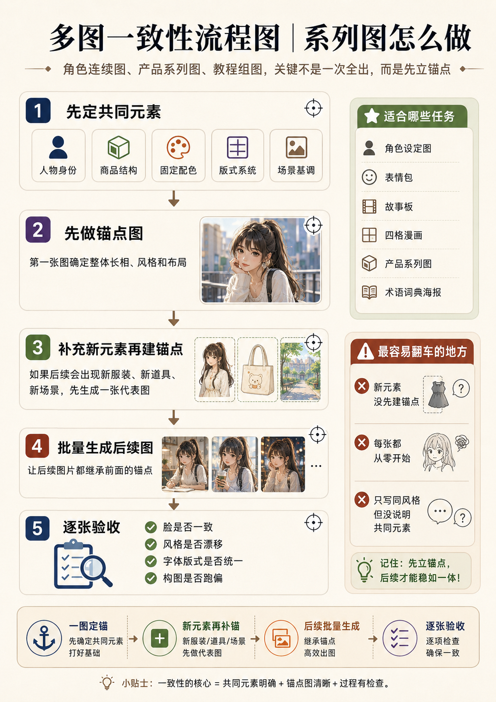
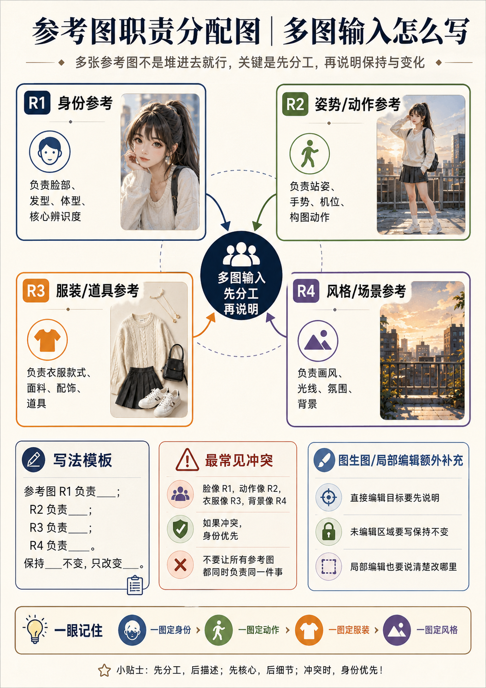

# 角色设定图提示词模板


## 多图一致性提示

> [!tip] 先做锚点图
> 系列图不要每张从零开始。先固定身份、结构、配色、版式或场景基调；出现新服装、新道具或新场景时，先为新元素建立代表图，再批量生成后续画面。



> [!abstract] 定位
> 角色设定板由多个不同职责的资产组成：主立绘、正侧背视图、表情、服装结构、配件和材质细节。高可靠方式不是一次塞进一张图，而是**先锁定基准角色，再分组生成，最后排版**。

## 一、设定板类型

| 类型 | 内容 | 推荐方式 |
|---|---|---|
| 基础人设板 | 主立绘 + 角色摘要 + 配色 | 可一次草案，文字后期 |
| 结构设定板 | 正面、侧面、背面 | 逐视图生成 |
| 表情图集 | 4–8 个表情 | 使用同一脸部基准逐批生成 |
| 服装设定页 | 正背面、局部结构、配件 | 分资产生成后排版 |
| 综合设定板 | 主图 + 视图 + 表情 + 细节 | 必须分阶段 |

## 二、输入准备

- 角色基准卡：年龄、脸型五官、发型、体型、服装、配色、身份气质；
- 角色基准图 R1；
- 服装正背结构和配件清单；
- 表情列表及强度；
- 页面布局草图和文字安全区。

## 三、五槽位设定板母版

```text
【任务与变化范围】
任务类型：{基础人设板 / 三视图 / 表情图集 / 服装设定 / 综合设定板}
目标：{角色与用途}
每个分区只承担一个职责

【保留项与参考职责】
跨区保持：{角色身份、年龄感、脸型五官、发型、体型、服装主色和画风}
R1：负责人物身份
R2：负责服装正背结构，可选
R3：负责版式或风格，可选

【目标画面设计】
主图：{角度、姿势、完整角色}
视图：{正面、严格侧面、背面}
表情：{名称和强度}
细节：{配件、材质、纹样、道具}
版式：{主图占比、网格、留白、背景}

【控制规则】
优先顺序：角色身份 > 服装和比例 > 各分区职责 > 版式 > 装饰
避免：跨格换脸、年龄变化、服装主色变化、重复视图、乱码标签和格子重叠

【输出规格】
流程：{分资产生成 / 一次草案}
画幅：{4:3 / 3:4 / 16:9}
文字：只预留区域，正式标签后期添加
```

## 四、推荐分阶段流程


> [!image-plan]- 教学图规划｜角色设定板分阶段生成
> - **图型**：流程图
> - **学习目标**：说明先身份锚点，再三视图、表情、服装和细节，而不是一次全出。
> - **画面结构**：五步纵向流程，每一步配小型设定板缩略图。
> - **圈注重点**：标出每一步继承的固定项和新增加的变量。
> - **建议文件名**：`角色设定板_分阶段生成流程.png`
> - **建议位置**：本子标题的概念说明之后、详细表格或模板之前。
> - **状态**：待生成；生成后存入当前目录的 `示意图/`，再替换本规划块或在其下方嵌入图片。

### 阶段 1：角色基准图

```text
生成角色的正面全身标准立绘，建立身份、发型、体型、服装、配色和画风基准。背景简洁，平视，自然站姿，完整可见。
```

### 阶段 2：视图与表情

```text
使用角色基准图作为唯一身份参考。
视图组：正面、左侧严格 90°、背面，独立输出。
表情组：平静、轻微微笑、惊讶、愤怒；只改变眉眼和嘴部表情，不改变脸型、发型和年龄感。
```

### 阶段 3：服装与配件细节

```text
生成角色服装的正面结构、背面结构、鞋靴、腰带、包袋和关键纹样细节。保持同一配色、材质和设计语言；每项独立、背景简洁、便于后期排版。
```

### 阶段 4：排版

在设计软件中统一：格线、标题、角色信息、色卡、箭头和文字标签。

## 五、一次生成草案模板

```text
生成一张角色设定板草案。

角色核心：{年龄、脸型五官、发型、体型、服装、配色、气质}。
版面内容：
- 主图：正面全身标准站姿，占页面约一半；
- 副图 1：左侧严格 90° 全身；
- 副图 2：背面全身；
- 表情：平静、轻微微笑、惊讶；
- 细节：{一个配件或材质特写}。

统一浅灰背景、平视机位、柔和工作室光和{画风}。
格间留白，不添加正式文字和随机标签。
避免跨格换脸、年龄和发色变化、服装主色漂移、比例变化、重复视图和格子重叠。
输出：单张 4:3 草案；生成后逐格验收。
```

## 六、验收清单

- 主图是否足以作为后续身份基准；
- 各视图、表情和细节是否属于同一角色；
- 表情变化是否改变了脸型或年龄；
- 服装正背结构和配件是否互相对应；
- 页面是否有足够留白供后期排字；
- 是否需要拆分失败分区单独重做。

## 七、问题诊断

| 现象 | 原因 | 修复 |
|---|---|---|
| 各格人物不同 | 一次任务过载 | 分离主图、视图、表情和细节 |
| 表情像换脸 | 表情强度过大 | 降低强度，明确只改眉眼和嘴部 |
| 服装正背矛盾 | 背部设计未定义 | 提供正背结构说明或服装参考 |
| 标签乱码 | 让模型负责最终排字 | 只留空位，设计软件排版 |
| 主图不稳定 | 基准角色未先确定 | 先完成单张正面基准图 |

## 多参考图职责示例



## 相关笔记

- [[提示图与知识图解提示词模板]]

- [[人物创作提示词模板]]
- [[视图生成提示词模板]]、[[人物九大角度词典]]
