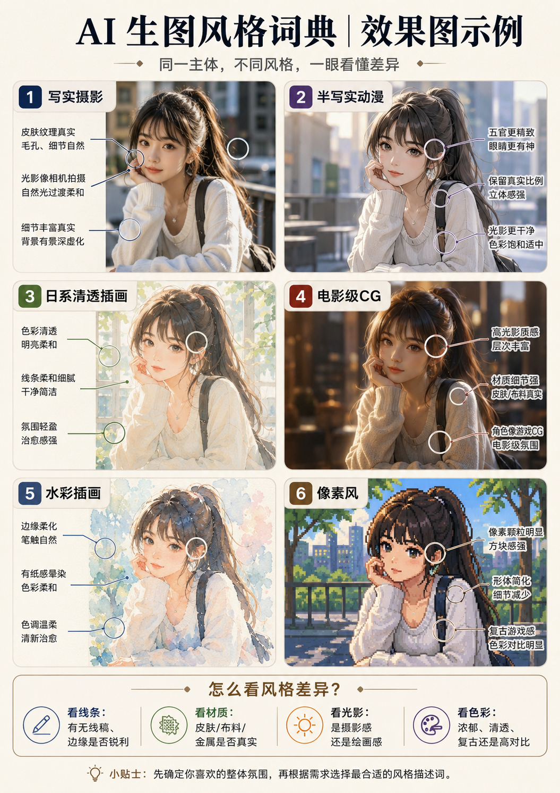
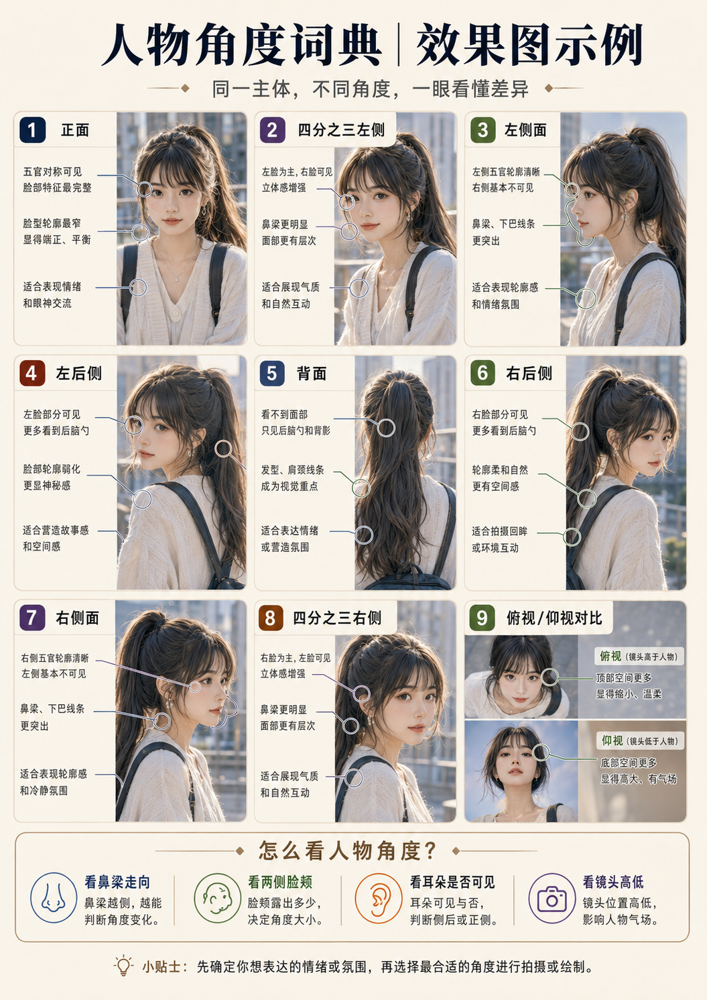
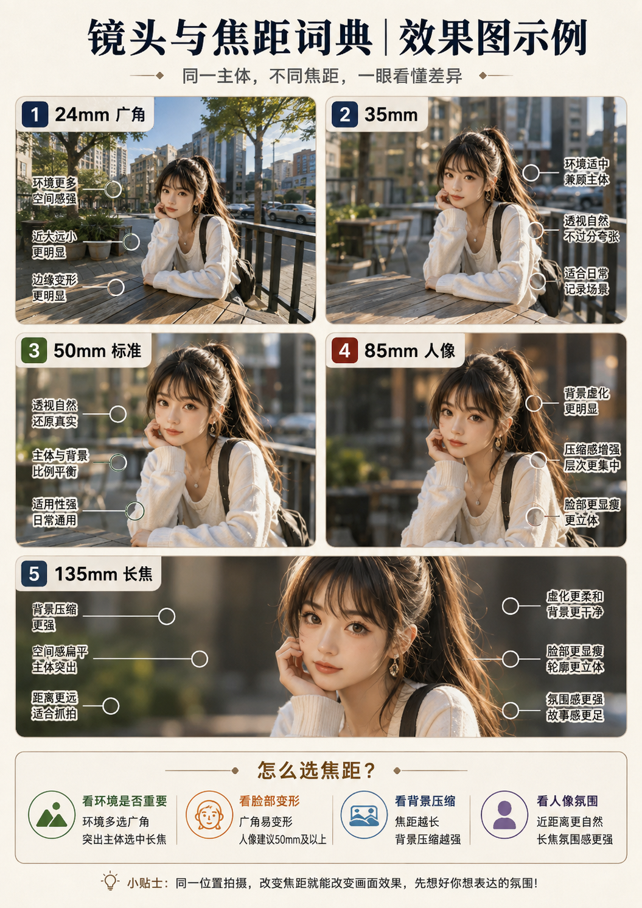
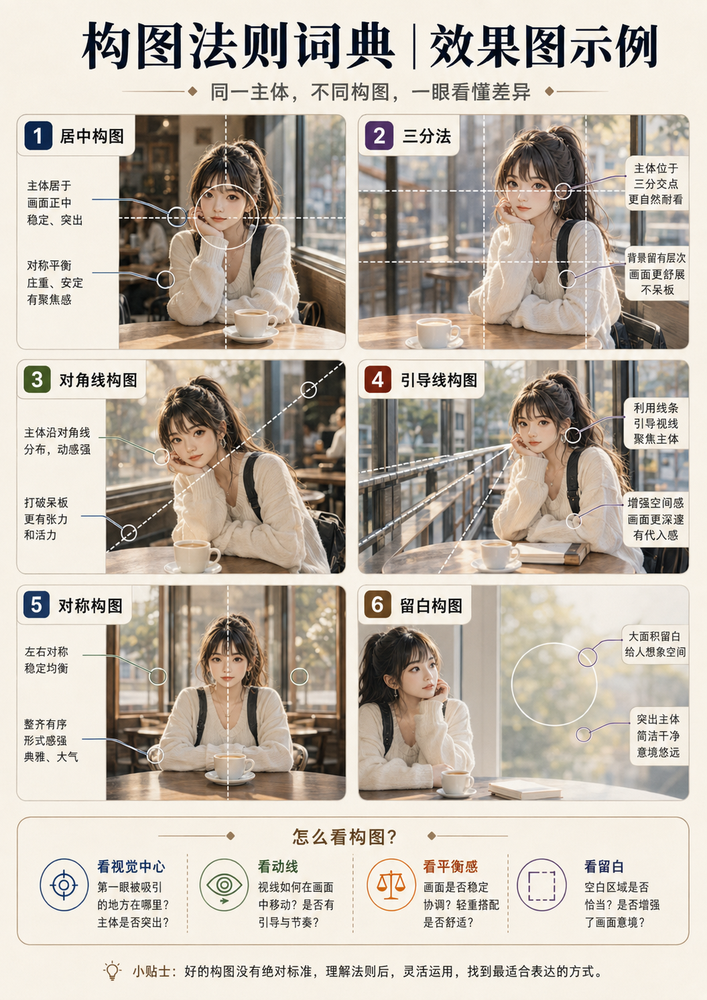
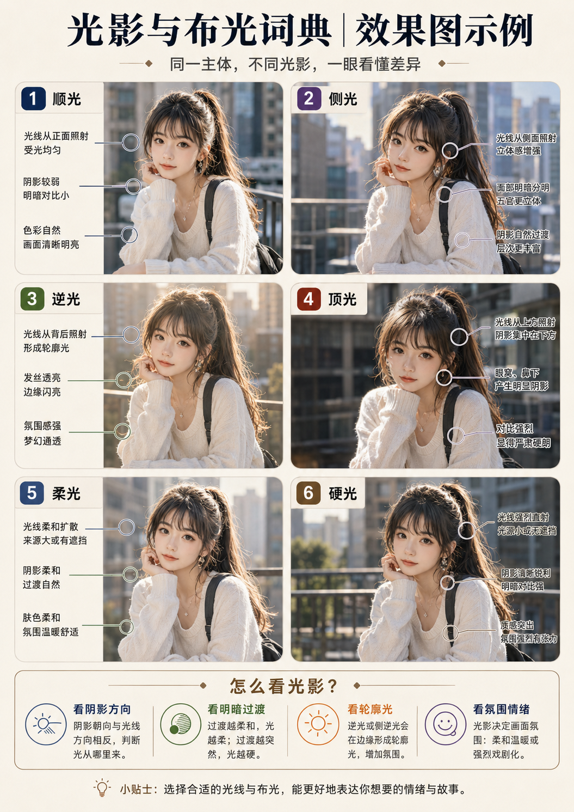
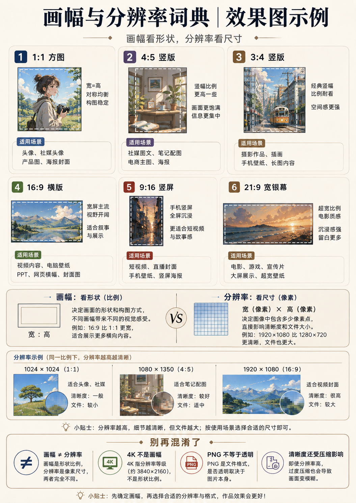
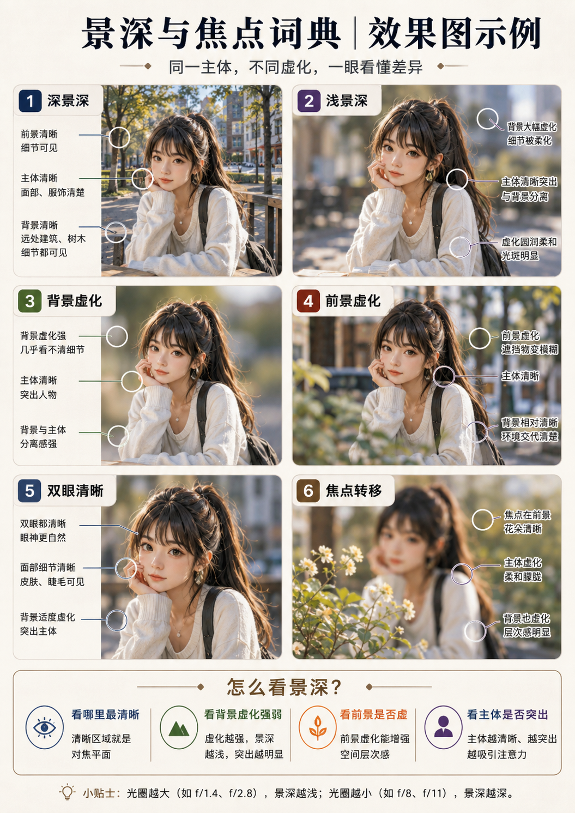

# 专业名词速查：小白入门

## 图文速览入口

> [!tip] 如果你是第一次接触这些术语，建议先看对应效果图，再阅读下方词典内容。

- [[艺术风格词典]]：
  
- [[景别词典]]：
  
- [[人物九大角度词典]]：
  
- [[镜头与焦距词典]]：
  
- [[构图法则词典]]：
  
- [[光影与布光词典]]：
  
- [[材质与质感词典]]：
  
- [[画幅与分辨率词典]]：
  
- [[景深与焦点词典]]：
  


> [!abstract] 一句话理解
> 专业名词不是“高级咒语”，而是帮助你把脑中的画面说得更清楚。先想清楚**看什么、从哪里看、看多大、哪里清楚、怎么摆、怎么打光、表面是什么感觉、最后输出多大**，再选词。

## 一、九个词典分别解决什么问题

| 你真正想解决的问题 | 应查词典 | 最简单的理解 |
|---|---|---|
| 画面里能看到人物多少部分？ | [[景别词典]] | 是拍全身、半身，还是只拍脸 |
| 人物身体和脸朝哪个方向？ | [[人物九大角度词典]] | 正面、侧面、背面、四分之三侧面 |
| 画面是广阔、自然，还是背景被拉近？ | [[镜头与焦距词典]] | 决定透视感，不等于放大倍数 |
| 哪些地方清楚，哪些地方虚？ | [[景深与焦点词典]] | 决定“清晰范围”和视觉重点 |
| 主体放在哪里、哪里留空？ | [[构图法则词典]] | 决定画面的摆放与视线流向 |
| 光从哪里来、软硬冷暖如何？ | [[光影与布光词典]] | 决定明暗、立体感和氛围 |
| 皮肤、布料、金属怎样才像真的？ | [[材质与质感词典]] | 决定表面看起来是什么材料 |
| 画面是摄影、动漫、水彩还是 3D？ | [[艺术风格词典]] | 决定整体画法和视觉语言 |
| 图片是方形、竖版还是横版？ | [[画幅与分辨率词典]] | 决定画布形状、像素和交付格式 |

## 二、最容易混淆的四组概念


> [!image-plan]- 教学图规划｜四组易混概念对照
> - **图型**：四栏对照图
> - **学习目标**：一次分清景别/焦距、人物朝向/机位、景深/画质、画幅/分辨率。
> - **画面结构**：每栏使用同一示例图和两个概念的差异箭头。
> - **圈注重点**：标出“描述对象不同”，并给一句记忆口诀。
> - **建议文件名**：`专业名词四组易混概念_对照图.png`
> - **建议位置**：本子标题的概念说明之后、详细表格或模板之前。
> - **状态**：待生成；生成后存入当前目录的 `示意图/`，再替换本规划块或在其下方嵌入图片。

### 1. 景别 ≠ 焦距

- **景别**：画面拍了多少，例如全身、半身、特写；
- **焦距**：空间透视看起来怎样，例如广角夸张、长焦压缩。

同样是半身照，可以用广角拍，也可以用中长焦拍，脸型和背景感觉会不同。

### 2. 人物朝向 ≠ 摄影机机位

- **人物朝向**：人物正面、侧面或背面；
- **摄影机机位**：镜头从平视、俯视还是仰视拍摄；
- **视线方向**：人物眼睛看镜头、看左边或看远处。

这三项最好分开写。

### 3. 景深 ≠ 画质

- 浅景深只是背景更虚；
- 深景深只是更多范围清楚；
- 两者都可能生成得精细，也都可能生成得模糊。

### 4. 画幅 ≠ 分辨率

- **画幅 3:4**：只表示宽高比例；
- **像素 1536×2048**：表示文件实际大小；
- 写“8K”不能代替真实尺寸设置。

## 三、小白最稳的填写顺序


> [!image-plan]- 教学图规划｜从人话到专业词的翻译流程
> - **图型**：流程图
> - **学习目标**：展示先说画面需求，再查专业词，最后组合成提示词。
> - **画面结构**：三步：人话需求→查词典→放入五槽位，配一个完整示例。
> - **圈注重点**：圈出不要先堆术语，专业词只用于减少歧义。
> - **建议文件名**：`从人话到专业提示词_三步流程.png`
> - **建议位置**：本子标题的概念说明之后、详细表格或模板之前。
> - **状态**：待生成；生成后存入当前目录的 `示意图/`，再替换本规划块或在其下方嵌入图片。

按下面顺序写，比先堆“8K、电影感、杰作”更有效：

```text
1. 主体：画谁或画什么
2. 动作与场景：正在做什么，在哪里
3. 景别与角度：拍多大，从哪里看
4. 构图：主体放哪里，哪里留白
5. 光线：从哪里来，软硬冷暖
6. 风格：摄影、动漫、插画或 3D
7. 材质：皮肤、头发、服装、商品表面
8. 焦点：哪里必须清楚
9. 输出：比例、数量、版式和用途
```

## 四、把模糊说法改成可执行说法

| 模糊说法 | 问题 | 更清楚的写法 |
|---|---|---|
| 高级感 | 每个人理解不同 | 低饱和配色、深色背景、受控高光、简洁留白 |
| 电影感 | 范围太大 | 低调侧光、前中后景层次、宽银幕构图、轻微空气雾 |
| 高清 8K | 不等于真实分辨率 | 面部结构清楚、发丝分层、衣料纹理可辨，真实尺寸在平台设置 |
| 日系 | 可能是动漫、摄影或平面设计 | 日系清透插画、细薄线条、高明度低饱和色、柔和自然光 |
| 真实皮肤 | 仍不够具体 | 自然肤色变化、轻微毛孔、柔和高光，不过度磨皮 |
| 漂亮构图 | 无法判断摆法 | 人物位于右侧三分之一，左侧留出标题空间 |

## 五、一个完整示例：每个术语放在哪里

```text
年轻女性坐在咖啡店窗边，双手自然放在桌面。

中景，腰部以上；人物身体呈四分之三侧面，面部轻转向镜头，平视机位。
人物位于右侧三分之一，左侧保留干净负空间。

50–85mm 等效的自然人像透视，焦点在双眼，整张脸保持清楚，背景轻度虚化。
窗外柔和侧逆光，室内有微弱暖色补光，明暗对比适中。

标准半写实动漫，真实人物比例，细薄线条，柔和数字上色。
自然皮肤纹理，清晰发丝，棉质上衣呈哑光细纤维和自然褶皱。

单张独立图，3:4 竖版，用于人物角色展示。
```

## 六、专业词使用的三条底线

1. **同一维度不要互相打架**：不要同时写“硬光”和“极柔光”，除非明确哪个是主光、哪个是补光。
2. **不要为显得专业而堆词**：每个词都应该解决一个具体问题。
3. **生成模型不是相机或设计软件**：焦距、光圈、DPI 等词常是视觉意图，真实参数仍以平台设置为准。

## 七、快速选择入口

- 想做人物：先看 [[景别词典]] → [[人物九大角度词典]] → [[光影与布光词典]]；
- 想做商品：先看 [[材质与质感词典]] → [[光影与布光词典]] → [[构图法则词典]]；
- 想做场景：先看 [[镜头与焦距词典]] → [[构图法则词典]] → [[景深与焦点词典]]；
- 想做插画：先看 [[艺术风格词典]] → [[构图法则词典]] → [[画幅与分辨率词典]]；
- 想做海报：先看 [[构图法则词典]] → [[画幅与分辨率词典]] → [[艺术风格词典]]。
