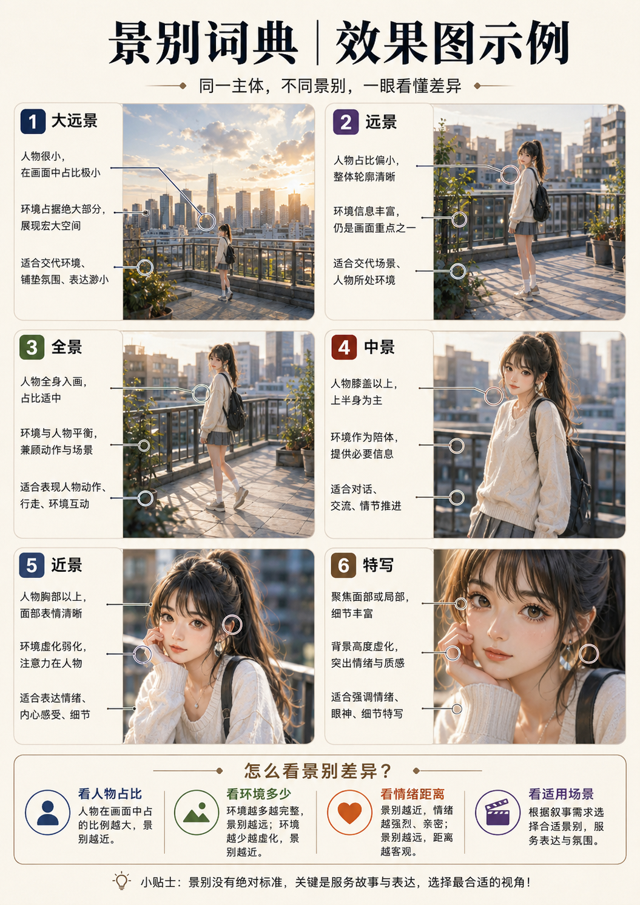

# 景别词典

## 效果图示例

> [!tip] 先看图，再看文
> 先看这张图，再对照文中的景别解释，会更容易理解“人物占比”和“环境信息量”的变化。




> [!abstract] 小白一句话
> **景别就是“镜头框进来多少东西”**：是只看一双眼睛、只看脸、看半身、看全身，还是主要看环境。

## 一、先理解：景别不负责什么

景别只负责“看多大范围”，它不直接决定：

- 镜头从高处还是低处拍；
- 人物正面还是侧面；
- 背景虚不虚；
- 使用广角还是长焦；
- 主体放画面左边还是右边。

这些要分别用机位、人物朝向、景深、焦距和构图描述。

## 二、核心景别词条

| 景别 | 英文参考 | 画面大致看到什么 | 用人话理解 | 常见用途 |
|---|---|---|---|---|
| 建立镜头 | establishing shot | 大范围环境，人物可能很小 | 先告诉观众“事情发生在哪里” | 电影开场、故事板、城市与建筑 |
| 大远景 | extreme long shot | 山河、城市、巨型建筑占主导 | 人只是一个小点，用来显示规模 | 世界观、自然地貌、史诗场景 |
| 远景/大全景 | long shot / wide shot | 全身人物加较多环境 | 既看见人，也看见人与环境的关系 | 行走、追逐、多人场景 |
| 全景 | full shot | 人物头到脚完整 | 重点看人物全貌和姿势 | 服装、角色设定、动作展示 |
| 中全景 | medium long shot / cowboy shot | 膝盖或大腿以上 | 看动作，又不会离脸太远 | 对话、持物、动作人物 |
| 中景 | medium shot | 腰部以上 | 最常见的“半身交流画面” | 对话、人物展示、直播感 |
| 中近景 | medium close-up | 胸部或肩部以上 | 更靠近脸，但还能看一点服装 | 人像、访谈、情绪表达 |
| 近景 | close-up | 头肩或面部为主 | 重点看五官和情绪 | 肖像、表情、剧情反应 |
| 大特写 | extreme close-up | 眼睛、嘴唇、手等局部 | 把一个细节放到最大 | 强调紧张、线索、情绪 |
| 插入镜头 | insert shot | 信件、按钮、戒指等关键物件 | 专门让观众看清一个信息 | 故事板、商品细节、剧情线索 |
| 微距细节 | macro detail shot | 极小物体或表面纹理 | 像贴得非常近观察材质 | 珠宝、皮肤、织物、接口 |

## 三、人物景别的直观裁切位置


> [!image-plan]- 教学图规划｜人物景别裁切安全线
> - **图型**：全身标尺图
> - **学习目标**：明确特写、近景、中景、全景常见裁切位置和危险裁切点。
> - **画面结构**：一位全身人物叠加多条水平裁切线，左侧标景别名称。
> - **圈注重点**：标出不要卡在关节处，头顶和脚底留安全空间。
> - **建议文件名**：`人物景别_裁切安全线.png`
> - **建议位置**：本子标题的概念说明之后、详细表格或模板之前。
> - **状态**：待生成；生成后存入当前目录的 `示意图/`，再替换本规划块或在其下方嵌入图片。

| 写法 | 常见裁切位置 | 小白提醒 |
|---|---|---|
| 头肩像 | 肩膀附近 | 适合头像，但要防头顶裁切 |
| 胸像 | 胸部附近 | 能看脸和上衣结构 |
| 腰部以上 | 腰附近 | 最稳定的常规中景 |
| 大腿以上 | 大腿中部附近 | 适合动作与穿搭 |
| 膝盖以上 | 膝盖附近 | 接近牛仔景别 |
| 头到脚完整 | 脚底以下留少量空间 | 必须补“脚部完整、不要裁切” |

> [!tip] 裁切原则
> 尽量不要正好切在膝盖、手腕、脚踝等关节上，看起来容易别扭。可以明确写“裁切位于大腿中部”或“头到脚完整可见”。

## 四、多人和叙事常用景别

| 词条 | 英文参考 | 白话解释 | 使用提醒 |
|---|---|---|---|
| 双人镜头 | two-shot | 两个人同时清楚地出现在画面里 | 写清两人的位置和关系 |
| 群像镜头 | group shot | 多个人共同构成主体 | 写清中心人物，避免人数漂移 |
| 过肩镜头 | over-the-shoulder shot | 从一人肩后看向另一人 | 适合对话，肩膀不能挡住主脸 |
| 主观镜头 | point-of-view shot | 像角色本人正在看 | 适合故事板和沉浸场景 |
| 反应镜头 | reaction shot | 重点表现角色听到或看到后的反应 | 通常用近景或中近景 |

## 五、怎么选：三步判断

1. **主要看环境吗？** 是 → 建立镜头、大远景或远景。
2. **主要看动作和服装吗？** 是 → 全景、中全景或中景。
3. **主要看表情或细节吗？** 是 → 中近景、近景、大特写或微距。

## 六、可直接复制的提示词写法

### 全身人物

```text
全景，人物头到脚完整可见，脚下保留少量空间，双手和鞋子不被裁切，环境只作为辅助背景。
```

### 人像半身

```text
中景，腰部以上，人物占画面约三分之二，面部和双手清楚，背景仍可辨识但不抢主体。
```

### 情绪近景

```text
近景，肩部以上，面部占画面主体，重点表现眼神和细微表情，头顶不过度裁切。
```

### 宏大场景

```text
大远景，人物仅作为尺度参照，地貌与建筑占画面主体，明确前景、中景和远景层次。
```

### 商品细节

```text
微距细节镜头，聚焦商品接口和表面纹理，关键结构完整可辨，不因虚化丢失卖点。
```

## 七、相近概念区别

| 容易混淆 | 正确区别 |
|---|---|
| 全景 vs 广角 | 全景是取景范围；广角是透视感觉 |
| 近景 vs 浅景深 | 近景是靠近主体；浅景深是背景虚化范围小 |
| 大远景 vs 航拍 | 大远景是看得广；航拍是摄影机在高处 |
| 特写 vs 微距 | 特写可以拍脸和物件；微距更强调极小细节和表面纹理 |
| 半身 vs 中景 | 日常常混用，但最好直接写“腰部以上”消除歧义 |

## 八、常见翻车与修复

- **说“全身”仍然裁脚**：补“头到脚完整、鞋子完整、脚下留空间”。
- **近景把头顶切掉太多**：补“头部完整，头顶保留少量空间”。
- **多人都变成同样大小和姿势**：为每个人指定位置、景别和动作。
- **每格故事板都生成同一景别**：逐格明确“远景→中景→近景→特写”。
- **环境图人物太大**：写“人物只占画面约 5%–10%，仅作为尺度参照”。

## 九、填入五槽位

- **目标画面设计 → 镜头与构图**：填写景别和可见范围；
- **保留项**：图生图必须保持原裁切范围时填写；
- **输出规格**：拼版中每格景别、顺序和布局写在这里。

## 相关笔记

- [[专业名词速查-小白入门]]
- [[人物九大角度词典]]、[[镜头与焦距词典]]、[[景深与焦点词典]]
