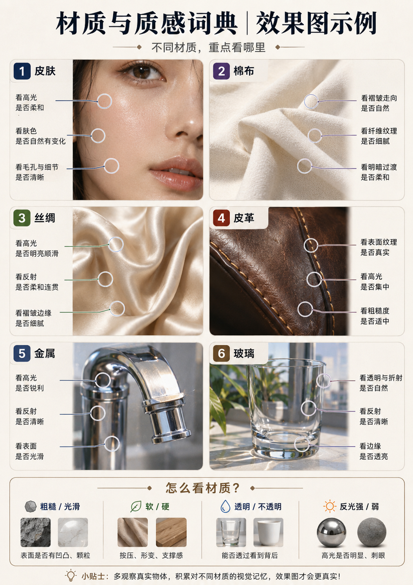

# 材质与质感词典

## 效果图示例

> [!tip] 先看图，再看文
> 这张图适合搭配本文一起看，帮助小白快速建立“看高光、看纹理、看反射、看透明度”的观察方法。




> [!abstract] 小白一句话
> 材质就是“这个东西看起来由什么做成”。只写“丝绸”还不够，还要说它**怎么反光、厚不厚、纹理多大、怎么垂坠和起皱**。

## 一、材质五维公式


> [!image-plan]- 教学图规划｜材质五维观察法
> - **图型**：五边形图
> - **学习目标**：把粗糙度、反射/透射、纹理尺度、厚度边缘和受力状态变成观察步骤。
> - **画面结构**：中心材质样本，五个放大框围绕展示五维。
> - **圈注重点**：圈出高光形状、纹理颗粒、边缘厚度、褶皱受力和透明度。
> - **建议文件名**：`材质五维观察法_五边形图.png`
> - **建议位置**：本子标题的概念说明之后、详细表格或模板之前。
> - **状态**：待生成；生成后存入当前目录的 `示意图/`，再替换本规划块或在其下方嵌入图片。

```text
材质名称
+ 表面粗糙或光滑
+ 如何反光或透光
+ 纹理大小与方向
+ 厚度、边缘、受力和褶皱
```

例如：

```text
黑色天鹅绒，深暗哑光基底，沿绒毛方向出现柔和高光，布料厚实，褶皱受重力自然下垂。
```

## 二、先懂五个基础词

| 词条 | 白话解释 | 视觉结果 |
|---|---|---|
| 粗糙度 | 表面有多毛糙或多光滑 | 越粗糙，高光越散；越光滑，高光越锐利 |
| 反射 | 表面像镜子一样反映环境的程度 | 金属、玻璃、亮面塑料明显 |
| 透射/透明 | 光能否穿过材料 | 玻璃、薄纱、液体 |
| 纹理尺度 | 纹路是细小还是粗大 | 木纹、石纹、织物纹理必须符合物体尺寸 |
| 厚度与边缘 | 材料边缘是否有真实厚度 | 玻璃、纸张、皮革、布料都需要 |

## 三、人物相关材质

| 材质 | 英文参考 | 白话特征 | 常见翻车 |
|---|---|---|---|
| 自然皮肤 | natural skin texture | 有轻微毛孔、肤色变化和柔和高光 | 过度磨皮、蜡像、塑料脸 |
| 湿润皮肤 | slightly dewy skin | 高光更明显，但不是满脸油亮 | 像出汗或涂油过量 |
| 哑光妆面 | matte makeup finish | 反光较少、肤色均匀 | 完全无纹理像面具 |
| 眼球 | moist realistic eyes | 角膜有湿润高光，虹膜有细节 | 玻璃珠感、双眼高光不一致 |
| 发丝 | individual hair strands | 发束有层次，边缘有碎发 | 整块塑料发片、每根都过锐 |
| 指甲 | natural nail surface | 半透明、轻微弧度和自然高光 | 像塑料甲片、数量错误 |

### 人物皮肤推荐写法

```text
自然皮肤纹理，轻微毛孔和细小肤色变化，柔和高光，不过度磨皮，不呈蜡像或塑料表面。
```

## 四、常用布料与服装材质

| 材质 | 英文参考 | 白话特征 | 易错点 |
|---|---|---|---|
| 棉布 | matte cotton fabric | 哑光、细纤维、柔软日常 | 像塑料、没有织物纹理 |
| 亚麻 | natural linen fabric | 稍粗纹理、透气、自然皱感 | 纹理过粗像麻袋 |
| 牛仔 | structured denim | 较厚、有斜纹、硬挺褶皱 | 过软像棉布 |
| 针织 | knitted fabric | 可见线圈、弹性、贴合身体 | 纹理尺寸过大 |
| 羊毛 | soft wool texture | 柔软纤维、低反射、保暖感 | 变成长毛绒 |
| 丝绸 | silk with flowing sheen | 轻薄垂坠、流动高光 | 反光像 PVC |
| 缎面 | satin with smooth directional sheen | 表面平滑、高光较集中 | 与丝绸混用但无结构区别 |
| 天鹅绒 | velvet with directional pile | 深暗基底、方向性柔光 | 全面发亮失去绒感 |
| 雪纺 | lightweight chiffon | 轻薄、半透明、飘逸 | 透明度过高或边缘消失 |
| 欧根纱 | crisp translucent organza | 半透明但较挺、有轮廓 | 变成软塌薄纱 |
| 蕾丝 | fine lace textile | 镂空图案、边缘精细 | 图案断裂、黏在皮肤上 |
| 皮革 | fine-grain leather | 有细纹、适度油润高光、较厚 | 镜面塑料感 |
| 漆皮 | glossy patent leather | 强而锐利的高光 | 高光位置混乱 |
| PVC/乳胶感 | glossy flexible polymer | 光滑、强反光、贴合 | 容易过度塑料化，需明确用途 |

### 布料受力词

| 词条 | 白话解释 |
|---|---|
| 自然垂坠 | 布料受重力向下落 |
| 拉伸褶皱 | 布料被动作或固定点拉紧形成放射线 |
| 压缩褶皱 | 弯曲处堆叠的短褶皱 |
| 接触褶皱 | 坐下、靠墙、被手压住形成的褶皱 |
| 厚重挺括 | 布料不易贴身，轮廓稳定 |
| 轻薄飘动 | 布料受风和动作影响，边缘轻盈 |

## 五、金属、玻璃与塑料

| 材质 | 英文参考 | 白话特征 | 易错点 |
|---|---|---|---|
| 拉丝金属 | brushed metal | 有统一方向的细纹，高光被拉长 | 纹理方向随机 |
| 抛光金属 | polished metal | 像镜子，反射清楚，高光锐利 | 反射出不合理环境 |
| 哑光金属 | matte metal | 金属感存在但反光柔和 | 变成灰塑料 |
| 镀铬 | chrome finish | 极强镜面反射，明暗反差大 | 像白色塑料或液态金属 |
| 阳极氧化铝 | anodized aluminum | 细腻哑光、金属色均匀 | 缺少金属边缘高光 |
| 透明玻璃 | clear glass with visible thickness | 边缘有厚度、折射和高光 | 透明到像不存在 |
| 磨砂玻璃 | frosted glass | 透光但看不清背后细节 | 变成白色塑料 |
| 有色玻璃 | tinted glass | 透明中带稳定颜色 | 颜色过浓像实体塑料 |
| 透明塑料 | clear polymer | 比玻璃更轻、更柔，折射较弱 | 与玻璃无区别 |
| 磨砂塑料 | matte polymer | 均匀细颗粒、低反射 | 过度平滑或像橡胶 |
| 高光塑料 | glossy plastic | 明亮高光、表面光滑 | 廉价感、反射过强 |
| 橡胶 | soft rubber | 低反射、轻微弹性、边缘柔 | 变成黑色塑料 |

## 六、建筑与自然材料

| 材质 | 英文参考 | 白话特征 | 易错点 |
|---|---|---|---|
| 木材 | natural wood grain | 顺着构件方向的木纹，哑光或油蜡高光 | 木纹方向和尺寸错误 |
| 石材 | natural stone with irregular veining | 不规则纹路、孔隙、厚重 | 重复贴图、每块完全一样 |
| 大理石 | polished marble with natural veining | 流动纹理、轻度反射 | 纹路过密或像塑料印花 |
| 花岗岩 | speckled granite | 颗粒状矿物、较硬、低到中反射 | 颗粒尺度失真 |
| 混凝土 | cast concrete | 细孔、模板痕、低反射 | 均匀灰色塑料 |
| 砖 | fired brick | 颗粒、色差、砂浆缝 | 砖尺寸和接缝不统一 |
| 陶瓷 | glazed ceramic | 坚硬、釉面高光、边缘圆润 | 变成塑料或玻璃 |
| 无釉陶土 | unglazed terracotta | 暖色、哑光、细孔 | 失去粗糙感 |
| 石膏 | matte plaster | 柔和哑光、细小起伏 | 像纯白塑料 |
| 水面 | reflective water surface | 反射、波纹、透明深度 | 反射方向和波纹不一致 |
| 冰 | translucent ice | 半透明、内部裂纹、冷色折射 | 变成玻璃块 |

## 七、纸张、印刷与平面质感

| 材质 | 英文参考 | 白话特征 |
|---|---|---|
| 铜版纸 | coated paper | 表面较平滑，印刷颜色鲜明 |
| 哑粉纸 | matte coated paper | 低反射、细腻、适合高级印刷感 |
| 再生纸 | recycled paper fibers | 可见纤维和小颗粒，颜色不完全均匀 |
| 水彩纸 | cold-pressed watercolor paper | 有明显但自然的纸纹和吸水边缘 |
| 画布 | canvas texture | 规则织纹，适合油画质感 |
| 丝网印刷 | screen-print texture | 色块平实、边缘略有油墨质感 |
| 烫金 | metallic foil stamping | 局部金属反光，边缘清楚 |
| 压凹/压凸 | debossed / embossed | 表面有凹凸和阴影 |

## 八、可直接复制的提示词写法

### 天鹅绒服装

```text
黑色天鹅绒面料，深暗哑光基底，沿织物方向出现柔和高光；布料较厚，褶皱受坐姿、重力和接触点影响，自然垂坠，不出现塑料反光。
```

### 透明玻璃瓶

```text
透明玻璃瓶，瓶壁和底部具有真实厚度，边缘高光与折射清楚；内部液体界面可辨，工作室反射受控，不像透明塑料。
```

### 拉丝金属

```text
细腻拉丝铝合金表面，纹理沿水平方向统一延伸，高光柔和拉长，边缘保留金属反射，不呈灰色塑料。
```

### 自然木材

```text
天然浅色木材，木纹沿构件长度方向延伸，纹理大小符合家具尺度，表面为低反射油蜡质感，接缝和边缘厚度真实。
```

### 无缝纹理

```text
均匀光照下的正视材质纹理，纹理尺度一致，四边可无缝衔接，无方向性阴影、无透视、无物体遮挡。
```

## 九、相近概念区别

| 容易混淆 | 正确区别 |
|---|---|
| 材质 vs 质感 | 材质是“由什么做成”；质感是“表面看起来怎样” |
| 丝绸 vs 缎面 | 丝绸偏纤维材料；缎面偏织法和表面效果，视觉可相近 |
| 玻璃 vs 透明塑料 | 玻璃折射和边缘厚度更明显；塑料通常更轻、更柔 |
| 金属 vs 灰色塑料 | 金属会反射环境并有边缘高光；灰塑料反射更弱更均匀 |
| 磨砂 vs 哑光 | 都低反射；磨砂常强调细颗粒或微表面 |
| 纹理 vs 图案 | 纹理是材料表面结构；图案是有意设计的重复图形 |

## 十、常见翻车与修复

- **所有材料都像塑料**：分别说明粗糙度、反射方式和边缘厚度。
- **布料褶皱随机**：写清动作、重力、接触点和布料厚度。
- **玻璃像消失了**：增加边缘高光、壁厚、折射和内部界面。
- **金属反射乱**：说明工作室环境和高光方向受控。
- **木纹或石纹比例不对**：写“纹理尺度符合物体尺寸”。
- **重复贴图明显**：增加“不规则变化、避免可见重复单元”。
- **皮肤太磨皮**：加入轻微毛孔、色差和自然高光，删除“无瑕、完美皮肤”等绝对词。

## 十一、填入五槽位

- **目标画面设计 → 材质与细节**：材质名称、表面、反射、纹理、厚度和受力；
- **控制规则**：避免塑料感、错误反射、重复贴图、断裂纹理；
- **保留项**：商品材质或原服装材质必须不变时填写。

## 相关笔记

- [[专业名词速查-小白入门]]
- [[光影与布光词典]]、[[商品视觉提示词模板]]、[[建筑与空间设计提示词模板]]
