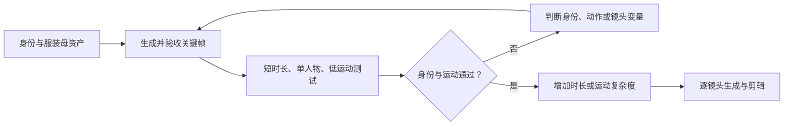

# AI人物跨图像与视频一致性控制

> [!abstract] 核心结论
> 一致性不是“每次都生成得像”，而是让身份、服装和辨识特征在场景、构图、画幅与时间变化中保持在可接受范围。稳定生产需要先冻结角色资产，再把身份、姿势、镜头和风格交给不同输入控制，逐阶段验收并只修改一个变量。

> [!warning] 适用边界
> 本文整理通用控制原则，产品能力示例按 2026-08-02 的官方资料核验。模型版本、参数、价格和功能兼容性会变化，使用前应复核官方文档。Kimi 分享页中的工具排名和“97% 面部一致性”等数字没有可追溯证据，本文不采用。

## 1. 先定义要保持什么

人物一致性至少包含五个相互独立的对象：

| 对象 | 应冻结的内容 | 主要控制输入 |
|---|---|---|
| 身份 | 脸型、五官比例、年龄感、肤色、辨识特征 | 身份母版、角色参考、身份模型 |
| 发型与服装 | 发型轮廓、发饰、领口、材质、配色、层级 | 多角度资产、服装参考、局部编辑 |
| 身体 | 头身比、体型、肩宽、四肢比例 | 全身母版、姿势或骨架条件 |
| 动作与镜头 | 姿势、动作方向、节奏、景别、运镜 | 姿势图、动作视频、首帧、镜头提示 |
| 风格与环境 | 画风、光线、色彩、材质、场景 | 风格参考、文本描述、环境参考 |

不要让一个输入同时承担所有职责。例如，身份图不应负责复杂动作，动作视频也不应负责精确还原五官。控制条件职责越清楚，失败时越容易定位。

## 2. 身份参考资产的最小闭环

完整资产制作沿用 [[AI人物身份参考资产-执行手册]]；进入图生图或视频前，至少准备：

1. 一张正面或四分之三正面的身份母版，表情中性、光照均匀、面部清晰；
2. 一张全身图，用于冻结体型、头身比和默认服装；
3. 对任务必要的侧面、背面、表情或服装细节图；
4. 一份文字资产卡，列出不可变特征和允许变化项。

参考图不是越多越好。低质量、冲突光照、不同年龄或不同服装的图片会向模型提供相互矛盾的证据。首轮采用最小充分参考集；只有失败能够明确归因于角度或细节缺失时，才增加对应参考图。

> [!tip] 参考图质量原则
> Runway 官方建议使用高质量、光照自然且表情中性的主体图，并在复杂变化中逐项迭代；其开发文档还建议一张参考图只突出一个主体，并让多张参考图保持相近的色彩、光照和氛围。

## 3. 四层控制机制

| 层级 | 作用 | 典型方式 | 局限 |
|---|---|---|---|
| 视觉身份锚点 | 提供“这个人是谁”的直接证据 | 角色参考、Omni Reference、多参考图、IP-Adapter | 角度差异大或参考冲突时仍会漂移 |
| 生成起点锚定 | 降低视频第一帧的身份不确定性 | 通过的关键帧作为首帧或图生视频输入 | 不能保证长时间、遮挡后的持续稳定 |
| 结构与运动控制 | 约束姿势、深度、边缘和运动 | 姿势图、ControlNet、动作参考、运动轨迹 | 控制过强会牺牲自然度或身份细节 |
| 文本约束 | 补充图像未表达的规则 | 固定角色描述、不可变项、负面约束 | 不能替代清晰的视觉参考 |

LoRA、身份嵌入或专用身份模型属于更重的身份锚点：适合长期、多批次角色资产，但需要训练数据、版本管理和回归测试，不应作为一次性任务的默认起点。

## 4. 分场景工作流

### 4.1 图生图与多轮编辑

1. 从唯一身份母版开始，明确本轮只改变场景、姿势、服装或风格中的一项；
2. 提示词同时写明“要改变什么”和“必须保持什么”；
3. 生成后先验收身份与服装，再验收本轮目标；
4. 将通过结果保存为新的下游参考，不从失败图继续编辑；
5. 连续编辑出现累积漂移时，回到最近的通过版本，而不是继续补提示词。

这种“通过结果接力”比反复从最初母版进行大跨度变换更容易定位漂移来源。Black Forest Labs 的官方文档也将保持未要求修改的内容、分步迭代和多轮身份保持列为上下文编辑的核心能力；但具体效果仍需项目实测。

### 4.2 扩图

扩图应把原图主体视为不可修改区域，只生成新增画布：

1. 优先扩展背景和留白，再处理身体或服装的新增部分；
2. 蒙版边界避开眼睛、嘴、手指、服装纹样等高辨识区域；
3. 提示词描述新增区域的空间连续性，不重新描述或重新设计人物；
4. 每次只扩一个方向或一个尺度，阶段性保存通过版本；
5. 身体补全后重新检查头身比、关节、服装层级和光源方向。

如果平台把扩图和身份参考放在不同模型版本中，应先确认两项功能能否同时使用。例如 Midjourney 官方资料显示，V7 的 Omni Reference 与仍使用 V6.1 的部分局部重绘、扩图功能并不兼容，不能把参数名称当成跨版本通用能力。

### 4.3 图生视频



视频首轮使用通过的关键帧，控制在单人物、短时长、固定镜头或轻微运动。先解决跨帧身份，再增加旋转、遮挡、快速动作和镜头变化。长叙事应拆成多个短镜头，每个镜头使用同一资产版本，并在剪辑阶段处理连续性。

## 5. 单变量实验与回退

每轮实验只验证一个假设，例如“增加侧脸图能否改善侧面身份”，不要同时更换模型、提示词、参考图和画幅。

| 字段 | 记录内容 |
|---|---|
| 目标 | 本轮唯一要解决的问题 |
| 固定项 | 模型版本、母版、尺寸、种子或其他不变条件 |
| 变量 | 唯一改变的参考、参数或提示段 |
| 输出 | 生成次数、可用次数、通过文件 |
| 评分 | 身份、发型、服装、身体、动作、镜头 |
| 结论 | 保留、回退或进入下一阶段 |

详细评分锚点、否决项和 A/B 实验模板复用 [[附录B-验收与失败修复]]，本文不重复维护两套标准。

## 6. 常见失败与处理顺序

| 失败 | 优先检查 | 推荐回退 |
|---|---|---|
| 换脸感或年龄突变 | 身份图是否清晰、是否混入冲突人物 | 回到唯一母版，减少参考图 |
| 发型或服装增删 | 不可变项是否明确、参考图是否互相矛盾 | 固定资产版本，局部修复 |
| 侧脸和极端角度漂移 | 是否缺少对应角度证据 | 补充经过验收的角度图，不硬拉视角 |
| 强表情导致五官变化 | 中性母版与表情跨度是否过大 | 分级生成轻表情，再扩展幅度 |
| 扩图后身体失真 | 蒙版是否切入主体、是否一次扩展过大 | 缩小扩展范围，分方向生成 |
| 视频遮挡后身份变化 | 遮挡、旋转或镜头是否过于复杂 | 缩短镜头，用正面或三分之四角度过渡 |
| 多人物串脸 | 角色条件是否可区分、同框任务是否过载 | 分角色单独生成，再合成或交替剪辑 |

相同失败连续三轮没有改善时，不继续堆叠提示词；应降低任务难度、替换冲突参考、切换控制机制，或回到上游资产制作阶段。

## 7. 提示词骨架

```text
【任务】
基于参考图生成同一角色的{目标场景／姿势／镜头}。

【必须保持】
保持脸型、五官比例、年龄感、发型轮廓、服装结构和辨识特征不变。

【本轮只改变】
只改变{一个变量}，其余内容沿用参考图。

【动作与镜头】
描述动作方向、景别和镜头运动；不让该段重新定义人物身份。

【禁止变化】
不增加人物，不重新设计服装，不改变年龄、发色、发饰和身体比例。
```

提示词是任务合同，不是身份数据库。若身份参考本身不充分，继续增加形容词通常无法稳定解决问题。

## 8. 工具能力示例与选择原则

> [!caution] 不是排名
> 下表只说明官方资料公开的控制形态，不代表效果、成本或可用性排名。正式项目必须用同一角色资产做小样测试。

| 工具或能力 | 已核验的官方描述 | 适合验证的任务 |
|---|---|---|
| Runway Gen-4 References | 可使用一张或多张参考图提取人物、物体、场景或风格；官方建议复杂变化逐项迭代 | 角色换场景、通过结果接力、多参考组合 |
| FLUX.1 Kontext／FLUX.2 | 支持基于输入图的上下文编辑；FLUX.2 是官方当前推荐的新项目方案并支持多参考 | 多轮局部编辑、场景变化、保留未修改区域 |
| Midjourney Omni Reference | V7 可通过一张 Omni Reference 引入人物或物体，并与文本、风格参考组合 | 单主体风格化与跨场景图像 |
| 本地可控工作流 | 可组合身份参考、姿势、深度、边缘、蒙版和局部重绘 | 隐私素材、精细控制、批量回归和失败修复 |

工具选择顺序应是：先列出任务所需的输入类型和控制粒度，再验证模型是否支持；不要先选流行工具，再强迫任务适配它。

## 9. 来源与证据分级

### 官方资料

- [Runway：Creating with Gen-4 Image References](https://help.runwayml.com/hc/en-us/articles/40042718905875-Creating-with-Gen-4-Image-References)
- [Runway：Reference media guidelines](https://docs.dev.runwayml.com/recipes/reference-media/)
- [Runway：Gen-4 Video Prompting Guide](https://help.runwayml.com/hc/en-us/articles/39789879462419-Gen-4-Video-Prompting-Guide)
- [Black Forest Labs：FLUX.1 Kontext Image Editing](https://docs.bfl.ai/kontext/kontext_image_editing)
- [Black Forest Labs：FLUX.1 Kontext Overview](https://docs.bfl.ai/kontext/kontext_overview)
- [Midjourney：Omni Reference](https://docs.midjourney.com/hc/en-us/articles/36285124473997-Omni-Reference)

### 启发来源

- [Kimi 分享对话：图生图、扩图、图生视频人物一致性](https://www.kimi.com/share/19fbe318-4ca2-85d1-8000-00005787ed1a)

Kimi 对话用于提出问题和形成初始结构，不作为产品能力、效果百分比或工具排名的最终证据。

## 相关笔记

- [[AI人物身份参考资产库-MOC]]
- [[AI人物身份参考资产-执行手册]]
- [[附录B-验收与失败修复]]
- [[古风角色图像与视频生成-项目总览与执行框架]]
